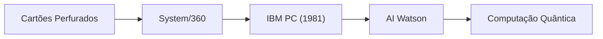

## 1. De Máquinas de Tabulação à IBM
Fundada em 1911. Começou com máquinas de tabulação de cartões perfurados usadas para censos, e mais tarde foi renomeada para IBM (International Business Machines).

## 2. System/360 e Mainframes
Anunciado em 1964, o "System/360" foi um mainframe histórico que trouxe compatibilidade de software e construiu a infraestrutura de instituições financeiras e governamentais em todo o mundo.

## 3. IBM PC e Arquitetura Aberta
Lançado em 1981, o IBM PC adotou uma arquitetura aberta, criando o enorme mercado de "compatíveis com PC/AT" e impulsionando a ascensão da Microsoft e da Intel.

## 4. Computação Quântica e Nuvem Híbrida
Tendo vendido seus negócios de PC e servidores, a IBM atualmente continua a evoluir como a empresa líder mundial no desenvolvimento de "nuvem híbrida" e "IA", além de computadores quânticos supercondutores (IBM Quantum).

## Parte Adicional de Verificação Tecnológica 1

### 1. De Máquinas de Tabulação à IBM
Fundada em 1911. Começou com máquinas de tabulação de cartões perfurados usadas para censos, e mais tarde foi renomeada para IBM (International Business Machines).

### 2. System/360 e Mainframes
Anunciado em 1964, o "System/360" foi um mainframe histórico que trouxe compatibilidade de software e construiu a infraestrutura de instituições financeiras e governamentais em todo o mundo.

### 3. IBM PC e Arquitetura Aberta
Lançado em 1981, o IBM PC adotou uma arquitetura aberta, criando o enorme mercado de "compatíveis com PC/AT" e impulsionando a ascensão da Microsoft e da Intel.

### 4. Computação Quântica e Nuvem Híbrida
Tendo vendido seus negócios de PC e servidores, a IBM atualmente continua a evoluir como a empresa líder mundial no desenvolvimento de "nuvem híbrida" e "IA", além de computadores quânticos supercondutores (IBM Quantum).

## Parte Adicional de Verificação Tecnológica 2

### 1. De Máquinas de Tabulação à IBM
Fundada em 1911. Começou com máquinas de tabulação de cartões perfurados usadas para censos, e mais tarde foi renomeada para IBM (International Business Machines).

### 2. System/360 e Mainframes
Anunciado em 1964, o "System/360" foi um mainframe histórico que trouxe compatibilidade de software e construiu a infraestrutura de instituições financeiras e governamentais em todo o mundo.

### 3. IBM PC e Arquitetura Aberta
Lançado em 1981, o IBM PC adotou uma arquitetura aberta, criando o enorme mercado de "compatíveis com PC/AT" e impulsionando a ascensão da Microsoft e da Intel.

### 4. Computação Quântica e Nuvem Híbrida
Tendo vendido seus negócios de PC e servidores, a IBM atualmente continua a evoluir como a empresa líder mundial no desenvolvimento de "nuvem híbrida" e "IA", além de computadores quânticos supercondutores (IBM Quantum).

## Parte Adicional de Verificação Tecnológica 3

### 1. De Máquinas de Tabulação à IBM
Fundada em 1911. Começou com máquinas de tabulação de cartões perfurados usadas para censos, e mais tarde foi renomeada para IBM (International Business Machines).

### 2. System/360 e Mainframes
Anunciado em 1964, o "System/360" foi um mainframe histórico que trouxe compatibilidade de software e construiu a infraestrutura de instituições financeiras e governamentais em todo o mundo.

### 3. IBM PC e Arquitetura Aberta
Lançado em 1981, o IBM PC adotou uma arquitetura aberta, criando o enorme mercado de "compatíveis com PC/AT" e impulsionando a ascensão da Microsoft e da Intel.

### 4. Computação Quântica e Nuvem Híbrida
Tendo vendido seus negócios de PC e servidores, a IBM atualmente continua a evoluir como a empresa líder mundial no desenvolvimento de "nuvem híbrida" e "IA", além de computadores quânticos supercondutores (IBM Quantum).

## Parte Adicional de Verificação Tecnológica 4

### 1. De Máquinas de Tabulação à IBM
Fundada em 1911. Começou com máquinas de tabulação de cartões perfurados usadas para censos, e mais tarde foi renomeada para IBM (International Business Machines).

### 2. System/360 e Mainframes
Anunciado em 1964, o "System/360" foi um mainframe histórico que trouxe compatibilidade de software e construiu a infraestrutura de instituições financeiras e governamentais em todo o mundo.

### 3. IBM PC e Arquitetura Aberta
Lançado em 1981, o IBM PC adotou uma arquitetura aberta, criando o enorme mercado de "compatíveis com PC/AT" e impulsionando a ascensão da Microsoft e da Intel.

### 4. Computação Quântica e Nuvem Híbrida
Tendo vendido seus negócios de PC e servidores, a IBM atualmente continua a evoluir como a empresa líder mundial no desenvolvimento de "nuvem híbrida" e "IA", além de computadores quânticos supercondutores (IBM Quantum).

## Parte Adicional de Verificação Tecnológica 5

### 1. De Máquinas de Tabulação à IBM
Fundada em 1911. Começou com máquinas de tabulação de cartões perfurados usadas para censos, e mais tarde foi renomeada para IBM (International Business Machines).

### 2. System/360 e Mainframes
Anunciado em 1964, o "System/360" foi um mainframe histórico que trouxe compatibilidade de software e construiu a infraestrutura de instituições financeiras e governamentais em todo o mundo.

### 3. IBM PC e Arquitetura Aberta
Lançado em 1981, o IBM PC adotou uma arquitetura aberta, criando o enorme mercado de "compatíveis com PC/AT" e impulsionando a ascensão da Microsoft e da Intel.

### 4. Computação Quântica e Nuvem Híbrida
Tendo vendido seus negócios de PC e servidores, a IBM atualmente continua a evoluir como a empresa líder mundial no desenvolvimento de "nuvem híbrida" e "IA", além de computadores quânticos supercondutores (IBM Quantum).

## Parte Adicional de Verificação Tecnológica 6

### 1. De Máquinas de Tabulação à IBM
Fundada em 1911. Começou com máquinas de tabulação de cartões perfurados usadas para censos, e mais tarde foi renomeada para IBM (International Business Machines).

### 2. System/360 e Mainframes
Anunciado em 1964, o "System/360" foi um mainframe histórico que trouxe compatibilidade de software e construiu a infraestrutura de instituições financeiras e governamentais em todo o mundo.

### 3. IBM PC e Arquitetura Aberta
Lançado em 1981, o IBM PC adotou uma arquitetura aberta, criando o enorme mercado de "compatíveis com PC/AT" e impulsionando a ascensão da Microsoft e da Intel.

### 4. Computação Quântica e Nuvem Híbrida
Tendo vendido seus negócios de PC e servidores, a IBM atualmente continua a evoluir como a empresa líder mundial no desenvolvimento de "nuvem híbrida" e "IA", além de computadores quânticos supercondutores (IBM Quantum).

## Parte Adicional de Verificação Tecnológica 7

### 1. De Máquinas de Tabulação à IBM
Fundada em 1911. Começou com máquinas de tabulação de cartões perfurados usadas para censos, e mais tarde foi renomeada para IBM (International Business Machines).

### 2. System/360 e Mainframes
Anunciado em 1964, o "System/360" foi um mainframe histórico que trouxe compatibilidade de software e construiu a infraestrutura de instituições financeiras e governamentais em todo o mundo.

### 3. IBM PC e Arquitetura Aberta
Lançado em 1981, o IBM PC adotou uma arquitetura aberta, criando o enorme mercado de "compatíveis com PC/AT" e impulsionando a ascensão da Microsoft e da Intel.

### 4. Computação Quântica e Nuvem Híbrida
Tendo vendido seus negócios de PC e servidores, a IBM atualmente continua a evoluir como a empresa líder mundial no desenvolvimento de "nuvem híbrida" e "IA", além de computadores quânticos supercondutores (IBM Quantum).

## Parte Adicional de Verificação Tecnológica 8

### 1. De Máquinas de Tabulação à IBM
Fundada em 1911. Começou com máquinas de tabulação de cartões perfurados usadas para censos, e mais tarde foi renomeada para IBM (International Business Machines).

### 2. System/360 e Mainframes
Anunciado em 1964, o "System/360" foi um mainframe histórico que trouxe compatibilidade de software e construiu a infraestrutura de instituições financeiras e governamentais em todo o mundo.

### 3. IBM PC e Arquitetura Aberta
Lançado em 1981, o IBM PC adotou uma arquitetura aberta, criando o enorme mercado de "compatíveis com PC/AT" e impulsionando a ascensão da Microsoft e da Intel.

### 4. Computação Quântica e Nuvem Híbrida
Tendo vendido seus negócios de PC e servidores, a IBM atualmente continua a evoluir como a empresa líder mundial no desenvolvimento de "nuvem híbrida" e "IA", além de computadores quânticos supercondutores (IBM Quantum).

## Parte Adicional de Verificação Tecnológica 9

### 1. De Máquinas de Tabulação à IBM
Fundada em 1911. Começou com máquinas de tabulação de cartões perfurados usadas para censos, e mais tarde foi renomeada para IBM (International Business Machines).

### 2. System/360 e Mainframes
Anunciado em 1964, o "System/360" foi um mainframe histórico que trouxe compatibilidade de software e construiu a infraestrutura de instituições financeiras e governamentais em todo o mundo.

### 3. IBM PC e Arquitetura Aberta
Lançado em 1981, o IBM PC adotou uma arquitetura aberta, criando o enorme mercado de "compatíveis com PC/AT" e impulsionando a ascensão da Microsoft e da Intel.

### 4. Computação Quântica e Nuvem Híbrida
Tendo vendido seus negócios de PC e servidores, a IBM atualmente continua a evoluir como a empresa líder mundial no desenvolvimento de "nuvem híbrida" e "IA", além de computadores quânticos supercondutores (IBM Quantum).

## Parte Adicional de Verificação Tecnológica 10

### 1. De Máquinas de Tabulação à IBM
Fundada em 1911. Começou com máquinas de tabulação de cartões perfurados usadas para censos, e mais tarde foi renomeada para IBM (International Business Machines).

### 2. System/360 e Mainframes
Anunciado em 1964, o "System/360" foi um mainframe histórico que trouxe compatibilidade de software e construiu a infraestrutura de instituições financeiras e governamentais em todo o mundo.

### 3. IBM PC e Arquitetura Aberta
Lançado em 1981, o IBM PC adotou uma arquitetura aberta, criando o enorme mercado de "compatíveis com PC/AT" e impulsionando a ascensão da Microsoft e da Intel.

### 4. Computação Quântica e Nuvem Híbrida
Tendo vendido seus negócios de PC e servidores, a IBM atualmente continua a evoluir como a empresa líder mundial no desenvolvimento de "nuvem híbrida" e "IA", além de computadores quânticos supercondutores (IBM Quantum).

## Parte Adicional de Verificação Tecnológica 11

### 1. De Máquinas de Tabulação à IBM
Fundada em 1911. Começou com máquinas de tabulação de cartões perfurados usadas para censos, e mais tarde foi renomeada para IBM (International Business Machines).

### 2. System/360 e Mainframes
Anunciado em 1964, o "System/360" foi um mainframe histórico que trouxe compatibilidade de software e construiu a infraestrutura de instituições financeiras e governamentais em todo o mundo.

### 3. IBM PC e Arquitetura Aberta
Lançado em 1981, o IBM PC adotou uma arquitetura aberta, criando o enorme mercado de "compatíveis com PC/AT" e impulsionando a ascensão da Microsoft e da Intel.

### 4. Computação Quântica e Nuvem Híbrida
Tendo vendido seus negócios de PC e servidores, a IBM atualmente continua a evoluir como a empresa líder mundial no desenvolvimento de "nuvem híbrida" e "IA", além de computadores quânticos supercondutores (IBM Quantum).

## Parte Adicional de Verificação Tecnológica 12

### 1. De Máquinas de Tabulação à IBM
Fundada em 1911. Começou com máquinas de tabulação de cartões perfurados usadas para censos, e mais tarde foi renomeada para IBM (International Business Machines).

### 2. System/360 e Mainframes
Anunciado em 1964, o "System/360" foi um mainframe histórico que trouxe compatibilidade de software e construiu a infraestrutura de instituições financeiras e governamentais em todo o mundo.

### 3. IBM PC e Arquitetura Aberta
Lançado em 1981, o IBM PC adotou uma arquitetura aberta, criando o enorme mercado de "compatíveis com PC/AT" e impulsionando a ascensão da Microsoft e da Intel.

### 4. Computação Quântica e Nuvem Híbrida
Tendo vendido seus negócios de PC e servidores, a IBM atualmente continua a evoluir como a empresa líder mundial no desenvolvimento de "nuvem híbrida" e "IA", além de computadores quânticos supercondutores (IBM Quantum).

## Parte Adicional de Verificação Tecnológica 13

### 1. De Máquinas de Tabulação à IBM
Fundada em 1911. Começou com máquinas de tabulação de cartões perfurados usadas para censos, e mais tarde foi renomeada para IBM (International Business Machines).

### 2. System/360 e Mainframes
Anunciado em 1964, o "System/360" foi um mainframe histórico que trouxe compatibilidade de software e construiu a infraestrutura de instituições financeiras e governamentais em todo o mundo.

### 3. IBM PC e Arquitetura Aberta
Lançado em 1981, o IBM PC adotou uma arquitetura aberta, criando o enorme mercado de "compatíveis com PC/AT" e impulsionando a ascensão da Microsoft e da Intel.

### 4. Computação Quântica e Nuvem Híbrida
Tendo vendido seus negócios de PC e servidores, a IBM atualmente continua a evoluir como a empresa líder mundial no desenvolvimento de "nuvem híbrida" e "IA", além de computadores quânticos supercondutores (IBM Quantum).

## Parte Adicional de Verificação Tecnológica 14

### 1. De Máquinas de Tabulação à IBM
Fundada em 1911. Começou com máquinas de tabulação de cartões perfurados usadas para censos, e mais tarde foi renomeada para IBM (International Business Machines).

### 2. System/360 e Mainframes
Anunciado em 1964, o "System/360" foi um mainframe histórico que trouxe compatibilidade de software e construiu a infraestrutura de instituições financeiras e governamentais em todo o mundo.

### 3. IBM PC e Arquitetura Aberta
Lançado em 1981, o IBM PC adotou uma arquitetura aberta, criando o enorme mercado de "compatíveis com PC/AT" e impulsionando a ascensão da Microsoft e da Intel.

### 4. Computação Quântica e Nuvem Híbrida
Tendo vendido seus negócios de PC e servidores, a IBM atualmente continua a evoluir como a empresa líder mundial no desenvolvimento de "nuvem híbrida" e "IA", além de computadores quânticos supercondutores (IBM Quantum).
