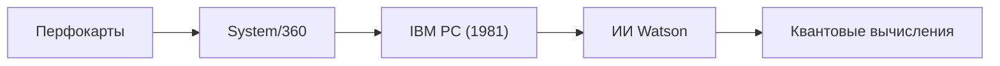

## 1. От табуляторов к IBM
Компания основана в 1911 году. Начав с машин для обработки перфокарт (табуляторов), используемых при переписях населения и других задачах, позже она была переименована в IBM (International Business Machines).

## 2. System/360 и мейнфреймы
Выпущенный в 1964 году «System/360» стал историческим мейнфреймом (большой ЭВМ) с программной совместимостью, который заложил основу инфраструктуры финансовых и правительственных учреждений по всему миру.

## 3. IBM PC и открытая архитектура
Выпущенный в 1981 году IBM PC благодаря использованию открытой архитектуры создал огромный рынок «PC/AT-совместимых компьютеров» и способствовал возвышению таких компаний, как Microsoft и Intel.

## 4. Квантовые компьютеры и гибридное облако
Продав свои подразделения по производству ПК и серверов, сегодня IBM продолжает развиваться как ведущая мировая компания в области разработки «гибридных облаков», «ИИ» и сверхпроводящих квантовых компьютеров (IBM Quantum).

## Дополнительная техническая проверка, часть 1

## Дополнительная техническая проверка, часть 2

## Дополнительная техническая проверка, часть 3

## Дополнительная техническая проверка, часть 4

## Дополнительная техническая проверка, часть 5

## Дополнительная техническая проверка, часть 6

## Дополнительная техническая проверка, часть 7

## Дополнительная техническая проверка, часть 8

## Дополнительная техническая проверка, часть 9

## Дополнительная техническая проверка, часть 10

## Дополнительная техническая проверка, часть 11

## Дополнительная техническая проверка, часть 12

## Дополнительная техническая проверка, часть 13

## Дополнительная техническая проверка, часть 14

