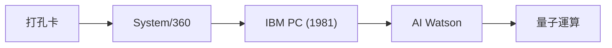

## 1. 從製表機到IBM
創立於1911年。從用於人口普查等用途的打孔卡集計機（製表機）起家，後來改名為IBM（International Business Machines）。

## 2. System/360與大型主機
於1964年發表的「System/360」是具備軟體相容性的歷史性大型主機（大型計算機），建構了全球金融與政府機構的基礎設施。

## 3. IBM PC與開放式架構
1981年推出的IBM PC，藉由採用開放式架構創造了「PC/AT相容機」這個巨大的市場，並促使了Microsoft和Intel的崛起。

## 4. 量子電腦與混合雲
在出售PC和伺服器業務後，目前的IBM正作為在「混合雲」與「AI」，以及超導量子電腦（IBM Quantum）開發領域引領全球的企業，持續進化中。

## 附加技術驗證部分 1

### 1. 從製表機到IBM
創立於1911年。從用於人口普查等用途的打孔卡集計機（製表機）起家，後來改名為IBM（International Business Machines）。

### 2. System/360與大型主機
於1964年發表的「System/360」是具備軟體相容性的歷史性大型主機（大型計算機），建構了全球金融與政府機構的基礎設施。

### 3. IBM PC與開放式架構
1981年推出的IBM PC，藉由採用開放式架構創造了「PC/AT相容機」這個巨大的市場，並促使了Microsoft和Intel的崛起。

### 4. 量子電腦與混合雲
在出售PC和伺服器業務後，目前的IBM正作為在「混合雲」與「AI」，以及超導量子電腦（IBM Quantum）開發領域引領全球的企業，持續進化中。

## 附加技術驗證部分 2

### 1. 從製表機到IBM
創立於1911年。從用於人口普查等用途的打孔卡集計機（製表機）起家，後來改名為IBM（International Business Machines）。

### 2. System/360與大型主機
於1964年發表的「System/360」是具備軟體相容性的歷史性大型主機（大型計算機），建構了全球金融與政府機構的基礎設施。

### 3. IBM PC與開放式架構
1981年推出的IBM PC，藉由採用開放式架構創造了「PC/AT相容機」這個巨大的市場，並促使了Microsoft和Intel的崛起。

### 4. 量子電腦與混合雲
在出售PC和伺服器業務後，目前的IBM正作為在「混合雲」與「AI」，以及超導量子電腦（IBM Quantum）開發領域引領全球的企業，持續進化中。

## 附加技術驗證部分 3

### 1. 從製表機到IBM
創立於1911年。從用於人口普查等用途的打孔卡集計機（製表機）起家，後來改名為IBM（International Business Machines）。

### 2. System/360與大型主機
於1964年發表的「System/360」是具備軟體相容性的歷史性大型主機（大型計算機），建構了全球金融與政府機構的基礎設施。

### 3. IBM PC與開放式架構
1981年推出的IBM PC，藉由採用開放式架構創造了「PC/AT相容機」這個巨大的市場，並促使了Microsoft和Intel的崛起。

### 4. 量子電腦與混合雲
在出售PC和伺服器業務後，目前的IBM正作為在「混合雲」與「AI」，以及超導量子電腦（IBM Quantum）開發領域引領全球的企業，持續進化中。

## 附加技術驗證部分 4

### 1. 從製表機到IBM
創立於1911年。從用於人口普查等用途的打孔卡集計機（製表機）起家，後來改名為IBM（International Business Machines）。

### 2. System/360與大型主機
於1964年發表的「System/360」是具備軟體相容性的歷史性大型主機（大型計算機），建構了全球金融與政府機構的基礎設施。

### 3. IBM PC與開放式架構
1981年推出的IBM PC，藉由採用開放式架構創造了「PC/AT相容機」這個巨大的市場，並促使了Microsoft和Intel的崛起。

### 4. 量子電腦與混合雲
在出售PC和伺服器業務後，目前的IBM正作為在「混合雲」與「AI」，以及超導量子電腦（IBM Quantum）開發領域引領全球的企業，持續進化中。

## 附加技術驗證部分 5

### 1. 從製表機到IBM
創立於1911年。從用於人口普查等用途的打孔卡集計機（製表機）起家，後來改名為IBM（International Business Machines）。

### 2. System/360與大型主機
於1964年發表的「System/360」是具備軟體相容性的歷史性大型主機（大型計算機），建構了全球金融與政府機構的基礎設施。

### 3. IBM PC與開放式架構
1981年推出的IBM PC，藉由採用開放式架構創造了「PC/AT相容機」這個巨大的市場，並促使了Microsoft和Intel的崛起。

### 4. 量子電腦與混合雲
在出售PC和伺服器業務後，目前的IBM正作為在「混合雲」與「AI」，以及超導量子電腦（IBM Quantum）開發領域引領全球的企業，持續進化中。

## 附加技術驗證部分 6

### 1. 從製表機到IBM
創立於1911年。從用於人口普查等用途的打孔卡集計機（製表機）起家，後來改名為IBM（International Business Machines）。

### 2. System/360與大型主機
於1964年發表的「System/360」是具備軟體相容性的歷史性大型主機（大型計算機），建構了全球金融與政府機構的基礎設施。

### 3. IBM PC與開放式架構
1981年推出的IBM PC，藉由採用開放式架構創造了「PC/AT相容機」這個巨大的市場，並促使了Microsoft和Intel的崛起。

### 4. 量子電腦與混合雲
在出售PC和伺服器業務後，目前的IBM正作為在「混合雲」與「AI」，以及超導量子電腦（IBM Quantum）開發領域引領全球的企業，持續進化中。

## 附加技術驗證部分 7

### 1. 從製表機到IBM
創立於1911年。從用於人口普查等用途的打孔卡集計機（製表機）起家，後來改名為IBM（International Business Machines）。

### 2. System/360與大型主機
於1964年發表的「System/360」是具備軟體相容性的歷史性大型主機（大型計算機），建構了全球金融與政府機構的基礎設施。

### 3. IBM PC與開放式架構
1981年推出的IBM PC，藉由採用開放式架構創造了「PC/AT相容機」這個巨大的市場，並促使了Microsoft和Intel的崛起。

### 4. 量子電腦與混合雲
在出售PC和伺服器業務後，目前的IBM正作為在「混合雲」與「AI」，以及超導量子電腦（IBM Quantum）開發領域引領全球的企業，持續進化中。

## 附加技術驗證部分 8

### 1. 從製表機到IBM
創立於1911年。從用於人口普查等用途的打孔卡集計機（製表機）起家，後來改名為IBM（International Business Machines）。

### 2. System/360與大型主機
於1964年發表的「System/360」是具備軟體相容性的歷史性大型主機（大型計算機），建構了全球金融與政府機構的基礎設施。

### 3. IBM PC與開放式架構
1981年推出的IBM PC，藉由採用開放式架構創造了「PC/AT相容機」這個巨大的市場，並促使了Microsoft和Intel的崛起。

### 4. 量子電腦與混合雲
在出售PC和伺服器業務後，目前的IBM正作為在「混合雲」與「AI」，以及超導量子電腦（IBM Quantum）開發領域引領全球的企業，持續進化中。

## 附加技術驗證部分 9

### 1. 從製表機到IBM
創立於1911年。從用於人口普查等用途的打孔卡集計機（製表機）起家，後來改名為IBM（International Business Machines）。

### 2. System/360與大型主機
於1964年發表的「System/360」是具備軟體相容性的歷史性大型主機（大型計算機），建構了全球金融與政府機構的基礎設施。

### 3. IBM PC與開放式架構
1981年推出的IBM PC，藉由採用開放式架構創造了「PC/AT相容機」這個巨大的市場，並促使了Microsoft和Intel的崛起。

### 4. 量子電腦與混合雲
在出售PC和伺服器業務後，目前的IBM正作為在「混合雲」與「AI」，以及超導量子電腦（IBM Quantum）開發領域引領全球的企業，持續進化中。

## 附加技術驗證部分 10

### 1. 從製表機到IBM
創立於1911年。從用於人口普查等用途的打孔卡集計機（製表機）起家，後來改名為IBM（International Business Machines）。

### 2. System/360與大型主機
於1964年發表的「System/360」是具備軟體相容性的歷史性大型主機（大型計算機），建構了全球金融與政府機構的基礎設施。

### 3. IBM PC與開放式架構
1981年推出的IBM PC，藉由採用開放式架構創造了「PC/AT相容機」這個巨大的市場，並促使了Microsoft和Intel的崛起。

### 4. 量子電腦與混合雲
在出售PC和伺服器業務後，目前的IBM正作為在「混合雲」與「AI」，以及超導量子電腦（IBM Quantum）開發領域引領全球的企業，持續進化中。

## 附加技術驗證部分 11

### 1. 從製表機到IBM
創立於1911年。從用於人口普查等用途的打孔卡集計機（製表機）起家，後來改名為IBM（International Business Machines）。

### 2. System/360與大型主機
於1964年發表的「System/360」是具備軟體相容性的歷史性大型主機（大型計算機），建構了全球金融與政府機構的基礎設施。

### 3. IBM PC與開放式架構
1981年推出的IBM PC，藉由採用開放式架構創造了「PC/AT相容機」這個巨大的市場，並促使了Microsoft和Intel的崛起。

### 4. 量子電腦與混合雲
在出售PC和伺服器業務後，目前的IBM正作為在「混合雲」與「AI」，以及超導量子電腦（IBM Quantum）開發領域引領全球的企業，持續進化中。

## 附加技術驗證部分 12

### 1. 從製表機到IBM
創立於1911年。從用於人口普查等用途的打孔卡集計機（製表機）起家，後來改名為IBM（International Business Machines）。

### 2. System/360與大型主機
於1964年發表的「System/360」是具備軟體相容性的歷史性大型主機（大型計算機），建構了全球金融與政府機構的基礎設施。

### 3. IBM PC與開放式架構
1981年推出的IBM PC，藉由採用開放式架構創造了「PC/AT相容機」這個巨大的市場，並促使了Microsoft和Intel的崛起。

### 4. 量子電腦與混合雲
在出售PC和伺服器業務後，目前的IBM正作為在「混合雲」與「AI」，以及超導量子電腦（IBM Quantum）開發領域引領全球的企業，持續進化中。

## 附加技術驗證部分 13

### 1. 從製表機到IBM
創立於1911年。從用於人口普查等用途的打孔卡集計機（製表機）起家，後來改名為IBM（International Business Machines）。

### 2. System/360與大型主機
於1964年發表的「System/360」是具備軟體相容性的歷史性大型主機（大型計算機），建構了全球金融與政府機構的基礎設施。

### 3. IBM PC與開放式架構
1981年推出的IBM PC，藉由採用開放式架構創造了「PC/AT相容機」這個巨大的市場，並促使了Microsoft和Intel的崛起。

### 4. 量子電腦與混合雲
在出售PC和伺服器業務後，目前的IBM正作為在「混合雲」與「AI」，以及超導量子電腦（IBM Quantum）開發領域引領全球的企業，持續進化中。

## 附加技術驗證部分 14

### 1. 從製表機到IBM
創立於1911年。從用於人口普查等用途的打孔卡集計機（製表機）起家，後來改名為IBM（International Business Machines）。

### 2. System/360與大型主機
於1964年發表的「System/360」是具備軟體相容性的歷史性大型主機（大型計算機），建構了全球金融與政府機構的基礎設施。

### 3. IBM PC與開放式架構
1981年推出的IBM PC，藉由採用開放式架構創造了「PC/AT相容機」這個巨大的市場，並促使了Microsoft和Intel的崛起。

### 4. 量子電腦與混合雲
在出售PC和伺服器業務後，目前的IBM正作為在「混合雲」與「AI」，以及超導量子電腦（IBM Quantum）開發領域引領全球的企業，持續進化中。
