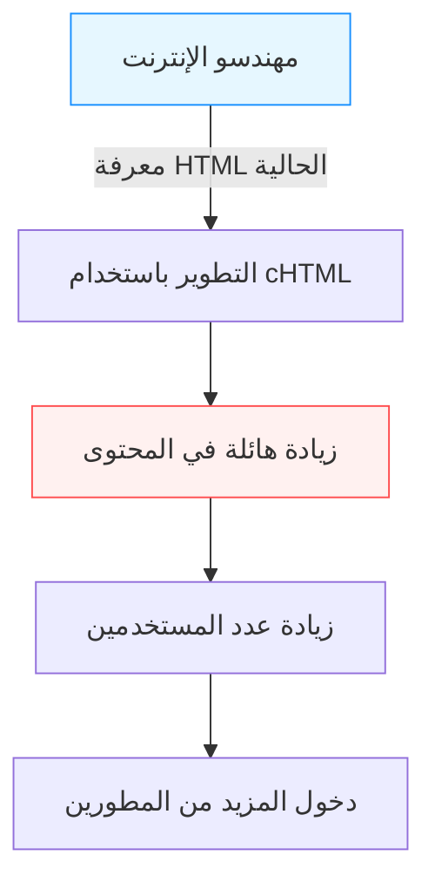

## مقدمة: "الإنترنت عبر الهاتف المحمول" قبل الهواتف الذكية

في العصر الحديث، أصبح الوصول إلى الإنترنت من جهاز في راحة يدك للاستمتاع بمقاطع الفيديو، والتواصل مع الناس حول العالم على وسائل التواصل الاجتماعي، والتسوق، أمراً طبيعياً كالتنفس. مع اجتياح الهواتف الذكية، وفي مقدمتها iPhone، للعالم، أصبحنا نسبح في بحر رقمي متصل دائماً.

ومع ذلك، وقبل ظهور الهواتف الذكية بوقت طويل، كان هناك بلد جعل من "الإنترنت في راحة اليد" جزءاً من الحياة اليومية. إنه اليابان. في عام 1999، أطلقت شركة NTT Docomo خدمة "i-mode" (آي مود)، والتي كانت رائدة عالمياً في بناء نظام بيئي ضخم للإنترنت عبر الهاتف المحمول، مما أحدث ثورة جذرية في أسلوب حياة الناس.

في هذا المقال، سنستكشف بعمق وتفصيل كيف وُلد i-mode ولماذا حقق هذا الانتشار الهائل في اليابان. وسنتناول الاختراقات التكنولوجية والتجارية التي وقفت وراءه، وإسهامات الشخصيات الرئيسية (ماري ماتسوناغا، وتاكيشي ناتسونو، وكيتشي إينوكي)، وصولاً إلى ما سُمي لاحقاً بـ "متلازمة غالاباغوس" (Galápagos syndrome)، وكيف انتهى به المطاف بالهزيمة أمام "السفن السوداء" المتمثلة في iPhone.

## الفصل الأول: عشية ولادة i-mode والشخصيات الرئيسية

### وضع الاتصالات في أواخر التسعينيات
في أواخر التسعينيات، بدأ الإنترنت ينتشر تدريجياً في المنازل العادية. ومع ذلك، كان الإنترنت في ذلك الوقت يعني "الجلوس أمام الكمبيوتر الشخصي والاتصال عبر المودم الهاتفي (Dial-up)"، وهي تجربة تقنية ثقيلة تستغرق وقتاً طويلاً للتشغيل والاتصال. كانت الهواتف المحمولة في الأساس أدوات للمكالمات الصوتية، واقتصرت اتصالات البيانات على إرسال رسائل نصية قصيرة (مثل البريد القصير وأجهزة النداء Pagers).

في خضم ذلك، ظهرت داخل NTT Docomo فكرة: "ألا يمكننا استخدام الهواتف المحمولة للوصول إلى خدمات المعلومات مثل الإنترنت؟"

### تشكيل فريق معجزة
لقيادة هذا المشروع الطموح، تم تشكيل فريق غير تقليدي، عُرف أعضاؤه لاحقاً بـ "أبو i-mode" و"أم i-mode".

- **كيتشي إينوكي (Keiichi Enoki)**
  مسؤول متمرس في NTT Docomo والمدير العام لمشروع i-mode. اتخذ قراراً جريئاً بالتخلص من البيروقراطية المميزة للشركات الكبرى واستقطاب مواهب استثنائية من الخارج. لولا قيادته وقدرته على التنسيق داخلياً وخارجياً، لكان i-mode قد سُحق تحت وطأة أطر أعمال الاتصالات التقليدية.

- **ماري ماتسوناغا (Mari Matsunaga)**
  محررة عملت كرئيسة تحرير لمجلات مثل "Travail" و"Shushoku Journal" في شركة Recruit. تم استقطابها من قبل إينوكي لتبتكر وتنتج المحتوى. جَلبت منظوراً يركز بالكامل على المستخدم، متسائلة "ما الذي ستستمتع به طالبة في المدرسة الثانوية أو ربة منزل عادية؟" بدلاً من منظور المهندسين. ابتكرت الاسم الودود "i-mode" وبذلت جهوداً كبيرة لاستقطاب مزودي المحتوى المختلفين.

- **تاكيشي ناتسونو (Takeshi Natsuno)**
  خبير في أعمال الإنترنت انضم إلى الفريق لاحقاً. لعب دوراً حاسماً في بناء نموذج العمل وتحديد المواصفات الفنية. كان أكبر إنجازاته السماح بوجود "مواقع غير رسمية" لإنشاء نظام بيئي مفتوح، بالإضافة إلى بناء "نظام تحصيل بالنيابة" الذي يجمع رسوم المحتوى جنباً إلى جنب مع فواتير الاتصالات.

ومن خلال الجمع بين نقاط القوة لكل من هؤلاء الثلاثة (القوة التنظيمية، ومهارات التخطيط المرتكزة على المستخدم، وبناء نموذج عمل ذو رؤية مستقبلية)، انطلق هذا المشروع المعجزة.

## الفصل الثاني: اختراق تكنولوجي —— اعتماد cHTML

في ذلك الوقت، كان الاتجاه العالمي لتوحيد اتصالات الهاتف المحمول يتجه نحو بروتوكول WAP (Wireless Application Protocol)، ولغته الوصفية الخاصة (WML) المصممة خصيصاً للأجهزة المحمولة. كانت العديد من شركات الاتصالات الأجنبية والمنافسين المحليين تخطط لاعتماد WAP.

ومع ذلك، اختار فريق تطوير i-mode (وخاصة ناتسونو) نهجاً مختلفاً تماماً، وهو الاعتماد على **Compact HTML (cHTML)**.

### لماذا تم اختيار cHTML؟
على الرغم من أن WAP(WML) كان مُحسّناً للهواتف المحمولة، إلا أنه كان يعاني من نقطة ضعف قاتلة: كان على مصممي الويب والمهندسين الحاليين تعلم لغة جديدة تماماً، مما جعل من الصعب إثراء المحتوى.

من ناحية أخرى، كان cHTML مجموعة فرعية من HTML (نسخة مبسطة مع إزالة بعض الميزات)، والذي كان يستخدم على نطاق واسع بالفعل في ذلك الوقت. وهذا يعني أن أي شخص يمكنه بناء موقع ويب للكمبيوتر يمكنه على الفور إنشاء موقع لـ i-mode.

كان هذا القرار خطوة تاريخية ذكية جلبت "انفتاح" الإنترنت إلى الهواتف المحمولة. كما تم اعتماد تنسيق GIF للصور (ثم تم دعم JPEG وFlash لاحقاً)، مما نجح في نقل ثقافة الإنترنت الحالية مباشرة إلى راحة اليد.

## الفصل الثالث: اكتمال النظام البيئي —— المواقع الرسمية، والمواقع غير الرسمية، ونظام التحصيل بالنيابة

السبب الأكبر وراء النجاح العالمي الذي حققه i-mode لا يكمن في التكنولوجيا، بل في "نموذج العمل" الخاص به.

### 1. قائمتي (My Menu) والمحتوى الرسمي
عند الضغط على زر "i" في هاتف i-mode، تظهر الشاشة الرئيسية التي تعرض "المواقع الرسمية" التي اجتازت فحص Docomo الصارم، مقسمة إلى فئات. تضمنت هذه القائمة الأخبار، الطقس، الخدمات المصرفية، نغمات الرنين، الألعاب، وغيرها من الخدمات عالية الجودة التي يمكن للمستخدمين استخدامها براحة بال.
بفضل جهود ماري ماتسوناغا وآخرين، قدمت العديد من الشركات والبنوك المعروفة محتوى منذ بداية الخدمة، مما وفر "قيمة عملية" للمستخدمين.

### 2. السماح بـ "المواقع غير الرسمية"
لم تقتصر Docomo على المواقع الرسمية، بل سمحت للمستخدمين بالوصول بحرية إلى المواقع العامة التي لم تخضع لفحصها (ما يسمى بـ "المواقع غير الرسمية" أو "مواقع مستقلة") من خلال إدخال عناوين URL مباشرة، أو عبر محركات البحث وروابط المواقع.
وبالاقتران مع اعتماد cHTML المذكور أعلاه، وُلد عدد لا يحصى من المدونات الشخصية، ولوحات البيانات (BBS)، ومواقع المعجبين. كان هذا "الانتشار الحر، بما في ذلك الثقافات الفرعية" هو ما دفع i-mode من مجرد أداة لنشر المعلومات للشركات إلى مركز لثقافة الشباب.

### 3. نظام التحصيل بالنيابة (الدفع عبر شركة الاتصالات)
كان أقوى نظام صممه ناتسونو هو نظام الفوترة للمحتوى الرقمي.
في هذا النظام، تقوم Docomo بجمع رسوم المحتوى المدفوع الذي تقدمه المواقع الرسمية (حوالي 100 إلى 300 ين شهرياً) جنباً إلى جنب مع فاتورة الهاتف المحمول الشهرية للمستخدم، ثم تدفع لمزودي المحتوى (CP) بعد خصم عمولة (حوالي 9٪).
نتيجة لذلك، تمكن مزودو المحتوى من تحقيق أرباح موثوقة ببساطة عن طريق إنشاء محتوى جيد، دون الحاجة إلى تحمل أعباء إنشاء بنية تحتية معقدة للدفع أو مخاطر عدم التحصيل. ظهرت العديد من الشركات الناشئة التي حققت مئات الملايين من الينات بفضل "نغمات الرنين" و"صور الخلفية"، مما خلق حالة تشبه حمى البحث عن الذهب.

## الفصل الرابع: تبديل الحزم (Packet Switching) وثورة نمط الحياة

في 22 فبراير 1999، تم إطلاق خدمة i-mode. وبمجرد طرح الأجهزة المتوافقة مثل "F501i" للبيع، أحدثت طفرة هائلة على الفور.

النقطة الأهم هنا كانت اعتماد **نظام تبديل الحزم (Packet Communication)**.
في السابق، كان يتم فرض رسوم على اتصالات البيانات بناءً على "وقت الاتصال"، مما جعل تصفح المواقع لفترات طويلة مكلفاً للغاية. ولكن في نظام الحزم، تعتمد الرسوم على "حجم البيانات المرسلة والمستلمة". ولأن cHTML المعتمد على النصوص ذو حجم بيانات صغير جداً، أصبح بإمكان المستخدمين الاستمتاع بالإنترنت دون القلق بشأن الوقت (كأنهم متصلون دائماً بالإنترنت).

### الانفجار الثقافي
أنتج i-mode ثقافة رقمية جديدة فريدة لليابان.

- **الرموز التعبيرية (Emoji)**
  أضافت الرموز التعبيرية بحجم 12×12 بكسل، التي طورها شيجيتاكا كوريتا وفريقه، مشاعر غنية للتواصل النصي القصير. تم اعتمادها لاحقاً في نظام Unicode، وهي أساس "Emoji" المستخدم حالياً في جميع أنحاء العالم.
- **نغمات الرنين المتقدمة (Chaku-uta / Chaku-mero)**
  تطورت من نغمات أحادية إلى متعددة الألحان، ثم إلى أغانٍ حقيقية (Chaku-uta)، مما خلق سوقاً ضخمة جديدة في صناعة الموسيقى.
- **روايات الهواتف المحمولة (Keitai Shosetsu)**
  ظهرت ظاهرة حيث قامت فتيات المدارس الثانوية بكتابة روايات عبر الضغط على أزرار الهواتف المحمولة، والتي جمعت ملايين الزيارات وتم نشرها ككتب حققت مبيعات هائلة. (مثل: "Deep Love" و"Koizora")
- **ألعاب الهواتف المحمولة**
  بدأت بلعبة السودوكو البسيطة وألعاب تقمص الأدوار (RPG)، مما أدى لاحقاً إلى ازدهار الألعاب الاجتماعية عبر منصات مثل GREE وMobage.

## الفصل الخامس: فخ متلازمة غالاباغوس (Galápagos syndrome)

في منتصف العقد الأول من القرن الحادي والعشرين، كان لدى i-mode عشرات الملايين من المستخدمين في اليابان. وصلت قدرات الأجهزة إلى أعلى مستوى في العالم، متضمنة ميزات مثل FeliCa (المحفظة المحمولة Osaifu-Keitai)، و 1Seg (التلفزيون المحمول)، ونظام الملاحة GPS.

ومع ذلك، بدأ هذا النظام البيئي المُحسّن للغاية يُشبه بـ "النظام البيئي الفريد لجزر غالاباغوس".

### التطور المستقل والانعزال عن العالم
في اليابان، أخذت شركات الاتصالات (مثل Docomo) زمام المبادرة في إملاء المواصفات الدقيقة على الشركات المصنعة للأجهزة. وبالتالي، كانت الهواتف مُحسّنة بشكل مثالي لخدمات شركات الاتصالات (مثل i-mode)، لكنها تطورت بشكل مستقل ومنعزل (مثل جزر غالاباغوس)، مما جعلها غير قابلة للاستخدام مع الشبكات والخدمات الخارجية في العالم.

- أصبحت البرمجيات معقدة للغاية، وعانت الشركات المصنعة من ارتفاع تكاليف التطوير.
- التأخر في التكيف مع الاتجاهات العالمية (أنظمة تشغيل تشبه أجهزة الكمبيوتر، وشاشات اللمس).
- لم يفكر مزودو المحتوى في التوسع عالمياً، لأن السوق اليابانية المغلقة كانت مربحة بما فيه الكفاية.

حاولت NTT Docomo أيضاً تصدير نظام i-mode والتعاون مع شركات اتصالات خارجية (في أوروبا وآسيا، إلخ)، ولكن بسبب الاختلافات في البنية التحتية للاتصالات، والثقافة، والممارسات التجارية في كل بلد، لم تحقق نجاحاً مشابهاً لما حدث في اليابان.

## الفصل السادس: هجوم "السفن السوداء" —— ظهور iPhone والهواتف الذكية

في عام 2007، أعلنت شركة Apple عن أول جهاز iPhone (تم إطلاقه في اليابان في عام 2008 مع iPhone 3G).
في البداية، قلل الكثيرون في الصناعة اليابانية من أهمية iPhone. قالوا: "ليس لديه محفظة محمولة، ولا تلفزيون 1Seg، ولا يمكنه كتابة الرموز التعبيرية، ولا يحتوي على اتصال عبر الأشعة تحت الحمراء. لن يقبل المستخدمون اليابانيون شيئاً كهذا".

ولكن الجوهر الحقيقي لثورة الهواتف الذكية التي أحدثها ستيف جوبز لم يكن في عدد الميزات، بل في **"إعادة تعريف تجربة المستخدم (UX) بشكل جذري"** و**"نظام بيئي عالمي ومفتوح حقاً عبر App Store"**.

### انهيار إمبراطورية i-mode
تجربة ويب غنية عبر متصفح كامل مثل الكمبيوتر الشخصي، واجهة لمس متعددة بديهية، ومتجر App Store الذي يتيح للمطورين من جميع أنحاء العالم تقديم التطبيقات مباشرة.
كل هذا جعل نظام "القائمة الرسمية" الذي تتحكم فيه شركات الاتصالات بصرامة أمراً عفا عليه الزمن تماماً.

انتقل المستخدمون بسرعة إلى الهواتف الذكية، وتحول مزودو المحتوى نحو تطوير التطبيقات. انتهت المهمة التاريخية لمنصة i-mode، وبدأت في التلاشي التدريجي. (من المقرر أن تنتهي الخدمة بالكامل في مارس 2026).

## الخاتمة: الإرث الذي تركه i-mode

في النهاية، انهزم i-mode أمام الهواتف الذكية واختفى من مسرح التاريخ. ومع ذلك، فإن "إمكانيات الإنترنت عبر الهاتف المحمول" التي أثبتها i-mode للعالم قبل أي جهة أخرى، والعديد من المفاهيم التي نشأت هناك، تم نقلها بالتأكيد إلى مجتمع الهواتف الذكية الحديث.

- أصبحت **الرموز التعبيرية (Emoji)** لغة عالمية مشتركة.
- مفهوم **الدفع عبر شركة الاتصالات (وهو أصل أنظمة الدفع في App Store وGoogle Play)** يمثل أساس اقتصاد التطبيقات.
- **أسلوب الحياة بحد ذاته**، المتمثل في استهلاك المحتوى والتواصل عبر الهاتف المحمول في أوقات الفراغ، جربه اليابانيون قبل أي شخص آخر في العالم.

"الإنترنت في راحة اليد" الذي تصوره وحققه ماري ماتسوناغا وتاكيشي ناتسونو وكيتشي إينوكي في عام 1999، هو بلا شك أحد أبرز الإنجازات في تاريخ الاتصالات البشرية، وكان النموذج الأولي العظيم للمجتمع الرقمي الذي نتمتع به اليوم.

---
*هذا المقال جزء من سلسلة تسترجع تاريخ التكنولوجيا والاتصالات لاستكشاف تلميحات حول الابتكار في العصر الحديث. ترقبوا المزيد من الاستكشافات التاريخية في المرة القادمة.*
