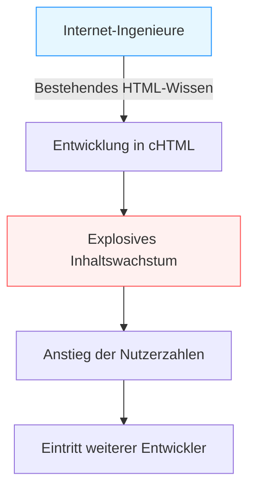

## Einleitung: Das „mobile Internet“ vor dem Smartphone

In der heutigen Zeit ist es so natürlich wie Atmen, über ein Gerät in unserer Handfläche auf das Internet zuzugreifen, Videos zu genießen, sich über soziale Netzwerke mit Menschen auf der ganzen Welt zu verbinden und einzukaufen. Smartphones, angeführt vom iPhone, haben die Welt erobert, und wir schwimmen in einem ständig verbundenen digitalen Meer.

Es gab jedoch ein Land, in dem dieses „Internet in der Handfläche“ schon lange vor dem Aufkommen von Smartphones alltäglich war. Dieses Land war Japan. Der Dienst „i-mode“, der 1999 von NTT DoCoMo gestartet wurde, war ein Pionier bei der Schaffung eines riesigen Ökosystems für das mobile Internet weltweit und veränderte den Lebensstil der Menschen grundlegend.

In diesem Artikel werden wir tief und detailliert die Geschichte der Entstehung von i-mode und die Gründe für seine explosive Verbreitung in Japan untersuchen. Wir beleuchten die technologischen und geschäftlichen Durchbrüche, die dahinter standen, die Bemühungen der Schlüsselpersonen (Mari Matsunaga, Takeshi Natsuno, Keiichi Enoki) und wie es schließlich zu dem führte, was als „Galapagos-Syndrom“ bezeichnet wurde, bis hin zu seiner Niederlage gegen die Ankunft der Smartphones wie dem iPhone.

## Kapitel 1: Der Vorabend der Geburt von i-mode und die Schlüsselpersonen

### Die Kommunikationslandschaft in den späten 1990er Jahren
In den späten 1990er Jahren begann sich das Internet allmählich in gewöhnlichen Haushalten zu verbreiten. Damals bedeutete das Internet jedoch noch „vor einem Computer zu sitzen und sich über ein Modem einzuwählen“ – ein technisches und schwerfälliges Erlebnis, das Zeit zum Starten und Verbinden brauchte. Mobiltelefone waren in erster Linie Werkzeuge für Sprachanrufe, und die Datenkommunikation beschränkte sich auf das Senden kurzer Textnachrichten (Short Mail und Pager).

In dieser Situation entstand innerhalb von NTT DoCoMo die Idee: „Können wir Mobiltelefone nicht nutzen, um auf Informationsdienste wie das Internet zuzugreifen?“

### Die Bildung eines Wunder-Teams
Um dieses ehrgeizige Projekt voranzutreiben, wurde ein unkonventionelles Team zusammengestellt, das später als „Vater von i-mode“ und „Mutter von i-mode“ bezeichnet werden sollte.

- **Keiichi Enoki**
  Ein NTT DoCoMo-Veteran und der Gesamtleiter des i-mode-Projekts. Er traf die kühne Entscheidung, die für große Unternehmen typische Bürokratie zu umgehen und externe, außergewöhnliche Talente an Bord zu holen. Ohne seine Führung und seine Fähigkeit, intern und extern zu koordinieren, wäre i-mode durch die Zwänge des bestehenden Telekommunikationsgeschäfts erdrückt worden.

- **Mari Matsunaga**
  Eine Redakteurin, die bei Recruit als Chefredakteurin für Publikationen wie „Travail“ und „Shushoku Journal“ gearbeitet hatte. Von Enoki angeworben, war sie für die Planung und Produktion von Inhalten verantwortlich. Sie brachte eine strikte Nutzerperspektive ein – nicht aus Sicht eines Technikers, sondern mit der Frage: „Was würden eine durchschnittliche Oberschülerin oder Hausfrau gerne genießen?“ – und arbeitete hart daran, den einprägsamen Namen „i-mode“ zu kreieren und verschiedene Content-Anbieter zu gewinnen.

- **Takeshi Natsuno**
  Ein Experte für Internet-Business, der später dazu stieß. Er spielte eine entscheidende Rolle beim Aufbau des Geschäftsmodells und bei der Festlegung technischer Spezifikationen. Sein größter Beitrag war der Aufbau eines offenen Ökosystems, das inoffizielle Seiten (sogenannte „Katte-Sites“) zuließ, sowie eines „Abrechnungssystems“, das Gebühren für Inhalte zusammen mit den Kommunikationsgebühren einzog.

Durch die Kombination ihrer jeweiligen Stärken (Organisationsstärke, nutzerorientierte Planung und visionäre Geschäftsmodellentwicklung) kam dieses Wunder-Projekt ins Rollen.

## Kapitel 2: Technologischer Durchbruch —— Die Übernahme von cHTML

Zu den damaligen globalen Standardisierungstrends in der Mobilkommunikation gehörte WAP (Wireless Application Protocol), das sich mit seiner speziellen Beschreibungssprache (WML) für Mobilgeräte zunehmender Beliebtheit erfreute. Viele ausländische Netzbetreiber und inländische Konkurrenten wollten dieses WAP übernehmen.

Das i-mode-Entwicklungsteam (insbesondere Natsuno) wählte jedoch einen völlig anderen Ansatz. Das war die Einführung von **Compact HTML (cHTML)**.

### Warum cHTML?
Obwohl WAP (WML) für Mobiltelefone optimiert war, hatte es einen fatalen Nachteil: Bestehende Webdesigner und Ingenieure mussten eine neue Sprache lernen, was es schwierig machte, die Inhalte zu erweitern.

Andererseits war cHTML eine Teilmenge des damals bereits weit verbreiteten HTML (eine vereinfachte Version mit einigen reduzierten Funktionen). Das bedeutete, dass jeder, der eine Website für einen Computer erstellen konnte, sofort eine Website für i-mode erstellen konnte.

Diese Entscheidung war ein historischer und brillanter Schritt, der die „Offenheit“ des Internets auf Mobilgeräte übertrug. Auch beim Bildformat wurde GIF (später auch JPEG und Flash) unterstützt, wodurch es gelang, die bestehende Internetkultur direkt in die Handfläche zu übertragen.

## Kapitel 3: Die Vollendung des Ökosystems —— Offizielle Seiten, unabhängige Seiten und das Abrechnungssystem

Der größte Grund für den weltweiten Erfolg von i-mode lag nicht in seiner Technologie, sondern in seinem „Geschäftsmodell“.

### 1. Mein Menü und offizielle Inhalte
Der Startbildschirm, der durch Drücken der „i“-Taste auf dem i-mode-Gerät angezeigt wurde. Hier wurden „offizielle Seiten“, die DoCoMos strenge Prüfung bestanden hatten, nach Kategorien aufgelistet. Nachrichten, Wetter, Bankwesen, Klingeltöne, Spiele usw. wurden als hochwertige Dienste gebündelt, die Nutzer sicher verwenden konnten.
Dank der Bemühungen von Mari Matsunaga und anderen boten viele namhafte Unternehmen und Banken vom ersten Tag des Dienstes an Inhalte an und verschafften den Nutzern einen „praktischen Mehrwert“.

### 2. Duldung von „unabhängigen Seiten“ (Katte-Sites)
DoCoMo ermöglichte den freien Zugang nicht nur zu offiziellen Seiten, sondern auch zu allgemeinen Webseiten, die nicht von DoCoMo geprüft worden waren (sogenannte „Katte-Sites“ oder inoffizielle Seiten), indem man URLs direkt eingab oder Suchmaschinen und Linksammlungen nutzte.
Gepaart mit der oben erwähnten Übernahme von cHTML wurden unzählige von Einzelpersonen erstellte Tagebuchseiten, BBS (Message Boards) und Fanseiten geboren. Genau diese „freie Expansion einschließlich des Undergrounds“ machte i-mode von einem einfachen Kommunikationswerkzeug für Unternehmen zum Zentrum der Jugendkultur.

### 3. Abrechnungssystem der Netzbetreiber (Carrier Billing)
Das von Natsuno aufgebaute stärkste System war das Abrechnungssystem für digitale Inhalte.
Der Mechanismus funktionierte so, dass DoCoMo die Gebühren für kostenpflichtige Inhalte (ca. 100 bis 300 Yen pro Monat), die von offiziellen Seiten angeboten wurden, zusammen mit den monatlichen Mobilfunkgebühren von den Nutzern einzog, eine Provision (ca. 9 %) abzog und den Content-Providern (CP) auszahlte.
Dies ermöglichte es den CPs, zuverlässig Gewinne zu erzielen, indem sie einfach gute Inhalte erstellten, ohne die Last einer komplexen Abrechnungsinfrastruktur oder das Risiko von Zahlungsausfällen zu tragen. Es kam zu einer Art Goldrausch, in dem Start-ups nach und nach entstanden und mit „Klingeltönen“ und „Hintergrundbildern“ Millionen verdienten.

## Kapitel 4: Paketdatenkommunikation und die Veränderung des Lebensstils

Am 22. Februar 1999 wurde der i-mode-Dienst gestartet. Mit der Veröffentlichung kompatibler Geräte wie dem „F501i“ löste er sofort einen massiven Boom aus.

Was hierbei wichtig war, war die Einführung der **Paketdatenkommunikation**.
Die herkömmliche Datenkommunikation wurde nach der „verbrachten Zeit in der Verbindung“ abgerechnet, sodass langes Surfen auf Webseiten enorme Kommunikationskosten verursachte. Die Paketdatenkommunikation wird jedoch nach der „Menge der gesendeten und empfangenen Daten“ abgerechnet. Da cHTML textzentriert war, war das Datenvolumen extrem gering, und die Nutzer konnten das Internet unbeschwert (als faktisch dauerhafte Verbindung) genießen, ohne sich um die Zeit sorgen zu müssen.

### Kulturelle Explosion
i-mode brachte eine neue, einzigartige digitale Kultur in Japan hervor.

- **Emoji**
  Die von Shigetaka Kurita und anderen entwickelten 12x12 Pixel großen Emojis fügten kurzen Textnachrichten reiche Emotionen hinzu. Diese wurden später in Unicode übernommen und sind der Ursprung der heute weltweit verwendeten „Emojis“.
- **Chaku-Uta / Klingeltöne**
  Aus einstimmigen Melodien wurden polyphone Töne und dann echte Lieder (Chaku-Uta), was einen neuen riesigen Markt in der Musikindustrie schuf.
- **Handyromane (Keitai Shosetsu)**
  Romane, die von Oberschülerinnen geschrieben wurden, indem sie unaufhörlich auf die Tasten ihrer Handys drückten, erhielten Millionen von Aufrufen, wurden in Büchern veröffentlicht und zu massiven Bestsellern. (Beispiele: „Deep Love“, „Koizora“ usw.)
- **Mobile Spiele**
  Begonnen mit frühem Sudoku und einfachen Rollenspielen, führte dies später zum Aufstieg von Social Games über Plattformen wie GREE und Mobage.

## Kapitel 5: Die Falle des Galapagos-Syndroms

Mitte der 2000er Jahre zählte i-mode in Japan zig Millionen Nutzer, und die Funktionen der Geräte hatten das höchste Niveau der Welt erreicht, einschließlich FeliCa (mobile Geldbörsen), One-Seg (mobiles Fernsehen) und GPS-Navigation.

Jedoch wurde dieses hochgradig optimierte Ökosystem nach und nach mit dem „einzigartigen Ökosystem der Galapagos-Inseln“ verglichen.

### Einzigartige Evolution und globale Isolation
Japanische Mobiltelefone (Feature Phones) wurden von Kommunikationsanbietern (wie DoCoMo) vorangetrieben, die den Herstellern detaillierte Spezifikationen vorgaben. Daher waren sie zwar perfekt für die Dienste der Netzbetreiber (wie i-mode) optimiert, durchliefen aber eine Galapagos-artige Entwicklung, da sie mit ausländischen Netzwerken und Diensten nicht verwendet werden konnten.

- Die Software wurde unglaublich komplex und die Gerätehersteller litten unter steigenden Entwicklungskosten.
- Die Anpassung an globale Trends (PC-ähnliche Betriebssysteme, Touchscreens) verzögerte sich.
- Auch die Content-Anbieter zogen eine Expansion nach Übersee nicht in Betracht, da sie auf dem geschlossenen japanischen Mobilfunkmarkt bereits ausreichende Gewinne erzielen konnten.

NTT DoCoMo versuchte auch, das i-mode-System zu exportieren und mit ausländischen Telekommunikationsunternehmen (in Europa und Asien) zusammenzuarbeiten. Aufgrund der Unterschiede in der Kommunikationsinfrastruktur, der Kultur und den Geschäftspraktiken der einzelnen Länder konnte man den Erfolg Japans jedoch nicht wiederholen.

## Kapitel 6: Die Ankunft der schwarzen Schiffe —— Das iPhone und der Aufstieg des Smartphones

Im Jahr 2007 kündigte Apple das erste iPhone an (in Japan wurde es 2008 als iPhone 3G veröffentlicht).
Anfangs unterschätzten viele in der japanischen Industrie das iPhone. „Keine mobile Geldbörse, kein One-Seg-TV, man kann keine Emojis tippen und keine Infrarotkommunikation nutzen. So etwas werden die japanischen Nutzer nicht akzeptieren“, hieß es.

Der Kern der von Steve Jobs ausgelösten Smartphone-Revolution lag jedoch nicht in der Anzahl der Funktionen, sondern in der **„grundlegenden Neudefinition der Benutzererfahrung (UX)“** und dem **„wirklich globalen, offenen Ökosystem über den App Store“**.

### Der Fall des i-mode-Imperiums
Eine reichhaltige Web-Erfahrung mit einem vollständigen Browser, der dem eines PCs entsprach, intuitive Multi-Touch-Bedienung und ein App Store, in dem Entwickler auf der ganzen Welt ihre Apps direkt anbieten konnten.
Dies machte das von den Netzbetreibern streng kontrollierte System der „offiziellen Menüs“ völlig obsolet.

Die Nutzer wechselten rasch zu Smartphones und auch die Content-Anbieter stellten auf die App-Entwicklung um. Die i-mode-Plattform hatte ihre historische Mission erfüllt und verblasste allmählich. (Die vollständige Einstellung ist für März 2026 geplant.)

## Schlusskapitel: Das Vermächtnis von i-mode

i-mode verlor schließlich gegen das Smartphone und verschwand von der Weltbühne. Das „Potenzial des mobilen Internets“, das i-mode als erstes in der Welt bewiesen hatte, und viele der dort entwickelten Konzepte wurden jedoch zweifellos in die heutige Smartphone-Gesellschaft übernommen.

- **Emojis** sind zu einer universellen Weltsprache geworden.
- Das Konzept der **Netzbetreiberabrechnung (die Wurzel der Zahlungssysteme für den App Store und Google Play)** ist die Grundlage der App-Wirtschaft.
- Japaner waren weltweit die ersten, die den **Lebensstil** erlebten, in der Freizeit auf mobilen Geräten Inhalte zu konsumieren und zu kommunizieren.

Das „Internet in der Handfläche“, das von Mari Matsunaga, Takeshi Natsuno, Keiichi Enoki und anderen 1999 erdacht und verwirklicht wurde, ist zweifellos einer der brillantesten Meilensteine in der Kommunikationsgeschichte der Menschheit und ein großartiger Prototyp der digitalen Gesellschaft, die wir heute genießen.

---
*Dieser Artikel ist Teil einer Serie, die auf die Geschichte von Technologie und Kommunikation zurückblickt, um nach Hinweisen für moderne Innovationen zu suchen. Freuen Sie sich auf die nächste historische Erkundung.*
