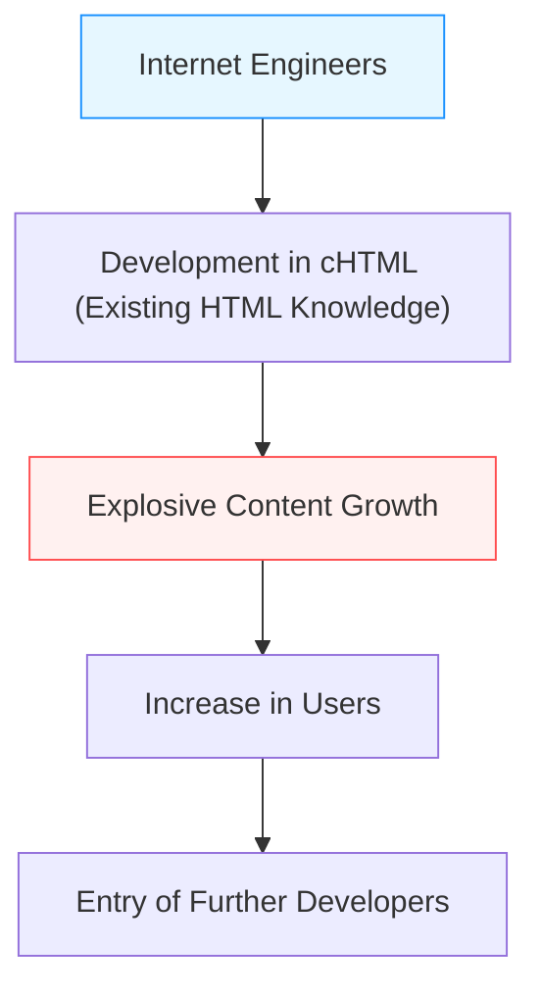

## Prologue: The "Mobile Internet" Before Smartphones

In modern times, accessing the internet from a device in the palm of your hand, enjoying videos, connecting with people around the world on social media, and shopping are all as natural as breathing. With the iPhone and other smartphones sweeping the world, we are constantly swimming in an always-connected digital ocean.

However, long before smartphones appeared, there was a country where this "internet in the palm of your hand" was an everyday occurrence. That country is Japan. "i-mode", launched by NTT DoCoMo in 1999, built a massive mobile internet ecosystem ahead of the rest of the world, fundamentally transforming people's lifestyles.

In this article, we will deeply and intricately unravel the history of how i-mode was born and why it saw such explosive adoption within Japan. We will explore the technological and business breakthroughs behind it, the activities of its key figures (Mari Matsunaga, Takeshi Natsuno, and Keiichi Enoki), and how it eventually became known as "Galapagosization," ultimately facing defeat against the "black ships" represented by the iPhone.

## Chapter 1: The Eve of i-mode's Birth and Its Key Figures

### Communications in the Late 1990s
In the late 1990s, the internet was gradually beginning to spread into ordinary households. However, the internet at that time involved "sitting in front of a computer and connecting via a dial-up modem," a specialized and heavy experience that took time to boot up and connect. Mobile phones were primarily tools for voice calls, and data communication was limited to sending short text messages (Short Mail and pagers).

Under these circumstances, an idea emerged within NTT DoCoMo: "Can't we use mobile phones to access information services like the internet?"

### A Miraculous Team Formation
To lead this ambitious project, a unique team was assembled, later known as the "Father of i-mode" and "Mother of i-mode."

- **Keiichi Enoki**
  A homegrown talent at NTT DoCoMo and the general manager of the i-mode project. He made the bold decision to eliminate the bureaucracy typical of large corporations and invite exceptional talent from outside. Without his leadership and ability to coordinate both inside and outside the company, i-mode would have been crushed by the framework of the existing telecommunications business.

- **Mari Matsunaga**
  An editor who previously served as the editor-in-chief for "Travail" and "Shushoku Journal" at Recruit. Scouted by Enoki, she took charge of content planning and production. She thoroughly brought in a user perspective, asking "What do ordinary high school girls and housewives want to enjoy?" rather than an engineer's perspective. She conceived the approachable name "i-mode" and worked tirelessly to cultivate various content providers.

- **Takeshi Natsuno**
  Well-versed in the internet business, he joined the team later. He played a decisive role in building the business model and formulating the technical specifications. His greatest achievements were constructing an open ecosystem that tolerated "unofficial sites" (katte sites) and a "proxy collection system" (billing system) that collected content fees along with communication charges.

By combining the strengths of these three individuals (organizational power, user-centric planning ability, and visionary business model construction), the miraculous project was set in motion.

## Chapter 2: Technological Breakthrough —— Adoption of cHTML

In global mobile communication standardization trends at the time, WAP (Wireless Application Protocol), utilizing a special markup language (WML) for mobile devices, was becoming the mainstream. Many overseas carriers and domestic competitors were trying to adopt this WAP.

However, the i-mode development team (especially Natsuno) chose a completely different approach. That was the adoption of **Compact HTML (cHTML)**.

### Why cHTML?
Although WAP (WML) was optimized for mobile phones, it had a fatal flaw: existing web designers and engineers had to learn a new language from scratch, making it difficult for content to grow.

On the other hand, cHTML was a subset of the already widely popular HTML (a simplified version with some features removed). In other words, anyone who could create websites for personal computers could immediately create sites for i-mode.

This decision was a historic and brilliant move that brought the "openness" of the internet to mobile devices. It also adopted GIF (later supporting JPEG, Flash, etc.) as the image format, successfully transplanting the existing internet culture directly into the palm of the hand.

## Chapter 3: Completion of the Ecosystem —— Official Sites, Unofficial Sites, and Proxy Collection

The biggest reason i-mode achieved global success lay more in its "business model" than its technology.

### 1. My Menu and Official Content
The top screen displayed when pressing the "i" button on an i-mode terminal. Here, "official sites" that had passed DoCoMo's strict screening were lined up by category. News, weather, banking, ringtones, games, and other high-quality services that users could use with peace of mind were packaged together.
Thanks to the efforts of Mari Matsunaga and others, many famous companies and banks provided content right from the launch of the service, offering "practical value" to users.

### 2. Tolerance of "Unofficial Sites"
DoCoMo allowed users to freely access not only official sites but also general sites (so-called "unofficial sites" or katte sites) that had not gone through DoCoMo's screening, by directly entering URLs or going through search sites and link collections.
Coupled with the aforementioned adoption of cHTML, countless personal diary sites, BBS (bulletin boards), and fan sites were born. This "free expansion including the underground" is what pushed i-mode from being a mere corporate information transmission tool to the center of youth culture.

### 3. Proxy Collection (Carrier Billing) System
The most powerful system built by Natsuno was the billing system for digital content.
The system allowed DoCoMo to collect the fees for paid content provided by official sites (about 100 to 300 yen per month) from users along with their monthly mobile phone bills, and pay the content providers (CPs) after deducting a commission (about 9%).
As a result, CPs could reliably generate revenue just by creating good content, without having to bear the burden of troublesome billing infrastructure or uncollected risks. Venture companies making hundreds of millions of yen from things like "ringtones" and "standby screens" sprang up one after another, truly presenting a gold rush scenario.

## Chapter 4: Packet Communication and Lifestyle Transformation

On February 22, 1999, the i-mode service was launched. When compatible devices like the "F501i" went on sale, it immediately triggered a massive boom.

What was important here was the adoption of the **packet communication system**.
Conventional data communication charged based on the "time connected," so browsing sites for a long time incurred enormous communication costs. However, packet communication charges based on the "amount of data sent and received." With text-centric cHTML, the data volume was extremely small, allowing users to enjoy the internet without worrying about time (essentially as an always-on connection).

### Cultural Explosion
i-mode birthed a new digital culture unique to Japan.

- **Emoji**
  The 12x12 pixel emojis developed by Shigetaka Kurita and others added rich emotion to short text communication. This was later adopted into Unicode and became the root of the "Emoji" used around the world today.
- **Chaku-uta and Ringtones**
  Evolving from monophonic to polyphonic, and then to actual songs (Chaku-uta), it created a massive new market for the music industry.
- **Mobile Phone Novels (Keitai Shousetsu)**
  Novels written by high school girls tapping away on their mobile phone buttons gathered millions of views and became huge bestsellers when published as books. (e.g., "Deep Love," "Koizora")
- **Mobile Games**
  Starting with early Sudoku and simple RPGs, it eventually led to the prosperity of social games through platforms like GREE and Mobage.

## Chapter 5: The Pitfall of Galapagos Syndrome

By the mid-2000s, i-mode had tens of millions of users in Japan, and device features like FeliCa (mobile wallet), 1Seg (mobile TV), and GPS navigation had reached the highest level in the world.

However, this highly optimized ecosystem gradually came to be compared to the "unique ecosystem of the Galapagos Islands."

### Unique Evolution and Isolation from the Globe
Japanese mobile devices (feature phones) were made with telecommunication carriers (like DoCoMo) taking the lead and giving detailed specifications to manufacturers. Therefore, while they were perfectly optimized for the carrier's services (like i-mode), they underwent a Galapagos-like evolution, becoming unusable on overseas networks and services.

- Software became overly complex, and device manufacturers suffered from skyrocketing development costs.
- Adaptation to global trends (PC-like OS, touch panels) was delayed.
- Content providers didn't consider overseas expansion because they could make sufficient profits solely within Japan's closed carrier market.

NTT DoCoMo also attempted to export and partner the i-mode system with overseas telecom operators (in Europe, Asia, etc.), but due to differences in telecommunication infrastructure, culture, and business customs in each country, it could not achieve the same success as in Japan.

## Chapter 6: Arrival of the Black Ships —— The Rise of the iPhone and Smartphones

In 2007, Apple announced the first-generation iPhone (released in Japan in 2008 as the iPhone 3G).
Initially, many people in the Japanese industry underestimated the iPhone. They thought, "No mobile wallet, no 1Seg, can't type emojis, can't do infrared communication. Something like this won't be accepted by Japanese users."

However, the essence of the smartphone revolution brought by Steve Jobs was not the number of features, but the **"fundamental redefinition of user experience (UX)"** and a **"truly global open ecosystem through the App Store."**

### The Collapsing i-mode Empire
A rich web experience with a full browser just like a PC, intuitive multi-touch operations, and the App Store where developers worldwide could directly provide apps.
These completely rendered the "official menu" system tightly controlled by carriers obsolete.

Users rapidly migrated to smartphones, and content providers also pivoted to app development. The platform known as i-mode completed its historical mission and gradually began to fade out. (Scheduled to be completely terminated in March 2026).

## Epilogue: The Legacy Left by i-mode

i-mode ultimately lost to smartphones and disappeared from the main stage of history. However, the "potential of the mobile internet" that i-mode proved ahead of the world, and the numerous concepts cultivated there, have definitely been passed down to our modern smartphone society.

- **Emoji** has become a universal language.
- The concept of **carrier billing (the origin of billing systems like the App Store and Google Play)** is the foundation of the app economy.
- The Japanese were the first in the world to experience the **lifestyle itself** of consuming content and communicating on mobile devices during spare time.

The "internet in the palm of your hand" envisioned and realized by Mari Matsunaga, Takeshi Natsuno, and Keiichi Enoki in 1999 is undoubtedly one of the most brilliant monumental achievements in the history of human communications, and was a great prototype of the digital society we enjoy today.

---
*This article is part of a series reflecting on the history of technology and communications, seeking hints for modern innovation. Look forward to our next historical exploration.*
