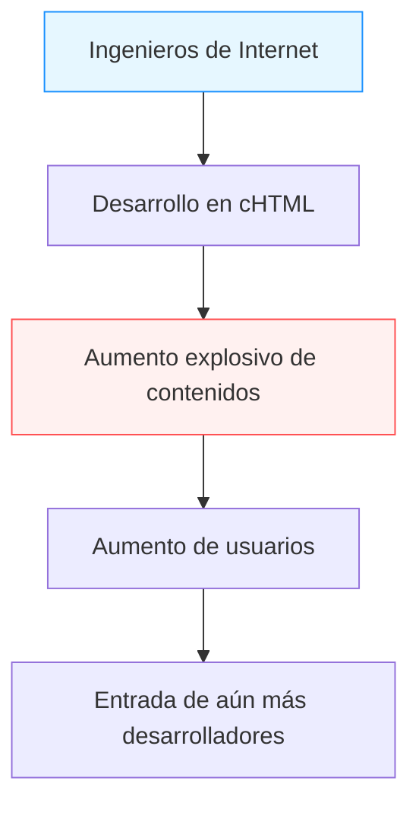

## Prólogo: El "internet móvil" antes de los teléfonos inteligentes (Smartphones)

En la actualidad, acceder a internet desde un dispositivo en la palma de la mano, disfrutar de videos, conectarse con personas de todo el mundo a través de las redes sociales y hacer compras son acciones tan naturales como respirar. Los teléfonos inteligentes, comenzando por el iPhone, han conquistado el mundo y nadamos constantemente en un océano digital siempre conectado.

Sin embargo, mucho antes de que aparecieran los teléfonos inteligentes, hubo un país que hizo de este "internet en la palma de la mano" algo cotidiano. Ese país fue Japón. "i-mode", servicio lanzado por NTT DoCoMo en 1999, construyó un ecosistema gigante de internet móvil antes que el resto del mundo, transformando fundamentalmente el estilo de vida de las personas.

En este artículo, exploraremos profundamente la historia de cómo nació i-mode y por qué experimentó una popularidad tan explosiva en Japón. Desentrañaremos los avances tecnológicos y empresariales detrás de su éxito, el papel de sus creadores (Mari Matsunaga, Takeshi Natsuno, Keiichi Enoki), lo que más tarde se denominó el "Síndrome de Galápagos" y su eventual derrota ante los barcos negros representados por el iPhone.

## Capítulo 1: La víspera del nacimiento de i-mode y sus creadores

### La situación de las telecomunicaciones a finales de la década de 1990
A finales de la década de 1990, internet comenzó a popularizarse gradualmente en los hogares comunes. Sin embargo, el internet de esa época significaba "sentarse frente a una computadora y conectarse por acceso telefónico a través de un módem", una experiencia técnica y pesada que requería tiempo tanto para iniciarse como para conectarse. Los teléfonos móviles eran principalmente herramientas para llamadas de voz y, en cuanto a comunicación de datos, se limitaban a enviar mensajes de texto cortos (Short Mail o buscapersonas/pagers).

En medio de esto, surgió dentro de NTT DoCoMo la idea de: "¿No podríamos usar los teléfonos móviles para acceder a servicios de información como internet?".

### La formación de un equipo milagroso
Para liderar este ambicioso proyecto se reunió a un equipo único que más tarde sería conocido como "el padre de i-mode" y "la madre de i-mode".

- **Keiichi Enoki**
  Un veterano de NTT DoCoMo y el director general del proyecto i-mode. Tomó la audaz decisión de eliminar la burocracia típica de las grandes corporaciones y traer talentos extraordinarios del exterior. Sin su liderazgo y su capacidad de coordinación interna y externa, i-mode habría sido aplastado por la estructura del negocio de telecomunicaciones existente.

- **Mari Matsunaga**
  Una editora que se desempeñó como editora en jefe de revistas como "Travail" y "Shushoku Journal" en Recruit. Fue reclutada por Enoki y estuvo a cargo de la planificación y producción de contenidos. Ella introdujo completamente la perspectiva del usuario en lugar de la perspectiva técnica: "qué quieren disfrutar las chicas de secundaria y las amas de casa comunes", ideó el nombre amigable "i-mode" y trabajó arduamente para desarrollar proveedores de contenido.

- **Takeshi Natsuno**
  Profundamente versado en negocios de internet y que se unió más tarde. Desempeñó un papel decisivo en la construcción del modelo de negocio y en la formulación de las especificaciones técnicas. Sus mayores logros fueron la creación de un ecosistema abierto que toleraba los "sitios no oficiales" (katte sites) y la construcción del "sistema de facturación delegada" que cobraba las tarifas de contenido junto con las tarifas de comunicación.

Al combinar las fortalezas de estos tres (capacidad organizativa, planificación centrada en el usuario y construcción de modelos de negocio visionarios), este proyecto milagroso se puso en marcha.

## Capítulo 2: Un avance tecnológico —— La adopción de cHTML

En las tendencias de estandarización de las telecomunicaciones móviles mundiales de la época, el WAP (Wireless Application Protocol), un lenguaje de marcado especial para dispositivos móviles (WML), se estaba convirtiendo en la corriente principal. Muchos operadores internacionales y competidores nacionales estaban a punto de adoptar este WAP.

Sin embargo, el equipo de desarrollo de i-mode (especialmente el Sr. Natsuno) eligió un enfoque completamente diferente. Esa fue la adopción de **Compact HTML (cHTML)**.

### ¿Por qué cHTML?
Aunque WAP (WML) estaba optimizado para teléfonos móviles, tenía la debilidad fatal de que los diseñadores e ingenieros web existentes tenían que aprender un nuevo lenguaje desde cero, lo que dificultaba la proliferación de contenidos.

Por otro lado, cHTML es un subconjunto (una versión simplificada sin algunas características) de HTML, que ya estaba ampliamente difundido en ese momento. En otras palabras, cualquier persona que pudiera crear un sitio web para PC podía crear un sitio para i-mode de inmediato.

Esta decisión fue un movimiento histórico que llevó la "apertura" de internet a los dispositivos móviles. También adoptaron el formato GIF para imágenes (más tarde soportarían JPEG, Flash, etc.) y tuvieron éxito en trasplantar la cultura de internet existente directamente a la palma de la mano.

## Capítulo 3: La finalización del ecosistema —— Sitios oficiales, sitios no oficiales y cobro delegado

La razón principal por la que i-mode logró el éxito mundial se debió a su "modelo de negocio" más que a su tecnología.

### 1. Mi Menú y contenidos oficiales
La pantalla principal que aparece al presionar el botón "i" en un terminal i-mode. Aquí se enumeraban, por categorías, los "sitios oficiales" que habían pasado la estricta revisión de DoCoMo. Servicios de alta calidad que los usuarios podían utilizar con tranquilidad, como noticias, clima, bancos, tonos de llamada y juegos, se ofrecían en un paquete.
Gracias a los esfuerzos de Mari Matsunaga y otros, muchas empresas y bancos famosos proporcionaron contenido desde el inicio del servicio, ofreciendo "valor práctico" a los usuarios.

### 2. Tolerancia a los "Sitios no oficiales" (Katte sites)
DoCoMo permitió el acceso libre no solo a los sitios oficiales, sino también a sitios generales (los llamados "sitios no oficiales" o "sitios no regulados") que no habían pasado por la revisión de DoCoMo, ingresando la URL directamente o a través de sitios de búsqueda o enlaces.
Combinado con la adopción mencionada de cHTML, nacieron innumerables sitios de diarios personales, BBS (tableros de anuncios) y sitios de fans creados por individuos. Esta "expansión libre que incluía también el underground" fue precisamente lo que empujó a i-mode de ser una simple herramienta de difusión de información corporativa a convertirse en el centro de la cultura juvenil.

### 3. Sistema de cobro delegado (Carrier billing)
El sistema más poderoso construido por Natsuno fue el sistema de cobro para contenidos digitales.
DoCoMo cobraba la tarifa del contenido de pago proporcionado por los sitios oficiales (alrededor de 100 a 300 yenes al mes) a los usuarios junto con la factura mensual del teléfono móvil, y pagaba al proveedor de contenido (CP) deduciendo una comisión (aproximadamente del 9%).
Como resultado, los CP podían obtener ingresos de forma segura con solo crear contenido de buena calidad, sin tener que asumir infraestructuras de cobro problemáticas o el riesgo de cobros fallidos. Surgieron empresas emergentes una tras otra, ganando cientos de millones de yenes con "tonos de llamada" (Chaku-mero) y "fondos de pantalla", mostrando aspectos de una verdadera fiebre del oro.

## Capítulo 4: Comunicaciones por paquetes y la transformación del estilo de vida

El 22 de febrero de 1999, se lanzó el servicio i-mode. Cuando salieron a la venta terminales compatibles como el "F501i", se desató inmediatamente un gran auge.

Lo importante aquí fue la adopción del **sistema de comunicación por paquetes**.
La comunicación de datos convencional cobraba según el "tiempo de conexión", por lo que mirar un sitio durante mucho tiempo resultaba en enormes costos de comunicación. Sin embargo, la comunicación por paquetes se cobra en función de la "cantidad de datos enviados y recibidos". Dado que cHTML centrado en texto tenía un volumen de datos muy pequeño, los usuarios podían disfrutar de internet sin preocuparse por el tiempo (como una conexión permanente efectiva).

### La explosión cultural
i-mode dio a luz a una nueva cultura digital exclusiva de Japón.

- **Emoji**
  Los emojis de 12x12 píxeles desarrollados por Shigetaka Kurita y otros agregaron emociones ricas a la comunicación de texto corto. Más tarde se adoptó en Unicode y se convirtió en la raíz del "Emoji" que se usa actualmente en todo el mundo.
- **Chaku-uta / Chaku-mero (Tonos de llamada)**
  Evolucionaron de tonos monofónicos a polifónicos, y luego a canciones reales (Chaku-uta), creando un nuevo mercado gigante en la industria de la música.
- **Novelas de teléfonos móviles (Keitai Shosetsu)**
  Ocurrió un fenómeno en el que las novelas escritas por chicas de secundaria presionando los botones de sus teléfonos móviles atrajeron millones de visitas, se publicaron como libros y se convirtieron en grandes éxitos de ventas. (Ejemplo: "Deep Love", "Koizora", etc.)
- **Juegos móviles**
  Comenzando con sudokus tempranos y juegos de rol simples, más tarde condujo al auge de los juegos sociales a través de plataformas como GREE y Mobage.

## Capítulo 5: La trampa del Síndrome de Galápagos (Galápagos syndrome)

A mediados de la década de 2000, i-mode tenía decenas de millones de usuarios en Japón, y las funciones de los terminales habían alcanzado el nivel más alto del mundo, como FeliCa (billetera móvil), One-Seg (televisión móvil) y navegación GPS.

Sin embargo, este ecosistema altamente optimizado gradualmente se comparó con un "ecosistema único de las Islas Galápagos".

### Evolución única y aislamiento global
En Japón, los operadores de telecomunicaciones (como DoCoMo) lideraban la fabricación de teléfonos móviles (feature phones) dando instrucciones detalladas sobre las especificaciones a los fabricantes. Por lo tanto, aunque estaban perfectamente optimizados para los servicios del operador (como i-mode), lograron una evolución al estilo Galápagos que no se podía usar en redes o servicios extranjeros.

- El software se volvió complejo y misterioso, y los fabricantes de dispositivos sufrieron por el aumento de los costos de desarrollo.
- Hubo un retraso en la adaptación a las tendencias mundiales (SO tipo PC, paneles táctiles).
- Los proveedores de contenido tampoco consideraban la expansión en el extranjero porque el mercado cerrado de operadores en Japón era lo suficientemente rentable.

NTT DoCoMo también intentó exportar el sistema i-mode a operadores de telecomunicaciones extranjeros (en Europa, Asia, etc.) y formar alianzas, pero debido a las diferencias en la infraestructura de telecomunicaciones, la cultura y las costumbres comerciales de cada país, no pudo lograr el mismo éxito que en Japón.

## Capítulo 6: El ataque de los barcos negros —— El ascenso del iPhone y los teléfonos inteligentes

En 2007, Apple anunció el primer iPhone (lanzado en Japón en 2008 con el iPhone 3G).
Al principio, muchos miembros de la industria japonesa subestimaron al iPhone. Decían: "No tiene billetera móvil, no tiene One-Seg, no puedes escribir emojis y no puede hacer comunicación por infrarrojos. Algo así no será aceptado por los usuarios japoneses".

Sin embargo, la esencia de la revolución de los teléfonos inteligentes traída por Steve Jobs no radicaba en la cantidad de características, sino en la **"redefinición fundamental de la experiencia del usuario (UX)"** y un **"verdadero ecosistema abierto y global a través de la App Store"**.

### El colapso del imperio i-mode
Una rica experiencia web con un navegador completo idéntico al de una PC, una operación multitáctil intuitiva y la App Store donde los desarrolladores de todo el mundo podían ofrecer aplicaciones directamente.
Estos factores hicieron completamente obsoleto el sistema del "menú oficial" que los operadores habían gestionado rígidamente.

Los usuarios cambiaron rápidamente a los teléfonos inteligentes, y los proveedores de contenido también se volcaron hacia el desarrollo de aplicaciones. La plataforma i-mode terminó su misión histórica y se fue desvaneciendo gradualmente. (Cierre total programado para marzo de 2026).

## Epílogo: El legado que dejó i-mode

i-mode finalmente fue derrotado por los teléfonos inteligentes y desapareció del escenario principal de la historia. Sin embargo, las "posibilidades del internet móvil" que i-mode demostró antes que el resto del mundo, y los numerosos conceptos cultivados allí, ciertamente se han transmitido a la sociedad actual de los teléfonos inteligentes.

- Los **Emoji** se han convertido en un lenguaje común en el mundo.
- El concepto de **cobro por parte del operador (la fuente de los sistemas de cobro de App Store y Google Play)** es la base de la economía de las aplicaciones.
- Los japoneses fueron los primeros en el mundo en experimentar el **estilo de vida en sí** de consumir contenido y comunicarse a través de dispositivos móviles durante el tiempo libre.

El "internet en la palma de la mano" imaginado y realizado por Mari Matsunaga, Takeshi Natsuno y Keiichi Enoki en 1999. Es sin duda uno de los hitos más brillantes en la historia de las comunicaciones humanas, y fue un gran prototipo de la sociedad digital que disfrutamos hoy.

---
*Este artículo es parte de una serie que repasa la historia de la tecnología y las comunicaciones para buscar pistas sobre la innovación moderna. Esperamos que disfrute de nuestra próxima exploración histórica.*
