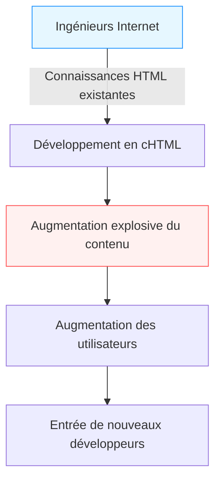

## Introduction : L'"Internet mobile" avant les smartphones

À l'époque contemporaine, accéder à Internet depuis un appareil dans la paume de sa main, profiter de vidéos, se connecter avec des personnes du monde entier sur les réseaux sociaux et faire des achats sont devenus des actes aussi naturels que respirer. Les smartphones, en commençant par l'iPhone, ont conquis le monde, et nous nageons constamment dans une mer numérique toujours connectée.

Cependant, bien avant l'apparition des smartphones, il existait un pays où cet "Internet dans la paume de la main" faisait partie du quotidien. C'est le Japon. "i-mode", lancé par NTT DoCoMo en 1999, a construit un écosystème géant de l'Internet mobile en avant-première mondiale, transformant fondamentalement le mode de vie des gens.

Dans cet article, nous explorerons en profondeur et en détail comment l'i-mode est né, pourquoi il a connu une diffusion aussi explosive au Japon, les percées technologiques et commerciales en arrière-plan, les contributions de ses fondateurs (Mari Matsunaga, Takeshi Natsuno, Keiichi Enoki), et son histoire jusqu'à ce qu'il soit qualifié de "syndrome des Galapagos" avant de s'incliner face aux navires noirs représentés par l'iPhone.

## Chapitre 1 : La veille de la naissance de l'i-mode et ses fondateurs

### Le contexte des télécommunications à la fin des années 1990
À la fin des années 1990, Internet commençait progressivement à se répandre dans les foyers. Cependant, l'Internet de l'époque consistait à "s'asseoir devant un ordinateur et se connecter par ligne commutée via un modem", une expérience technique et lourde qui prenait du temps à démarrer et à connecter. Les téléphones portables étaient principalement des outils d'appels vocaux, et la communication de données se limitait à l'envoi de courts messages textuels (Short Mail et pagers).

C'est dans ce contexte qu'est née au sein de NTT DoCoMo l'idée : "Ne pourrait-on pas utiliser des services d'information comme Internet sur un téléphone portable ?"

### La formation d'une équipe miracle
Pour diriger ce projet ambitieux, une équipe hétéroclite, plus tard appelée le "père de l'i-mode" et la "mère de l'i-mode", a été réunie.

- **Keiichi Enoki**
  Pur produit de NTT DoCoMo et directeur général du projet i-mode. Il a pris la décision audacieuse de rejeter la bureaucratie typique des grandes entreprises et de recruter des talents exceptionnels de l'extérieur. Sans son leadership et ses compétences en coordination interne et externe, l'i-mode aurait été écrasé par le cadre commercial existant des télécommunications.

- **Mari Matsunaga**
  Une éditrice qui a été rédactrice en chef de magazines comme "Travail" et "Shushoku Journal" chez Recruit. Recrutée par Enoki, elle était en charge de la planification et de la production de contenu. Elle a apporté non pas une perspective d'ingénieur, mais une perspective d'utilisateur se demandant "de quoi une lycéenne ou une femme au foyer ordinaire voudrait-elle profiter ?", et a travaillé d'arrache-pied pour inventer le nom accrocheur "i-mode" et démarcher divers fournisseurs de contenu.

- **Takeshi Natsuno**
  Expert du commerce sur Internet, il a rejoint l'équipe par la suite. Il a joué un rôle décisif dans la construction du modèle économique et la formulation des spécifications techniques. Ses plus grandes réalisations ont été la création d'un écosystème ouvert tolérant les "sites non officiels" (Katte sites) et d'un "système de recouvrement pour compte de tiers" (facturation par l'opérateur) permettant de collecter les frais de contenu en même temps que les frais de communication.

C'est en combinant les forces de ces trois personnes (pouvoir d'organisation, capacité de planification axée sur l'utilisateur, capacité visionnaire de création de modèles économiques) que ce projet miraculeux s'est mis en marche.

## Chapitre 2 : Percée technologique —— L'adoption du cHTML

Dans les tendances mondiales de normalisation des communications mobiles de l'époque, un langage de description spécial pour les appareils mobiles appelé WAP (Wireless Application Protocol) (WML) devenait la norme. De nombreux opérateurs étrangers et concurrents nationaux tentaient d'adopter ce WAP.

Cependant, l'équipe de développement de l'i-mode (en particulier M. Natsuno) a choisi une approche complètement différente. C'était l'adoption du **Compact HTML (cHTML)**.

### Pourquoi le cHTML ?
Bien que le WAP (WML) ait été optimisé pour les téléphones mobiles, il présentait un point faible fatal : les concepteurs Web et les ingénieurs existants devaient apprendre un nouveau langage depuis le début, ce qui rendait difficile l'enrichissement du contenu.

D'autre part, le cHTML est un sous-ensemble (une version simplifiée avec certaines fonctionnalités supprimées) du HTML qui était déjà largement répandu à l'époque. En d'autres termes, toute personne capable de créer un site Web pour ordinateur pouvait immédiatement créer un site pour i-mode.

Cette décision a été un choix historique audacieux qui a apporté l'"ouverture" d'Internet au monde mobile. Ils ont également adopté le format GIF pour les images (et plus tard pris en charge le JPEG, Flash, etc.), réussissant à transplanter la culture Internet existante telle quelle dans le creux de la main.

## Chapitre 3 : L'achèvement de l'écosystème —— Sites officiels, Sites non officiels, et Recouvrement pour le compte de tiers

La principale raison pour laquelle l'i-mode a connu un succès mondial résidait plus dans son "modèle économique" que dans sa technologie.

### 1. Mon Menu et Contenu Officiel
L'écran supérieur qui s'affichait lorsque vous appuyiez sur le bouton "i" d'un appareil i-mode. Ici, les "sites officiels" qui avaient passé l'examen strict de DoCoMo étaient alignés par catégorie. Des services de haute qualité que les utilisateurs pouvaient utiliser en toute confiance, tels que les actualités, la météo, les banques, les sonneries et les jeux, y étaient regroupés.
Grâce aux efforts de Mari Matsunaga et d'autres, de nombreuses entreprises et banques célèbres ont fourni du contenu dès le lancement du service, offrant une "valeur pratique" aux utilisateurs.

### 2. La tolérance des "Sites non officiels"
DoCoMo a permis aux utilisateurs d'accéder librement non seulement aux sites officiels, mais aussi aux sites généraux n'ayant pas passé l'examen de DoCoMo (les soi-disant "Katte sites" ou "sites non officiels") en saisissant directement une URL ou via des sites de recherche et des annuaires de liens.
Couplé à l'adoption du cHTML mentionnée précédemment, d'innombrables sites de journaux personnels, BBS (forums), sites de fans, etc., créés par des particuliers ont vu le jour. C'est cette "expansion libre, incluant l'underground", qui a propulsé l'i-mode de simple outil de diffusion d'informations d'entreprise à un centre névralgique de la culture des jeunes.

### 3. Système de recouvrement (Facturation par l'opérateur)
Le système le plus puissant construit par Natsuno était le système de facturation pour le contenu numérique.
C'est un mécanisme où DoCoMo collecte les frais de contenu payant fournis par les sites officiels (environ 100 à 300 yens par mois) auprès des utilisateurs avec leurs factures mensuelles de téléphone portable, puis paie les fournisseurs de contenu (CP) après déduction d'une commission (environ 9%).
Grâce à cela, les CP pouvaient générer des revenus de manière fiable simplement en créant du bon contenu, sans avoir à gérer d'infrastructures de facturation complexes ni à supporter le risque de non-recouvrement. De nombreuses startups générant des centaines de millions de yens avec des "sonneries" et des "fonds d'écran" sont nées l'une après l'autre, ressemblant véritablement à une ruée vers l'or.

## Chapitre 4 : Communication par paquets et transformation du mode de vie

Le 22 février 1999, le service i-mode a été lancé. Lors de la mise en vente de terminaux compatibles comme le "F501i", cela a immédiatement créé un immense engouement.

Ce qui était important ici, c'était l'adoption de la **communication par paquets**.
Les communications de données traditionnelles étaient facturées en fonction de la "durée de connexion", ce qui entraînait des coûts de communication énormes si vous naviguiez sur un site pendant longtemps. Cependant, la communication par paquets est facturée sur la "quantité de données envoyées et reçues". Avec le cHTML centré sur le texte, le volume de données était très faible, permettant aux utilisateurs de profiter d'Internet sans se soucier du temps (comme une connexion pratiquement permanente).

### L'explosion de la culture
L'i-mode a donné naissance à une nouvelle culture numérique propre au Japon.

- **Emoji (Pictogrammes)**
  Les emojis de 12x12 pixels développés par Shigetaka Kurita et d'autres ont ajouté des émotions riches aux courtes communications textuelles. Ceux-ci ont ensuite été adoptés par Unicode, devenant les racines des "Emoji" utilisés dans le monde entier aujourd'hui.
- **Chaku-uta / Chaku-mero (Sonneries)**
  Évoluant des sons monophoniques aux accords, puis aux vraies chansons (Chaku-uta), cela a créé un nouveau marché gigantesque dans l'industrie musicale.
- **Romans sur téléphone portable (Keitai shosetsu)**
  Le phénomène s'est produit où des romans écrits par des lycéennes tapant sur les boutons de leur téléphone portable ont attiré des millions de visites, ont été publiés sous forme de livres et sont devenus de grands best-sellers. (Exemples : "Deep Love", "Koizora", etc.)
- **Jeux mobiles**
  Commençant par le Sudoku et des RPG simples au début, cela a conduit à l'essor des jeux sociaux via des plateformes comme GREE et Mobage par la suite.

## Chapitre 5 : Le piège du syndrome des Galápagos

Au milieu des années 2000, l'i-mode comptait des dizaines de millions d'utilisateurs au Japon, et les fonctionnalités des terminaux avaient atteint le plus haut niveau mondial avec FeliCa (Osaifu-Keitai / portefeuille mobile), One-Seg (télévision mobile), la navigation GPS, etc.

Cependant, cet écosystème hautement optimisé a progressivement commencé à être comparé à "l'écosystème unique des îles Galápagos".

### Évolution indépendante et isolement mondial
Les téléphones portables japonais (feature phones) étaient fabriqués sous les spécifications détaillées dictées par les opérateurs de télécommunications (comme DoCoMo) aux fabricants. En conséquence, bien qu'ils fussent parfaitement optimisés pour les services des opérateurs (comme i-mode), ils avaient subi une évolution façon "Galápagos", les rendant inutilisables sur les réseaux ou avec les services à l'étranger.

- Les logiciels sont devenus extrêmement complexes, et les fabricants de terminaux ont souffert de la flambée des coûts de développement.
- L'adaptation aux tendances mondiales (systèmes d'exploitation de type PC, écrans tactiles) a pris du retard.
- Les fournisseurs de contenu n'ont pas envisagé de s'étendre à l'étranger car le marché fermé des opérateurs japonais était suffisamment rentable.

NTT DoCoMo a également tenté d'exporter le système i-mode et de s'associer avec des opérateurs de télécommunications étrangers (en Europe et en Asie), mais en raison des différences d'infrastructures de communication, de cultures et de pratiques commerciales dans chaque pays, il n'a pas pu obtenir le même succès qu'au Japon.

## Chapitre 6 : L'arrivée des navires noirs —— L'essor de l'iPhone et des smartphones

En 2007, le premier iPhone a été annoncé par Apple (lancé au Japon en 2008 avec l'iPhone 3G).
Au début, de nombreux acteurs de l'industrie japonaise sous-estimaient l'iPhone. "Pas de portefeuille mobile, pas de One-Seg, on ne peut pas taper des emojis, ni utiliser la communication infrarouge. Une telle chose ne sera jamais acceptée par les utilisateurs japonais."

Cependant, la véritable essence de la révolution des smartphones apportée par Steve Jobs ne résidait pas dans le nombre de fonctionnalités, mais dans la **"redéfinition fondamentale de l'expérience utilisateur (UX)"** et le **"véritable écosystème mondial et ouvert via l'App Store"**.

### L'effondrement de l'empire i-mode
Une expérience Web riche avec un navigateur complet comme sur un PC, un fonctionnement multi-touch intuitif, et l'App Store où des développeurs du monde entier pouvaient proposer directement des applications.
Ceux-ci ont rendu le système de "menu officiel", rigidement géré par les opérateurs, complètement obsolète.

Les utilisateurs sont rapidement passés aux smartphones, et les fournisseurs de contenu se sont également tournés vers le développement d'applications. La plateforme i-mode, ayant achevé sa mission historique, a commencé à s'effacer progressivement. (L'arrêt complet est prévu pour mars 2026).

## Conclusion : L'héritage laissé par l'i-mode

L'i-mode a finalement perdu face aux smartphones et a disparu du devant de la scène historique. Cependant, "le potentiel de l'Internet mobile" que l'i-mode a prouvé en avant-première mondiale, et les nombreux concepts qui y ont été cultivés, ont été solidement transmis à la société moderne des smartphones.

- Les **Emoji** sont devenus un langage universel.
- Le concept de **facturation par l'opérateur (les origines des systèmes de paiement de l'App Store et de Google Play)** est la base de l'économie des applications.
- **Le style de vie lui-même**, qui consiste à consommer du contenu et à communiquer sur des appareils mobiles pendant les temps morts, a été expérimenté par les Japonais avant tout le monde.

L'"Internet dans la paume de la main" que Mari Matsunaga, Takeshi Natsuno, Keiichi Enoki et d'autres ont imaginé et réalisé en 1999, est sans aucun doute l'un des monuments les plus brillants de l'histoire des télécommunications humaines, et c'était le grand prototype de la société numérique dont nous profitons aujourd'hui.

---
*Cet article fait partie d'une série qui retrace l'histoire de la technologie et des télécommunications afin de trouver des pistes d'innovation contemporaine. Restez à l'écoute pour notre prochaine exploration historique.*
