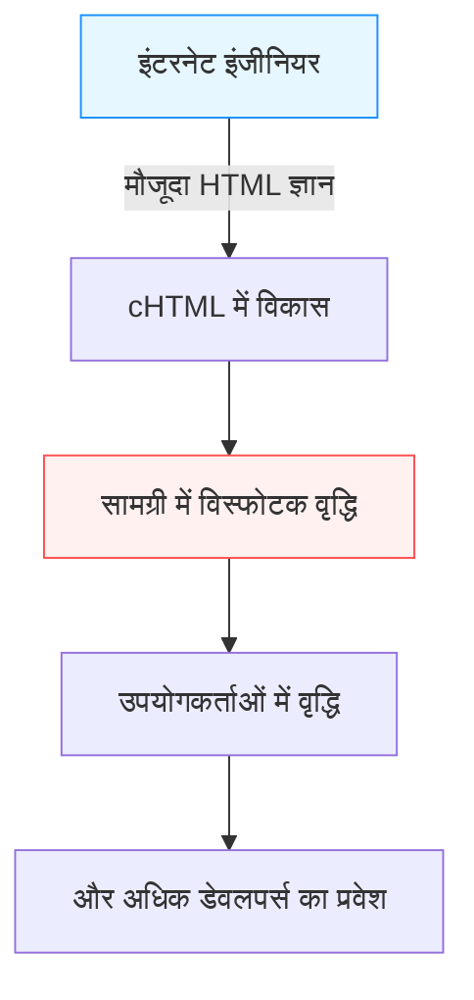

## प्रस्तावना: स्मार्टफोन से पहले का "मोबाइल इंटरनेट"

आधुनिक युग में, अपनी हथेली में मौजूद डिवाइस से इंटरनेट एक्सेस करना, वीडियो का आनंद लेना, सोशल मीडिया पर दुनिया भर के लोगों से जुड़ना और खरीदारी करना सांस लेने जितना स्वाभाविक हो गया है। iPhone सहित स्मार्टफ़ोन ने दुनिया में तहलका मचा दिया है, और हम हमेशा कनेक्टेड डिजिटल समुद्र में तैर रहे हैं।

लेकिन स्मार्टफ़ोन के आने से बहुत पहले, एक देश ऐसा था जहां यह "हथेली पर इंटरनेट" एक रोज़मर्रा की बात थी। वह देश जापान है। 1999 में NTT DoCoMo द्वारा शुरू की गई सेवा "i-mode" ने दुनिया में सबसे पहले मोबाइल इंटरनेट का एक विशाल इकोसिस्टम बनाया और लोगों की जीवनशैली को मौलिक रूप से बदल दिया।

इस लेख में, हम गहराई से और विस्तार से पता लगाएंगे कि i-mode कैसे पैदा हुआ और जापान में इसका इतना विस्फोटक प्रसार क्यों हुआ। इसके पीछे की तकनीकी और व्यावसायिक सफलताएं, प्रमुख हस्तियों (मारी मात्सुनागा, ताकेशी नात्सुनो, और केइची एनोकी) की भूमिकाएं, और फिर "गैलापागोस सिंड्रोम" कहलाने वाली घटना, जब अंततः यह iPhone द्वारा लाए गए बदलावों के सामने हार गया।

## अध्याय 1: i-mode के जन्म की पूर्व संध्या और प्रमुख हस्तियां

### 1990 के दशक के उत्तरार्ध में संचार की स्थिति
1990 के दशक के उत्तरार्ध में, इंटरनेट धीरे-धीरे आम घरों में फैलने लगा था। हालाँकि, उस समय का इंटरनेट "कंप्यूटर के सामने बैठना और मॉडेम के माध्यम से डायल-अप कनेक्शन का उपयोग करना" था, जो एक समय लेने वाला, तकनीकी और भारी अनुभव था। मोबाइल फोन मुख्य रूप से वॉयस कॉल के लिए टूल थे, और डेटा संचार केवल छोटे टेक्स्ट मैसेज (शॉर्ट मेल या पेजर) भेजने तक सीमित था।

इस बीच, NTT DoCoMo के भीतर यह विचार उभरा: "क्या मोबाइल फोन का उपयोग इंटरनेट जैसी सूचना सेवाओं के लिए किया जा सकता है?"

### चमत्कारी टीम का गठन
इस भव्य परियोजना का नेतृत्व करने के लिए, एक अनूठी टीम को इकट्ठा किया गया, जिन्हें बाद में "i-mode का पिता" और "i-mode की माँ" कहा गया।

- **केइची एनोकी (Keiichi Enoki)**
  NTT DoCoMo के एक अनुभवी कर्मचारी और i-mode परियोजना के महाप्रबंधक। उन्होंने बड़े निगमों के विशिष्ट नौकरशाही रवैये को दरकिनार करते हुए, बाहर से असाधारण प्रतिभाओं को आमंत्रित करने का साहसिक निर्णय लिया। उनके नेतृत्व और आंतरिक/बाहरी समन्वय कौशल के बिना, i-mode मौजूदा दूरसंचार व्यवसाय के ढांचे के नीचे कुचल दिया गया होता।

- **मारी मात्सुनागा (Mari Matsunaga)**
  एक संपादक जिन्होंने रिक्रूट (Recruit) में "Trabaille" और "Shushoku Journal" जैसी पत्रिकाओं के मुख्य संपादक के रूप में काम किया था। उन्हें एनोकी द्वारा भर्ती किया गया था, और उन्होंने सामग्री (content) की योजना और उत्पादन का प्रभार संभाला। वह एक इंजीनियर का दृष्टिकोण नहीं, बल्कि "सामान्य हाई स्कूल की लड़कियां और गृहिणियां क्या आनंद लेना चाहेंगी?" का उपयोगकर्ता-केंद्रित दृष्टिकोण लेकर आईं। उन्होंने "i-mode" के अनुकूल नाम को गढ़ा और विभिन्न सामग्री प्रदाताओं (content providers) को खोजने में कड़ी मेहनत की।

- **ताकेशी नात्सुनो (Takeshi Natsuno)**
  इंटरनेट व्यापार के जानकार, जो बाद में शामिल हुए। उन्होंने व्यवसाय मॉडल (business model) बनाने और तकनीकी विशिष्टताओं (technical specifications) को परिभाषित करने में एक निर्णायक भूमिका निभाई। उनकी सबसे बड़ी उपलब्धि एक खुले पारिस्थितिकी तंत्र (open ecosystem) का निर्माण था जिसने "अनौपचारिक साइटों (Unofficial sites)" की अनुमति दी, और एक "बिलिंग संग्रह प्रणाली (Billing Collection System)" का निर्माण किया जिसने संचार शुल्क के साथ सामग्री शुल्क एकत्र किया।

इन तीनों ने अपनी-अपनी ताकतों (संगठनात्मक शक्ति, उपयोगकर्ता-केंद्रित योजना और दूरदर्शी व्यापार मॉडल निर्माण शक्ति) को मिलाकर इस चमत्कारी परियोजना को गति दी।

## अध्याय 2: तकनीकी सफलता —— cHTML को अपनाना

उस समय वैश्विक मोबाइल संचार मानकीकरण प्रवृत्तियों में, WAP (वायरलेस एप्लीकेशन प्रोटोकॉल) और इसकी विशेष मार्कअप भाषा (WML) मोबाइल उपकरणों के लिए मुख्यधारा बन रही थी। कई विदेशी वाहक और घरेलू प्रतियोगी इस WAP को अपनाने की कोशिश कर रहे थे।

हालाँकि, i-mode विकास टीम (विशेष रूप से नात्सुनो) ने एक बिल्कुल अलग दृष्टिकोण चुना। यह **कॉम्पैक्ट HTML (cHTML)** को अपनाना था।

### cHTML ही क्यों?
हालाँकि WAP (WML) मोबाइल फोन के लिए अनुकूलित था, लेकिन इसकी एक घातक कमजोरी थी: मौजूदा वेब डिजाइनरों और इंजीनियरों को खरोंच से एक नई भाषा सीखनी पड़ती, जिससे सामग्री को समृद्ध करना मुश्किल हो जाता।

दूसरी ओर, cHTML उस HTML का एक सबसेट (कुछ सुविधाओं को हटाकर सरलीकृत संस्करण) है जो उस समय पहले से ही व्यापक रूप से उपयोग किया जाता था। दूसरे शब्दों में, जो कोई भी पीसी के लिए वेबसाइट बना सकता था, वह तुरंत i-mode के लिए भी वेबसाइट बना सकता था।

यह निर्णय एक ऐतिहासिक मास्टरस्ट्रोक था जिसने इंटरनेट के "खुलेपन (openness)" को मोबाइल पर लाया। चित्र प्रारूप के लिए GIF (बाद में JPEG और Flash का भी समर्थन किया गया) को अपनाया गया, और वे हथेली पर मौजूदा इंटरनेट संस्कृति को सफलतापूर्वक प्रत्यारोपित करने में सफल रहे।

## अध्याय 3: इकोसिस्टम का पूरा होना —— आधिकारिक साइटें, अनौपचारिक साइटें और बिलिंग संग्रह

i-mode की वैश्विक सफलता का सबसे बड़ा कारण इसकी तकनीक से कहीं अधिक इसका "व्यापार मॉडल (Business Model)" था।

### 1. माई मेनू (My Menu) और आधिकारिक सामग्री
i-mode हैंडसेट पर "i" बटन दबाए जाने पर प्रदर्शित होने वाली शीर्ष स्क्रीन। यहाँ, DoCoMo की सख्त जांच से गुजरने वाली "आधिकारिक साइटें (Official Sites)" श्रेणी के अनुसार पंक्तिबद्ध थीं। समाचार, मौसम, बैंकिंग, रिंगटोन, और गेम जैसी बेहतरीन सेवाएँ पैकेज की गई थीं जिनका उपयोगकर्ता सुरक्षित रूप से उपयोग कर सकते थे।
मारी मात्सुनागा और अन्य के प्रयासों के कारण, कई प्रसिद्ध कंपनियों और बैंकों ने सेवा शुरू होने के समय से ही सामग्री प्रदान की, जिससे उपयोगकर्ताओं को "व्यावहारिक मूल्य (Practical Value)" मिला।

### 2. "अनौपचारिक साइटों (Unofficial Sites)" की अनुमति
DoCoMo ने केवल आधिकारिक साइटों की अनुमति नहीं दी, बल्कि सीधे URL दर्ज करके या खोज इंजन और लिंक संग्रह के माध्यम से DoCoMo द्वारा जांच न की गई सामान्य साइटों (जिन्हें "कट्टे साइट" या "अनौपचारिक साइटें" कहा जाता है) तक मुफ्त पहुंच की भी अनुमति दी।
cHTML को अपनाने के साथ मिलकर, अनगिनत व्यक्तिगत डायरी साइटें, BBS (बुलेटिन बोर्ड सिस्टम) और फैन साइटें पैदा हुईं। "भूमिगत सहित यह मुफ्त विस्तार" ही था जिसने i-mode को केवल एक कॉर्पोरेट सूचना उपकरण से युवा संस्कृति के केंद्र में बदल दिया।

### 3. बिलिंग संग्रह (कैरियर बिलिंग) प्रणाली
नात्सुनो द्वारा बनाई गई सबसे शक्तिशाली प्रणाली डिजिटल सामग्री के लिए बिलिंग प्रणाली थी।
यह एक ऐसी प्रणाली थी जिसमें DoCoMo उपयोगकर्ताओं से उनके मासिक मोबाइल फोन बिल के साथ आधिकारिक साइटों (लगभग 100 से 300 येन प्रति माह) द्वारा प्रदान की जाने वाली सशुल्क सामग्री के लिए शुल्क एकत्र करता था, और एक कमीशन (लगभग 9%) काटकर सामग्री प्रदाताओं (CP) को भुगतान करता था।
नतीजतन, CP बिना जटिल बिलिंग बुनियादी ढांचे (billing infrastructure) या गैर-संग्रह (uncollected payments) के जोखिम के, केवल उच्च गुणवत्ता वाली सामग्री बनाकर मज़बूती से पैसा कमा सकते थे। "रिंगटोन" और "स्टैंडबाय इमेजेज (वॉलपेपर)" जैसी चीजों से करोड़ों कमाने वाली स्टार्टअप कंपनियां एक के बाद एक पैदा हुईं, जिससे सचमुच एक गोल्ड रश (Gold Rush) जैसी स्थिति बन गई।

## अध्याय 4: पैकेट संचार और जीवनशैली में बदलाव

22 फरवरी 1999 को i-mode सेवा शुरू की गई। जैसे ही इसके लिए अनुकूल उपकरण "F501i" और अन्य जारी हुए, यह तुरंत एक बहुत बड़ी सनसनी बन गया।

यहाँ सबसे महत्वपूर्ण बात **पैकेट संचार प्रणाली (Packet Communication System)** को अपनाना था।
चूंकि पारंपरिक डेटा संचार को "कनेक्शन समय" के आधार पर बिल किया जाता था, इसलिए लंबे समय तक साइटों को देखने से भारी संचार लागत आती थी। हालाँकि, पैकेट संचार में बिलिंग "भेजे और प्राप्त किए गए डेटा की मात्रा" पर आधारित होती है। cHTML, जो मुख्य रूप से टेक्स्ट है, के साथ डेटा की मात्रा बहुत कम थी, और उपयोगकर्ता समय की चिंता किए बिना (प्रभावी रूप से हमेशा-चालू कनेक्शन के रूप में) इंटरनेट का आनंद ले सकते थे।

### संस्कृति का विस्फोट
i-mode ने जापान के लिए अद्वितीय एक नई डिजिटल संस्कृति का निर्माण किया।

- **इमोजी (Emoji)**
  शिगेताका कुरिता और अन्य द्वारा विकसित 12x12 पिक्सेल इमोजी ने छोटे टेक्स्ट संचार में समृद्ध भावनाएं जोड़ीं। इसे बाद में यूनिकोड (Unicode) में अपनाया गया और यह "इमोजी" की जड़ है जो अब पूरी दुनिया में उपयोग किया जाता है।
- **चाकू-उता (रिंगटून्स) / चाकू-मेरो (रिंग मेलोडीज़)**
  यह मोनोटोन से पॉलीफोनिक (chords) में, और फिर वास्तविक गीतों (चाकू-उता) में विकसित हुआ, जिसने संगीत उद्योग के लिए एक नया विशाल बाजार तैयार किया।
- **मोबाइल उपन्यास (Keitai Shousetsu)**
  हाई स्कूल की लड़कियों और अन्य लोगों द्वारा अपने मोबाइल फोन के बटन दबाकर लिखे गए उपन्यासों को लाखों बार देखा गया, और उन्हें प्रकाशित करके बेस्टसेलर बनाने की एक घटना हुई। (उदाहरण: 'Deep Love', 'Koizora' आदि)
- **मोबाइल गेम**
  शुरुआती सुडोकू और सरल आरपीजी से शुरू होकर, इसने बाद में GREE और Mobage जैसे प्लेटफार्मों के माध्यम से सामाजिक खेलों (Social Games) के उदय को जन्म दिया।

## अध्याय 5: गैलापागोस सिंड्रोम (Galápagos syndrome) का जाल

2000 के दशक के मध्य में, i-mode के जापान में करोड़ों उपयोगकर्ता थे, और उपकरणों के कार्य, जैसे FeliCa (ओसाइफू-केताई / मोबाइल वॉलेट), 1Seg (मोबाइल टीवी), और GPS नेविगेशन, दुनिया में अपने उच्चतम स्तर पर पहुंच गए थे।

हालाँकि, इस अत्यधिक अनुकूलित पारिस्थितिकी तंत्र की तुलना धीरे-धीरे "गैलापागोस द्वीप समूह के अद्वितीय पारिस्थितिकी तंत्र" से की जाने लगी।

### अनूठा विकास और दुनिया से अलगाव
जापान में मोबाइल हैंडसेट (फीचर फोन) दूरसंचार वाहक (जैसे DoCoMo) द्वारा संचालित थे, जो निर्माताओं को विस्तृत विनिर्देश (specifications) देते थे। नतीजतन, हालांकि वे वाहक सेवाओं (जैसे i-mode) के लिए पूरी तरह से अनुकूलित थे, उन्होंने एक गैलापागोस जैसा विकास किया जहां उनका उपयोग विदेशी नेटवर्क या सेवाओं पर नहीं किया जा सकता था।

- सॉफ्टवेयर जटिल और रहस्यमयी हो गया, और हैंडसेट निर्माता विकास लागत (development costs) बढ़ने से जूझने लगे।
- वैश्विक प्रवृत्तियों (पीसी-जैसे ओएस, टच पैनल) के अनुकूलन में देरी हुई।
- सामग्री प्रदाता (Content providers) भी विदेशी विस्तार पर विचार नहीं करते थे क्योंकि जापान का बंद वाहक बाजार (closed carrier market) ही पर्याप्त लाभदायक था।

NTT DoCoMo ने भी विदेशी दूरसंचार ऑपरेटरों (यूरोप, एशिया, आदि) के साथ i-mode प्रणाली का निर्यात करने और साझेदारी करने का प्रयास किया, लेकिन विभिन्न देशों में संचार बुनियादी ढांचे, संस्कृति और व्यापार प्रथाओं में अंतर के कारण, यह जापान जैसी सफलता हासिल नहीं कर सका।

## अध्याय 6: काले जहाजों (Black Ships) का आगमन —— iPhone और स्मार्टफोन का उदय

2007 में, Apple ने पहले iPhone की घोषणा की (जापान में, इसे 2008 में iPhone 3G के साथ जारी किया गया था)।
प्रारंभ में, जापानी उद्योग के कई लोगों ने iPhone को कम आंका। उन्होंने कहा: "इसमें कोई मोबाइल वॉलेट नहीं है, कोई वन-सेग (मोबाइल टीवी) नहीं है, आप इमोजी टाइप नहीं कर सकते हैं, और इसमें इन्फ्रारेड संचार नहीं है। ऐसी चीज़ जापानी उपयोगकर्ताओं द्वारा स्वीकार नहीं की जाएगी।"

हालाँकि, स्टीव जॉब्स द्वारा लाई गई स्मार्टफोन क्रांति का सार सुविधाओं की संख्या में नहीं, बल्कि **"उपयोगकर्ता अनुभव (UX) की मौलिक पुनर्रचना"** और **"ऐप स्टोर (App Store) के माध्यम से सच्चे वैश्विक, खुले पारिस्थितिकी तंत्र"** में था।

### i-mode साम्राज्य का पतन
पीसी के समान एक पूर्ण ब्राउज़र (full browser) के साथ एक समृद्ध वेब अनुभव, सहज मल्टी-टच संचालन, और एक ऐप स्टोर जहां दुनिया भर के डेवलपर्स सीधे ऐप प्रदान कर सकते हैं।
इन्होंने वाहकों (carriers) द्वारा कड़ाई से प्रबंधित "आधिकारिक मेनू" प्रणाली को पूरी तरह से अप्रचलित कर दिया।

उपयोगकर्ता तेजी से स्मार्टफ़ोन की ओर चले गए, और सामग्री प्रदाताओं ने भी ऐप विकास की ओर रुख किया। i-mode का प्लेटफ़ॉर्म, अपना ऐतिहासिक मिशन पूरा करने के बाद, धीरे-धीरे लुप्त हो जाएगा। (मार्च 2026 में पूरी तरह से समाप्त होने वाला है)

## अंतिम अध्याय: i-mode की विरासत

अंततः i-mode स्मार्टफ़ोन से हार गया और इतिहास के मुख्य मंच से गायब हो गया। हालाँकि, दुनिया में पहली बार i-mode द्वारा साबित "मोबाइल इंटरनेट की क्षमता" और वहां विकसित कई अवधारणाएँ निश्चित रूप से आज के स्मार्टफोन समाज में विरासत में मिली हैं।

- **इमोजी (Emoji)** दुनिया की आम भाषा बन गई है।
- **कैरियर बिलिंग (App Store और Google Play की बिलिंग प्रणालियों की उत्पत्ति)** की अवधारणा ऐप अर्थव्यवस्था (app economy) की नींव है।
- अपने खाली समय में मोबाइल उपकरणों पर सामग्री का उपभोग करने और संवाद करने की **जीवनशैली (lifestyle)** का अनुभव करने वाले जापानी दुनिया में सबसे पहले थे।

मारी मात्सुनागा, ताकेशी नात्सुनो, और केइची एनोकी द्वारा 1999 में परिकल्पित और साकार किया गया "हथेली पर इंटरनेट"। निस्संदेह, यह मानव संचार के इतिहास में सबसे शानदार स्मारकों में से एक है, और उस डिजिटल समाज का एक महान प्रोटोटाइप है जिसका हम आज आनंद ले रहे हैं।

---
*यह लेख तकनीक और संचार के इतिहास को पीछे देखने और आधुनिक नवाचारों के लिए संकेत तलाशने वाली एक श्रृंखला का हिस्सा है। कृपया अगले ऐतिहासिक अन्वेषण की प्रतीक्षा करें।*
