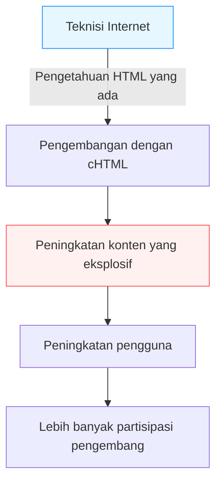

## Pendahuluan: "Internet Seluler" Sebelum Era Ponsel Pintar

Di era modern, mengakses internet, menonton video, terhubung dengan orang-orang di seluruh dunia melalui media sosial, dan berbelanja melalui perangkat dalam genggaman tangan telah menjadi aktivitas yang alami, layaknya bernapas. Ponsel pintar, dengan iPhone sebagai pelopornya, telah mendominasi dunia, dan kita terus-menerus berenang dalam lautan digital yang selalu terhubung.

Namun, jauh sebelum munculnya ponsel pintar, ada sebuah negara yang menjadikan "internet dalam genggaman" ini sebagai hal sehari-hari. Negara itu adalah Jepang. "i-mode", layanan yang diluncurkan oleh NTT DoCoMo pada tahun 1999, telah mempelopori pembangunan ekosistem raksasa internet seluler di dunia dan secara fundamental mengubah gaya hidup masyarakat.

Artikel ini akan mengupas secara mendalam dan terperinci bagaimana i-mode lahir, dan mengapa ia dapat menyebar secara eksplosif di Jepang. Kita juga akan menelusuri terobosan teknis dan bisnis di baliknya, kiprah tokoh-tokoh utamanya (Mari Matsunaga, Takeshi Natsuno, Keiichi Enoki), dan sejarah yang kelak dikenal sebagai "Sindrom Galapagos", hingga akhirnya kalah oleh gempuran kapal hitam (kekuatan asing) yang diwakili oleh iPhone.

## Bab 1: Malam Sebelum Lahirnya i-mode dan Tokoh-Tokoh Utamanya

### Situasi Komunikasi di Akhir Tahun 1990-an
Pada akhir 1990-an, internet mulai menyebar ke rumah tangga umum. Namun, internet pada saat itu berarti "duduk di depan komputer dan terhubung melalui koneksi dial-up menggunakan modem", yang memakan waktu baik untuk memulai maupun menyambung, serta memberikan pengalaman yang berat dan bersifat sangat teknis. Telepon seluler saat itu utamanya adalah alat untuk panggilan suara, dan komunikasi data hanya sebatas mengirim pesan teks pendek (pesan singkat atau pager).

Di tengah kondisi tersebut, muncullah gagasan di internal NTT DoCoMo: "Bisakah kita menggunakan ponsel untuk mengakses layanan informasi seperti internet?"

### Pembentukan Tim Keajaiban
Untuk memimpin proyek ambisius ini, dikumpulkanlah sebuah tim unik yang kelak dikenal sebagai "Bapak i-mode" dan "Ibu i-mode".

- **Keiichi Enoki**
  Seorang pegawai murni NTT DoCoMo dan manajer umum proyek i-mode. Ia mengambil keputusan berani dengan menyingkirkan birokrasi khas perusahaan besar dan merekrut talenta luar biasa dari eksternal. Tanpa kepemimpinan dan kemampuannya dalam mengkoordinasikan pihak internal maupun eksternal, i-mode mungkin akan hancur terhimpit kerangka bisnis telekomunikasi yang sudah ada.

- **Mari Matsunaga**
  Seorang editor yang pernah menjadi pemimpin redaksi "Travail" dan "Shushoku Journal" di Recruit. Ia direkrut oleh Enoki untuk bertanggung jawab atas perencanaan dan produksi konten. Alih-alih menggunakan sudut pandang teknisi, ia secara konsisten membawa perspektif pengguna: "Apa yang ingin dinikmati oleh siswi SMA dan ibu rumah tangga biasa?". Ia juga yang menggagas penamaan "i-mode" yang ramah dan berupaya keras merintis kerja sama dengan berbagai penyedia konten.

- **Takeshi Natsuno**
  Seorang yang sangat memahami bisnis internet dan bergabung belakangan. Ia memainkan peran krusial dalam membangun model bisnis dan menentukan spesifikasi teknis. Prestasi terbesarnya adalah membangun ekosistem terbuka yang mengizinkan "situs independen (unofficial)" dan sistem "penagihan proxy" yang menagih biaya konten bersamaan dengan biaya telekomunikasi.

Dengan menggabungkan kekuatan masing-masing (kekuatan organisasi, kemampuan perencanaan dari perspektif pengguna, dan kemampuan membangun model bisnis yang visioner), proyek keajaiban ini pun mulai berjalan.

## Bab 2: Terobosan Teknis —— Adopsi cHTML

Tren standardisasi komunikasi seluler global pada masa itu didominasi oleh bahasa pemrograman khusus untuk ponsel, yaitu WML (Wireless Markup Language) yang menggunakan protokol WAP (Wireless Application Protocol). Banyak operator luar negeri dan kompetitor domestik di Jepang yang berencana mengadopsi WAP ini.

Namun, tim pengembangan i-mode (khususnya Natsuno) memilih pendekatan yang sama sekali berbeda, yaitu mengadopsi **Compact HTML (cHTML)**.

### Mengapa Memilih cHTML?
Meskipun WAP (WML) dioptimalkan untuk ponsel, ia memiliki kelemahan fatal: desainer Web dan teknisi yang sudah ada harus mempelajari bahasa baru dari awal, sehingga sulit untuk memperkaya konten.

Di sisi lain, cHTML adalah subset (versi sederhana dengan fitur yang dikurangi) dari HTML yang sudah tersebar luas saat itu. Artinya, siapa pun yang bisa membuat situs Web untuk PC dapat segera membuat situs untuk i-mode.

Keputusan ini merupakan langkah berani bersejarah yang membawa "keterbukaan" internet ke perangkat seluler. Mereka juga menggunakan GIF sebagai format gambar (nantinya juga mendukung JPEG dan Flash), dan berhasil memindahkan budaya internet yang ada secara utuh ke dalam genggaman tangan.

## Bab 3: Ekosistem yang Sempurna —— Situs Resmi, Situs Independen, dan Penagihan Proxy

Alasan terbesar kesuksesan i-mode secara global bukanlah pada teknologinya, melainkan pada "model bisnisnya".

### 1. Menu Saya dan Konten Resmi
Layar utama yang muncul saat tombol "i" ditekan pada perangkat i-mode. Di sana berjajar berbagai kategori "situs resmi" yang telah melewati pemeriksaan ketat DoCoMo. Layanan berkualitas yang aman digunakan oleh pengguna seperti berita, cuaca, perbankan, nada dering, dan game telah dipaketkan dengan baik. Berkat upaya keras Mari Matsunaga dan tim, sejak awal peluncuran layanan ini, banyak perusahaan dan bank terkenal yang menyediakan konten, memberikan "nilai praktis" bagi pengguna.

### 2. Penerimaan "Situs Independen"
DoCoMo tidak hanya menyediakan situs resmi, tetapi juga memungkinkan pengguna untuk mengakses situs umum yang tidak melalui pemeriksaan DoCoMo secara bebas (dikenal sebagai "situs independen" atau "situs tidak resmi") dengan memasukkan URL secara langsung, atau melalui situs pencarian dan tautan. 
Dipadukan dengan adopsi cHTML seperti yang disebutkan sebelumnya, muncullah situs buku harian pribadi, BBS (papan buletin), dan situs penggemar yang tak terhitung jumlahnya. Ekspansi bebas yang juga mencakup aktivitas "underground" inilah yang mendorong i-mode dari sekadar alat penyebaran informasi perusahaan menjadi pusat budaya kaum muda.

### 3. Sistem Penagihan Proxy (Tagihan Operator)
Sistem paling kuat yang dibangun oleh Natsuno adalah sistem penagihan konten digital.
Sistem ini memungkinkan DoCoMo untuk menagih biaya konten berbayar yang disediakan oleh situs resmi (sekitar 100-300 yen per bulan) bersamaan dengan tagihan ponsel bulanan, kemudian membayarkannya kepada penyedia konten (CP) setelah dikurangi biaya administrasi (sekitar 9%).
Dengan ini, CP dapat memastikan pendapatan yang stabil hanya dengan membuat konten berkualitas tanpa perlu membangun infrastruktur penagihan yang rumit atau menanggung risiko gagal bayar. Hal ini memicu bermunculannya perusahaan ventura yang meraup pendapatan miliaran yen melalui "nada dering" dan "gambar wallpaper", yang tampak layaknya fenomena "Gold Rush".

## Bab 4: Komunikasi Paket dan Transformasi Gaya Hidup

Pada 22 Februari 1999, layanan i-mode resmi dimulai. Dengan dirilisnya perangkat yang kompatibel seperti "F501i", layanan ini langsung memicu ledakan popularitas yang luar biasa.

Hal penting di sini adalah pengadopsian metode **komunikasi paket**.
Pada komunikasi data konvensional, pengguna dikenakan biaya berdasarkan "waktu koneksi", sehingga biaya komunikasi akan sangat membengkak jika pengguna menjelajahi situs terlalu lama. Namun, komunikasi paket menagih biaya berdasarkan "jumlah data yang dikirim dan diterima". Karena data dalam format cHTML yang berbasis teks sangat kecil, pengguna dapat menikmati internet tanpa khawatir memikirkan waktu (seolah-olah terkoneksi secara permanen).

### Ledakan Budaya
i-mode melahirkan budaya digital baru yang unik di Jepang.

- **Emoji**
  Emoji berukuran 12x12 piksel yang dikembangkan oleh Shigetaka Kurita dan kawan-kawan menambah emosi yang kaya pada komunikasi teks singkat. Ini kemudian diadopsi oleh Unicode dan menjadi cikal bakal "Emoji" yang digunakan di seluruh dunia saat ini.
- **Chaku-uta dan Chaku-mero (Nada Dering)**
  Berkembang dari nada dering monofonik ke polifonik, dan kemudian ke lagu asli (Chaku-uta), menciptakan pasar raksasa baru di industri musik.
- **Novel Ponsel (Keitai Shousetsu)**
  Terjadi fenomena di mana novel yang ditulis oleh siswi SMA dengan menekan tombol ponsel secara manual menarik jutaan akses, diterbitkan menjadi buku, dan menjadi mega-bestseller (Contoh: "Deep Love", "Koizora", dll.).
- **Game Seluler**
  Berawal dari Sudoku sederhana atau RPG ringan, yang kelak berkembang menjadi era kejayaan game sosial melalui platform seperti GREE dan Mobage.

## Bab 5: Jebakan Sindrom Galapagos (Galápagos Syndrome)

Pada pertengahan tahun 2000-an, i-mode telah memiliki puluhan juta pengguna di Jepang, dan fungsi ponsel seperti FeliCa (Osaifu-Keitai/dompet digital), One Seg (TV seluler), dan navigasi GPS telah mencapai tingkat tertinggi di dunia.

Namun, ekosistem yang sangat optimal ini perlahan mulai diibaratkan sebagai "ekosistem unik di Kepulauan Galapagos".

### Evolusi Unik dan Isolasi dari Dunia Global
Ponsel di Jepang (feature phone) dikembangkan melalui spesifikasi mendetail yang didikte oleh operator seluler (seperti DoCoMo) kepada pembuat ponsel. Akibatnya, ponsel ini sangat optimal untuk layanan operator (seperti i-mode), tetapi tidak dapat digunakan pada jaringan atau layanan di luar negeri, sehingga mengalami evolusi ala Galapagos.

- Perangkat lunak menjadi rumit dan aneh, serta pembuat ponsel kesulitan menghadapi biaya pengembangan yang membengkak.
- Tertinggal dalam mengadaptasi tren global (OS yang mirip PC, peralihan ke panel sentuh).
- Penyedia konten tidak memikirkan ekspansi ke luar negeri karena mereka sudah mendapat keuntungan yang cukup besar hanya dari pasar operator Jepang yang tertutup.

NTT DoCoMo mencoba mengekspor dan menjalin kerja sama sistem i-mode ke operator telekomunikasi luar negeri (Eropa dan Asia, dll.), tetapi karena perbedaan infrastruktur telekomunikasi, budaya, dan kebiasaan bisnis di masing-masing negara, mereka tidak berhasil mencapai kesuksesan yang sama seperti di Jepang.

## Bab 6: Kedatangan Kapal Hitam —— Kebangkitan iPhone dan Ponsel Pintar

Pada tahun 2007, Apple mengumumkan iPhone generasi pertama (dirilis di Jepang pada tahun 2008 melalui iPhone 3G).
Awalnya, banyak orang di industri Jepang meremehkan iPhone. "Tidak ada Osaifu-Keitai, tidak ada One Seg, tidak bisa mengetik emoji, tidak ada komunikasi inframerah. Barang seperti ini tidak akan diterima oleh pengguna Jepang," begitu kata mereka.

Namun, inti dari revolusi ponsel pintar yang dibawa oleh Steve Jobs bukanlah pada jumlah fitur, melainkan pada **"redifinisi fundamental dari pengalaman pengguna (UX)"** dan **"ekosistem terbuka global sejati melalui App Store"**.

### Runtuhnya Kerajaan i-mode
Pengalaman Web yang kaya menggunakan browser penuh seperti pada PC, kontrol multi-sentuh yang intuitif, dan App Store yang memungkinkan pengembang dari seluruh dunia untuk langsung menawarkan aplikasi.
Semua hal tersebut sepenuhnya mengusangkan sistem "menu resmi" yang selama ini dikendalikan ketat oleh operator seluler.

Pengguna dengan cepat beralih ke ponsel pintar, dan para penyedia konten pun beralih arah ke pengembangan aplikasi. Platform i-mode pun mengakhiri misi historisnya, dan secara bertahap menghilang (dijadwalkan berakhir sepenuhnya pada bulan Maret 2026).

## Bab Penutup: Warisan yang Ditinggalkan oleh i-mode

Pada akhirnya, i-mode kalah oleh ponsel pintar dan menghilang dari panggung utama sejarah. Namun, "potensi internet seluler" yang dibuktikan pertama kali di dunia oleh i-mode, serta berbagai konsep yang dibangun di dalamnya, secara pasti telah diwariskan kepada masyarakat ponsel pintar modern.

- **Emoji** telah menjadi bahasa universal dunia.
- Konsep **Penagihan Operator (akar dari sistem penagihan App Store dan Google Play)** adalah fondasi ekonomi aplikasi saat ini.
- Orang Jepang adalah yang pertama di dunia yang merasakan **gaya hidup** di mana orang mengkonsumsi konten dan berkomunikasi melalui perangkat seluler di waktu luang mereka.

"Internet dalam genggaman" yang digagas dan diwujudkan oleh Mari Matsunaga, Takeshi Natsuno, Keiichi Enoki dan lainnya pada tahun 1999. Hal itu tidak diragukan lagi merupakan salah satu pencapaian paling cemerlang dalam sejarah komunikasi umat manusia, dan merupakan prototipe luar biasa dari masyarakat digital yang kita nikmati saat ini.

---
*Artikel ini adalah bagian dari seri yang mengulas sejarah teknologi dan telekomunikasi untuk mencari inspirasi inovasi di masa depan. Nantikan penjelajahan sejarah kami berikutnya.*
