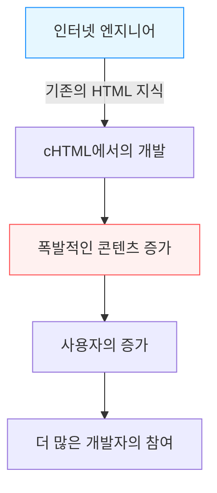

## 서장: 스마트폰 이전의 '모바일 인터넷'

현대 사회에서 손안의 단말기로 인터넷에 접속하여 동영상을 즐기고, SNS로 전 세계 사람들과 연결되며, 쇼핑을 하는 것은 숨 쉬는 것처럼 자연스러운 행위가 되었습니다. iPhone을 비롯한 스마트폰이 세계를 휩쓸고 있으며, 우리는 항상 연결된 디지털의 바다를 헤엄치고 있습니다.

하지만 스마트폰이 등장하기 훨씬 이전부터 이 '손안의 인터넷'을 일상적인 것으로 만들었던 나라가 있었습니다. 바로 일본입니다. 1999년 NTT 도코모가 서비스를 시작한 'i-mode(아이모드)'는 세계 최초로 모바일 인터넷의 거대한 생태계를 구축하고 사람들의 라이프스타일을 근본적으로 혁신했습니다.

본 기사에서는 i-mode가 어떻게 탄생했고, 왜 일본 내에서 그토록 폭발적인 보급을 보였는지, 그 이면에 있던 기술적·비즈니스적 돌파구와 주역들(마쓰나가 마리, 나쓰노 다케시, 에노키 케이이치)의 활약, 그리고 훗날 '갈라파고스화'라 불리며 이윽고 iPhone으로 대표되는 흑선 앞에 패배하기까지의 역사를 깊고 상세하게 풀어보겠습니다.

## 제1장: i-mode 탄생 전야와 주역들

### 1990년대 후반의 통신 사정
1990년대 후반, 인터넷은 서서히 일반 가정으로 보급되기 시작했습니다. 하지만 당시의 인터넷은 "컴퓨터 앞에 앉아 모뎀을 통해 다이얼업 접속을 하는" 것이었으며, 부팅과 접속에 시간이 걸리는 전문적이고 무거운 경험이었습니다. 휴대전화는 주로 음성 통화를 위한 도구였고, 데이터 통신이라고 해봐야 짧은 텍스트 메시지(단문 메시지나 호출기)를 보내는 정도에 머물러 있었습니다.

그런 가운데 NTT 도코모 내부에서 '휴대전화로 인터넷 등의 정보 서비스를 이용할 수 없을까'라는 구상이 제기됩니다.

### 기적의 팀 편성
이 장대한 프로젝트를 이끌기 위해 모인 사람들이 훗날 'i-mode의 아버지', 'i-mode의 어머니'라 불리게 될 이색적인 팀이었습니다.

- **에노키 케이이치 (榎啓一)**
  NTT 도코모의 순수 공채 출신이자 i-mode 프로젝트의 총책임자. 그는 대기업 특유의 관료주의를 배제하고 외부에서 이질적인 재능을 영입한다는 대담한 결단을 내렸습니다. 그의 리더십과 대내외적인 조정력이 없었다면 i-mode는 기존 통신 사업의 틀에 짓눌렸을 것입니다.

- **마쓰나가 마리 (松永真理)**
  리크루트에서 '토라바유'나 '취직 저널' 등의 편집장을 지낸 편집자. 에노키 씨에게 스카우트되어 콘텐츠의 기획 및 프로듀싱을 담당했습니다. 그녀는 기술자의 시선이 아닌 '일반 여고생이나 주부가 무엇을 즐기고 싶어 할까'라는 사용자 관점을 철저히 도입하여, 'i-mode'라는 친숙한 네이밍 고안과 각종 콘텐츠 제공업체 개척을 위해 동분서주했습니다.

- **나쓰노 다케시 (夏野剛)**
  인터넷 비즈니스에 정통하여 나중에 합류. 비즈니스 모델 구축과 기술적인 사양 책정에 있어 결정적인 역할을 했습니다. 그의 가장 큰 공로는 '비공식 사이트(승인되지 않은 사이트)'를 허용하는 개방적인 생태계와, 통신 요금과 함께 콘텐츠 요금을 회수하는 '대행 회수 시스템'의 구축이었습니다.

이 세 사람이 각자의 강점(조직력, 사용자 관점의 기획력, 선견지명 있는 비즈니스 모델 구축력)을 결합하면서 기적의 프로젝트는 움직이기 시작했습니다.

## 제2장: 기술적 돌파구 —— cHTML의 채택

당시 전 세계적인 모바일 통신 표준화 동향에서는 WAP(Wireless Application Protocol)이라는 휴대전화용 특수 기술 언어(WML)가 주류가 되어가고 있었습니다. 많은 해외 통신사나 국내 경쟁사들은 이 WAP을 채택하려고 했습니다.

하지만 i-mode 개발팀(특히 나쓰노 씨)은 전혀 다른 접근 방식을 선택합니다. 그것이 바로 **Compact HTML (cHTML)**의 채택이었습니다.

### 왜 cHTML이었는가?
WAP(WML)은 휴대전화용으로 최적화되어 있었지만, 기존의 웹 디자이너나 엔지니어가 언어를 새로 다시 배워야 했고, 이로 인해 콘텐츠가 풍부해지기 어렵다는 치명적인 약점이 있었습니다.

반면, cHTML은 당시 이미 널리 보급되어 있던 HTML의 부분 집합(일부 기능을 줄인 간략화된 버전)이었습니다. 즉, PC용 웹 사이트를 만들 수 있는 사람이라면 누구나 쉽게 i-mode용 사이트를 만들 수 있었던 것입니다.

이 결정은 인터넷의 '개방성'을 모바일로 가져온 역사적인 영단이었습니다. 이미지 포맷도 GIF(후에 JPEG나 Flash 등도 지원)를 채택하여, 기존의 인터넷 문화를 그대로 손안에 이식하는 데 성공한 것입니다.

## 제3장: 생태계의 완성 —— 공식 사이트, 비공식 사이트, 대행 회수

i-mode가 세계적인 성공을 거둔 가장 큰 이유는 기술보다 그 '비즈니스 모델'에 있었습니다.

### 1. 마이 메뉴와 공식 콘텐츠
i-mode 단말기의 'i' 버튼을 누르면 표시되는 초기 화면. 이곳에는 도코모의 엄격한 심사를 통과한 '공식 사이트'가 카테고리별로 나열되어 있었습니다. 뉴스, 날씨, 은행, 착신 멜로디, 게임 등 사용자가 안심하고 이용할 수 있는 우량 서비스가 패키지화되어 있었습니다.
마쓰나가 마리 씨 등의 노력으로 서비스 시작 초기부터 많은 유명 기업이나 은행이 콘텐츠를 제공하여 사용자에게 '실용적인 가치'를 제공했습니다.

### 2. '비공식 사이트'의 허용
도코모는 공식 사이트뿐만 아니라 URL을 직접 입력하거나 검색 사이트, 링크 모음을 경유하여 도코모의 심사를 거치지 않은 일반 사이트(이른바 '비공식 사이트(勝手サイト)')에도 자유롭게 접근할 수 있도록 했습니다.
앞서 언급한 cHTML의 채택과 맞물려 개인이 만든 일기 사이트, BBS(게시판), 팬 사이트 등이 무수히 탄생했습니다. 이 '언더그라운드를 포함한 자유로운 확산'이야말로 i-mode를 단순한 기업의 정보 발신 도구에서 젊은이 문화의 중심지로 밀어 올린 것입니다.

### 3. 대행 회수 (통신사 결제) 시스템
나쓰노 씨가 구축한 가장 강력한 시스템이 디지털 콘텐츠의 과금 시스템입니다.
공식 사이트가 제공하는 유료 콘텐츠(월액 100엔~300엔 정도)의 요금을 도코모가 매월 휴대전화 요금과 함께 사용자로부터 회수하고, 수수료(약 9%)를 뺀 나머지 금액을 콘텐츠 제공업체(CP)에 지불하는 구조입니다.
이로 인해 CP는 번거로운 과금 인프라나 미수금 위험을 떠안지 않고 양질의 콘텐츠를 만들기만 하면 확실하게 수익을 올릴 수 있게 되었습니다. '착신 멜로디'나 '대기 화면 이미지' 등으로 몇억 엔을 벌어들이는 벤처 기업이 속속 탄생하며, 그야말로 골드 러시 양상을 띠었습니다.

## 제4장: 패킷 통신과 라이프스타일의 변혁

1999년 2월 22일, i-mode 서비스가 시작되었습니다. 지원 단말기인 'F501i' 등이 발매되자 순식간에 큰 붐을 일으켰습니다.

여기서 중요했던 것이 **패킷 통신 방식**의 채택입니다.
기존의 데이터 통신은 '연결되어 있는 시간'에 비례하여 과금되었기 때문에 오랫동안 사이트를 보고 있으면 막대한 통신비가 들었습니다. 하지만 패킷 통신은 '송수신한 데이터의 양'에 대해 과금됩니다. 텍스트 중심의 cHTML이라면 데이터 양이 매우 적어, 사용자는 시간을 신경 쓰지 않고 (실질적인 상시 접속으로서) 인터넷을 즐길 수 있게 되었습니다.

### 문화의 폭발
i-mode는 일본만의 새로운 디지털 문화를 낳았습니다.

- **이모티콘 (Emoji)**
  구리타 시게타카 씨 등이 개발한 12×12 픽셀의 이모티콘(그림 문자)은 짧은 텍스트 커뮤니케이션에 풍부한 감정을 더했습니다. 이는 나중에 유니코드에 채택되어 현재 전 세계에서 사용되고 있는 'Emoji'의 뿌리가 됩니다.
- **착신음·착신 멜로디 (차쿠우타·차쿠메로)**
  단음에서 화음으로, 그리고 실제 악곡(차쿠우타)으로 진화하며 음악 산업에 새로운 거대 시장을 창출했습니다.
- **모바일 소설 (휴대전화 소설)**
  여고생 등이 휴대전화 버튼을 꾹꾹 눌러 집필한 소설이 수백만 조회수를 기록하고 서적화되어 대형 베스트셀러가 되는 현상이 일어났습니다. (예: 『Deep Love』, 『연공(恋空)』 등)
- **모바일 게임**
  초기의 스도쿠나 간단한 RPG에서 시작하여, 나중에는 GREE나 모바게(Mobage) 같은 플랫폼을 통한 소셜 게임의 융성으로 이어집니다.

## 제5장: 갈라파고스화 (Galápagos syndrome)의 함정

2000년대 중반, i-mode는 일본 국내에서 수천만 명의 사용자를 보유하고, FeliCa(모바일 결제/오사이후케이타이), 원세그(모바일 TV), GPS 내비게이션 등 단말기의 기능은 세계 최고 수준에 도달해 있었습니다.

하지만 이 고도로 최적화된 생태계는 점차 '갈라파고스 제도의 독자적인 생태계'에 비유되기 시작합니다.

### 독자적인 진화와 글로벌로부터의 고립
일본의 휴대전화 단말기(피처폰)는 통신사(도코모 등)가 주도하여 제조사에게 사양을 세세하게 지시해서 만들게 했습니다. 그로 인해 통신사의 서비스(i-mode 등)에는 완벽하게 최적화되어 있었지만, 해외의 네트워크나 서비스에서는 사용할 수 없는, 갈라파고스적인 진화를 이루고 말았던 것입니다.

- 소프트웨어는 복잡기괴해지고, 단말기 제조사는 개발비 폭등에 시달리게 됨.
- 세계적인 트렌드(PC와 유사한 OS, 터치 패널화)에 대한 적응이 늦어짐.
- 콘텐츠 제공업체도 일본의 폐쇄적인 통신사 시장만으로 충분한 이익이 나기 때문에 해외 진출을 생각하지 않음.

NTT 도코모 또한 i-mode의 시스템을 해외의 통신 사업자(유럽이나 아시아 등)에 수출·제휴하려고 시도했지만, 각국의 통신 인프라나 문화, 비즈니스 관습의 차이로 인해 일본만큼의 성공을 거두지는 못했습니다.

## 제6장: 흑선의 내습 —— iPhone과 스마트폰의 대두

2007년, Apple에서 초대 iPhone이 발표되었습니다(일본 출시는 2008년 iPhone 3G부터).
당초 일본 업계 관계자들의 상당수는 iPhone을 경시했습니다. "오사이후케이타이(모바일 결제)도 없고, 원세그도 없고, 이모티콘도 칠 수 없고, 적외선 통신도 할 수 없다. 이런 것은 일본 사용자들에게 받아들여질 리 없다"라고.

하지만 스티브 잡스가 가져온 스마트폰 혁명의 진수는 기능의 수가 아니라 **'사용자 경험(UX)의 근본적인 재정의'**와 **'App Store를 통한 진정한 글로벌 오픈 생태계'**에 있었습니다.

### 붕괴하는 i-mode 제국
PC와 같은 풀 브라우저를 통한 풍부한 웹 경험, 직관적인 멀티 터치 조작, 그리고 전 세계 개발자들이 앱을 직접 제공할 수 있는 App Store.
이들은 통신사가 꽉 쥐고 관리하는 '공식 메뉴' 시스템을 완전히 진부화시켰습니다.

사용자들은 급속하게 스마트폰으로 이동했고, 콘텐츠 제공업체들도 앱 개발로 방향을 틀었습니다. i-mode라는 플랫폼은 그 역사적 사명을 끝내고 서서히 페이드아웃하게 됩니다. (2026년 3월에 완전 종료 예정)

## 종장: i-mode가 남긴 유산

i-mode는 최종적으로 스마트폰에 패배하여 역사의 화려한 무대에서 사라졌습니다. 하지만 i-mode가 세계에 앞서 증명했던 '모바일 인터넷의 가능성'과 그곳에서 배양된 콘셉트의 수많은 요소는 현대 스마트폰 사회에 확실하게 계승되어 있습니다.

- **Emoji(이모티콘)**는 세계의 공통 언어가 되었습니다.
- **통신사 결제 (App Store나 Google Play 과금 시스템의 기원)**의 개념은 앱 경제권의 기반입니다.
- 모바일로 자투리 시간에 콘텐츠를 소비하고 커뮤니케이션을 한다는 **라이프스타일 그 자체**를, 일본인들은 세계에서 가장 일찍 경험하고 있었습니다.

마쓰나가 마리, 나쓰노 다케시, 에노키 케이이치 등이 1999년에 그리고 실현했던 '손안의 인터넷'. 그것은 틀림없이 인류 통신 역사상 가장 빛나는 금자탑 중 하나였으며, 우리가 지금 누리고 있는 디지털 사회의 위대한 프로토타입이었던 것입니다.

---
*본 기사는 기술과 통신의 역사를 되돌아보고 현대 혁신의 힌트를 찾기 위한 연재의 일부입니다. 다음 역사 탐방도 기대해 주세요.*
