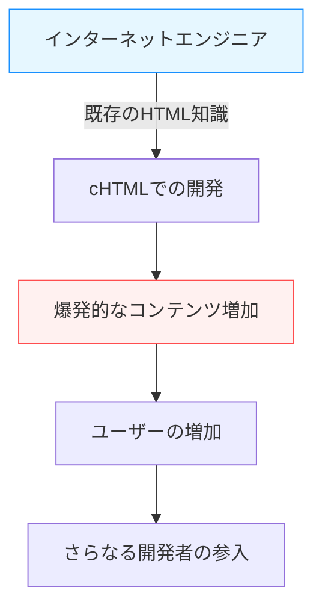

## 序章：スマートフォン以前の「モバイルインターネット」

現代において、手のひらの上の端末からインターネットにアクセスし、動画を楽しみ、SNSで世界中の人々と繋がり、買い物をすることは、息をするように自然な行為となっています。iPhoneをはじめとするスマートフォンが世界を席巻し、私たちは常時接続のデジタルの海を泳いでいます。

しかし、スマートフォンが登場するずっと以前から、この「手のひらの上のインターネット」を日常のものとしていた国がありました。それが日本です。1999年にNTTドコモがサービスを開始した「iモード（i-mode）」は、世界に先駆けてモバイルインターネットの巨大なエコシステムを構築し、人々のライフスタイルを根本から変革しました。

本記事では、iモードがどのようにして誕生し、なぜ日本国内でこれほどまでの爆発的な普及を見せたのか。その背後にあった技術的・ビジネス的なブレイクスルー、立役者たち（松永真理氏、夏野剛氏、榎啓一氏）の活躍、そして後に「ガラパゴス化」と呼ばれ、やがてiPhoneに代表される黒船の前に敗れ去っていくまでの歴史を、深く、詳細に紐解いていきます。

## 第1章：iモードの誕生前夜と立役者たち

### 1990年代後半の通信事情
1990年代後半、インターネットは徐々に一般家庭へと普及し始めていました。しかし、当時のインターネットは「パソコンの前に座り、モデムを通じてダイヤルアップ接続する」というものであり、起動にも接続にも時間がかかる、専門的で重厚な体験でした。携帯電話は主に音声通話のためのツールであり、データ通信といえば短いテキストメッセージ（ショートメールやポケットベル）を送る程度にとどまっていました。

そんな中、NTTドコモ内部で「携帯電話でインターネットなどの情報サービスを利用できないか」という構想が持ち上がります。

### 奇跡のチーム編成
この壮大なプロジェクトを牽引するために集められたのが、後に「iモードの父」「iモードの母」と呼ばれる異色のチームでした。

- **榎啓一（えのき けいいち）**
  NTTドコモの生え抜きであり、iモードプロジェクトの総責任者。彼は、大企業特有の官僚主義を排し、外部から異能の才能を招き入れるという大胆な決断を下しました。彼のリーダーシップと社内外の調整力がなければ、iモードは既存の通信事業の枠組みに押し潰されていたでしょう。

- **松永真理（まつなが まり）**
  リクルートで「とらばーゆ」や「就職ジャーナル」などの編集長を務めた編集者。榎氏にスカウトされ、コンテンツの企画・プロデュースを担当しました。彼女は技術者目線ではなく「一般の女子高生や主婦が何を楽しみたいか」というユーザー視点を徹底的に持ち込み、「iモード」という親しみやすいネーミングの考案や、各種コンテンツプロバイダーの開拓に奔走しました。

- **夏野剛（なつの たけし）**
  インターネットビジネスに精通し、後に参画。ビジネスモデルの構築と技術的な仕様策定において決定的な役割を果たしました。彼の最大の功績は、「勝手サイト」を許容するオープンなエコシステムと、通信料金と一緒にコンテンツ料金を回収する「代行回収システム」の構築でした。

この三者が、それぞれの強み（組織力、ユーザー視点の企画力、先見的なビジネスモデル構築力）を掛け合わせることで、奇跡のプロジェクトは動き出しました。

## 第2章：技術的ブレイクスルー —— cHTMLの採用

当時の世界的なモバイル通信の標準化動向では、WAP（Wireless Application Protocol）という携帯端末向けの特殊な記述言語（WML）が主流になりつつありました。多くの海外キャリアや国内の競合他社は、このWAPを採用しようとしていました。

しかし、iモード開発チーム（特に夏野氏）は、全く異なるアプローチを選択します。それが**Compact HTML (cHTML)**の採用でした。

### なぜcHTMLだったのか？
WAP(WML)は携帯電話向けに最適化されているものの、既存のWebデザイナーやエンジニアが新たに言語を学び直さなければならず、コンテンツが充実しにくいという致命的な弱点がありました。

一方、cHTMLは、当時すでに広く普及していたHTMLのサブセット（一部の機能を削った簡易版）です。つまり、パソコン向けのWebサイトを作れる人なら、誰でもすぐにiモード向けのサイトを作ることができたのです。

この決定は、インターネットの「オープン性」をモバイルに持ち込んだ歴史的な英断でした。画像のフォーマットもGIF（後にJPEGやFlashなどもサポート）を採用し、既存のインターネット文化をそのまま手のひらに移植することに成功したのです。

## 第3章：エコシステムの完成 —— 公式サイト、勝手サイト、代行回収

iモードが世界的な成功を収めた最大の理由は、技術以上にその「ビジネスモデル」にありました。

### 1. マイメニューと公式コンテンツ
iモード端末の「i」ボタンを押すと表示されるトップ画面。ここには、ドコモの厳しい審査を通過した「公式サイト」がカテゴリごとに並んでいました。ニュース、天気、銀行、着信メロディ、ゲームなど、ユーザーが安心して利用できる優良なサービスがパッケージ化されていました。
松永真理氏らの尽力により、サービス開始当初から多くの有名企業や銀行がコンテンツを提供し、ユーザーに「実用的な価値」を提供しました。

### 2. 「勝手サイト」の許容
ドコモは公式サイトだけでなく、URLを直接入力したり、検索サイトやリンク集を経由したりすることで、ドコモの審査を経ていない一般のサイト（いわゆる「勝手サイト」「非公式サイト」）にも自由にアクセスできるようにしました。
前述のcHTMLの採用と相まって、個人が作った日記サイト、BBS（掲示板）、ファンサイトなどが無数に誕生しました。この「アンダーグラウンドも含めた自由な広がり」こそが、iモードを単なる企業の情報発信ツールから、若者文化の中心地へと押し上げたのです。

### 3. 代行回収（キャリア決済）システム
夏野氏が構築した最も強力なシステムが、デジタルコンテンツの課金システムです。
公式サイトが提供する有料コンテンツ（月額100円〜300円程度）の料金を、ドコモが毎月の携帯電話料金と一緒にユーザーから回収し、手数料（約9%）を差し引いてコンテンツプロバイダー（CP）に支払うという仕組みです。
これにより、CPは面倒な課金インフラや未回収リスクを抱えることなく、良質なコンテンツを作るだけで確実に収益を上げることができるようになりました。「着メロ」や「待ち受け画像」などで何億円も稼ぎ出すベンチャー企業が次々と誕生し、まさにゴールドラッシュの様相を呈しました。

## 第4章：パケット通信とライフスタイルの変革

1999年2月22日、iモードのサービスが開始されました。対応端末である「F501i」などが発売されると、たちまち大ブームを巻き起こします。

ここで重要だったのが**パケット通信方式**の採用です。
従来のデータ通信は「つないでいる時間」に応じて課金されるため、長々とサイトを見ていると莫大な通信費がかかりました。しかしパケット通信は「送受信したデータの量」に対して課金されます。テキスト中心のcHTMLであればデータ量は非常に小さく、ユーザーは時間を気にせずに（実質的な常時接続として）インターネットを楽しむことができるようになりました。

### 文化の爆発
iモードは、日本独自の新しいデジタル文化を生み出しました。

- **絵文字（Emoji）**
  栗田穣崇氏らが開発した12×12ピクセルの絵文字は、短いテキストコミュニケーションに豊かな感情を添えました。これは後にUnicodeに採用され、現在世界中で使われている「Emoji」のルーツとなります。
- **着うた・着メロ**
  単音から和音へ、そして実際の楽曲（着うた）へと進化し、音楽産業に新たな巨大市場を生み出しました。
- **ケータイ小説**
  女子高生などが携帯電話のボタンをポチポチと押して執筆した小説が、数百万アクセスを集め、書籍化されて大ベストセラーになる現象が起きました。（例：『Deep Love』『恋空』など）
- **モバイルゲーム**
  初期の数独や簡単なRPGから始まり、後にGREEやモバゲーといったプラットフォームを通じたソーシャルゲームの隆盛へと繋がっていきます。

## 第5章：ガラパゴス化（Galápagos syndrome）の陥穽

2000年代中盤、iモードは日本国内で数千万人のユーザーを抱え、FeliCa（おサイフケータイ）、ワンセグ（モバイルテレビ）、GPSナビゲーションなど、端末の機能は世界最高峰に達していました。

しかし、この高度に最適化されたエコシステムは、次第に「ガラパゴス諸島の独自の生態系」に例えられるようになります。

### 独自の進化とグローバルからの孤立
日本の携帯端末（フィーチャーフォン）は、通信キャリア（ドコモなど）が主導してメーカーに仕様を細かく指示して作らせていました。そのため、キャリアのサービス（iモードなど）には完璧に最適化されていましたが、海外のネットワークやサービスでは使えない、ガラパゴス的な進化を遂げてしまったのです。

- ソフトウェアは複雑怪奇になり、端末メーカーは開発費の高騰に苦しむ。
- 世界のトレンド（PCライクなOS、タッチパネル化）への適応が遅れる。
- コンテンツプロバイダーも、日本の閉鎖的なキャリア市場だけで十分に利益が出るため、海外展開を考えない。

NTTドコモもiモードの仕組みを海外の通信事業者（欧州やアジアなど）に輸出・提携しようと試みましたが、各国の通信インフラや文化、ビジネス慣習の違いから、日本ほどの成功を収めることはできませんでした。

## 第6章：黒船襲来 —— iPhoneとスマートフォンの台頭

2007年、Appleから初代iPhoneが発表されました（日本での発売は2008年のiPhone 3Gから）。
当初、日本の業界関係者の多くはiPhoneを軽視していました。「おサイフケータイもない、ワンセグもない、絵文字も打てない、赤外線通信もできない。こんなものは日本のユーザーには受け入れられない」と。

しかし、スティーブ・ジョブズがもたらしたスマートフォン革命の真髄は、機能の数ではなく**「ユーザー体験（UX）の根本的な再定義」**と**「App Storeを通じた真のグローバル・オープン・エコシステム」**にありました。

### 崩壊するiモード帝国
PCと同じフルブラウザによるリッチなWeb体験、直感的なマルチタッチ操作、そして世界中の開発者がアプリを直接提供できるApp Store。
これらは、キャリアがガチガチに管理する「公式メニュー」の仕組みを完全に陳腐化させました。

ユーザーは急速にスマートフォンへと移行し、コンテンツプロバイダーもアプリ開発へと舵を切りました。iモードというプラットフォームは、その歴史的使命を終え、徐々にフェードアウトしていくことになります。（2026年3月に完全終了予定）

## 終章：iモードが残したレガシー

iモードは最終的にスマートフォンに敗れ、歴史の表舞台から姿を消しました。しかし、iモードが世界に先駆けて証明した「モバイルインターネットの可能性」と、そこで培われたコンセプトの数々は、現代のスマートフォン社会に確実に受け継がれています。

- **Emoji（絵文字）**は世界の共通言語となりました。
- **キャリア決済（App StoreやGoogle Playの課金システムの源流）**の概念は、アプリ経済圏の基盤です。
- モバイルで隙間時間にコンテンツを消費し、コミュニケーションを行うという**ライフスタイルそのもの**を、日本人は世界で最も早く経験していました。

松永真理氏、夏野剛氏、榎啓一氏らが1999年に描き、実現した「手のひらの上のインターネット」。それは間違いなく、人類の通信史における最も輝かしい金字塔の一つであり、私たちが今享受しているデジタル社会の偉大なプロトタイプだったのです。

---
*本記事は技術と通信の歴史を振り返り、現代のイノベーションのヒントを探るための連載の一部です。次回の歴史探訪もお楽しみに。*
