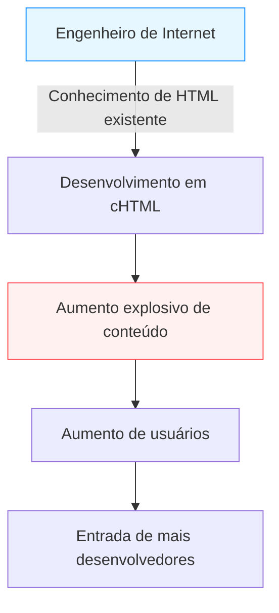

## Introdução: A "Internet Móvel" antes dos Smartphones

Na era moderna, acessar a internet na palma da mão, assistir a vídeos, conectar-se com pessoas de todo o mundo pelas redes sociais e fazer compras tornou-se algo tão natural quanto respirar. Com o iPhone e outros smartphones dominando o mundo, nadamos num mar digital constantemente conectados.

No entanto, muito antes do surgimento dos smartphones, havia um país que já vivenciava essa "internet na palma da mão" no seu cotidiano. Esse país era o Japão. Em 1999, o "i-mode", lançado pela NTT Docomo, construiu um gigantesco ecossistema de internet móvel antes do resto do mundo e transformou fundamentalmente o estilo de vida das pessoas.

Neste artigo, exploraremos detalhadamente a história de como o i-mode nasceu e por que se popularizou tão explosivamente no Japão. Analisaremos as inovações tecnológicas e comerciais por trás de seu sucesso, as contribuições de seus fundadores (Mari Matsunaga, Takeshi Natsuno e Keiichi Enoki), e como o fenômeno que mais tarde seria chamado de "Síndrome de Galápagos" culminou em sua eventual derrota para os "navios negros" liderados pelo iPhone.

## Capítulo 1: A Véspera do Nascimento do i-mode e seus Fundadores

### A Situação das Comunicações no Final da Década de 1990
No final da década de 1990, a internet começava a se espalhar pelos lares. Contudo, a internet daquela época era uma experiência densa e técnica, que exigia "sentar-se na frente de um PC e usar uma conexão dial-up por meio de um modem", levando muito tempo para inicializar e conectar. Os telefones celulares eram principalmente ferramentas para chamadas de voz e, em termos de comunicação de dados, limitavam-se ao envio de mensagens curtas de texto (Short Mail e Pagers).

Nesse contexto, surgiu dentro da NTT Docomo a ideia de "usar telefones celulares para acessar serviços de informação, como a internet".

### A Formação de uma Equipe Milagrosa
Para liderar este projeto ambicioso, formou-se uma equipe não convencional cujos membros mais tarde seriam conhecidos como o "pai do i-mode" e a "mãe do i-mode".

- **Keiichi Enoki**
  Um veterano da NTT Docomo e o gerente geral do projeto i-mode. Ele eliminou a burocracia típica das grandes corporações e tomou a ousada decisão de atrair talentos extraordinários de fora da empresa. Sem sua liderança e habilidade para coordenar forças internas e externas, o i-mode teria sido esmagado pelos rígidos limites dos negócios de telecomunicações existentes.

- **Mari Matsunaga**
  Uma editora que foi chefe de redação de publicações como "Travail" e "Shushoku Journal" na Recruit. Foi recrutada por Enoki para liderar o planejamento e a produção de conteúdo. Em vez de uma perspectiva técnica, ela focou intensamente no ponto de vista do usuário — "O que garotas comuns do ensino médio e donas de casa achariam divertido?" —, criou o nome amigável "i-mode" e se esforçou muito no recrutamento de vários provedores de conteúdo.

- **Takeshi Natsuno**
  Profundo conhecedor de negócios na internet, Natsuno se juntou mais tarde e desempenhou um papel decisivo na construção do modelo de negócios e nas especificações técnicas. Suas maiores conquistas foram estabelecer um ecossistema aberto que permitia "sites não oficiais" e um "sistema de cobrança delegada" que coletava as taxas de conteúdo junto com a conta do telefone.

Ao combinar seus respectivos pontos fortes (capacidade organizacional, planejamento focado no usuário e construção visionária de modelos de negócios), esse milagroso projeto entrou em ação.

## Capítulo 2: Avanço Tecnológico —— Adoção do cHTML

Nas tendências globais de padronização das comunicações móveis daquela época, uma linguagem de marcação especial para dispositivos móveis chamada WML, baseada em WAP (Wireless Application Protocol), estava se tornando popular. Muitas operadoras internacionais e concorrentes locais no Japão tentavam adotar o WAP.

Porém, a equipe de desenvolvimento do i-mode (especialmente Natsuno) optou por uma abordagem completamente diferente: a adoção do **Compact HTML (cHTML)**.

### Por que cHTML?
Embora o WAP (WML) fosse otimizado para telefones celulares, ele apresentava uma desvantagem fatal: web designers e engenheiros existentes precisavam aprender uma linguagem inteiramente nova, dificultando o rápido aumento do conteúdo.

Por outro lado, o cHTML era um subconjunto do HTML (uma versão simplificada com alguns recursos removidos), que já era amplamente utilizado. Em outras palavras, qualquer pessoa que soubesse construir um site para PC poderia facilmente criar um site para o i-mode.

Essa decisão foi uma jogada histórica e brilhante que trouxe a "natureza aberta" da internet para os dispositivos móveis. O formato de imagem GIF foi adotado (com suporte posterior para JPEG, Flash, etc.), transferindo a cultura da internet existente com sucesso para a palma da mão.

## Capítulo 3: A Conclusão do Ecossistema —— Sites Oficiais, Sites Não Oficiais e Cobrança Delegada

A maior razão para o sucesso global do i-mode estava mais no seu "modelo de negócios" do que em sua tecnologia.

### 1. Meu Menu e Conteúdos Oficiais
A tela inicial exibida ao pressionar o botão "i" nos dispositivos i-mode listava os "sites oficiais", categorizados por assunto, que passavam pelas rigorosas avaliações da Docomo. Notícias, previsão do tempo, serviços bancários, toques de celular e jogos eram empacotados como serviços confiáveis e de alta qualidade.
Graças aos esforços de Mari Matsunaga e outros, muitas grandes corporações e bancos forneceram conteúdo desde o início, oferecendo "valor prático" aos usuários.

### 2. A Aceitação de "Sites Não Oficiais" (Katte Sites)
Além dos sites oficiais, a Docomo permitia acesso irrestrito a sites independentes que não passavam pela aprovação da Docomo (conhecidos como "katte sites" ou sites não oficiais), seja inserindo o URL diretamente ou através de motores de busca e diretórios de links.
Combinado com a adoção do cHTML, surgiram incontáveis sites de diários pessoais, BBS (fóruns) e fã-clubes criados por usuários comuns. Essa "expansão livre, incluindo redes informais", elevou o i-mode de uma mera ferramenta de distribuição de informações corporativas para o epicentro da cultura jovem.

### 3. Sistema de Cobrança Delegada (Pagamento pela Operadora)
O sistema mais poderoso que Natsuno construiu foi o de cobrança para conteúdo digital.
A Docomo arrecadava as taxas para serviços premium de sites oficiais (cerca de 100 a 300 ienes por mês) junto com a conta mensal de telefone celular. Após deduzir uma comissão de cerca de 9%, repassava a receita ao Provedor de Conteúdo (CP).
Com isso, os CPs não precisavam investir em uma infraestrutura de cobrança complexa ou enfrentar o risco de não pagamento, garantindo receita simplesmente criando bons conteúdos. Várias startups floresceram subitamente ganhando milhões com a venda de "toques musicais" e "papeis de parede", criando uma verdadeira corrida do ouro.

## Capítulo 4: A Comunicação por Pacotes e a Revolução no Estilo de Vida

O serviço i-mode foi lançado em 22 de fevereiro de 1999. Assim que os telefones compatíveis, como o modelo "F501i", chegaram ao mercado, provocaram um tremendo sucesso.

Crucial para esse sucesso foi a adoção da **comunicação de dados por pacotes**.
A comunicação de dados tradicional cobrava pelo "tempo de conexão", o que significava que navegar em um site por muito tempo resultaria em contas enormes. No entanto, o faturamento por pacotes era baseado no "volume de dados transmitidos e recebidos". Como o cHTML, focado em texto, usava quantidades ínfimas de dados, os usuários podiam desfrutar da internet sem se preocupar com a duração da chamada (essencialmente agindo como uma conexão constante).

### A Explosão Cultural
O i-mode fomentou o nascimento de uma cultura digital totalmente nova, exclusiva do Japão.

- **Emoji**
  Os ícones de 12×12 pixels desenvolvidos por Shigetaka Kurita e sua equipe adicionavam emoções sutis a comunicações de texto breves. Mais tarde, foram incorporados ao Unicode, sendo as raízes dos "Emojis" amplamente usados ​​no mundo todo atualmente.
- **Chaku-uta e Chaku-melo**
  Os toques de celular evoluíram de bipes monofônicos para melodias polifônicas e, depois, para músicas reais (chaku-uta), criando um novo mercado massivo na indústria musical.
- **Romances de Celular (Keitai Shousetsu)**
  Romances inteiros, muitas vezes escritos por garotas do ensino médio através do pequeno teclado de seus telefones, atraíram milhões de visualizações e se tornaram fenômenos de vendas após serem publicados na forma de livros físicos (por exemplo, "Deep Love" e "Koizora").
- **Jogos para Dispositivos Móveis**
  Começando com Sudoku básico e RPGs simplificados, isso pavimentou o caminho para o imenso crescimento dos jogos sociais através de plataformas como GREE e Mobage.

## Capítulo 5: A Armadilha da "Síndrome de Galápagos"

Em meados da década de 2000, o i-mode tinha dezenas de milhões de usuários no Japão, e as funcionalidades dos dispositivos haviam alcançado níveis incomparáveis, ostentando recursos como FeliCa (carteira móvel), One-Seg (TV móvel) e navegação por GPS.

Mas, ao longo do tempo, esse ecossistema altamente otimizado passou a ser comparado ao da **Síndrome de Galápagos** (uma evolução isolada, como na ecologia única das Ilhas Galápagos).

### Evolução Exclusiva e o Isolamento do Mercado Global
Para produzir dispositivos móveis (feature phones) no Japão, as operadoras (como a Docomo) lideravam o processo de desenvolvimento dadas especificações rigorosas aos fabricantes de telefones. Assim, enquanto os telefones eram perfeitamente ajustados aos serviços da operadora (como o i-mode), eles eram incompatíveis com redes e serviços internacionais, sofrendo uma "evolução de Galápagos".

- Os softwares tornaram-se ridiculamente complexos, forçando os fabricantes a lidar com o aumento vertiginoso dos custos de desenvolvimento.
- A adaptação às tendências globais (Sistemas Operacionais tipo PC e telas sensíveis ao toque) ocorreu de forma lenta.
- Os Provedores de Conteúdo não se importavam em expandir globalmente, pois o mercado interno fechado e as operadoras já forneciam lucros mais que suficientes.

A NTT Docomo tentou exportar o sistema do i-mode se associando com parceiros estrangeiros (na Europa e na Ásia), mas, devido a diferenças fundamentais de cultura, modelo de negócios e infraestrutura em diferentes regiões, o sistema nunca repetiu seu sucesso japonês no exterior.

## Capítulo 6: A Chegada dos Navios Negros —— A Ascensão do iPhone e dos Smartphones

Em 2007, a Apple lançou o primeiro iPhone (introduzido no Japão em 2008 como o modelo iPhone 3G).
Inicialmente, a indústria japonesa ignorou amplamente o iPhone: "Sem carteira digital, sem One-Seg, não dá para digitar emojis, sem comunicação por infravermelho. Ninguém no Japão aceitaria algo tão inútil".

No entanto, a verdadeira essência da revolução dos smartphones de Steve Jobs não estava na quantidade de recursos, mas na **"redefinição radical da experiência do usuário (UX)"** e num **"verdadeiro ecossistema global e aberto através da App Store"**.

### A Queda do Império i-mode
A rica experiência na web usando um navegador completo, as operações multitoque intuitivas e a capacidade de desenvolvedores do mundo inteiro oferecerem aplicativos diretamente pela App Store rapidamente deixaram o rígido e rigidamente controlado "menu oficial" das operadoras obsoletos.

Os usuários mudaram rapidamente para os smartphones, e os criadores de conteúdo pivotaram para o desenvolvimento de aplicativos. Tendo completado a sua missão histórica, o i-mode gradualmente desapareceu (programado para encerrar completamente os serviços em março de 2026).

## Capítulo Final: O Legado do i-mode

Por fim, o i-mode foi derrotado pelos smartphones e se retirou do palco principal da história. Contudo, as "possibilidades da internet móvel" que o i-mode provou precocemente ao mundo, junto com os inúmeros conceitos que cultivou, foram inequivocamente transferidos para a era dos smartphones de hoje.

- O **Emoji** tornou-se a língua universal de todos.
- A ideia de **Pagamento pela Operadora (as raízes do faturamento via App Store e Google Play)** formou o próprio núcleo da economia de aplicativos.
- O **estilo de vida inerente** em consumir conteúdo ou interagir por comunicações breves no celular durante os tempos livres foi abraçado pelo povo japonês anos antes do restante do mundo.

A "internet na palma da mão", imaginada e concretizada por Mari Matsunaga, Takeshi Natsuno, Keiichi Enoki e sua equipe em 1999. Sem dúvida, é uma das conquistas mais ilustres da história das comunicações humanas e serviu como um formidável protótipo da imensa sociedade digital da qual desfrutamos hoje.

---
*Este artigo é parte de uma série que examina a história da tecnologia e das comunicações e explora dicas para as inovações modernas. Aguarde o nosso próximo passeio histórico.*
