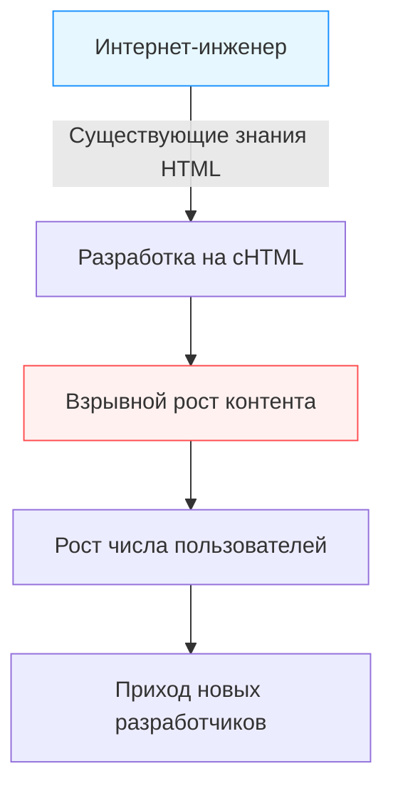

## Введение: "Мобильный интернет" до смартфонов

В наше время доступ к интернету с устройства на ладони, просмотр видео, общение с людьми по всему миру в социальных сетях и совершение покупок стали такими же естественными, как дыхание. Смартфоны, начиная с iPhone, захватили мир, и мы постоянно плаваем в цифровом море.

Однако задолго до появления смартфонов существовала страна, где этот "интернет на ладони" уже был повседневной реальностью. Этой страной была Япония. Сервис "i-mode", запущенный NTT DoCoMo в 1999 году, стал первой в мире огромной экосистемой мобильного интернета, которая в корне изменила образ жизни людей.

В этой статье мы подробно рассмотрим историю того, как зародился i-mode и почему он получил такое взрывное распространение в Японии. Мы изучим технологические и бизнес-прорывы, стоявшие за ним, роли ключевых фигур (Мари Мацунага, Такеши Нацуно, Кеичи Эноки), а также последующий феномен "Галапагосского синдрома" и, в конечном итоге, поражение перед "черными кораблями" в лице iPhone.

## Глава 1: Канун рождения i-mode и его создатели

### Ситуация со связью во второй половине 1990-х годов
Во второй половине 1990-х годов интернет начал постепенно проникать в обычные дома. Однако в то время интернет означал "сидеть за компьютером и подключаться через модем по коммутируемой линии (dial-up)". Это был медленный процесс как при запуске, так и при подключении, требующий технических навыков. Мобильные телефоны были в первую очередь инструментом для голосовой связи, а передача данных ограничивалась отправкой коротких текстовых сообщений (Short Mail и пейджеры).

В этих условиях внутри NTT DoCoMo возникла идея: "Можно ли использовать мобильные телефоны для доступа к интернету и информационным сервисам?"

### Чудо-команда
Для руководства этим амбициозным проектом была собрана уникальная команда, которую позже назвали "отцами и матерями i-mode".

- **Кеичи Эноки**
  Ветеран NTT DoCoMo и генеральный директор проекта i-mode. Он принял смелое решение отказаться от корпоративной бюрократии и привлечь таланты со стороны. Без его лидерства и способности к координации внутри и вне компании i-mode был бы раздавлен рамками существующего телекоммуникационного бизнеса.

- **Мари Мацунага**
  Редактор, ранее работавшая главным редактором таких изданий, как "Travail" и "Shushoku Journal" в компании Recruit. Эноки пригласил её для планирования и продюсирования контента. Она привнесла не точку зрения инженера, а точку зрения пользователя, задаваясь вопросом: "Чего хотят обычные старшеклассницы и домохозяйки?". Мацунага придумала дружелюбное название "i-mode" и много сделала для привлечения различных контент-провайдеров.

- **Такеши Нацуно**
  Специалист по интернет-бизнесу, присоединившийся позже. Он сыграл решающую роль в построении бизнес-модели и разработке технических спецификаций. Его величайшим достижением стало создание открытой экосистемы, допускающей "неофициальные сайты", и системы биллинга "Daikou Kaishuu", при которой плата за контент собиралась вместе с платой за услуги связи.

Благодаря объединению сильных сторон каждого (организаторские способности, планирование с точки зрения пользователя и дальновидное построение бизнес-модели) этот чудесный проект был запущен.

## Глава 2: Технологический прорыв — внедрение cHTML

В то время глобальной тенденцией в стандартизации мобильной связи было использование WAP (Wireless Application Protocol) со специальным языком разметки WML для мобильных устройств. Многие зарубежные операторы и отечественные конкуренты планировали внедрить именно WAP.

Однако команда разработчиков i-mode (особенно Нацуно) выбрала совершенно другой подход — внедрение **Compact HTML (cHTML)**.

### Почему cHTML?
Хотя WAP (WML) был оптимизирован для мобильных телефонов, у него был фатальный недостаток: существующим веб-дизайнерам и инженерам приходилось изучать новый язык с нуля, что затрудняло создание богатого контента.

С другой стороны, cHTML был подмножеством (упрощенной версией с удалением некоторых функций) HTML, который в то время уже был широко распространен. Это означало, что любой человек, умеющий создавать сайты для ПК, мог сразу же создавать сайты для i-mode.

Это решение стало историческим прорывом, перенесшим "открытость" интернета в мобильную среду. Также был принят формат изображений GIF (позже добавилась поддержка JPEG, Flash и др.), что позволило успешно перенести существующую интернет-культуру прямо на ладонь пользователя.

## Глава 3: Завершение создания экосистемы — Официальные сайты, Неофициальные сайты и Система биллинга

Главной причиной мирового успеха i-mode стала не столько технология, сколько "бизнес-модель".

### 1. Мое меню и Официальный контент
Главный экран, который появлялся при нажатии кнопки "i" на телефоне i-mode. Здесь по категориям располагались "Официальные сайты", прошедшие строгую проверку DoCoMo. Новости, погода, банки, рингтоны, игры — всё это было упаковано в виде надежных сервисов. Благодаря усилиям Мари Мацунаги и других, с самого начала многие известные компании и банки предоставляли свой контент, давая пользователям "практическую ценность".

### 2. Допуск "Неофициальных сайтов"
DoCoMo позволил пользователям свободно заходить не только на официальные сайты, но и на обычные сайты (так называемые "неофициальные" или "самодельные" сайты), не прошедшие проверку DoCoMo, путем прямого ввода URL-адреса, использования поисковых систем или каталогов ссылок.
В сочетании с упоминавшимся ранее cHTML это привело к появлению бесчисленного множества личных дневников, BBS (форумов) и фан-сайтов. Именно это "свободное расширение, включающее андеграунд" превратило i-mode из просто корпоративного инструмента распространения информации в центр молодежной культуры.

### 3. Система биллинга (Carrier Billing)
Самой мощной системой, созданной Нацуно, стала система оплаты цифрового контента.
DoCoMo собирал плату за платный контент, предоставляемый официальными сайтами (около 100-300 иен в месяц), вместе с ежемесячным счетом за мобильную связь, и выплачивал ее контент-провайдерам (CP), удерживая комиссию (около 9%).
Благодаря этому CP могли получать гарантированную прибыль, просто создавая качественный контент, без необходимости поддерживать сложную инфраструктуру биллинга или брать на себя риски неоплаты. Стали появляться венчурные компании, зарабатывающие миллионы иен на "рингтонах" и "обоях", что было похоже на золотую лихорадку.

## Глава 4: Пакетная передача данных и изменение образа жизни

Сервис i-mode был запущен 22 февраля 1999 года. С выходом совместимых устройств, таких как "F501i", начался настоящий бум.

Ключевым фактором здесь стало внедрение **пакетной передачи данных**.
Традиционная передача данных тарифицировалась в зависимости от "времени соединения", поэтому долгий просмотр сайтов приводил к огромным счетам. Однако пакетная связь тарифицировалась за "объем отправленных и полученных данных". Поскольку текстовый cHTML имел очень маленький объем данных, пользователи могли наслаждаться интернетом, не беспокоясь о времени (практически как при постоянном подключении).

### Культурный взрыв
i-mode породил новую, уникальную для Японии цифровую культуру.

- **Эмодзи (Emoji)**
  Эмодзи размером 12x12 пикселей, разработанные Сигетакой Куритой и его командой, добавили богатые эмоции в короткие текстовые сообщения. Позже они были включены в стандарт Unicode и стали прародителем современных "Emoji", используемых во всем мире.
- **Рингтоны (Chaku-Uta, Chaku-Mero)**
  Развившись от монофонических до полифонических, а затем и до настоящих песен (Chaku-Uta), они создали новый огромный рынок для музыкальной индустрии.
- **Мобильные романы (Keitai Shosetsu)**
  Романы, написанные старшеклассницами путем набора текста на кнопках мобильных телефонов, собирали миллионы просмотров и становились бестселлерами в виде печатных книг (например, "Deep Love", "Koizora").
- **Мобильные игры**
  Начиная с ранних судоку и простых RPG, они позже привели к расцвету социальных игр на таких платформах, как GREE и Mobage.

## Глава 5: Ловушка "Галапагосского синдрома"

В середине 2000-х годов i-mode насчитывал десятки миллионов пользователей в Японии, а функции устройств достигли высочайшего мирового уровня, включая FeliCa (мобильный кошелек Osaifu-Keitai), 1seg (мобильное телевидение) и GPS-навигацию.

Однако эта высокооптимизированная экосистема постепенно стала ассоциироваться с "уникальной экосистемой Галапагосских островов".

### Уникальная эволюция и изоляция от мира
В Японии операторы связи (такие как DoCoMo) диктовали производителям спецификации мобильных телефонов (feature phones). В результате телефоны были идеально оптимизированы для сервисов оператора (например, i-mode), но не могли использоваться в зарубежных сетях и сервисах, пережив "галапагосскую" эволюцию.

- Программное обеспечение становилось всё более сложным, и производители устройств страдали от резкого роста затрат на разработку.
- Адаптация к мировым тенденциям (ОС, подобные ПК, сенсорные экраны) запаздывала.
- Контент-провайдеры также не задумывались о выходе за рубеж, так как получали достаточную прибыль на закрытом японском рынке операторов связи.

NTT DoCoMo также пытался экспортировать систему i-mode и сотрудничать с зарубежными операторами (в Европе, Азии и т.д.), но из-за различий в телекоммуникационной инфраструктуре, культуре и деловых обычаях каждой страны он не смог достичь такого же успеха, как в Японии.

## Глава 6: Прибытие "черных кораблей" — появление iPhone и смартфонов

В 2007 году Apple анонсировала первый iPhone (в Японии он появился в 2008 году с моделью iPhone 3G).
Изначально многие представители японской индустрии недооценивали iPhone. Они говорили: "В нем нет ни мобильного кошелька, ни телевизора 1seg, нельзя печатать эмодзи, нет инфракрасного порта. Японские пользователи не примут такую вещь".

Однако суть революции смартфонов, осуществленной Стивом Джобсом, заключалась не в количестве функций, а в **"фундаментальном переосмыслении пользовательского опыта (UX)"** и **"настоящей глобальной открытой экосистеме через App Store"**.

### Падение империи i-mode
Богатый веб-опыт через полноценный браузер, аналогичный ПК, интуитивно понятное мультитач-управление и App Store, где разработчики со всего мира могли напрямую предлагать свои приложения.
Всё это сделало систему "официальных меню", жестко контролируемую операторами, абсолютно устаревшей.

Пользователи стремительно переходили на смартфоны, и контент-провайдеры также переключились на разработку приложений. Платформа i-mode завершила свою историческую миссию и начала постепенно угасать. (Полное закрытие запланировано на март 2026 года).

## Заключение: Наследие i-mode

В конечном итоге i-mode проиграл смартфонам и исчез с главной исторической сцены. Тем не менее, "потенциал мобильного интернета", который i-mode доказал первым в мире, и многочисленные концепции, выработанные в то время, определенно унаследованы современным обществом смартфонов.

- **Эмодзи (Emoji)** стали универсальным языком общения.
- Концепция **биллинга оператора (предшественник систем оплаты в App Store и Google Play)** является основой экономики приложений.
- Сам **образ жизни**, при котором контент потребляется, а общение происходит в свободное время с мобильного телефона, японцы испытали раньше всех в мире.

"Интернет на ладони", который Мари Мацунага, Такеши Нацуно, Кеичи Эноки и другие придумали и реализовали в 1999 году, несомненно, является одной из самых ярких вех в истории человеческой коммуникации и великим прототипом цифрового общества, которым мы наслаждаемся сегодня.

---
*Эта статья является частью серии публикаций, в которых мы оглядываемся на историю технологий и коммуникаций в поисках подсказок для современных инноваций. С нетерпением ждите наших следующих исторических экскурсов.*
