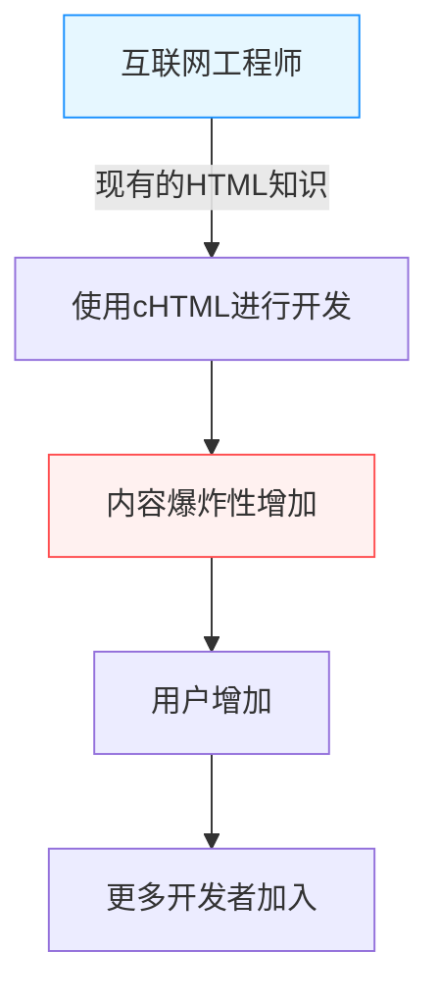

## 序章：智能手机之前的“移动互联网”

在现代，通过手掌上的终端访问互联网、享受视频、在社交网络上与世界各地的人们联系、购物，已经成为像呼吸一样自然的行为了。以iPhone为首的智能手机席卷全球，我们正畅游在永远在线的数字海洋中。

然而，在智能手机出现很久之前，就有一个将这种“手掌上的互联网”作为日常生活的国家。那就是日本。1999年，NTT DoCoMo开始提供“i-mode”服务，在世界上率先构建了移动互联网的巨大生态系统，从根本上改变了人们的生活方式。

本文将深入、详细地解读i-mode是如何诞生的，为什么能在日本国内获得如此爆炸性的普及，其背后的技术和商业突破，功臣们（松永真理、夏野刚、榎启一）的活跃，以及后来被称为“加拉帕戈斯化”，最终败在以iPhone为代表的黑船面前的历史。

## 第1章：i-mode诞生前夜与功臣们

### 1990年代后期的通信状况
在1990年代后期，互联网开始逐渐普及到普通家庭。然而，当时的互联网是“坐在电脑前，通过调制解调器拨号连接”的，启动和连接都需要时间，是一种专业而沉重的体验。手机主要作为语音通话工具，说到数据通信也仅限于发送简短的文本信息（短信或寻呼机）。

在这样的背景下，NTT DoCoMo内部提出了“能否用手机使用互联网等信息服务”的构想。

### 奇迹般的团队组建
为了引领这个宏大的项目，组建了一支后来被称为“i-mode之父”、“i-mode之母”的异色团队。

- **榎启一（Enoki Keiichi）**
  NTT DoCoMo的资深员工，也是i-mode项目的总负责人。他排除了大企业特有的官僚主义，做出了从外部招揽异能人才的大胆决定。如果没有他的领导能力和在公司内外的协调能力，i-mode可能会被现有的通信业务框架所压垮。

- **松永真理（Matsunaga Mari）**
  曾在Recruit担任过《Travail》和《就职Journal》等杂志主编的编辑。被榎氏挖角，负责内容的策划和制作。她没有从技术人员的角度出发，而是彻底引入了“普通的女高中生和家庭主妇想享受什么”的用户视角，并构思了“i-mode”这个平易近人的名字，奔走于开拓各种内容提供商。

- **夏野刚（Natsuno Takeshi）**
  精通互联网商业，后来加入团队。在构建商业模式和制定技术规格方面发挥了决定性作用。他最大的功绩是，构建了允许“非官方网站”存在的开放生态系统，以及将内容费用与通信费用一起回收的“代收系统”。

这三个人将各自的优势（组织能力、用户视角的策划能力、有远见的商业模式构建能力）结合在一起，奇迹般的项目开始运转了。

## 第2章：技术突破 —— 采用cHTML

在当时全球移动通信的标准化趋势中，一种名为WAP（无线应用协议）的针对手机终端的特殊描述语言（WML）正成为主流。许多海外运营商和国内竞争对手都在尝试采用这种WAP。

然而，i-mode开发团队（特别是夏野氏）选择了一种完全不同的方法。那就是采用了**Compact HTML (cHTML)**。

### 为什么是cHTML？
虽然WAP（WML）针对手机进行了优化，但它有一个致命的弱点：现有的Web设计师和工程师必须重新学习一门新的语言，这使得内容很难丰富起来。

另一方面，cHTML是当时已经广泛普及的HTML的子集（去掉了部分功能的简化版）。也就是说，只要是能为电脑制作网站的人，任何人都可以立即制作出面向i-mode的网站。

这个决定是将互联网的“开放性”引入移动领域的历史性英断。图像格式也采用了GIF（后来支持了JPEG和Flash等），成功地将现有的互联网文化原封不动地移植到了手掌上。

## 第3章：生态系统的完成 —— 官方网站、非官方网站、代收系统

i-mode能在全球取得成功的最大原因，比起技术，更在于其“商业模式”。

### 1. 我的菜单与官方内容
按下i-mode终端的“i”按钮后显示的顶部屏幕。在这里，通过了DoCoMo严格审查的“官方网站”按类别排列。新闻、天气、银行、手机铃声、游戏等，用户可以放心使用的优质服务被打包在一起。
在松永真理等人的努力下，从服务开始之初，就有许多知名企业和银行提供内容，为用户提供了“实用价值”。

### 2. 允许“非官方网站”存在
DoCoMo不仅提供官方网站，还允许通过直接输入URL，或通过搜索网站和链接集，自由访问未经过DoCoMo审查的普通网站（即所谓的“非官方网站”或“胜手网站”）。
再加上前面提到的cHTML的采用，个人制作的日记网站、BBS（论坛）、粉丝网站等无数诞生。正是这种“包含地下在内的自由扩展”，将i-mode从单纯的企业信息发布工具推向了年轻人文化的中心。

### 3. 代收（运营商计费）系统
夏野氏构建的最强大的系统就是数字内容的计费系统。
对于官方网站提供的收费内容（每月约100至300日元），DoCoMo会与每月的手机费一起向用户收取费用，扣除手续费（约9%）后支付给内容提供商（CP）。
通过这种方式，CP无需承担繁琐的计费基础设施或无法收回资金的风险，只需制作优质内容即可切实获得收益。通过“手机铃声”和“待机画面”赚取数亿日元的风险企业层出不穷，呈现出一种名副其实的淘金热景象。

## 第4章：数据包通信与生活方式的改变

1999年2月22日，i-mode服务正式开始。支持终端“F501i”等一经发售，立刻掀起了热潮。

这里重要的是采用了**数据包通信方式**。
传统的数据通信根据“连接时间”计费，因此如果长时间浏览网站会产生巨额通信费。然而，数据包通信是根据“发送和接收的数据量”计费的。以文本为主的cHTML数据量非常小，用户可以不用担心时间（实际上是永远在线）地享受互联网。

### 文化的爆发
i-mode创造了日本独有的新数字文化。

- **Emoji（绘文字）**
  由栗田穰崇等人开发的12×12像素的Emoji，为简短的文字交流增添了丰富的情感。它后来被Unicode采用，成为目前世界各地都在使用的“Emoji”的起源。
- **手机音乐・铃声**
  从单音到和弦，再进化到实际的乐曲（手机音乐），在音乐产业中创造了一个新的巨大市场。
- **手机小说**
  女高中生等用手机按钮一点一点写出的小说获得了数百万次访问，并被出版成书，成为了大畅销书的现象发生了。（例：《Deep Love》、《恋空》等）
- **移动游戏**
  从早期的数独和简单的RPG开始，后来连接到了通过GREE和Mobage等平台的社交游戏的繁荣。

## 第5章：加拉帕戈斯化（Galápagos syndrome）的陷阱

在2000年代中期，i-mode在日本国内拥有数千万用户，FeliCa（手机钱包）、One Seg（移动电视）、GPS导航等终端功能达到了世界最高水平。

然而，这个高度优化的生态系统，逐渐被比作“加拉帕戈斯群岛独有的生态系统”。

### 独有的进化与全球的孤立
日本的移动终端（功能手机）是由通信运营商（如DoCoMo）主导，向制造商详细指示规格而生产的。因此，虽然它们对运营商的服务（如i-mode）进行了完美的优化，但却无法在海外的网络或服务中使用，经历了加拉帕戈斯式的进化。

- 软件变得异常复杂，终端制造商在开发费用高涨中苦苦挣扎。
- 适应全球趋势（类似PC的OS、触摸屏化）变得迟缓。
- 内容提供商也因为仅在日本封闭的运营商市场中就能获得足够的利润，而不考虑拓展海外市场。

NTT DoCoMo也曾试图将i-mode机制输出给海外的通信运营商（如欧洲和亚洲等）或与之合作，但由于各国的通信基础设施、文化和商业习惯的不同，并没有取得像日本那样的成功。

## 第6章：黑船来袭 —— iPhone与智能手机的崛起

2007年，苹果公司发布了第一代iPhone（日本于2008年发售iPhone 3G）。
起初，日本许多业内人士轻视了iPhone。“没有手机钱包，没有One Seg，不能打Emoji，也没有红外线通信。这种东西是不会被日本用户接受的。”

然而，史蒂夫·乔布斯带来的智能手机革命的精髓，不在于功能的数量，而在于**“用户体验（UX）的根本性重新定义”**和**“通过App Store实现的真正全球、开放的生态系统”**。

### 崩溃的i-mode帝国
通过与PC相同的全浏览器带来的丰富Web体验，直观的多点触控操作，以及世界各地的开发者可以直接通过App Store提供应用。
这些完全使运营商严格管理的“官方菜单”机制变得过时。

用户迅速向智能手机转移，内容提供商也转向了应用开发。i-mode这个平台结束了它的历史使命，开始逐渐淡出历史舞台。（计划于2026年3月完全终止）

## 终章：i-mode留下的遗产

i-mode最终败给了智能手机，从历史的舞台上消失了。然而，i-mode在世界上率先证明的“移动互联网的可能性”，以及在其中培养出的许多理念，确实被现代智能手机社会所继承。

- **Emoji（绘文字）**成为了世界共通的语言。
- **运营商计费（App Store和Google Play计费系统的源流）**概念是应用经济圈的基础。
- 在移动设备的零碎时间消费内容和进行交流的**生活方式本身**，日本人在世界上是最早体验到的。

松永真理、夏野刚、榎启一等人于1999年描绘并实现的“手掌上的互联网”。这毫无疑问是人类通信史上最辉煌的里程碑之一，也是我们现在享受的数字社会的伟大原型。

---
*本文是回顾技术和通信历史、寻找现代创新启示连载的一部分。敬请期待下一次的历史探索。*
