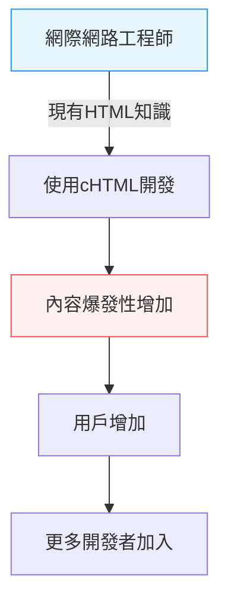

## 序章：智慧型手機之前的「行動網路」

在現代，從手掌上的裝置連接上網、觀賞影片、透過社群媒體與世界各地的人交流、甚至購物，已經成為像呼吸一樣自然的行為。以iPhone為首的智慧型手機席捲全球，我們彷彿隨時都在隨時連線的數位海洋中遨遊。

然而，在智慧型手機問世的很久以前，就有一個國家將這種「手掌上的網路」視為日常。那就是日本。1999年，NTT DoCoMo開始提供「i-mode」服務，領先全球建構了龐大的行動網路生態系統，從根本上改變了人們的生活方式。

本文將深入探討i-mode是如何誕生的？為何能在日本國內達到如此爆發性的普及？其背後的技術與商業突破、核心推手（松永真理、夏野剛、榎啓一）的活躍，以及後來被稱為「加拉巴哥化」，最終在以iPhone為代表的黑船面前敗下陣來的歷史，為您進行深入且詳細的剖析。

## 第1章：i-mode誕生前夕與核心推手

### 1990年代後半的通訊概況
在1990年代後半，網際網路開始逐漸普及到一般家庭。然而，當時的網路體驗是「坐在電腦前，透過數據機進行撥接上網」，無論是開機還是連線都需要時間，是一種專業且笨重的體驗。手機則主要作為語音通話的工具，數據通訊也僅限於發送簡短的文字訊息（簡訊或呼叫器）。

在這樣的背景下，NTT DoCoMo內部開始萌生出「是否能用手機使用網路等資訊服務？」的構想。

### 奇蹟的團隊編制
為了帶領這個宏大的計畫，集結了一支與眾不同的團隊，他們後來被稱為「i-mode之父」與「i-mode之母」。

- **榎啓一（Enoki Keiichi）**
  NTT DoCoMo的資深員工，也是i-mode計畫的總負責人。他排除了大企業特有的官僚主義，做出了從外部招攬異能之士的大膽決定。如果沒有他的領導力與內外協調能力，i-mode可能早就被現有通訊事業的框架給壓垮了。

- **松永真理（Matsunaga Mari）**
  曾在Recruit擔任過《Travail》與《就職Journal》等雜誌總編輯的編輯人員。被榎氏挖角，負責內容的企劃與製作。她徹底帶入了非技術人員觀點，而是「一般高中女生或家庭主婦想玩什麼」的用戶視角，構思出「i-mode」這個充滿親切感的名稱，並四處奔走開拓各種內容供應商（CP）。

- **夏野剛（Natsuno Takeshi）**
  精通網路商業模式，隨後加入團隊。在建構商業模式與制定技術規格方面發揮了決定性的作用。他最大的功績在於，打造了容許「非官方網站（勝手網站）」存在的開放生態系統，以及將通訊費與內容費一併收取的「代收系統」。

這三人將各自的優勢（組織力、用戶視角的企劃力、具前瞻性的商業模式建構力）結合在一起，讓這個奇蹟的計畫開始運作。

## 第2章：技術突破 —— 採用cHTML

在當時全球行動通訊標準化的趨勢中，一種名為WAP（Wireless Application Protocol）的手機專用描述語言（WML）正逐漸成為主流。許多海外電信商與國內競爭對手，都打算採用這種WAP。

然而，i-mode開發團隊（特別是夏野氏）選擇了完全不同的途徑。那就是採用**Compact HTML (cHTML)**。

### 為什麼是cHTML？
儘管WAP(WML)針對手機進行了最佳化，但現有的網頁設計師與工程師必須重新學習新的語言，這導致內容難以豐富，成為一個致命的弱點。

另一方面，cHTML是當時已經廣泛普及的HTML的子集（刪減部分功能的簡易版）。也就是說，只要是會製作電腦網頁的人，任何人都能立刻製作出i-mode專用的網站。

這項決定，是將網際網路的「開放性」帶入行動裝置的歷史性英明決策。圖片格式也採用了GIF（後來亦支援JPEG與Flash等），成功地將現有的網路文化原封不動地移植到了手掌中。

## 第3章：生態系統的完成 —— 官方網站、非官方網站、代收機制

i-mode能在全球獲得成功的最大原因，與其說是技術，不如說是其「商業模式」。

### 1. 我的選單與官方內容
按下i-mode手機上的「i」按鈕後顯示的首頁畫面。這裡排列著通過DoCoMo嚴格審查、按類別區分的「官方網站」。新聞、天氣、銀行、來電鈴聲、遊戲等，將用戶能安心使用的優質服務打包在一起。
在松永真理等人的努力下，從服務開始之初就有許多知名企業與銀行提供內容，為用戶提供了「實用的價值」。

### 2. 容許「非官方網站（勝手網站）」
DoCoMo不僅提供官方網站，用戶還能透過直接輸入URL、經由搜尋引擎或連結集，自由瀏覽未經DoCoMo審查的一般網站（所謂的「勝手網站」或「非官方網站」）。
加上前述採用的cHTML，無數個人製作的日記網站、BBS（佈告欄）、粉絲網站如雨後春筍般誕生。這種「包含地下文化在內的自由擴展」，正是將i-mode從單純的企業資訊發布工具，推升為年輕人文化中心的關鍵。

### 3. 代收系統（電信帳單代收）
夏野氏所建構的最強大系統，就是數位內容的計費系統。
官方網站提供的付費內容（月費約100至300日圓左右）費用，由DoCoMo隨每個月的手機通話費一起向用戶收取，扣除手續費（約9%）後支付給內容供應商（CP）。
如此一來，CP無需負擔繁瑣的計費基礎設施與未收款風險，只需製作出優質的內容就能確實獲利。許多靠著「來電鈴聲」或「待機畫面」賺進數億日圓的新創企業接連誕生，宛如呈現出淘金熱的景象。

## 第4章：封包通訊與生活方式的變革

1999年2月22日，i-mode服務正式上線。隨著對應手機「F501i」等機型發售，立刻掀起了巨大的熱潮。

這裡非常重要的一點是採用了**封包通訊技術（Packet Switching）**。
傳統的數據通訊是根據「連線時間」來計費，如果長時間瀏覽網站，會產生龐大的通訊費。但是封包通訊是根據「傳送與接收的數據量」來計費。如果是以文字為主的cHTML，數據量非常小，用戶無需在意時間（實質上形同常時連線），就能盡情享受網路。

### 文化的爆發
i-mode孕育出了日本獨有的全新數位文化。

- **表情符號（Emoji）**
  栗田穰崇等人開發的12×12像素表情符號，為簡短的文字交流增添了豐富的情感。這後來被Unicode採用，成為目前全世界都在使用的「Emoji」的根源。
- **原音鈴聲、來電鈴聲**
  從單音進化到和絃，再到真實的樂曲（原音鈴聲），在音樂產業中創造了全新的龐大市場。
- **手機小說**
  女高中生等人用手機按鍵一點一滴寫下的小說，吸引了數百萬次的點閱，甚至出版成實體書成為超級暢銷書。（例如：《Deep Love》、《戀空》等）
- **手機遊戲**
  從早期的數獨與簡單的RPG開始，後來透過GREE或Mobage等平台，促成了社群遊戲的繁榮。

## 第5章：加拉巴哥化（Galápagos syndrome）的陷阱

在2000年代中期，i-mode在日本國內擁有多達數千萬的用戶，FeliCa（手機錢包）、One-Seg（行動電視）、GPS導航等，手機功能達到了世界最高峰。

然而，這個高度最佳化的生態系統，逐漸被比喻為「加拉巴哥群島的獨特生態系」。

### 獨自進化與與全球脫節
日本的手機（功能型手機），是由電信商（如DoCoMo）主導，向製造商給出詳細規格指示來製造。因此，雖然完美地針對電信商服務（如i-mode）進行了最佳化，卻無法在海外的網路或服務中使用，形成了加拉巴哥式的進化。

- 軟體變得錯綜複雜，手機製造商苦於開發費用飆升。
- 遲遲無法適應全球趨勢（如類似PC的OS、觸控螢幕化）。
- 內容供應商也因為只要在日本封閉的電信市場就能獲得足夠利潤，而不考慮進軍海外。

NTT DoCoMo也曾試圖將i-mode的機制輸出並與海外電信商（歐洲或亞洲等）合作，但由於各國通訊基礎設施、文化與商業習慣的差異，未能取得如日本那般的成功。

## 第6章：黑船來襲 —— iPhone與智慧型手機的崛起

2007年，Apple發表了第一代iPhone（日本於2008年發售iPhone 3G）。
起初，許多日本業界人士輕視了iPhone。「沒有手機錢包、沒有行動電視、打不出表情符號、也不能用紅外線通訊。這種東西日本用戶是不會接受的。」他們這麼說。

然而，史蒂夫·賈伯斯所帶來的智慧型手機革命的真髓，並不在於功能的數量，而是**「使用者體驗（UX）的根本重新定義」**以及**「透過App Store實現的真正全球開放生態系統」**。

### 崩潰的i-mode帝國
與PC相同的全瀏覽器帶來豐富的網頁體驗、直覺的多點觸控操作，以及讓全世界開發者能直接提供App的App Store。
這些完全讓由電信商嚴密控管的「官方選單」機制變得過時。

用戶迅速轉向智慧型手機，內容供應商也轉向App開發。i-mode這個平台結束了它的歷史使命，逐漸淡出舞台。（預計於2026年3月完全終止服務）

## 終章：i-mode留下的遺產

i-mode最終敗給了智慧型手機，從歷史的舞台上消失了。然而，i-mode領先全球證明的「行動網路的可能性」，以及在其中孕育出的無數概念，確實地傳承給了現代的智慧型手機社會。

- **Emoji（表情符號）**成為了世界共通語言。
- **代收機制（App Store與Google Play計費系統的源流）**的概念，是App經濟圈的基礎。
- 在零碎時間透過行動裝置消費內容、進行交流的**生活方式本身**，日本人是世界上最早體驗到的。

松永真理、夏野剛、榎啓一等人在1999年所描繪並實現的「手掌上的網路」。這毫無疑問是人類通訊史上最耀眼的金字塔之一，也是我們現在所享受的數位社會最偉大的原型。

---
*本文為回顧科技與通訊歷史、尋找現代創新靈感之連載的一部分。敬請期待下一次的歷史探訪。*
