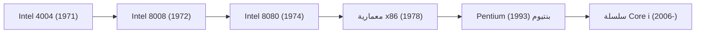

# التاريخ المؤسسي: ملحمة إنتل (Intel) — ميلاد المعالج الدقيق وسيادة وادي السيليكون

في المجتمع البشري المعاصر، أصبحت الحواسيب ورقائق السيليكون بنية تحتية حيوية لا غنى عنها تماماً كالماء والكهرباء. ولأكثر من نصف قرن، قاد مسيرة تطور هذا "العقل" الرقمي عملاق وادي السيليكون بلا منازع: شركة إنتل (Intel Corporation). فمن نشر الحواسيب الشخصية إلى انفجار شبكة الإنترنت، ومراكز البيانات السحابية، وصولاً إلى ثورة الذكاء الاصطناعي، يتماهى تاريخ إنتل مع تاريخ تطور الحضارة الرقمية الحديثة ذاتها.

تقدم هذه المقالة قراءة شاملة في المسيرة التاريخية لإنتل: من تأسيسها في ماونتن فيو واختراعها لأول معالج دقيق في العالم، مروراً بقانون مور والتحولات الاستراتيجية المصيرية، وصولاً إلى مبادرة IDM 2.0 في عصر الذكاء الاصطناعي.

## 1. فجر وادي السيليكون وولادة إنتل (1968)

بدأت ملحمة إنتل في عام 1968 بمدينة ماونتن فيو في ولاية كاليفورنيا. فقد قرر روبرت نويس (أحد مخترعي الدوائر المتكاملة) وغوردون مور (عالم الكيمياء الفيزيائية البارز)، وهما من الأعمدة المؤسسة لشركة فيرتشايلد لأشباه الموصلات، الاستقالة وتأسيس شركتهما الخاصة هرباً من البيروقراطية الخانقة.

وبدعم تمويلي من المستثمر الجريء آرثر روك بناءً على خطة عمل موجزة لم تتجاوز بضع صفحات، أطلقا على الشركة اسم "Intel" — وهو اختصار لعبارة **"Integrated Electronics"** (الإلكترونيات المتكاملة). وسرعان ما انضم إليهما آندي غروف، الحاصل على الدكتوراه في الهندسة الكيميائية، والذي أصبح المحرك الإداري للشركة. وهكذا تشكل أعظم ثلاثي قيادي في تاريخ التكنولوجيا: نويس (الملهم وصاحب الرؤية)، ومور (العبقري التقني)، وغروف (القائد التنفيذي الصارم).

لم يكن هدف إنتل الأولي صناعة المعالجات، بل استبدال ذواكر الحلقات المغناطيسية القديمة بـ **ذواكر أشباه الموصلات**. وكان رهانهم صائباً؛ ففي عام 1970 أطلقت الشركة رقاقة "Intel 1103"، أول شريحة ذاكرة وصول عشوائي ديناميكية (DRAM) تجارية في العالم، والتي حققت نجاحاً ساحقاً وتوجت إنتل رائدة لصناعة الذواكر عالمياً.

## 2. اختراع المعالج الدقيق: المصادفة التي غيرت مجرى التاريخ (1971)

جاء المنعطف الأكبر في تاريخ التكنولوجيا عام 1971، حين تعاقدت شركة الآلات الحاسبة اليابانية "بوسيكوم" (Busicom) مع إنتل لتصميم 12 شريحة مخصصة (LSI) لآلتها الحاسبة الجديدة.

ولما كانت إنتل شركة ناشئة محدودة الموارد الهندسية، فقد عجزت عن تصميم 12 شريحة متخصصة في وقت واحد. وهنا طرح المهندسون تيد هوف وفيديريكو فاجين وستان ميزور مع المهندس الياباني ماساتوشي شيما فكرة ثورية:  
*بدلاً من تصميم دوائر صلبة مخصصة لكل وظيفة حسابية، لماذا لا نصنع شريحة حوسبة مركزية موحدة وقابلة للبرمجة بحيث تؤدي أي مهمة عبر التعليمات البرمجية؟*

أثمر هذا الابتكار عن ولادة أول معالج دقيق تجاري متكامل على شريحة واحدة في التاريخ: **Intel 4004** في نوفمبر 1971. وبجمعه نحو 2,300 ترانزستور على قطعة سيليكون بحجم ظفر اليد، قدم هذا المعالج ذو الـ 4-بت طاقة حسابية كانت توازي حواسيب تشغل غرفاً كاملة قبل عقد واحد.

أعقبت ذلك معالجات 8-بت مثل 8008 (1972) والمعالج الشهير 8080 (1974). وكان معالج 8080 بمثابة القلب النابض لأول حاسوب شخصي Altair 8800، وهو ما دفع بيل غيتس لتأسيس مايكروسوفت وستيف جوبز لبناء حاسوب Apple I.

## 3. قانون مور: نبض التقدم التكنولوجي العالمي

يرتبط صعود إنتل ارتباطاً وثيقاً بـ **قانون مور**. ففي عام 1965، لاحظ غوردون مور أن عدد الترانزستورات على الشريحة الواحدة يتضاعف كل 18 إلى 24 شهراً تقريباً مع انخفاض تكلفتها بمعدلات مطردة.

$$
P = 2^{rac{t}{1.5}}
$$

*(حيث تمثل $P$ كثافة الترانزستورات و$t$ الزمن بالسنوات)*

لم يكن قانون مور مجرد ملاحظة تجريبية، بل تحول إلى التزام مقدس وبوصلة وجهت صناعة أشباه الموصلات بأسرها. وللحفاظ على هذا الإيقاع الشاق، ضخت إنتل مليارات الدولارات سنوياً في الأبحاث والمصانع الفائقة (Fabs)، لتقود وتيرة التقدم التكنولوجي للبشرية لعقود متتالية.

## 4. التحول الاستراتيجي الحاسم: التخلي عن الذواكر من أجل المعالجات (عقد 1980)

في مطلع الثمانينيات، واجهت إنتل أزمة وجودية طاحنة. فقد أغرقت الشركات اليابانية (NEC وتوشيبا وهيتاشي) الأسواق العالمية بذواكر DRAM عالية الجودة بأسعار منخفضة للغاية. وتكبد قطاع الذواكر، وهو العمود الفقري لإنتل، خسائر مالية جسيمة.

وفي تلك اللحظة الحرجة، دار الحوار الشهير بين آندي غروف وغوردون مور:  
*غروف: «إذا طردنا مجلس الإدارة واستقدم رئيساً تنفيذياً جديداً، ماذا سيفعل برأيك؟»*  
*مور: «سيخرجنا فوراً من قطاع الذواكر».*  
*غروف: «إذن، لماذا لا نخرج نحن من هذا الباب، ثم نعود ونتخذ هذا القرار بأنفسنا؟»*

في عام 1985، اتخذت إنتل قرارها التاريخي والشجاع: إيقاف تصنيع ذواكر DRAM بالكامل، وتكريس جميع موارد الشركة لإنتاج المعالجات المركزية (CPU).

وكانت الظروف مواتية لهذا القرار؛ ففي عام 1981 اختارت IBM معالج إنتل 8088 ليكون عقل أول حاسوب شخصي لها (IBM PC). ومع انتشار الحواسيب المتوافقة مع معيار IBM في العالم، تحولت معمارية إنتل "x86" إلى المعيار الفعلي للحوسبة الشخصية. ومن خلال حملة "Operation CRUSH" التسويقية الشرسة، هزمت إنتل منافسيها مثل موتورولا، لتفرض سيطرتها المطلقة على سوق المعالجات.

## 5. العصر الذهبي لتحالف Wintel وأسطورة "Intel Inside" (عقد 1990)

كانت التسعينيات الحقبة الذهبية لهيمنة إنتل؛ إذ أحكم التحالف الوثيق بين نظام ويندوز من مايكروسوفت ومعالجات x86 من إنتل — والمعروف بتحالف **Wintel** — قبضته على أكثر من 90% من سوق الحواسيب الشخصية. وقادت معالجات 386 و486 ثم معالجات Pentium ثورة الوسائط المتعددة والإنترنت.

في عام 1993، أطلقت إنتل علامتها التجارية "Pentium"، لتتجاوز العقبات القانونية التي تمنع تسجيل الأرقام المجردة كعلامات تجارية، وتحول الاسم إلى مرادف عالمي للأداء العالي.

وتعزز هذا الحضور بالحملة التسويقية الخالدة **"Intel Inside"** التي انطلقت عام 1991. فمن خلال دعم ميزانيات إعلانات مصنعي الحواسيب مقابل وضع شعار إنتل وعزف نغمتها الموسيقية الشهيرة، جعلت الشركة من المعالج الداخلي غير المرئي معيار الجودة الأول في عيون المستهلكين، متمتعة بنفوذ تسعيري مطلق.

ولخص آندي غروف، الذي أدار هذه الحقبة بحزم أسطوري، فلسفته في كتابه الشهير *«وحدهم المصابون بجنون الارتياب ينجون»* (Only the Paranoid Survive).

## 6. ثورة تعدد الأنوية والصراع الملحمي مع AMD (عقد 2000)

في مطلع الألفية، واجهت إنتل أزمة حادة مع معمارية "NetBurst (Pentium 4)" بسبب السعي المحموم لرفع الترددات لأكثر من 4 جيجاهرتز، مما اصطدم بـ "الجدار الحراري" الفيزيائي والاستهلاك المفرط للطاقة.

واستغلت شركة AMD هذا التعثر ببراعة عبر معالجات Athlon 64 وOpteron، سابقة إنتل إلى طرح معالجات 64-بت (AMD64) ومتحكمات الذاكرة المدمجة، مهددة هيمنة إنتل على الحواسيب ومراكز البيانات.

وجاء الإنقاذ عبر فريق مهندسي إنتل في حيفا، حيث جرى التخلي عن سباق الترددات والانتقال إلى **معمارية تعدد الأنوية (Multi-Core)** وكفاءة الطاقة. وفي عام 2006، حطمت معالجات "Core 2 Duo" المنافسين واستعادت الصدارة لصالح إنتل.

ودشنت إنتل بعد ذلك استراتيجية **"Tick-Tock"**: التناوب سنوياً بين تقليص دقة التصنيع (Tick) وتقديم معمارية جديدة كلياً (Tock)، مما منحها تفوقاً كاسحاً دام قرابة عقد كامل.

## 7. فوات قطار الهواتف الذكية وأزمة دقة التصنيع (عقد 2010)

رغم تفوقها في الحواسيب والخوادم، ارتكبت إنتل خطأ استراتيجياً فادحاً في العقد الثاني من الألفية بتفويت ثورة الهواتف الذكية. فعندما عرض ستيف جوبز على إنتل تصنيع معالجات الآيفون الأول، رفضت الإدارة ذلك بداعي ضعف الجدوى المالية. وهكذا ذهب سوق الهواتف بالكامل لمعمارية ARM وشركات مثل كوالكوم وآبل.

وتفاقمت الأزمة بتعثر أهم مزايا إنتل التنافسية: ريادتها العالمية في تصنيع الرقاقات. فقد أدت التأخيرات المتكررة لسنوات في دقتي 14 و10 نانومتر إلى تعطل وتيرة قانون مور.

واستغلت AMD الفرصة بقيادة الدكتورة ليزا سو لتعود بقوة عبر معمارية Zen (معالجات Ryzen)، بينما أتقنت شركة TSMC التايوانية تقنية الطباعة فوق البنفسجية المتطرفة (EUV) وتجاوزت إنتل في دقة التصنيع. وواجه نموذج إنتل القائم على الجمع الحصري بين التصميم والتصنيع الداخلي (IDM) ضغوطاً غير مسبوقة.

## 8. مسيرة النهوض: استراتيجية IDM 2.0 وعصر الذكاء الاصطناعي (2020 — حتى الآن)

في عام 2021، وفي ذروة الأزمة، عاد المهندس المخضرم بات غيلسنجر (Pat Gelsinger)، أول مدير تكنولوجيا في العصر الذهبي لإنتل، ليشغل منصب الرئيس التنفيذي، معلناً استراتيجية الإنقاذ الجريئة **"IDM 2.0"**.

تقوم هذه الاستراتيجية على ثلاثة محاور رئيسية:
1. **استعادة ريادة التصنيع**: تنفيذ خريطة طريق "5 عقد تصنيعية في 4 سنوات"، تتوج بتقنية Intel 18A وتصميم ترانزستورات RibbonFET وتغذية الطاقة الخلفية PowerVia.
2. **التحول لمسبك عالمي (Intel Foundry)**: فتح المصانع للعملاء الخارجيين مع استثمار مئات المليارات في مصانع ضخمة بأوهايو وأريزونا وأوروبا لمنافسة TSMC.
3. **الاستعانة المرنة بالمصانع الخارجية**: تصنيع بعض الرقائق لدى مسابك خارجية متقدمة كلما اقتضت المصلحة.

وفي سباق الذكاء الاصطناعي التوليدي الذي تقوده إنفيديا، أطلقت إنتل مسرعات "Gaudi" ودشنت عصر "حواسيب الذكاء الاصطناعي" (AI PC) عبر معالجات Core Ultra المدعومة بوحدات معالجة عصبية مدمجة (NPU).

وبفضل قانون الرقائق الأمريكي (CHIPS Act) والدعم الأوروبي لإعادة توطين سلاسل الإمداد، تحولت إنتل إلى قلعة استراتيجية وأمنية لا غنى عنها للسيادة التكنولوجية الغربية.

## خاتمة: عملاق السيليكون الذي صاغ العالم الحديث

إن تاريخ إنتل الممتد لقرابة ستين عاماً هو ملحمة بطولية في تحدي قوانين الفيزياء وتغيرات الأسواق. وفي كل مرة وقفت فيها على حافة الهاوية، كانت تعود للنهوض بفضل عبقرية مهندسيها وجرأة قادتها.

من 2,300 ترانزستور على معالج 4004 إلى مليارات الترانزستورات المعاصرة على المقياس دون النانوي، صنعت إنتل أسس العالم الرقمي المعاصر. وفي عصر IDM 2.0 والذكاء الاصطناعي، يواصل هذا الصرح التقني رسم ملامح المستقبل الرقمي للبشرية.
