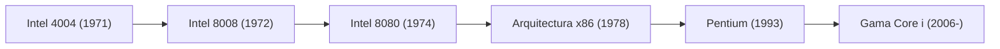

# Historia corporativa: La trayectoria de Intel - El nacimiento del microprocesador y el gigante de Silicon Valley

En la sociedad contemporánea, los ordenadores y los chips de silicio se han vuelto tan indispensables como el agua corriente o la electricidad. Y durante más de medio siglo, el cerebro que ha impulsado esta colosal revolución tecnológica ha llevado una firma indiscutible: Intel Corporation. Desde la democratización del ordenador personal hasta la explosión de internet, los centros de datos en la nube y la inteligencia artificial, la historia de Intel coincide con la propia evolución del mundo digital.

Este artículo profundiza en la trayectoria épica de Intel: desde su fundación en Mountain View y la invención del microprocesador, pasando por la Ley de Moore y sus arriesgados giros estratégicos, hasta su actual reinvención bajo la estrategia IDM 2.0 en la era de la IA.

## 1. El amanecer de Silicon Valley y el nacimiento de Intel (1968)

La historia de Intel arranca en 1968 en Mountain View, California. Dos figuras consagradas de Fairchild Semiconductor —Robert Noyce (coinventor del circuito integrado) y Gordon Moore (brillante fisicoquímico)—, frustrados por la creciente burocracia de su compañía, decidieron fundar su propia empresa.

Con el respaldo financiero del legendario inversor de capital de riesgo Arthur Rock, obtuvieron los fondos iniciales gracias a un conciso plan de negocio de apenas unas pocas páginas. El nombre elegido fue «Intel», acrónimo de **«Integrated Electronics»** (Electrónica Integrada). Poco después se unió a ellos Andy Grove, un doctor en ingeniería química que se convertiría en el motor operativo de la empresa. Así se formó el triunvirato de gestión más influyente de la historia tecnológica: Noyce (el visionario y embajador público), Moore (el prodigio científico) y Grove (el gestor riguroso e implacable).

El objetivo fundacional de Intel no fue el microprocesador, sino sustituir las voluminosas memorias magnéticas por **memorias de semiconductores**. El acierto fue pleno: en 1970 presentaron el «Intel 1103», el primer chip comercial de memoria DRAM (Dynamic Random-Access Memory) del mundo, cuyo arrollador éxito convirtió a la empresa en el líder indiscutible del sector.

## 2. La invención del microprocesador: Un hallazgo que cambió el mundo (1971)

En 1971 tuvo lugar el punto de inflexión definitivo para Intel y para la historia tecnológica de la humanidad. El fabricante japonés de calculadoras Busicom encargó a Intel el diseño de 12 chips LSI (integración a gran escala) personalizados para su nueva calculadora programable.

En aquel momento, Intel era una firma joven sin la capacidad de ingeniería necesaria para desarrollar doce circuitos especializados simultáneamente. Los ingenieros Ted Hoff, Federico Faggin y Stan Mazor, junto con el ingeniero japonés Masatoshi Shima, concibieron una solución revolucionaria:  
*En lugar de fabricar circuitos rígidos específicos para cada tarea, era preferible crear un único chip de procesamiento general cuya función pudiera reprogramarse indefinidamente mediante software.*

Así nació en noviembre de 1971 el primer microprocesador comercial en un único chip de silicio: el **Intel 4004**. Integrando unos 2.300 transistores en un silicio diminuto del tamaño de una uña, poseía una potencia comparable a la de los ordenadores centrales que ocupaban habitaciones enteras una década antes.

Poco después, Intel presentó los procesadores de 8 bits 8008 (1972) y 8080 (1974). El Intel 8080 fue el núcleo del Altair 8800, el equipo que prendió la mecha de la revolución de la informática personal, inspirando a Bill Gates a fundar Microsoft y a Steve Jobs a fabricar el Apple I.

## 3. La Ley de Moore y la vanguardia tecnológica

El auge de Intel está intrínsecamente ligado a la **Ley de Moore**. Formulada en 1965 por Gordon Moore, esta observación empírica sostenía que el número de transistores en un chip integrado se duplicaría aproximadamente cada 18 a 24 meses, duplicando la potencia y abaratando costes.

$$
P = 2^{rac{t}{1.5}}
$$

*(donde $P$ representa la densidad de transistores y $t$ el tiempo en años)*

La Ley de Moore no fue una simple estimación teórica; funcionó como una profecía autocumplida y la hoja de ruta indiscutible de toda la industria electrónica. Para mantener ese vertiginoso ritmo, Intel invirtió sin descanso miles de millones en I+D y en fábricas de vanguardia (fabs), convirtiéndose en el gran motor del progreso digital.

## 4. El giro existencial: El abandono de las memorias por la CPU (década de 1980)

A principios de los ochenta, Intel encaró una crisis de supervivencia. Los fabricantes japoneses (NEC, Toshiba, Hitachi) inundaron el mercado global de memorias DRAM con rendimientos de fabricación impecables y precios extraordinariamente agresivos. La división de memorias de Intel entró en pérdidas multimillonarias.

En ese momento crítico se produjo un diálogo memorable entre Andy Grove y Gordon Moore:  
*Grove: «Si nos despidieran y el consejo trajera a un nuevo consejero delegado, ¿qué crees que haría?»*  
*Moore: «Nos sacaría del negocio de las memorias».*  
*Grove: «Entonces, ¿por qué no salimos por esa puerta, volvemos a entrar y lo hacemos nosotros mismos?»*

En 1985, Intel tomó la dolorosa decisión de clausurar sus históricas líneas de DRAM y concentrar todos sus recursos en los microprocesadores (CPU).

La fortuna premió su audacia: en 1981, IBM había elegido el procesador Intel 8088 de 16 bits para su primer IBM PC. Al proliferar los ordenadores compatibles en todo el mundo, la arquitectura «x86» de Intel se transformó en el estándar universal de la informática. Gracias a su agresiva campaña «Operación CRUSH», Intel doblegó a competidores como Motorola y se aseguró el monopolio de los procesadores para PC.

## 5. La era dorada de Wintel y el fenómeno «Intel Inside» (década de 1990)

La década de 1990 consolidó la hegemonía de Intel. La alianza indisoluble entre el sistema operativo Windows de Microsoft y los procesadores x86 de Intel —bautizada como **Wintel**— controló más del 90% del mercado de PC. Las sucesivas generaciones 386, 486 y Pentium convirtieron la potencia de cálculo en el motor del despegue de internet y la multimedia.

En 1993, Intel presentó el procesador «Pentium». Al crear un nombre comercial propio para sortear la imposibilidad legal de registrar números como marcas, la firma convirtió a Pentium en un icono popular indiscutible.

El espaldarazo definitivo llegó con la legendaria campaña de marketing **«Intel Inside»**, iniciada en 1991. Subvencionando la publicidad de los fabricantes de ordenadores a cambio de exhibir su logotipo y el célebre jingle sonoro, Intel convenció al consumidor de que un PC con procesador Intel era sinónimo de calidad y rendimiento superior, otorgándole un poder de negociación inaudito sobre la industria.

Andy Grove, que lideró la compañía en aquellos años triunfales, resumió su filosofía de gestión en su célebre libro *Solo los paranoicos sobreviven*.

## 6. La revolución multinúcleo y el enfrentamiento con AMD (década de 2000)

A principios de los 2000, Intel cometió un error estratégico con su arquitectura «NetBurst (Pentium 4)», empeñada en alcanzar altísimas frecuencias de reloj a costa de chocar contra el «muro térmico»: un calor y un consumo eléctrico inasumibles.

Su histórico rival, AMD, aprovechó el tropiezo con sus procesadores Athlon 64 y Opteron, introduciendo la computación de 64 bits (AMD64) y controladores de memoria integrados, arrebatándole cuota de mercado en sobremesas y servidores.

La respuesta de Intel no se hizo esperar: su equipo de diseño en Haifa (Israel) diseñó la microarquitectura **«Core»**, abandonando la obsesión por los gigahercios para apostar por el paralelismo multinúcleo y una eficiencia energética extraordinaria. El lanzamiento en 2006 de los procesadores «Core 2 Duo» recuperó el trono de la potencia.

Poco después, Intel adoptó la disciplina del **modelo «Tick-Tock»**: alternar cada año una reducción del nodo de fabricación (Tick) con una nueva arquitectura (Tock), encadenando una década de liderazgo tecnológico implacable.

## 7. El tropiezo en telefonía móvil y la pérdida de la primacía en fabricación (década de 2010)

Sin embargo, en la década de 2010 surgieron graves fisuras. El gran error estratégico de Intel fue desdeñar la revolución del smartphone. Cuando Steve Jobs propuso a Intel fabricar el chip del primer iPhone, la dirección rechazó la oferta creyendo que el volumen no compensaría los costes. Como consecuencia, el mercado móvil fue dominado por la arquitectura ARM y compañías como Qualcomm y la propia Apple.

Peor aún: la histórica joya de la corona de Intel —su supremacía indiscutible en la fabricación de chips— comenzó a flaquear. Los graves retrasos en sus procesos de 14 nm y 10 nm paralizaron el ritmo de la Ley de Moore.

AMD aprovechó la coyuntura bajo el liderazgo de Lisa Su con su arquitectura Zen (Ryzen y EPYC). Paralelamente, la firma taiwanesa TSMC dominó antes que nadie la litografía ultravioleta extrema (EUV), superando a Intel en densidad de transistores. El modelo tradicional IDM (diseñar y fabricar exclusivamente en plantas propias) quedó en entredicho.

## 8. El renacimiento: IDM 2.0 y el horizonte de la IA (década de 2020–presente)

En 2021, en plena crisis de identidad, Intel nombró consejero delegado a Pat Gelsinger, un reputado ingeniero que había sido el primer director de tecnología (CTO) de la empresa en su época dorada. Gelsinger impulsó de inmediato una audaz estrategia de reconstrucción: **IDM 2.0**.

Los pilares de esta nueva etapa son:
1. **Recuperar el liderazgo de fabricación**: Desarrollar «cinco nodos en cuatro años», culminando en el proceso Intel 18A con transistores RibbonFET y alimentación trasera PowerVia.
2. **Apertura del negocio de fundición (Intel Foundry)**: Abrir sus fábricas a clientes externos con inversiones de cientos de miles de millones de dólares en megaprocesadoras en Ohio, Arizona y Europa para competir con TSMC.
3. **Uso flexible de fundiciones externas**: Fabricar ciertos diseños con socios punteros cuando resulte estratégico.

En paralelo, frente a la eclosión de la IA generativa dominada por las GPU de NVIDIA, Intel ha desplegado sus aceleradores «Gaudi» e impulsado la era de los «AI PC» con los procesadores Core Ultra dotados de NPU dedicada.

Asimismo, ante las tensiones geopolíticas mundiales, la Ley CHIPS de Estados Unidos y los apoyos europeos han convertido a Intel en una corporación de importancia estratégica vital para la seguridad tecnológica occidental.

## Conclusión: El coloso de silicio que forjó la era digital

Los cerca de sesenta años de historia de Intel son el testimonio de una lucha incesante contra los límites de la física y las turbulencias del mercado. En múltiples ocasiones estuvo al borde del precipicio, pero siempre halló la fuerza para reinventarse mediante el talento de sus ingenieros.

Desde aquel primer chip 4004 con 2.300 transistores hasta los modernos procesadores que albergan decenas de miles de millones de conmutadores en el reino subnanométrico, la huella de Intel es indisociable del progreso humano. Su pulso en la era de IDM 2.0 y la IA seguirá definiendo las fronteras de la computación mundial.
