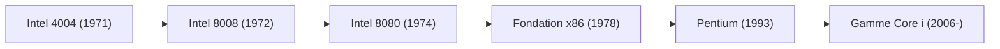

# Histoire d'entreprise : La saga Intel - Naissance du microprocesseur et maître de la Silicon Valley

Dans nos sociétés modernes, les ordinateurs et les composants en silicium sont devenus des ressources aussi indispensables que l'eau ou l'électricité. Et depuis plus d'un demi-siècle, le cerveau au cœur de cette révolution technologique porte un nom emblématique : Intel Corporation. De l'avènement de l'ordinateur personnel à l'essor d'Internet, du cloud computing jusqu'à l'intelligence artificielle, l'histoire d'Intel se confond avec l'histoire même de l'ère numérique.

Cet article retrace la trajectoire d'Intel : sa création à Mountain View, l'invention du microprocesseur, la formulation de la loi de Moore, ses audacieuses mutations stratégiques et son grand défi IDM 2.0 à l'ère de l'IA.

## 1. L'aurore de la Silicon Valley et la fondation d'Intel (1968)

L'épopée d'Intel commence en 1968 à Mountain View, en Californie. Figures centrales de Fairchild Semiconductor, Robert Noyce (coinventeur du circuit intégré) et Gordon Moore (chimiste et physicien hors pair), exaspérés par la lourdeur administrative de leur entreprise, décidèrent de créer leur propre structure.

Soutenus par l'investisseur légendaire Arthur Rock, ils réunirent leurs premiers capitaux sur la foi d'un modeste plan d'affaires de quelques pages. L'entreprise fut baptisée « Intel », contraction d'**« Integrated Electronics »** (Électronique Intégrée). Peu après, Andy Grove, docteur en génie chimique, rejoignit l'aventure pour en devenir la cheville ouvrière opérationnelle. Le célèbre triumvirat était né : Noyce le visionnaire charismatique, Moore le génie scientifique et Grove l'administrateur impitoyable et rigoureux.

L'objectif initial d'Intel ne portait pas sur le microprocesseur, mais sur le remplacement des mémoires à tores magnétiques par des **mémoires à semi-conducteurs**. L'intuition fut couronnée de succès : en 1970, Intel sortit l'« Intel 1103 », la première mémoire vive dynamique (DRAM) commerciale, dont l'immense triomphe hissa l'entreprise au rang de leader mondial du secteur.

## 2. L'invention du microprocesseur : L'étincelle qui changea l'Histoire (1971)

L'année 1971 marqua le tournant le plus retentissant de l'histoire d'Intel et de la technologie moderne. Le fabricant japonais de calculatrices Busicom sollicita Intel pour concevoir douze circuits intégrés spécifiques (LSI) destinés à sa nouvelle calculatrice de bureau.

Intel était alors une structure de taille modeste, dépourvue des ressources nécessaires pour mener de front douze développements sur mesure. Les ingénieurs Ted Hoff, Federico Faggin, Stan Mazor et l'ingénieur japonais Masatoshi Shima eurent alors une intuition géniale :  
*Plutôt que de figer des circuits matériels rigides pour chaque fonction, pourquoi ne pas concevoir un processeur central universel programmable dont les tâches seraient dictées par le logiciel ?*

Cette rupture donna le jour au tout premier microprocesseur monopuce commercial au monde : l'**Intel 4004**, en novembre 1971. Rassemblant environ 2 300 transistors sur un minuscule fragment de silicium, cette puce 4 bits rivalisait avec la puissance des ordinateurs géants des années 1960.

Intel lança ensuite les processeurs 8 bits 8008 (1972) et 8080 (1974). L'Intel 8080 devint le moteur de l'Altair 8800, la machine considérée comme le point de départ de la micro-informatique personnelle, poussant Bill Gates à créer Microsoft et Steve Jobs à assembler l'Apple I.

## 3. La loi de Moore et le tempo de l'industrie technologique

L'histoire d'Intel est inséparable de la **loi de Moore**. Formulée en 1965 par Gordon Moore, cette règle empirique stipulait que le nombre de transistors sur un circuit intégré doublerait environ tous les 18 à 24 mois, décuplant les performances tout en divisant les coûts.

$$
P = 2^{rac{t}{1.5}}
$$

*(où $P$ représente la densité de transistors et $t$ le temps écoulé en années)*

Loin d'être une simple hypothèse, la loi de Moore devint une prophétie autoréalisatrice guidant l'ensemble de l'industrie informatique. Pour tenir cette cadence forcenée, Intel réinvestit chaque année des milliards en R&D et dans ses usines de fabrication (fabs), dictant le tempo de la technologie mondiale pendant plusieurs décennies.

## 4. Le grand renoncement : De la mémoire vive aux microprocesseurs (années 1980)

Au début des années 1980, Intel frôla le désastre. Les conglomérats japonais (NEC, Toshiba, Hitachi), soutenus par une politique industrielle offensive et des rendements exemplaires, inondèrent le marché mondial de puces DRAM à prix cassés. Le cœur de métier originel d'Intel devint un gouffre financier.

C'est alors qu'eut lieu l'échange légendaire entre Andy Grove et Gordon Moore :  
*Grove : « Si le conseil d'administration nous licenciait et nommait un nouveau PDG, que ferait-il à notre avis ? »*  
*Moore : « Il abandonnerait immédiatement les mémoires. »*  
*Grove : « Dans ce cas, pourquoi ne pas sortir par cette porte, revenir et le faire nous-mêmes ? »*

En 1985, Intel prit la décision héroïque d'abandonner définitivement la production de DRAM pour consacrer toutes ses forces aux microprocesseurs (CPU).

Ce choix audacieux fut récompensé. En 1981, IBM avait retenu le processeur 16 bits Intel 8088 pour équiper son premier ordinateur personnel, l'IBM PC. Grâce à la prolifération mondiale des ordinateurs compatibles, l'architecture « x86 » d'Intel devint le standard incontournable de l'informatique. Avec son offensive commerciale « Operation CRUSH », Intel écrasa Motorola et verrouilla sa domination sur le marché des processeurs.

## 5. L'apogée Wintel et l'impact culturel d'« Intel Inside » (années 1990)

Les années 1990 consacrèrent la toute-puissance d'Intel. L'alliance organique entre le système Windows de Microsoft et les puces x86 d'Intel — baptisée **Wintel** — régnait sur plus de 90 % du marché mondial des ordinateurs. Les générations 386, 486 et Pentium fournirent la puissance indispensable au triomphe du multimédia et du Web.

En 1993, Intel lança sa marque « Pentium ». Renonçant aux désignations purement numériques impossibles à protéger juridiquement, Intel fit de Pentium un nom synonyme de puissance et de modernité.

Cette notoriété fut décuplée par la mémorable campagne de communication **« Intel Inside »** lancée en 1991. En cofinançant les publicités des constructeurs de PC sous réserve qu'ils fassent apparaître le logo et le tintement musical d'Intel, l'entreprise réussit le tour de force de transformer un simple composant invisible en label de confiance absolu pour le grand public.

Andy Grove, qui mena cette période faste d'une main de fer, formalisa sa vision du management dans son célèbre ouvrage *Seuls les paranoïaques survivent*.

## 6. La transition multicœur et l'affrontement avec AMD (années 2000)

Au début des années 2000, Intel s'enlisa avec son architecture « NetBurst (Pentium 4) », qui cherchait la montée en fréquence au détriment de la thermique, heurtant de plein fouet le « mur de la puissance ».

Son éternel rival AMD profita de cette faiblesse avec ses processeurs Athlon 64 et Opteron, introduisant avant Intel le jeu d'instructions 64 bits (AMD64) et le contrôleur mémoire intégré.

Intel réagit spectaculairement grâce à ses ingénieurs du centre de recherche de Haïfa, en Israël. Délaissant la course aux gigahertz, l'entreprise bascula vers le **parallélisme multicœur** et l'efficacité énergétique avec l'architecture « Core ». Sortis en 2006, les processeurs « Core 2 Duo » écrasèrent la concurrence et rétablirent la suprématie d'Intel.

Intel mit alors en place son fameux modèle de développement **« Tick-Tock »** : alterner chaque année une réduction de la finesse de gravure (Tick) et une nouvelle microarchitecture (Tock), maintenant une supériorité technique écrasante pendant une décennie.

## 7. Le virage manqué du mobile et les difficultés de gravure (années 2010)

Malgré sa toute-puissance sur PC et serveurs, la décennie 2010 vit survenir la plus grave erreur stratégique d'Intel : manquer l'explosion des smartphones. Lorsque Steve Jobs approcha Intel pour fabriquer les puces du premier iPhone, la direction déclina l'offre, doutant de la rentabilité des volumes. Le marché mobile échappa totalement à Intel pour devenir le fief de l'architecture ARM, de Qualcomm et d'Apple.

Pire encore, le joyau technologique d'Intel — son leadership absolu dans la gravure du silicium — s'effondra. Les retards massifs sur ses procédés 14 nm puis 10 nm mirent à mal la loi de Moore.

AMD en profita pour orchestrer sa résurrection avec l'architecture Zen (Ryzen), tandis que le fondeur taïwanais TSMC s'imposait en pionnier de la lithographie ultraviolette extrême (EUV), dépassant Intel en finesse de gravure. Le modèle historique du fabricant de puces intégré (IDM) était ébranlé.

## 8. La contre-attaque : IDM 2.0, les fonderies et l'horizon IA (années 2020–présent)

En 2021, dans un contexte d'incertitude stratégique, Intel rappela aux commandes Pat Gelsinger, un ingénieur pur jus ayant été le premier directeur technologique (CTO) du groupe lors de son âge d'or. Gelsinger initia un plan de reconquête sans précédent : **IDM 2.0**.

Ce plan repose sur trois piliers :
1. **Rétablir la primauté des procédés** : Déployer « 5 nœuds en 4 ans », culminant avec le procédé Intel 18A muni des transistors RibbonFET et de l'alimentation par la face arrière PowerVia.
2. **Ouvrir une activité de fonderie (Intel Foundry)** : Mettre ses usines au service de clients tiers et investir massivement dans des méga-fabs en Ohio, en Arizona et en Europe face à TSMC.
3. **Exploiter les capacités externes** : Confier certains modules à des fonderies partenaires lorsque cela est opportun.

Parallèlement, face au boom de l'IA générative emmené par NVIDIA, Intel avance ses accélérateurs « Gaudi » et promeut l'ère de l'« AI PC » grâce à ses puces Core Ultra intégrant un NPU dédié.

Soutenue par le CHIPS Act américain et les initiatives européennes de réindustrialisation stratégique, Intel s'impose plus que jamais comme un pilier technologique fondamental pour la sécurité du monde occidental.

## Conclusion : Le géant de silicium au cœur du monde moderne

Les six décennies d'histoire d'Intel illustrent une lutte opiniâtre contre les lois de la physique et les turbulences des marchés. Qu'il s'agisse de la crise des DRAM dans les années 1980 ou du mur thermique en 2005, l'entreprise a toujours su rebondir grâce à l'audace de ses ingénieurs.

Des 2 300 transistors du 4004 aux dizaines de milliards de commutateurs gravés à l'échelle sub-nanométrique d'aujourd'hui, Intel a bâti les fondations de notre civilisation numérique et continue de tracer la frontière de la puissance de calcul mondiale.
