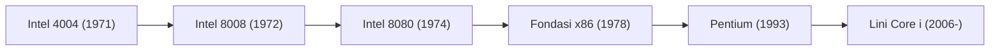

# Sejarah Perusahaan: Kisah Intel - Kelahiran Mikroprosesor dan Penguasa Silicon Valley

Dalam tatanan masyarakat modern, komputer dan chip semikonduktor telah menjadi kebutuhan primer yang sama pentingnya dengan aliran listrik atau air bersih. Dan selama lebih dari setengah abad, evolusi "otak" digital yang menggerakkan peradaban ini dipimpin oleh raksasa Silicon Valley: Intel Corporation. Dari era demokratisasi komputer pribadi (PC), ledakan internet, hingga komputasi awan dan kecerdasan buatan (AI), sejarah Intel mencerminkan sejarah evolusi teknologi informasi modern itu sendiri.

Artikel ini menyajikan ulasan menyeluruh mengenai perjalanan epik Intel: dari pendiriannya di Mountain View, penemuan mikroprosesor pertama di dunia, penetapan Hukum Moore, keputusan putar haluan bisnis yang dramatis, hingga strategi IDM 2.0 di era kecerdasan buatan.

## 1. Fajar Silicon Valley dan Berdirinya Intel (1968)

Kisah Intel berawal pada tahun 1968 di Mountain View, California. Dua figur kunci dari Fairchild Semiconductor — Robert Noyce (salah satu penemu sirkuit terpadu) dan Gordon Moore (ahli kimia fisik terkemuka) — merasa jenuh dengan birokrasi korporasi dan memutuskan mendirikan usaha mandiri.

Didukung pendanaan awal dari investor ventura legendaris Arthur Rock melalui proposal bisnis yang hanya beberapa halaman, mereka menamai perusahaan baru ini "Intel" — singkatan dari **"Integrated Electronics"**. Tak lama setelah berdiri, Andy Grove, seorang doktor teknik kimia yang kelak menjadi mesin penggerak operasional perusahaan, bergabung ke dalam tim. Terbentuklah trio kepemimpinan paling tangguh dalam sejarah Silicon Valley: Noyce (pemimpin visioner), Moore (jenius teknologi), dan Grove (eksekutor disiplin dan tanpa kompromi).

Fokus awal Intel bukanlah mikroprosesor, melainkan penggantian memori inti magnetik komputer lama dengan **memori semikonduktor**. Langkah ini terbukti jitu: pada tahun 1970, Intel meluncurkan "Intel 1103", chip memori DRAM (Dynamic Random-Access Memory) komersial pertama di dunia yang sukses besar di pasar dan mengukuhkan posisi Intel sebagai pemimpin pasar memori dunia.

## 2. Penemuan Mikroprosesor: Revolusi Tak Terduga yang Mengubah Dunia (1971)

Titik balik terpenting dalam sejarah teknologi modern terjadi pada tahun 1971. Perusahaan pembuat kalkulator asal Jepang, Busicom, memesan dua belas chip LSI (Large-Scale Integration) khusus kepada Intel untuk produk kalkulator elektronik terbarunya.

Sebagai perusahaan yang masih berkembang, Intel kekurangan tenaga insinyur untuk mendesain dua belas sirkuit khusus secara bersamaan. Insinyur Ted Hoff, Federico Faggin, Stan Mazor, serta insinyur Busicom Masatoshi Shima kemudian mencetuskan ide brilian:  
*Alih-alih membuat sirkuit perangkat keras kaku untuk setiap fungsi yang berbeda, mengapa tidak merancang satu chip komputasi sentral serbaguna yang fungsinya dapat diprogram berulang kali menggunakan perangkat lunak?*

Gagasan ini melahirkan mikroprosesor komersial chip tunggal pertama di dunia: **Intel 4004** pada November 1971. Mengemas sekitar 2.300 transistor di atas silikon seukuran kuku, chip 4-bit ini sanggup menyamai daya hitung komputer mainframe berukuran satu ruangan penuh pada dekade sebelumnya.

Intel segera mengembangkan chip 8-bit 8008 (1972) dan 8080 (1974). Intel 8080 menjadi otak penggerak komputer pribadi pertama, Altair 8800, yang memicu Bill Gates mendirikan Microsoft dan Steve Jobs merakit komputer Apple I.

## 3. Hukum Moore sebagai Kompas Kemajuan Teknologi

Perjalanan Intel tidak dapat dilepaskan dari **Hukum Moore**. Dirumuskan oleh Gordon Moore pada tahun 1965, observasi ini menyatakan bahwa jumlah transistor pada sebuah chip silikon akan berlipat ganda kira-kira setiap 18 hingga 24 bulan, yang melipatgandakan kinerja sekaligus menekan biaya per transistor.

$$
P = 2^{rac{t}{1.5}}
$$

*(dengan $P$ melambangkan kepadatan transistor dan $t$ melambangkan waktu dalam tahun)*

Hukum Moore bukan sekadar ramalan ilmiah, melainkan cetak biru dan kompas penggerak seluruh industri semikonduktor dunia. Demi menjaga ritme ketat ini, Intel menginvestasikan miliaran dolar setiap tahun untuk riset mendasar dan pembangunan pabrik perintis (fabs), memimpin laju teknologi komputasi selama puluhan tahun.

## 4. Manuver Penyelamatan: Meninggalkan Bisnis Memori Demi CPU (1980-an)

Pada awal dekade 1980-an, Intel menghadapi krisis eksistensial terberat. Korporasi manufaktur Jepang (NEC, Toshiba, Hitachi) membanjiri pasar global dengan chip DRAM berkualitas prima berbiaya rendah. Bisnis memori yang menjadi tulang punggung Intel merugi besar.

Di tengah situasi genting tersebut, terjadilah dialog legendaris antara Andy Grove dan Gordon Moore:  
*Grove: "Seandainya kita dipecat oleh dewan direksi dan mereka membawa CEO baru, apa yang akan dia lakukan?"*  
*Moore: "Dia pasti akan segera menutup bisnis memori."*  
*Grove: "Kalau begitu, mengapa kita tidak melangkah keluar pintu itu, masuk kembali, dan melakukannya sendiri?"*

Pada tahun 1985, Intel mengambil keputusan pahit menghentikan total lini produksi DRAM dan memusatkan seluruh sumber daya serta modalnya pada mikroprosesor (CPU).

Keputusan ini membuahkan hasil luar biasa. Pada tahun 1981, IBM memilih prosesor 16-bit Intel 8088 sebagai inti komputasi untuk IBM PC pertamanya. Seiring menjamurnya komputer klon yang kompatibel dengan IBM PC di seluruh dunia, arsitektur "x86" milik Intel menjadi standar de facto industri komputasi pribadi. Lewat kampanye pemasaran agresif "Operation CRUSH", Intel menaklukkan para pesaingnya seperti Motorola dan mengukuhkan monopoli pasar mikroprosesor.

## 5. Kejayaan Aliansi Wintel dan Fenomena "Intel Inside" (1990-an)

Dekade 1990-an adalah masa keemasan supremasi Intel. Kemitraan strategis antara sistem operasi Windows milik Microsoft dan prosesor x86 milik Intel — dikenal sebagai **Aliansi Wintel** — menguasai lebih dari 90% pasar PC global. Generasi 386, 486, dan Pentium menjadi motor penggerak maraknya internet dan era multimedia.

Pada tahun 1993, Intel meluncurkan nama "Pentium". Langkah ini diambil karena angka numerik murni tidak dapat didaftarkan sebagai merek dagang, menjadikan Pentium merek chip paling terkenal di dunia.

Keberhasilan ini diperkuat oleh kampanye pemasaran legendaris **"Intel Inside"** yang dimulai pada tahun 1991. Dengan memberikan subsidi iklan kepada para produsen PC yang memasang logo dan nada jingle khas lima nada milik Intel, perusahaan berhasil menanamkan keyakinan bahwa komputer berkualitas tinggi harus bertenaga Intel. Hal ini memberi Intel kekuatan tawar menawar harga yang mutlak terhadap seluruh produsen komputer.

Andy Grove mengabadikan filosofi manajemen tangguhnya selama era ini dalam buku klasiknya, *Only the Paranoid Survive*.

## 6. Era Multi-Core dan Persaingan Sengit Melawan AMD (2000-an)

Pada awal 2000-an, Intel tersandung ambisi arsitektur "NetBurst (Pentium 4)" yang memaksakan peningkatan clock speed melampaui 4 GHz, hingga menabrak "dinding panas" (thermal wall) berupa konsumsi daya dan panas yang berlebihan.

Pesaing abadinya, AMD, memanfaatkan celah ini melalui prosesor Athlon 64 dan Opteron, lebih dulu memperkenalkan instruksi 64-bit (AMD64) serta pengontrol memori terintegrasi yang merebut pangsa pasar desktop dan server.

Intel bangkit berkat terobosan tim risetnya di Haifa, Israel. Meninggalkan perlombaan clock speed, Intel beralih ke arsitektur **Multi-Core** dan efisiensi energi lewat arsitektur "Core". Dirilis pada tahun 2006, prosesor "Core 2 Duo" merebut kembali tahta performa komputasi dunia.

Sejak saat itu, Intel mengadopsi model pengembangan **"Tick-Tock"**: bergantian setiap tahun antara penyusutan fabrikasi (Tick) dan peluncuran arsitektur mikro baru (Tock), menjaga keunggulan kompetitifnya selama satu dekade.

## 7. Ketinggalan di Era Ponsel Pintar dan Kendala Fabrikasi (2010-an)

Meski dominan di PC dan server, dekade 2010-an membawa kekeliruan strategis terbesar Intel: melewatkan revolusi ponsel pintar. Saat Steve Jobs menawarkan kontrak produksi prosesor untuk iPhone generasi pertama, manajemen Intel menolaknya karena menganggap volumenya tidak menguntungkan. Akibatnya, pasar mobile sepenuhnya dikuasai arsitektur ARM, Qualcomm, dan Apple.

Selain itu, keunggulan mutlak Intel dalam teknologi fabrikasi silikon mulai goyah. Penundaan berkepanjangan pada proses litografi 14nm dan 10nm merusak ritme Hukum Moore.

Di saat bersamaan, AMD bangkit kembali di bawah kepemimpinan Dr. Lisa Su lewat arsitektur Zen (Ryzen/EPYC). Pada saat yang sama, TSMC dari Taiwan berhasil memimpin penerapan teknologi Extreme Ultraviolet (EUV), melampaui Intel dalam kerapatan fabrikasi. Model bisnis terintegrasi (IDM) Intel pun menghadapi ujian berat.

## 8. Kebangkitan: IDM 2.0, Bisnis Foundry, dan Era AI (2020-an–Sekarang)

Pada tahun 2021, di tengah situasi kritis, Intel mengangkat kembali Pat Gelsinger — insinyur kawakan yang pernah menjabat sebagai CTO pertama Intel di masa kejayaannya — sebagai CEO. Gelsinger meluncurkan peta jalan pemulihan yang berani: **IDM 2.0**.

Strategi ini bertumpu pada tiga pilar:
1. **Merebut Kembali Kepemimpinan Fabrikasi**: Menuntaskan target "5 node proses dalam 4 tahun", berpuncak pada proses Intel 18A dengan transistor RibbonFET dan penghantaran daya dari sisi belakang (PowerVia).
2. **Membuka Layanan Pengecoran (Intel Foundry)**: Membuka fasilitas pabrik bagi klien luar dengan investasi ratusan miliar dolar di Ohio, Arizona, dan Eropa guna menyaingi TSMC.
3. **Pemanfaatan Pabrik Eksternal**: Memanfaatkan pabrik eksternal secara fleksibel untuk efisiensi produksi.

Dalam persaingan kecerdasan buatan (AI) yang dipimpin oleh GPU NVIDIA, Intel meluncurkan lini akselerator "Gaudi" serta memelopori era "AI PC" lewat prosesor Core Ultra yang dilengkapi NPU bawaan.

Didukung oleh pendanaan Undang-Undang CHIPS Amerika Serikat dan inisiatif kemandirian semikonduktor Eropa, Intel kini memegang peranan krusial sebagai pilar strategis keamanan rantai pasok teknologi barat.

## Kesimpulan: Raksasa Silikon yang Membangun Dunia Digital

Hampir enam dekade perjalanan Intel membuktikan ketangguhan melawan hukum fisika dan dinamika pasar. Dari krisis memori di era 1980-an hingga pergeseran ke era multi-core, Intel selalu berhasil bangkit melalui keunggulan rekayasa teknologi dan keberanian kepemimpinan.

Dari 2.300 transistor pada chip 4004 hingga puluhan miliar transistor pada era sub-nanometer saat ini, sejarah Intel adalah sejarah kemajuan peradaban digital dunia. Dalam babak baru IDM 2.0 dan era kecerdasan buatan, raksasa Silicon Valley ini akan terus membentuk masa depan komputasi global.
