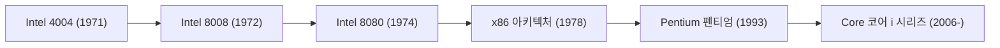

# 기업사: 인텔(Intel)의 역사 - 마이크로프로세서의 탄생과 실리콘밸리 제국의 흥망성쇠

현대 인류 사회에서 컴퓨터와 반도체 칩은 공기와 전기처럼 문명을 지탱하는 없어서는 안 될 필수 인프라가 되었습니다. 그리고 지난 반세기 이상 이 거대한 디지털 문명의 심장이자 '두뇌'의 진화를 진두지휘해 온 장본인이 바로 실리콘밸리의 상징, 인텔(Intel Corporation)입니다. 개인용 컴퓨터의 태동부터 초고속 인터넷 혁명, 데이터센터 클라우드, 그리고 생성형 AI에 이르기까지 인텔의 기업 역사는 곧 현대 IT 산업의 진화 역사 그 자체였습니다.

본 기사에서는 창업기부터 마이크로프로세서의 발명, 무어의 법칙 수립, 메모리에서 CPU로의 생사결단 전환, 윈텔(Wintel) 제국의 지배, 그리고 IDM 2.0과 AI 시대에 맞선 치열한 부활의 도정까지 인텔의 웅대한 역사를 입체적으로 조명합니다.

## 1. 실리콘밸리의 새벽과 인텔의 탄생 (1968년)

인텔의 대서사시는 1968년 미국 캘리포니아주 마운틴뷰에서 시작되었습니다. 반도체의 요람이었던 페어차일드 반도체의 핵심 기둥이었던 로버트 노이스(집적회로 공동 발명자)와 고든 무어(물리화학자)는 관료주의화된 회사를 떠나 새로운 창업을 결심했습니다.

전설적인 벤처투자자 아서 록(Arthur Rock)의 전폭적인 지지를 받아 단 몇 장짜리 사업계획서로 자금을 조달한 그들은 회사의 이름을 '통합 전자공학'을 뜻하는 **'Integrated Electronics'** 의 약자를 따서 '인텔(Intel)'로 정했습니다. 창업 직후 화학공학 박사인 앤디 그로브(Andy Grove)가 합류하면서, 노이스(대외적 얼굴이자 카리스마 리더), 무어(기술적 천재), 그로브(철저하고 무자비한 경영자)로 구성된 실리콘밸리 역사상 최강의 경영 삼총사(트로이카)가 완성되었습니다.

초창기 인텔의 목표는 당시 컴퓨터의 주류 기억장치였던 자성 코어 메모리를 대체할 **'반도체 메모리'** 의 개발이었습니다. 그들의 통찰은 적중하여, 1970년 출시된 세계 최초의 상용 DRAM인 'Intel 1103'은 전 세계 컴퓨터 시장을 강타했습니다. 이 기념비적인 성공으로 인텔은 일약 반도체 메모리의 글로벌 선두 주자로 우뚝 섰습니다.

## 2. 마이크로프로세서의 발명: 우연이 낳은 세기의 대혁명 (1971년)

인텔과 인류 기술 역사상 가장 위대한 분기점은 1971년에 찾아왔습니다. 계기는 일본의 전자계산기 제조사 비지콤(Busicom)의 의뢰였습니다. 비지콤은 신형 프로그래머블 계산기를 개발하기 위해 인텔에 12종의 전용 맞춤형 LSI(대규모 집적회로) 칩 설계를 주문했습니다.

하지만 당시 인텔은 12개의 전용 칩을 동시에 개발할 만한 엔지니어링 여력이 부족했습니다. 이에 테드 호프(Ted Hoff), 페데리코 파진(Federico Faggin), 스탠 메이저(Stan Mazor), 그리고 비지콤의 시마 마사토시(島正利)는 발상을 전환하여 완전히 새로운 접근법을 제안했습니다.  
*“용도마다 전용 하드웨어 회로를 따로 설계할 것이 아니라, 하나의 범용 연산 칩을 만들고 소프트웨어 프로그램을 바꿔가며 어떤 계산이든 수행하게 만들자.”*

그 결과 탄생한 것이 세계 최초의 상용 단일칩 마이크로프로세서인 **'인텔 4004(Intel 4004)'** 였습니다(1971년 11월). 손톱만 한 실리콘 기판 위에 약 2,300개의 트랜지스터를 집적한 이 4비트 칩은 수십 년 전 방 하나를 가득 채우던 진공관 메인프레임 컴퓨터와 맞먹는 연산력을 자랑했습니다.

이후 인텔은 8비트 '8008'(1972년)과 '8080'(1974년)을 연이어 선보였습니다. 특히 인텔 8080은 최초의 개인용 컴퓨터라 불리는 알테어 8800(Altair 8800)의 심장으로 채택되면서 빌 게이츠가 마이크로소프트를 창업하고 스티브 잡스가 애플 I을 만드는 도화선이 되었습니다.

## 3. 무어의 법칙: 전 세계 기술을 이끈 자기충족적 예언

인텔을 논할 때 결코 빼놓을 수 없는 개념이 바로 **'무어의 법칙(Moore's Law)'** 입니다. 1965년 고든 무어가 발표한 이 경험적 관찰은 "반도체 칩에 집적되는 트랜지스터의 수는 대략 18개월에서 24개월마다 두 배로 증가한다"는 것이었습니다.

$$
P = 2^{rac{t}{1.5}}
$$

*(P는 트랜지스터 밀도, t는 경과 연수를 나타내는 수식)*

무어의 법칙은 단순한 예측을 넘어 인텔과 반도체 산업 전체의 나침반이자 '자기충족적 예언'으로 기능했습니다. 인텔은 이 무자비한 속도 경쟁을 유지하기 위해 매년 수십억 달러의 R&D 비용과 최첨단 제조공장(Fab) 투자를 아끼지 않았으며, 수십 년간 글로벌 컴퓨팅의 페이스메이커로 군림했습니다.

## 4. 결단의 승부수: '메모리'에서 'CPU'로의 생사 전환 (1980년대)

1980년대에 접어들며 인텔은 절체절명의 존망 위기를 맞았습니다. 일본 반도체 기업들(NEC, 도시바, 히타치 등)이 정부의 지원과 높은 수율, 완벽한 품질을 무기로 글로벌 DRAM 시장에 덤핑 공세를 퍼부으면서 인텔의 모태 사업이던 메모리 사업부는 천문학적인 적자를 냈습니다.

이때 CEO 고든 무어와 사장 앤디 그로브 사이에 전설적인 대화가 오갔습니다.  
*그로브: "만약 우리가 이사회에서 해고당하고 새 CEO가 온다면 그 사람은 무엇을 할 것 같소?"*  
*무어: "당연히 메모리 사업에서 손을 떼겠지."*  
*그로브: "그렇다면 우리가 저 문밖으로 걸어 나갔다가 다시 돌아와서 직접 그 일을 합시다!"*

1985년, 인텔은 창립 기반이었던 DRAM 사업에서 완전히 철수하고 모든 인력과 자본을 마이크로프로세서(CPU)에 몰빵하는 뼈아픈 전략적 결단을 단행했습니다.

마침 운명의 여신도 인텔의 편이었습니다. 1981년 출시된 IBM의 첫 PC(IBM PC)의 메인 프로세서로 인텔의 16비트 '8088'이 채택된 것입니다. IBM PC의 폭발적인 대중화와 함께 인텔의 'x86' 명령어 세트 아키텍처는 전 세계 PC의 표준으로 굳건히 자리 잡았습니다. 인텔은 모토로라 등을 완벽히 따돌리는 전사적 마케팅 작전 '오퍼레이션 크러시(Operation CRUSH)'를 전개하며 CPU 시장의 절대 패권을 거머쥐었습니다.

## 5. 윈텔(Wintel) 황금기와 '인텔 인사이드(Intel Inside)' 신화 (1990년대)

1990년대는 마이크로소프트의 윈도우 OS와 인텔의 x86 CPU가 결합한 **'윈텔(Wintel) 동맹'** 이 전 세계 PC 시장을 완전히 장악한 황금기였습니다. 386, 486을 거쳐 1993년 출시된 '펜티엄(Pentium)' 프로세서는 단순 숫자 번호로는 상표 등록이 불가능하다는 법적 한계를 극복하기 위해 만든 고유 브랜드로, 전 세계 소비자들에게 고성능 PC의 대명사로 각인되었습니다.

이를 기폭제로 삼은 것이 1991년부터 시작된 역사적인 **'인텔 인사이드(Intel Inside)'** 마케팅 캠페인이었습니다. 컴퓨터 케이스 속에 숨어 있던 부품 제조사가 완제품 PC 제조사의 광고비를 보조해 주는 대가로 로고를 노출하는 혁신적인 마케팅을 펼쳐, "인텔 칩이 들어가야 좋은 컴퓨터"라는 절대적 신뢰를 구축했습니다. 이를 통해 인텔은 PC 제조사들을 완벽히 장악하는 초우량 가격결정권을 행사했습니다.

이 시기 인텔을 이끌었던 앤디 그로브의 명저 《편집광만이 살아남는다(Only the Paranoid Survive)》는 인텔 특유의 치열한 생존 문화와 위기관리 철학을 대변합니다.

## 6. 멀티코어 혁명과 AMD와의 혈투 (2000년대)

2000년대 초반, 인텔은 동작 클럭(GHz)을 4GHz 이상으로 끌어올리는 데 집착한 '넷버스트(NetBurst, 펜티엄 4)' 아키텍처를 밀어붙이다가 물리학의 한계인 '발열과 전력 소비의 벽'에 부딪혔습니다.

이 틈을 타 오랜 라이벌인 AMD가 애슬론 64와 옵테론을 앞세워 64비트 명령어(AMD64)와 내장 메모리 컨트롤러를 최초로 도입하며 인텔의 목을 죄어왔습니다.

위기에 몰린 인텔을 구원한 것은 이스라엘 하이파 연구소 팀이 개발한 **'코어(Core)' 아키텍처** 였습니다. 클럭 속도 만능주의를 폐기하고, 하나의 칩에 여러 개의 연산 코어를 집적하는 '멀티코어화'와 높은 에너지 효율(IPC)로 패러다임을 바꾼 것입니다. 2006년 출시된 '코어 2 듀오(Core 2 Duo)'는 압도적인 성능으로 AMD를 일거에 제압하고 왕좌를 되찾았습니다.

이후 인텔은 미세공정 전환(Tick)과 아키텍처 혁신(Tock)을 1년마다 번갈아 수행하는 **'틱-톡(Tick-Tock) 모델'** 을 확립하며 10여 년간 무적의 기술 독주를 이어갔습니다.

## 7. 스마트폰 혁명의 실기와 미세공정의 덫 (2010년대)

그러나 찬란했던 영광 뒤에서 위기의 싹이 자라고 있었습니다. 인텔의 뼈아픈 실책은 '스마트폰의 급부상'을 놓친 것이었습니다. 2000년대 중반 스티브 잡스가 초기 아이폰의 칩 생산을 타진했으나, 인텔 경영진은 물량과 수익성이 부족할 것이라 오판하여 이를 거절했습니다. 그 결과 모바일 시장은 저전력 ARM 아키텍처와 퀄컴, 애플에 완전히 빼앗겼습니다.

설상가상으로 인텔의 최대 자부심이던 '세계 최고 수준의 자체 제조공정 기술'에도 치명적인 균열이 생겼습니다. 14나노에서 10나노 공정 전환 과정에서 수년간 기술적 난관에 봉착하며 오랫동안 지켜온 무어의 법칙이 붕괴된 것입니다.

그 사이 리사 수가 이끄는 AMD가 혁신적인 Zen 아키텍처(라이젠)로 부활했고, 순수 파운드리 기업인 대만의 TSMC가 극자외선(EUV) 노광장비를 선제 도입하며 미세공정에서 인텔을 완전히 추월하는 역사적 역전극이 벌어졌습니다. 인텔이 고수해 온 '자체 설계+자체 생산'의 IDM(종합반도체기업) 모델은 거대한 구조적 한계에 부딪혔습니다.

## 8. 부활을 향한 승부수: IDM 2.0과 AI 시대의 도전 (2020년대〜현재)

2021년, 창사 이래 최대의 위기 속에서 인텔의 황금기를 이끌었던 정통 엔지니어 출신 팻 겔싱어(Pat Gelsinger)가 구원투수 CEO로 전격 복귀했습니다. 그는 인텔을 재건하기 위한 승부수로 **'IDM 2.0'** 전략을 선포했습니다.

이 전략은 세 가지 핵심 축으로 구성됩니다:
1. **공정 리더십 탈환**: "4년 내 5개 공정 노드 진입"이라는 초유의 로드맵을 추진하며 차세대 'Intel 18A' 공정에서 TSMC를 앞지르겠다는 목표.
2. **파운드리 사업 본격 진출(Intel Foundry)**: 미국 오하이오, 애리조나 및 유럽에 수백억 달러 규모의 초대형 팹을 건설하여 외부 팹리스 고객을 위한 파운드리 서비스 제공.
3. **외부 파운드리 유연 활용**: 핵심 제품에 TSMC 공정을 병행 활용하는 유연성 확보.

동시에 생성형 AI 붐으로 촉발된 슈퍼컴퓨팅 경쟁에서 엔비디아가 GPU로 독점적 우위를 굳힌 가운데, 인텔은 가우디(Gaudi) AI 가속기와 온디바이스 신경망처리장치(NPU)를 탑재한 '인텔 코어 Ultra(AI PC)' 시리즈를 선보이며 대반격을 시도하고 있습니다.

나아가 글로벌 공급망 안보와 미·중 기술 패권 전쟁 속에서 미국 정부의 반도체 지원법(CHIPS Act)에 힘입어 인텔은 단순한 기업을 넘어 서구 경제와 군사 안보를 떠받치는 '절대 실패해서는 안 될 전략 자산'으로 그 중요성이 더욱 부각되고 있습니다.

## 맺음말: 한계에 도전하며 시대를 빚어낸 거인

인텔의 60년 역사는 물리학의 장벽과 치열한 시장 경쟁 속에서 끊임없이 자신의 한계를 시험해 온 여정이었습니다. 1980년대 메모리 위기, 2000년대 발열의 벽, 2020년대 공정 지연이라는 절망적 위기 속에서도 인텔은 뼈를 깎는 혁신과 순수한 공학적 열정으로 번번이 기적처럼 부활했습니다.

손톱만 한 4004 칩의 2,300개 트랜지스터에서 시작하여 오늘날 나노미터의 미시 세계에서 수백억 개의 전자 소자를 조율하는 거인으로 성장한 인텔. 격변하는 AI와 파운드리 패권 전쟁 속에서도 기술 혁신을 향한 그들의 고집스러운 여정은 계속해서 인류의 미래를 빚어갈 것입니다.
