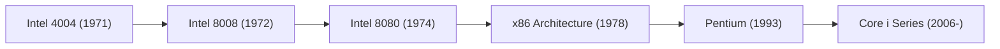

# 企業史: Intelの歴史 - マイクロプロセッサの誕生とシリコンバレーの覇者

現代社会において、コンピューターは水や電気と同じように不可欠なインフラとなっています。そして、その心臓部である「頭脳」の進化を半世紀以上にわたって牽引してきたのが、シリコンバレーの巨人・Intel（インテル）です。パーソナルコンピューターの普及からインターネットの爆発的な成長、そしてクラウドコンピューティングやAI（人工知能）に至るまで、Intelの歴史はそのまま現代IT産業の進化の歴史と重なります。

本記事では、Intelの創業からマイクロプロセッサの発明、幾多の危機と劇的な戦略転換、そして現在に至るまでの壮大な軌跡を、技術的・ビジネス的視点から詳細に紐解いていきます。

## 1. シリコンバレーの夜明けとIntelの誕生（1968年）

Intelの物語は、1968年のカリフォルニア州マウンテンビューから始まります。当時、半導体産業の中心であったフェアチャイルド・セミコンダクター社で中核的な役割を果たしていたロバート・ノイス（集積回路の共同発明者）とゴードン・ムーア（化学者）は、官僚主義化しつつあった同社に見切りをつけ、独立を決意しました。

彼らは伝説的なベンチャーキャピタリストであるアーサー・ロックの支援を受け、わずか数ページの事業計画書で資金を調達しました。社名は「Integrated Electronics（集積電子工学）」を略して「Intel」と名付けられました。創業直後には、後に「インテルの心臓」と呼ばれることになるアンディ・グローブも加わり、ノイス（ビジョナリーで対外的な顔）、ムーア（技術の天才）、グローブ（厳格で容赦のない経営者）という、シリコンバレー史上最強と呼ばれる経営トロイカ体制が完成しました。

創業当初のIntelが目標としたのは、当時主流だった磁気コアメモリに代わる「半導体メモリ」の開発でした。彼らの読みは的中し、1970年に発売された世界初の商用DRAM「1103」は大ヒットを記録。この成功により、Intelは瞬く間に急成長企業へと押し上げられ、メモリチップの世界的リーダーとしての地位を確立しました。

## 2. マイクロプロセッサの発明：偶然から生まれた世紀の大発明（1971年）

Intelの歴史、いや人類の技術史における最大の転換点は1971年に訪れます。日本の計算機メーカー「ビジコン」からの依頼がきっかけでした。ビジコン社は新型のプログラム可能な電卓を開発するため、Intelに12種類の専用LSI（大規模集積回路）の設計を依頼しました。

しかし、当時のIntelはまだ小規模であり、それだけの数のカスタムチップを設計するエンジニアリングリソースが不足していました。そこで、エンジニアのテッド・ホフ、フェデリコ・ファジン、スタン・メイザー、そしてビジコンの嶋正利らは、全く新しいアプローチを提案します。それは、「用途ごとに専用の回路をハードウェアとして設計するのではなく、汎用的なハードウェアを作り、ソフトウェア（プログラム）を書き換えることでどんな計算もできるようにする」という革新的なアイデアでした。

こうして誕生したのが、世界初の商用マイクロプロセッサ「Intel 4004」です。指先ほどの小さなシリコンチップ上に約2,300個のトランジスタを集積したこのチップは、当時の巨大なメインフレームコンピュータに匹敵する計算能力を持っていました。

その後、Intelは8ビットの「8008」、「8080」とマイクロプロセッサの性能を急速に向上させていきます。特に8080は、世界初のパーソナルコンピュータとも言われる「Altair 8800」に採用され、のちにビル・ゲイツやスティーブ・ジョブズらが活躍するPC革命の火蓋を切ることになります。

## 3. ムーアの法則と技術の牽引

Intelの成長を語る上で絶対に欠かせないのが「ムーアの法則」です。共同創業者のゴードン・ムーアが1965年に提唱したこの経験則は、「半導体回路の集積密度は1年半から2年で2倍になる」というものです。

$$
P = 2^{\frac{t}{1.5}}
$$

（※Pはトランジスタ数、tは経過年数を示す簡略化されたモデル）

ムーアの法則は単なる未来予測にとどまらず、Intel、そして半導体業界全体の「自己実現的予言（目標値）」としての役割を果たしました。Intelは常にこの法則を維持するために巨額の資金を研究開発と最先端の製造設備（ファブ）に投資し続け、競合他社を圧倒する微細化技術で業界のペースメーカーとなり続けました。

## 4. 決死の戦略転換：「メモリ」から「CPU」へ（1980年代）

1980年代に入ると、Intelは絶体絶命の危機に直面します。日本企業（NEC、東芝、日立など）が歩留まりの高さによる圧倒的な品質と低価格でDRAM市場を席巻し、Intelの祖業であり主力事業であったメモリ部門は深刻な大赤字に陥ったのです。

この時、社長のアンディ・グローブと会長のゴードン・ムーアの間で交わされた伝説的な会話があります。
グローブ：「もし我々がクビになり、取締役会が新しいCEOを連れてきたら、彼は何をすると思う？」
ムーア：「メモリ事業から撤退するだろうね。」
グローブ：「だったら、我々自身でドアから外に出て、もう一度戻ってきてそれをやろうじゃないか。」

1985年、IntelはDRAM市場からの完全撤退を決断し、リソースのすべてをマイクロプロセッサ（CPU）に集中させるという極めて痛みを伴う戦略転換を行いました。

時を同じくして、Intelは巨大な勝利を手にしていました。1981年に発売されたIBM初のパーソナルコンピュータ（IBM PC）の頭脳として、Intelの「8088」プロセッサが採用されたのです。IBM PCの大成功と普及により、Intelの「x86」アーキテクチャはPC業界の事実上の標準（デファクトスタンダード）となりました。さらに、競合のモトローラを完全に打ち負かすための全社的マーケティング作戦「オペレーション・クラッシュ」を展開し、プロセッサ市場での覇権を決定づけました。

## 5. ウィンテル（Wintel）の時代と「Intel Inside」（1990年代）

1990年代は、MicrosoftのWindows OSとIntelのプロセッサを組み合わせた「Wintel（ウィンテル）」連合がPC業界を完全に支配した黄金期です。「Intel 386」「Intel 486」と世代を重ねるごとにPCの性能は飛躍的に向上し、マルチメディアやインターネットの普及をハードウェアの側面から支えました。

1993年、Intelは画期的なプロセッサ「Pentium（ペンティアム）」を発表します。単なる数字の型番（586など）では商標登録ができないという問題を回避するために作られたこのブランド名は、瞬く間に世界中に認知されました。

それを決定的に後押ししたのが、1991年に始まった歴史的なマーケティングキャンペーン「Intel Inside（インテル、入ってる）」です。PCの中に隠れた部品メーカーに過ぎなかったIntelが、直接消費者にブランドをアピールし、「Intel製のCPUが搭載されているPCこそが高性能で安心である」という認識を植え付けることに成功しました。これにより、IntelはPCメーカーに対して圧倒的な価格交渉力と主導権を持つようになりました。

この時代を強力なリーダーシップで牽引したアンディ・グローブの著書『Only the Paranoid Survive（パラノイアだけが生き残る）』は、Intelの厳しい競争文化と危機管理の哲学を象徴しています。

## 6. マルチコアの時代とAMDとの激闘（2000年代）

2000年代前半、Intelはクロック周波数の向上を至上命題とする「NetBurst」アーキテクチャ（Pentium 4など）を推進していました。しかし、クロック周波数を無理に引き上げるアプローチは、莫大な消費電力と発熱を伴い、物理的な「熱の壁」にぶつかってしまいます。

この時、長年のライバルであるAMD（アドバンスト・マイクロ・デバイセズ）が「Athlon 64」やサーバー向けの「Opteron」プロセッサで、Intelの弱点を見事に突きました。AMDはIntelより先に64ビット命令セット（AMD64）を普及させ、一時はIntelの市場シェアを深刻に脅かしました。

この技術的行き詰まりと競争の危機を打破したのが、イスラエルのハイファ研究所のチームが設計した「Core」アーキテクチャです。クロック周波数至上主義を捨て、1つのチップに複数の演算コアを搭載する「マルチコア化」と、クロックあたりの命令実行数（IPC）および電力効率の最適化へと舵を切りました。2006年に登場した「Core 2 Duo」は圧倒的な性能と省電力性を誇り、Intelは再び王座を奪還しました。

この頃から、Intelは「Tick-Tock（チックタック）モデル」と呼ばれる開発戦略を採用します。製造プロセスの微細化（Tick）と新アーキテクチャの導入（Tock）を1年ごとに交互に繰り返すことで、安定的かつ高速に進化を続けるという驚異的な実行力を世界に見せつけました。

## 7. モバイルの波と製造技術の停滞（2010年代）

しかし、2010年代に入るとIntelに再び暗雲が立ち込めます。最大の誤算は「スマートフォンの台頭」を見逃したことでした。Appleが初代iPhoneを開発する際、プロセッサの供給を打診されましたが、当時のIntel経営陣は「数量が出ても利益が見込めない」としてこれを断ってしまいました。結果として、モバイル市場は省電力性に優れるARMアーキテクチャを採用する企業（Qualcomm、Apple自身など）に完全に支配され、Intelは巨大なパラダイムシフトを取り逃がすことになります。

さらに、Intelの最大のアイデンティティであった「世界最高の製造プロセス技術」にも陰りが見え始めます。14nmプロセス、そして特に10nmプロセスの立ち上げで数年単位の深刻な遅延が発生し、長年維持してきた「ムーアの法則」のペースが完全に崩壊しました。

その隙を突き、AMDがリサ・スーCEOの指揮下で画期的な「Ryzen（Zenアーキテクチャ）」プロセッサを投入して猛烈な巻き返しを図ります。同時に、設計を持たず製造に特化するファウンドリ専業のTSMC（台湾積体電路製造）が、EUV（極端紫外線）リソグラフィ技術をいち早く実用化し、製造プロセスにおいてついにIntelを追い抜くという歴史的事態が発生しました。Intelは「自社で設計し、自社の工場で製造する」という垂直統合型デバイスメーカー（IDM）としての優位性を失いかけていました。

## 8. 再生への挑戦：IDM 2.0とAI時代への対応（2020年代〜現在）

組織の士気低下と技術的停滞が続く危機的状況にあった2021年、Intelの黄金期を初代CTOとして支えた生粋のエンジニア、パット・ゲルシンガーがCEOとして復帰します。彼はIntelを再建するため、「IDM 2.0」という極めて大胆な新戦略を打ち出しました。

この戦略の核心は、自社工場での製造技術を再び世界トップレベルに引き上げる（「5年間で4つのプロセスノードを進める」という野心的な目標）ことと並行して、「Intel Foundry Services（IFS、現Intel Foundry）」を設立し、他社のチップを受託製造するファウンドリ・ビジネスに本格参入することです。TSMCやSamsungに対抗するため、アメリカのオハイオ州やアリゾナ州、さらにヨーロッパに巨額の投資を行って最先端工場を建設しています。

同時に、IT業界全体が生成AI（ジェネレーティブAI）の爆発的ブームに沸く中、データセンター向けGPUでNVIDIAが圧倒的な覇権を握っています。Intelもこの波に乗るべく、AIアクセラレータ「Gaudi」シリーズの展開や、PC側にAI処理能力を持たせる「AI PC」向けプロセッサ（Core Ultraプロセッサシリーズ）を市場に投入し、巻き返しを図っています。

さらに、米中対立などの地政学的リスクが高まる中、半導体の国内製造回帰を目指すアメリカ政府の「CHIPS法（CHIPS and Science Act）」による巨額の補助金もIntelの追い風となっています。Intelはもはや一企業にとどまらず、西側諸国の経済的・軍事的安全保障上の観点からも「絶対に失敗が許されない国家戦略企業」としての色彩を強めています。

## 結び：限界に挑み続けるシリコンバレーの巨人

Intelの約60年にわたる歴史は、決して順風満帆なものではありませんでした。物理学の壁、強力なライバルの出現、そしてモバイルやAIといった市場の劇的なパラダイムシフトによって、何度も存亡の危機に立たされました。しかしその度に、痛みを伴う決断と革新的なテクノロジーによって、不死鳥のように蘇ってきました。

「トランジスタをより小さく、より多く、より安く、より速くする」というシンプルで途方もなく困難な使命を追求し続けたIntel。シリコンバレーの荒野から始まり、現代のデジタル社会の基礎を築き上げたこの巨人の歩みは、今後もファウンドリ事業の成否やAI時代の覇権争いという新たな試練に直面しながら、我々の未来のテクノロジーを形作っていくことでしょう。
