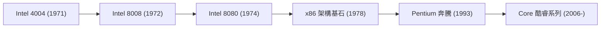

# 企業史：Intel（英特爾）發展史 - 微處理器的誕生與矽谷霸主的半世紀傳奇

在現代人類社會中，電腦與半導體晶片已經如同水和電一樣，成為了維繫文明運轉不可或缺的基礎設施。而在過去半個多世紀裡，引領這場資訊科技革命「大腦」進化的核心引擎，正是矽谷的無冕之王——英特爾（Intel Corporation）。從個人電腦的普及到網際網路的狂飆突進，再到雲端運算乃至人工智慧的爆發，英特爾的發展史，正是整個現代資訊科技文明演進史的生動縮影。

本文將從技術演進與商業競爭的雙重維度，深度復盤英特爾從創立初期、發明微處理器、確立摩爾定律，到生死戰略轉型、Wintel帝國霸權，再到如今在 IDM 2.0 與 AI 時代全力求索的壯麗征程。

## 1. 矽谷破曉與英特爾的誕生（1968年）

英特爾的傳奇始於 1968 年加利福尼亞州的山景城。當時，在半導體搖籃仙童半導體（Fairchild Semiconductor）擔任核心領袖的羅伯特·諾伊斯（Robert Noyce，積體電路共同發明者）與高登·摩爾（Gordon Moore，傑出物理化學家），因不堪忍受母公司的官僚僵化，毅然決定辭職創業。

憑藉無可匹敵的聲望與傳奇創投家阿瑟·洛克（Arthur Rock）的鼎力支持，他們僅憑一份薄薄數頁的商業計劃書便融得了啟動資金。新公司被命名為「Intel」——取自「 **Int**egrated **El**ectronics（積體電子）」的縮寫。創立伊始，化學工程博士安迪·葛洛夫（Andy Grove）迅速加盟。至此，由諾伊斯（富有遠見的精神領袖）、摩爾（深諳技術的科學泰斗）與葛洛夫（鐵血嚴苛的營運大師）構築的「管理三駕馬車」正式成型，成為矽谷史上最強悍的黃金組合。

初生的英特爾並未將目光投向當時尚顯遙遠的微處理器，而是精準鎖定了取代磁芯記憶體的「半導體記憶體」。1970 年，英特爾推出了人類歷史上首款商用動態隨機存取記憶體（DRAM）晶片——「Intel 1103」。1103 迅速擊潰了傳統的磁芯儲存介質，引發全球訂單狂潮，直接確立了英特爾作為世界記憶體晶片霸主的早期統治地位。

## 2. 微處理器的誕生：偶然孕育的世紀大發明（1971年）

英特爾乃至整個人類科技史上最偉大的轉折點降臨於 1971 年。當時，日本計算機製造商比吉康（Busicom）委託英特爾為其新款可程式化電子計算機客製化設計 12 塊專用的特殊應用積體電路（LSI）。

彼時的英特爾規模尚小，根本沒有足夠的工程資源同時並行研發 12 款高度客製化的專用晶片。面對困境，英特爾工程師特德·霍夫（Ted Hoff）、費德里科·法金（Federico Faggin）、斯坦·梅澤（Stan Mazor）與比吉康工程師島正利打破常規，提出了一項革命性的構想：  
*與其為不同運算分別設計死板的專用硬體電路，不如製造一枚通用的中央運算晶片，透過軟體編程來決定其執行的具體功能。*

這項劃時代的構想催生了人類歷史上第一款商用單晶片微處理器——**Intel 4004** （1971年11月）。這枚僅有指甲蓋大小的矽片上集成了約 2,300 個電晶體，卻擁有媲美數十年前數噸重大型主機的驚人算力。

隨後，英特爾迅速推出了 8 位元微處理器 8008（1972年）以及奠基之作 8080（1974年）。Intel 8080 成為歷史上第一台個人電腦 Altair 8800 的心臟，直接引爆了微型電腦革命，激勵了比爾·蓋茲創立微軟，並啟發了史蒂夫·賈伯斯手工打造 Apple I。

## 3. 摩爾定律：驅動全球算力狂飆的自我實現預言

探討英特爾的崛起，絕對無法脫離著名的「 **摩爾定律（Moore's Law）** 」。共同創辦人高登·摩爾於 1965 年發表經驗觀察指出：積體電路上可容納的電晶體數目，約每隔 18 至 24 個月便會增加一倍，而成本與功耗則成倍下降。

$$
P = 2^{rac{t}{1.5}}
$$

*（其中 $P$ 為電晶體密度，$t$ 為以年為單位的時間演進）*

摩爾定律絕非單純的科學定律，而是一份驅動全球半導體產業前行的「產業聖經」與自我實現預言。為了捍衛這一嚴苛的研發節奏，英特爾每年將數百億美元砸向基礎物理研發與前瞻晶圓製造產線（Fabs），數十年來始終扮演著全球半導體微細化競賽的絕對領跑者。

## 4. 決死戰略轉型：從「記憶體之王」斷腕蛻變為「CPU巨擘」（1980年代）

進入 1980 年代，英特爾遭遇了險遭滅頂的至暗時刻。日本半導體軍團（NEC、東芝、日立等）憑藉國家級協同、精實製造帶來的極高良率和極低成本，發動了血腥的 DRAM 價格戰。英特爾起家的基石業務——記憶體部門陷入巨額虧損。

在生死存亡的懸崖邊，執行長高登·摩爾與總裁安迪·葛洛夫展開了商業史上最著名的經典對話：  
*葛洛夫問：「如果我們被董事會開除，新來的 CEO 會怎麼做？」*  
*摩爾回答：「他會立刻徹底砍掉記憶體業務。」*  
*葛洛夫斬釘截鐵地說：「那為什麼我們不自己走出這扇門，再重新走進來親自幹這件事？」*

1985 年，英特爾展現了驚人的魄力，果斷關閉起家的 DRAM 生產線，將全公司所有資本與工程骨幹全力押注在微處理器（CPU）上。

幾乎在同一時期，幸運女神眷顧了英特爾。1981 年，IBM 決定採用英特爾的 16 位元 8088 晶片作為首款 IBM PC 的運算中樞。隨著相容機在全世界範圍內的氾濫普及，英特爾的「x86」指令集架構一躍成為全球個人電腦的工業事實標準。透過發起代號為「CRUSH 操作」的全面市場反擊戰，英特爾擊潰了摩托羅拉等競爭對手，徹底奠定了其在處理器領域的統治地位。

## 5. Wintel 黃金時代與「Intel Inside」品牌神話（1990年代）

1990 年代是英特爾如日中天的極盛時代。微軟的 Windows 作業系統與英特爾的 x86 處理器緊密鎖定的「 **Wintel 聯盟** 」，統治了全球 90% 以上的 PC 市場。從 386、486 再到劃時代的 Pentium（奔騰），處理器的算力狂飆成為推動多媒體與網際網路大爆發的底層引擎。

1993 年推出的「Pentium（奔騰）」處理器，打破了純數字編號無法申請商標的法律局限，成為家喻戶曉的硬核科技品牌。

配合 1991 年啟動的劃時代行銷戰役——「 **Intel Inside（給電腦一顆奔騰的芯）** 」，英特爾透過補貼 PC 廠商廣告費換取品牌曝光，成功將深埋在機箱內部的冰冷矽片，塑造成了消費者眼中高品質與高效能的唯一代名詞。英特爾一舉獲得了對整個 PC 產業鏈無與倫比的話語權與定價權。

這一時期鐵血執掌英特爾帥印的安迪·葛洛夫，在其商業名著《只有偏執狂才能生存》（*Only the Paranoid Survive*）中總結的管理哲學，成為了全球科技界奉為圭臬的危機意識燈塔。

## 6. 多核革命爆發與直面 AMD 的巔峰對決（2000年代）

進入 21 世紀初，英特爾在微架構路線上遭遇了嚴重的技術盲動。其主推的「NetBurst 架構」（奔騰 4）盲目追求 4 GHz 以上的高時脈，卻在物理學定律面前撞得頭破血流——晶片遇到了無法逾越的「功耗牆與發熱牆」。

敏銳捕捉到戰機的宿敵 AMD 憑藉 Athlon 64 與 Opteron 處理器發動了猛烈突襲，率先商用 64 位元 x86 指令集（AMD64）並首創片上記憶體控制器，在桌面與伺服器市場大肆蠶食英特爾的份額。

危急時刻，英特爾位於以色列海法研發中心的團隊力挽狂瀾。英特爾果斷放棄高頻低能的 NetBurst 架構，全面轉向以每時脈週期指令數（IPC）與高能效比為核心的「 **多核架構（Multi-Core）** 」。2006 年誕生的「Core（酷睿 2）」架構以代際碾壓的效能瞬間奪回算力王座。

在此期間，英特爾確立了聞名遐邇的「 **Tick-Tock（鐘擺）戰略** 」：一年更新先進製程（Tick），次年更新微架構（Tock）。這種如同精密機械鐘錶般穩定推進的技術節奏，讓競爭對手在長達十年的時間裡望塵莫及。

## 7. 錯失行動互聯浪潮與先進製程延宕（2010年代）

然而，輝煌的慣性也埋下了危機的種子。2000 年代後期，賈伯斯曾就初代 iPhone 的處理器代工接洽英特爾，但英特爾管理層因評估行動晶片出貨量與利潤不及預期而傲慢拒絕。這一歷史性誤判導致英特爾徹底缺席了智慧型手機時代，行動運算王座被 ARM 架構與高通、蘋果徹底瓜分。

更為嚴峻的是，英特爾長達幾十年的核心技術護城河——「全球最先進的晶圓製造工藝」開始出現嚴重裂痕。在推進 14nm 乃至 10nm 工藝節點時，英特爾遭遇了數年之久的重大技術延期，長年堅守的摩爾定律節奏徹底停擺。

借此天賜良機，蘇姿丰掌舵的 AMD 憑藉台積電先進代工與 Zen 架構（Ryzen）展開了史詩級逆襲。同時，專注於純晶圓代工模式的台積電（TSMC）率先攻克了極紫外光刻（EUV）工業化量產，在先進製程上首次全面反超英特爾。英特爾堅持數十年的「自研設計+自有晶圓廠製造」（IDM）一體化模式面臨前所未有的質疑。

## 8. 絕地反擊：IDM 2.0 宏圖、晶圓代工與 AI 新紀元（2020年代〜至今）

2021 年，在企業陷入士氣低迷與戰略迷茫的危難關頭，曾在英特爾黃金時代擔任首任 CTO 的資深技術派領袖帕特·季辛吉（Pat Gelsinger）重返英特爾執掌帥印。他上任後大刀闊斧推出了極具魄力的重振計劃——「 **IDM 2.0** 」。

該戰略包含三大支柱：
1. **重奪製程王座** ：提出「四年五個製程節點」的極限行軍計劃，全力衝刺 Intel 18A 工藝節點，率先引入 RibbonFET 全環繞閘極與背面供電（PowerVia）技術。
2. **全面開放代工（Intel Foundry）** ：設立獨立晶圓代工事業部，在美國俄亥俄州、亞利桑那州以及歐洲斥資千億美元大舉興建先進晶圓超級工廠，直面台積電的全球競爭。
3. **靈活利用外部產能** ：在關鍵產品線上靈活採用台積電等外部先進製程以最佳化成本與效能。

與此同時，面對生成式 AI 引發的算力海嘯與 NVIDIA GPU 的強勢霸權，英特爾迅速發力 Gaudi 系列 AI 專用加速晶片，並在消費端全面吹響「AI PC」號角，推出整合 NPU 的全新一代 Core Ultra 處理器。

更重要的是，在逆全球化與地緣政治博弈加劇的宏觀背景下，英特爾作為美國唯一擁有全套先進製程製造能力的本土巨頭，獲得了美國《晶片與科學法案》數百億美元的補貼重託。英特爾早已超越了一家商業公司，成為了捍衛西方半導體供應鏈安全不可或缺的國家級戰略中樞。

## 結語：永不放棄創新的矽谷巨艦

回顧英特爾近六十年的壯闊征程，它經歷了無數次瀕臨生死線的大風大浪：從 80 年代記憶體業務斷臂求生，到 2005 年突破物理功耗極限，再到如今面對先進製程與 AI 時代的絕地反攻。每一次，這家底蘊深厚的科技巨擘都能憑藉偏執的工程師文化與破釜沉舟的決斷力破繭重生。

從 1971 年指甲蓋大的 4004 晶片上那 2,300 個電晶體，到如今在埃米級微觀世界裡操控數百億電晶體的超級怪獸，英特爾書寫的歷史，正是人類不斷突破物理極限、拓展認知疆界的歷史。這場關乎全球算力未來的巔峰較量，仍在激盪上演。
