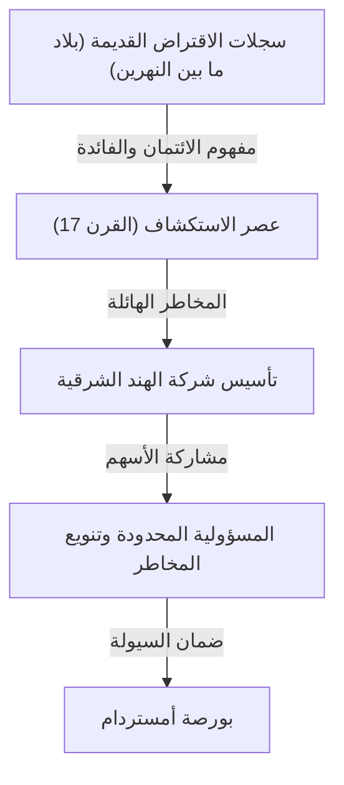

# تاريخ الاستثمار: كيف ابتكرت البشرية المخاطر والعوائد

تاريخ البشرية هو أيضاً تاريخ من الاستكشاف في المجهول والمعركة مع المخاطر المصاحبة لذلك. والتحدي المتمثل في كيفية إدارة هذه المخاطر وتحويلها إلى أرباح (عوائد) قد دفع إلى بناء النظام الواسع لـ "التمويل" و"الاستثمار". في هذا المقال، نتعمق في كيف ابتكرت البشرية وطورت مفاهيم المخاطر والعوائد، من أقدم سجلات الإقراض والاقتراض المنقوشة على الألواح الطينية في بلاد ما بين النهرين القديمة، إلى شركة الهند الشرقية التي عبرت المحيطات، والاقتصادات الفقاعية التي اجتاحت العالم، ووصولاً إلى التداول الخوارزمي بالملي ثانية بواسطة أجهزة الكمبيوتر العملاقة الحديثة.

## 1. الفجر: "ولادة الائتمان" في العصور القديمة

تعود جذور الاستثمار والتمويل إلى فترة طويلة قبل اختراع النقود، وصولاً إلى عصر بلاد ما بين النهرين القديمة. ففي حوالي عام 3000 قبل الميلاد، استخدم السومريون الكتابة المسمارية لتسجيل قروض الشعير والفضة على الألواح الطينية. وهذا هو أقدم سجل لـ "الديون" معروف للبشرية.

في مجتمع ذلك الوقت، تم تأسيس نظام يقوم فيه المزارعون باقتراض بذور الأرز والأدوات الزراعية وإعادتها مع الفوائد بعد الحصاد. تنص شريعة حمورابي (حوالي القرن الثامن عشر قبل الميلاد) بوضوح على الحد الأقصى لمعدلات الفائدة وشروط الإعفاء من الديون في حالة فشل المحاصيل بسبب الكوارث الطبيعية، مما يشير إلى أن مفهوم إدارة المخاطر كان موجوداً بالفعل.

## 2. عصر الاستكشاف وولادة الشركة المساهمة: تنويع المخاطر

في أوروبا خلال العصور الوسطى، أوجدت دول المدن الإيطالية (مثل البندقية وجنوة) التي بنت ثرواتها من التجارة في البحر الأبيض المتوسط تقنيات مالية لا تزال تستخدم حتى اليوم، مثل مسك الدفاتر المزدوج والكمبيالات. ومع ذلك، حدث التحول النموذجي الحقيقي في تاريخ الاستثمار خلال "عصر الاستكشاف" في القرن السابع عشر.

تُعرف شركة الهند الشرقية الهولندية (VOC)، التي تأسست عام 1602، على نطاق واسع بأنها أول "شركة مساهمة" في التاريخ. كانت الرحلات إلى آسيا بحثاً عن التوابل تحمل إمكانية تحقيق أرباح هائلة، لكنها كانت محفوفة أيضاً بمخاطر عالية جداً مثل حطام السفن وهجمات القراصنة ومرض الاسقربوط. استثمار كل ثروتك في سفينة واحدة يمكن أن يعني الخراب.

لذلك، تم ابتكار طريقة رائدة لجمع مبالغ صغيرة من الأموال من العديد من المستثمرين لتوزيع المخاطر. استفاد المستثمرون (المساهمون) من "المسؤولية المحدودة"، حيث لم يتحملوا مسؤولية تتجاوز مبلغ استثمارهم، وكان بإمكانهم تلقي أرباح الأسهم إذا حققت الشركة أرباحاً. بالإضافة إلى ذلك، مع إنشاء بورصة أمستردام، أصبحت هذه الأسهم تتداول بحرية، وهنا اكتمل النموذج الأولي لسوق الأسهم الحديث.

## 3. الحماس والانهيار: الفقاعات المبكرة التي شكلت التاريخ

بمجرد أن بدأت آلية السوق في العمل، تضخمت رغبات الناس أيضاً من خلال السوق. بين القرنين السابع عشر والثامن عشر، شهد العالم ثلاث فقاعات مالية هائلة.

### جنون التوليب (1637، هولندا)
أصبحت بصيلات الزنبق (التوليب) التي تم جلبها من الإمبراطورية العثمانية هدفاً للمضاربة، وكانت أسعار الأصناف النادرة تكفي لشراء منزل. إنه مثال نموذجي لـ "المضاربة" التي ابتعدت عن الطلب الفعلي وتم تداولها فقط توقعاً لارتفاع الأسعار في المستقبل، وبعد انفجار الفقاعة أفلس الكثير من الناس.

### فقاعة بحر الجنوب (1720، بريطانيا)
مقابل تولي ديون الحكومة البريطانية، تم منح "شركة بحر الجنوب" حق احتكار التجارة في أمريكا الجنوبية، وشهدت أسعار أسهمها ارتفاعاً غير طبيعي. حتى الفيزيائي إسحاق نيوتن انخرط في حمى المضاربة هذه، وبعد تكبده خسائر فادحة، ترك مقولته الشهيرة: "أستطيع حساب حركة الأجرام السماوية، لكن ليس جنون البشر."

### مخطط ميسيسيبي (1720، فرنسا)
مشروع مالي ضخم محوره شركة ميسيسيبي، أطلقه الاسكتلندي جون لو في فرنسا. ارتبط الإصدار المفرط للنقود الورقية بالتلاعب في أسعار الأسهم، مما أدى في النهاية إلى انهيار كبير هز الاقتصاد الوطني.

نقشت هذه الأحداث في ذاكرة البشرية أن السوق يمكن أن تهيمن عليه أحياناً سلوكيات غير عقلانية ومجنونة، بالإضافة إلى رعب المخاطر عندما ترتبط السيولة والائتمان المفرط.

## 4. الثورة الصناعية وتطور الرأسمالية

تطلبت الثورة الصناعية التي بدأت في بريطانيا في أواخر القرن الثامن عشر حجماً غير مسبوق من رأس المال لمد شبكات السكك الحديدية وبناء المصانع الضخمة وشق القنوات. لتلبية هذا الطلب الهائل على التمويل، أصبح النظام المالي أكثر تطوراً.

أصبحت لندن المركز المالي العالمي، حيث تم تداول السندات الحكومية وسندات الشركات ومجموعة متنوعة من الأسهم. برزت البنوك الاستثمارية (البنوك التجارية) ولعبت دور خط أنابيب لتوريد الأموال لجميع المشاريع، من تطوير البنية التحتية الوطنية إلى تنمية المستعمرات الخارجية. في هذا العصر، لم يعد الاستثمار مقتصراً على طبقة النخبة المميزة أو التجار المغامرين، بل رسخ نفسه في المجتمع كوسيلة لإدارة الثروات للطبقة البرجوازية الناشئة.

## 5. القرن العشرون: الهندسة المالية وتنظير الاستثمار

مع دخول القرن العشرين، تحول الاستثمار من عالم "الخبرة والحدس" إلى عالم "العلم والرياضيات". وكانت نقطة التحول الكبرى في ذلك هي "نظرية المحفظة الحديثة (MPT)" التي نشرها هاري ماركويتز عام 1952.

عرّف ماركويتز "العائد" و"المخاطرة (تباين تقلبات الأسعار)" للاستثمار بشكل رياضي، وأثبت أنه من خلال الجمع بين أصول متعددة ذات تحركات أسعار مختلفة، يمكن تقليل المخاطر مع تعظيم العوائد. وهكذا تم دعم القول المأثور القديم "لا تضع كل بيضك في سلة واحدة" بصيغ رياضية دقيقة.

في وقت لاحق، في السبعينيات، ابتكر فيشر بلاك ومايرون سكولز "نموذج بلاك-سكولز"، مما جعل من الممكن حساب السعر العادل للمشتقات المالية (مثل الخيارات) نظرياً. هذا التطور في الهندسة المالية مكّن المستثمرين المؤسسيين من إدارة أموال ضخمة، ووسّع الأسواق المالية العالمية بشكل كبير.

## 6. العصر الرقمي: الخوارزميات والتداول فائق السرعة

اليوم في القرن الحادي والعشرين، ينتقل الدور الرئيسي في الأسواق المالية من البشر إلى أجهزة الكمبيوتر. أصبح مشهد قاعات التداول حيث يجتمع الناس ويصرخون بأصواتهم شيئاً من الماضي، والآن تشكل البيانات الإلكترونية التي تنتقل عبر كابلات الألياف الضوئية شكل السوق.

في تقنية تعرف باسم HFT (التداول عالي التردد)، تقوم أجهزة الكمبيوتر العملاقة، بناءً على خوارزميات متقدمة، بتكرار أوامر ضخمة في وحدات زمنية لا تدركها العين البشرية، مثل 1/1000 من الثانية (ملي ثانية) أو 1/1,000,000 من الثانية (ميكرو ثانية)، لاقتناص الأرباح من فروق الأسعار الطفيفة. يهيمن خبراء الرياضيات والفيزياء المعروفون باسم "المحللين الكميين" على السوق، ويتم تحديث النماذج التنبؤية القائمة على التعلم الآلي باستخدام الذكاء الاصطناعي (AI) يومياً.

ومع ذلك، فقد أدى التطور التكنولوجي أيضاً إلى خلق مخاطر جديدة. في "الانهيار الخاطف" الذي حدث في 6 مايو 2010، تسببت سلسلة من أوامر البيع الخوارزمية في انهيار مؤشر داو جونز الصناعي بنحو 1000 دولار في بضع دقائق، مما كشف عن هشاشة السوق.

## 7. مستقبل التمويل: اللامركزية وخلق قيمة جديدة

والآن، مع ظهور تكنولوجيا البلوكتشين والأصول المشفرة (العملات الرقمية)، تتم كتابة صفحة جديدة في تاريخ التمويل. يعد التمويل اللامركزي (DeFi) محاولة طموحة لبناء نظام مالي مستقل يكتمل بواسطة أكواد برمجية (عقود ذكية) فقط، دون المرور عبر "مديرين" مثل البنوك المركزية أو المؤسسات المالية التقليدية.

إن تاريخ الاستثمار كان سلسلة مستمرة من الابتكارات لإدارة المخاطر بشكل أكثر كفاءة وأماناً وللسعي وراء العوائد. نظام الائتمان والتسجيل الذي بدأ على الألواح الطينية القديمة، أصبح الآن على وشك أن يُنقش إلى الأبد كبيانات مشفرة على شبكات لامركزية عابرة للحدود.

مهما كان شكل السوق في المستقبل، فإن جوهر الاستثمار المتمثل في "استثمار الأموال في مستقبل غير مؤكد وخلق قيمة جديدة" لن يتغير. سنستمر نحن البشر في البحث عن أشكال اقتصادية جديدة في المساحة الفاصلة بين المخاطر والعوائد.
