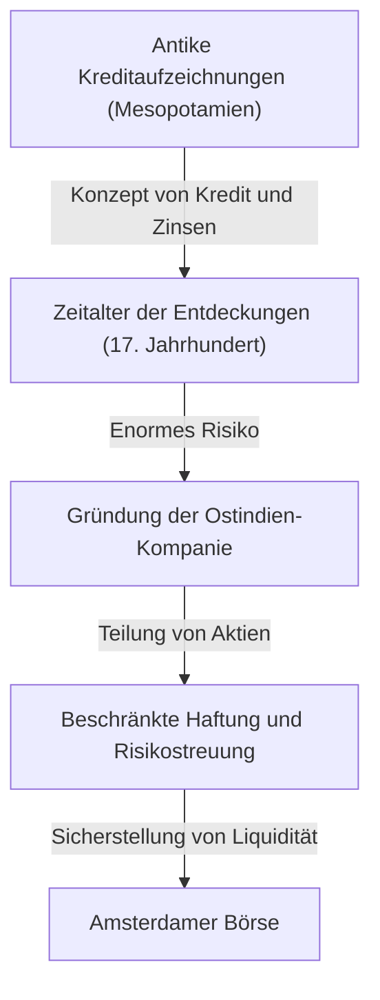

# Die Geschichte der Investitionen: Wie die Menschheit Risiko und Rendite erfand

Die Geschichte der Menschheit ist auch eine Geschichte der Erforschung des Unbekannten und des damit verbundenen Kampfes mit dem Risiko. Und die Herausforderung, wie man dieses Risiko managt und mit Gewinn (Rendite) verknüpft, förderte den Aufbau der gewaltigen Systeme von "Finanzen" und "Investitionen". Dieser Artikel befasst sich eingehend damit, wie die Menschheit die Konzepte von Risiko und Rendite erfunden und weiterentwickelt hat – von den frühesten auf Tontafeln im antiken Mesopotamien eingravierten Kreditaufzeichnungen über die Ostindien-Kompanie, die die Ozeane überquerte, und die Blasenökonomie, die die Welt in Aufruhr versetzte, bis hin zum algorithmischen Handel in Millisekunden durch moderne Supercomputer.

## 1. Die Anfangsphase: Die antike "Geburt des Kredits"

Die Wurzeln von Investitionen und Finanzen reichen weit vor die Erfindung des Geldes zurück, bis in die Zeit des antiken Mesopotamien. Um 3000 v. Chr. nutzten die Sumerer die Keilschrift, um auf Tontafeln das Verleihen und Leihen von Gerste und Silber zu dokumentieren. Dies sind die ältesten Aufzeichnungen über "Forderungen", die der Menschheit bekannt sind.

In der damaligen Gesellschaft etablierte sich ein System, bei dem Bauern Saatgut und landwirtschaftliche Geräte liehen und nach der Ernte mit Zinsen zurückzahlten. Der Codex Hammurapi (ca. 18. Jahrhundert v. Chr.) enthielt bereits klare Vorgaben zu maximalen Zinssätzen und zum Erlass von Schulden bei Missernten durch Naturkatastrophen, was darauf hindeutet, dass das Konzept des Risikomanagements bereits existierte.

## 2. Das Zeitalter der Entdeckungen und die Geburt der Aktiengesellschaft: Risikostreuung

Im mittelalterlichen Europa schufen die italienischen Stadtstaaten (wie Venedig und Genua), die durch den Mittelmeerhandel zu Reichtum gelangten, Finanztechniken wie die doppelte Buchführung und den Wechsel, die bis heute Bestand haben. Der wahre Paradigmenwechsel in der Geschichte der Investitionen vollzog sich jedoch im 17. Jahrhundert während des "Zeitalters der Entdeckungen".

Die 1602 gegründete Niederländische Ostindien-Kompanie (VOC) ist weithin als die erste "Aktiengesellschaft" der Geschichte bekannt. Die Seereisen nach Asien auf der Suche nach Gewürzen bargen das Potenzial für enorme Gewinne, waren jedoch gleichzeitig mit extrem hohen Risiken wie Schiffbruch, Piratenangriffen und Skorbut verbunden. Sein gesamtes Vermögen in ein einziges Schiff zu investieren, konnte den Ruin bedeuten.

Daher wurde die bahnbrechende Methode entwickelt, kleine Geldbeträge von vielen Investoren zu sammeln, um das Risiko zu streuen. Die Investoren (Aktionäre) profitierten von der "beschränkten Haftung", die sie nicht über ihre Einlage hinaus zur Verantwortung zog, und konnten Dividenden erhalten, wenn das Unternehmen Gewinn machte. Darüber hinaus wurden diese Aktien an der in Amsterdam gegründeten Börse frei handelbar, womit der Prototyp des modernen Aktienmarktes vollendet war.

## 3. Rausch und Absturz: Die frühen Blasen, die die Geschichte prägten

Als der Marktmechanismus zu funktionieren begann, begannen auch die menschlichen Begierden, sich durch den Markt zu verstärken. Vom 17. bis zum 18. Jahrhundert erlebte die Welt drei gigantische Finanzblasen.

### Die Tulpenmanie (1637, Niederlande)
Aus dem Osmanischen Reich importierte Tulpenzwiebeln wurden zum Spekulationsobjekt, und seltene Sorten erzielten Preise, für die man ein ganzes Haus kaufen konnte. Dies ist ein klassisches Beispiel für "Spekulation", bei der fernab der realen Nachfrage nur in der Erwartung zukünftiger Preissteigerungen gehandelt wird. Nach dem Platzen der Blase gingen viele Menschen bankrott.

### Die Südseeblase (1720, Großbritannien)
Die Aktien der "South Sea Company", der im Gegenzug für die Übernahme britischer Staatsschulden das Monopol für den Handel in Südamerika gewährt worden war, verzeichneten einen abnormalen Preisanstieg. Sogar der Physiker Isaac Newton ließ sich von diesem Spekulationsfieber anstecken und hinterließ nach enormen Verlusten das berühmte Zitat: "Ich kann die Bewegung der Himmelskörper berechnen, aber nicht den Wahnsinn der Menschen."

### Die Mississippi-Blase (1720, Frankreich)
Ein gigantisches Finanzprojekt in Frankreich, das von dem Schotten John Law ins Leben gerufen wurde und dessen Kern die Mississippi-Kompanie bildete. Die unkontrollierte Ausgabe von Papiergeld und die künstliche in die Höhe treibende der Aktienkurse waren miteinander verbunden und führten letztlich zu einem massiven Zusammenbruch, der die nationale Wirtschaft erschütterte.

Diese Ereignisse prägten das menschliche Bewusstsein dafür, dass Märkte manchmal von irrationalem und wahnhaftem Verhalten dominiert werden und wie furchterregend das Risiko ist, wenn Liquidität und exzessiver Kredit zusammentreffen.

## 4. Die Industrielle Revolution und die Entwicklung des Kapitalismus

Die in der zweiten Hälfte des 18. Jahrhunderts in Großbritannien begonnene Industrielle Revolution erforderte Kapital in einem noch nie dagewesenen Ausmaß, beispielsweise für den Bau von Eisenbahnnetzen, die Errichtung riesiger Fabriken und den Aushub von Kanälen. Um diesen enormen Finanzierungsbedarf zu decken, wurde auch das Finanzsystem immer komplexer.

London wurde zum globalen Finanzzentrum, in dem Staatsanleihen, Unternehmensanleihen und eine Vielzahl von Aktien gehandelt wurden. Investmentbanken (Merchant Banks) kamen auf und fungierten als Pipeline für die Finanzierung von Projekten jeder Art, vom Ausbau der nationalen Infrastruktur bis zur Entwicklung von Überseekolonien. In dieser Zeit war das Investieren nicht mehr nur wenigen Privilegierten und abenteuerlustigen Kaufleuten vorbehalten, sondern etablierte sich in der Gesellschaft als Mittel der Vermögensverwaltung für die aufstrebende Bourgeoisie.

## 5. Das 20. Jahrhundert: Financial Engineering und die Theoretisierung von Investitionen

Mit Beginn des 20. Jahrhunderts wandelte sich das Investieren von einer Welt der "Erfahrung und Intuition" zu einer Welt der "Wissenschaft und Mathematik". Der größte Wendepunkt war die 1952 von Harry Markowitz veröffentlichte "Moderne Portfoliotheorie (MPT)".

Markowitz definierte "Rendite" und "Risiko" (die Varianz von Preisschwankungen) bei Investitionen mathematisch und bewies, dass man das Risiko minimieren und gleichzeitig die Rendite maximieren kann, indem man mehrere Vermögenswerte mit unterschiedlichen Preisbewegungen kombiniert. Damit wurde das alte Sprichwort "Lege nicht alle Eier in einen Korb" durch strenge mathematische Formeln untermauert.

Später, in den 1970er Jahren, entwickelten Fischer Black und Myron Scholes das "Black-Scholes-Modell", das es ermöglichte, den fairen Preis von Finanzderivaten (wie Optionen) theoretisch zu berechnen. Diese Fortschritte im Financial Engineering (Finanzmathematik) ermöglichten es institutionellen Anlegern, riesige Geldsummen zu verwalten, und führten zu einer dramatischen Expansion der globalen Finanzmärkte.

## 6. Das digitale Zeitalter: Algorithmen und Hochfrequenzhandel

Heute, im 21. Jahrhundert, verlagert sich die Hauptrolle auf den Finanzmärkten vom Menschen auf den Computer. Die Szenerie des Parketthandels, auf dem sich Menschen versammelten und lauthals riefen, gehört der Vergangenheit an; heute bilden elektronische Daten, die über Glasfaserkabel fließen, den Markt.

Beim HFT (Hochfrequenzhandel) wiederholen Supercomputer basierend auf fortschrittlichen Algorithmen gewaltige Mengen an Aufträgen in Bruchteilen einer Millisekunde (Tausendstelsekunde) oder Mikrosekunde (Millionstelsekunde), die für das menschliche Auge unsichtbar sind, und schöpfen Gewinne aus winzigen Preisdifferenzen ab. Experten für Mathematik und Physik, sogenannte Quants, dominieren den Markt, und Vorhersagemodelle durch maschinelles Lernen mit KI (Künstliche Intelligenz) werden täglich aktualisiert.

Doch die technologische Entwicklung brachte auch neue Risiken mit sich. Beim "Flash Crash" am 6. Mai 2010 führte eine Kettenreaktion von algorithmischen Verkaufsaufträgen dazu, dass der Dow-Jones-Index innerhalb weniger Minuten um etwa 1000 Punkte abstürzte, was die Anfälligkeit des Marktes offenbarte.

## 7. Die Zukunft der Finanzen: Dezentralisierung und die Schaffung neuer Werte

Und nun, mit dem Aufstieg der Blockchain-Technologie und der Kryptowährungen, wird ein neues Kapitel in der Geschichte der Finanzen geschrieben. DeFi (Dezentralisierte Finanzen) ist der ehrgeizige Versuch, ein autonomes Finanzsystem aufzubauen, das ausschließlich auf Programmcode (Smart Contracts) basiert und ohne "Verwalter" wie Zentralbanken oder traditionelle Finanzinstitute auskommt.

Die Geschichte des Investierens war eine Abfolge von Innovationen, um Risiken effizienter und sicherer zu managen und Renditen zu erzielen. Das mit antiken Tontafeln begonnene System von Kredit und Aufzeichnung ist nun dabei, als verschlüsselte Daten für immer in einem grenzüberschreitenden dezentralen Netzwerk festgehalten zu werden.

Wie auch immer der Markt der Zukunft aussehen mag, das Wesen des Investierens – "Kapital in eine ungewisse Zukunft zu stecken und neue Werte zu schaffen" – wird sich nicht ändern. Wir werden zweifellos weiterhin neue Wirtschaftsformen zwischen Risiko und Rendite erforschen.
