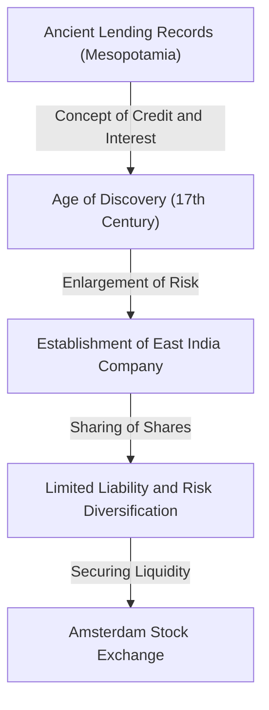

# The History of Investment: How Humanity Invented Risk and Return

Human history is also a history of exploring the unknown and fighting the risks that come with it. The challenge of how to manage those risks and connect them to profits (returns) prompted the construction of the grand systems of "finance" and "investment." In this article, we delve deep into how humanity invented and evolved the concepts of risk and return, from the oldest records of lending carved on clay tablets in ancient Mesopotamia, to the East India Company traversing the great oceans, the bubble economies that drove the world crazy, and the millisecond algorithmic trading by modern supercomputers.

## 1. The Dawn: The Ancient "Birth of Credit"

The roots of investment and finance date back to ancient Mesopotamia, long before the invention of money. Around 3000 BC, the Sumerians used cuneiform script to record the borrowing and lending of barley and silver on clay tablets. These are the oldest recorded "debts" known to mankind.

In the society of that time, a system had been established where farmers would borrow seed rice and farming tools, and return them with interest after the harvest. The Code of Hammurabi (around 18th century BC) clearly states the maximum limit for interest rates and provisions for debt exemption in the event of poor harvests due to natural disasters, suggesting that the concept of risk management already existed.

## 2. The Age of Discovery and the Birth of the Joint-Stock Company: Diversification of Risk

In medieval Europe, the Italian city-states (such as Venice and Genoa) that built wealth through Mediterranean trade created financial technologies that lead to modern times, such as double-entry bookkeeping and bills of exchange. However, a true paradigm shift in the history of investment occurred during the "Age of Discovery" in the 17th century.

Established in 1602, the Dutch East India Company (VOC) is widely known as the first "joint-stock company" in history. While voyages to Asia in search of spices had the potential to bring enormous profits, they were accompanied by extremely high risks such as shipwrecks, pirate attacks, and scurvy. Investing all one's fortune in just one ship could mean ruin.

Thus, a groundbreaking method was devised: collecting small amounts of funds from many investors to diversify the risk. Investors (shareholders) enjoyed the benefit of "limited liability," meaning they were not liable for more than their investment amount, and they could receive dividends if the company made a profit. Furthermore, with the establishment of the stock exchange in Amsterdam, these shares began to be traded freely, completing the prototype of the modern stock market.

## 3. Frenzy and Crash: Early Bubbles Coloring History

When the market mechanism begins to function, human desires are also amplified through the market. Between the 17th and 18th centuries, the world experienced three massive financial bubbles.

### Tulip Bubble (1637, Netherlands)
Tulip bulbs brought from the Ottoman Empire became targets for speculation, with rare varieties fetching prices equivalent to a single house. It is a prime example of "speculation," traded based solely on the expectation of future price increases, divorced from actual demand. After the bubble burst, many people went bankrupt.

### South Sea Bubble (1720, Britain)
The stock price of the "South Sea Company," which was granted a monopoly on trade in South America in exchange for taking on the British government's debt, skyrocketed abnormally. Even physicist Isaac Newton was caught up in this speculative fever, suffering huge losses, after which he famously remarked, "I can calculate the motion of heavenly bodies, but not the madness of people."

### Mississippi Scheme (1720, France)
A massive financial project orchestrated in France by the Scotsman John Law, centered around the Mississippi Company. The reckless issuance of paper money and the artificial inflation of stock prices worked in tandem, ultimately triggering a massive collapse that shook the national economy.

These incidents etched into humanity the terrifying reality of risks when liquidity and excessive credit intertwine, and the fact that markets can sometimes be dominated by irrational and crazy behavior.

## 4. The Industrial Revolution and the Development of Capitalism

The Industrial Revolution, which began in Britain in the late 18th century, required capital on an unprecedented scale, such as laying railway networks, building massive factories, and excavating canals. To meet this immense demand for funds, the financial system also became more sophisticated.

London became the center of global finance, and government bonds, corporate bonds, and a variety of stocks began to be traded. Investment banks (merchant banks) emerged, playing the role of a pipeline supplying funds to all kinds of projects, from national infrastructure development to the development of overseas colonies. During this era, investment ceased to be the exclusive domain of a privileged few or adventurous merchants and became firmly established in society as a means of asset management for the emerging bourgeoisie.

## 5. 20th Century: Financial Engineering and the Theorization of Investment

Entering the 20th century, investment transformed from a world of "experience and intuition" to a world of "science and mathematics." The biggest turning point was the "Modern Portfolio Theory (MPT)" published by Harry Markowitz in 1952.

Markowitz mathematically defined the "return" and "risk" (variance of price fluctuations) of an investment, and proved that by combining multiple assets that move differently, it is possible to maximize returns while suppressing risk. With this, the age-old adage "don't put all your eggs in one basket" was backed by rigorous mathematical formulas.

Later, in the 1970s, the "Black-Scholes Model" was devised by Fischer Black and Myron Scholes, making it possible to theoretically calculate the fair price of financial derivatives such as options. The development of such financial engineering enabled the massive management of funds by institutional investors and dramatically expanded global financial markets.

## 6. The Digital Age: Algorithms and High-Frequency Trading

Today, in the 21st century, the main players in financial markets are shifting from humans to computers. The sight of the trading floor, where people gathered and shouted, is a thing of the past. Currently, electronic data crossing optical fiber cables forms the market.

In a method called HFT (High-Frequency Trading), supercomputers repeatedly place massive orders based on sophisticated algorithms in units of a thousandth of a second (milliseconds) or a millionth of a second (microseconds), invisible to the human eye, snatching profits from tiny price differences. Experts in mathematics and physics called quants dominate the market, and predictive models through machine learning using AI (Artificial Intelligence) are updated daily.

However, the evolution of technology has also created new risks. In the "Flash Crash" that occurred on May 6, 2010, the Dow Jones Industrial Average plummeted by about 1,000 dollars in a few minutes due to a chain reaction of algorithmic sell orders, exposing the fragility of the market.

## 7. The Future of Finance: Decentralization and the Creation of New Value

And now, with the rise of blockchain technology and crypto assets (virtual currencies), a new page is about to be added to the history of finance. DeFi (Decentralized Finance) is an ambitious attempt to build an autonomous financial system completed solely through program code (smart contracts), without going through "administrators" like central banks or traditional financial institutions.

The history of investment has been a series of innovations to pursue returns and manage risks more efficiently and safely. The system of credit and records that began with ancient clay tablets is now about to be eternally engraved as encrypted data on decentralized networks across borders.

Whatever shape the market of the future may take, the essence of investment—"investing funds in an uncertain future and creating new value"—will never change. We will continue to explore new forms of the economy, navigating between risk and return.
