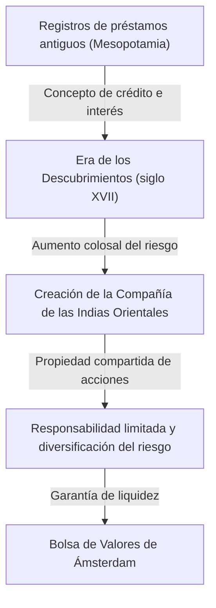

# Historia de la inversión: Cómo la humanidad inventó el riesgo y el rendimiento

La historia de la humanidad es también la historia de la exploración de mundos desconocidos y la lucha contra los riesgos asociados. Y el desafío de cómo gestionar ese riesgo y conectarlo con los beneficios (rendimientos) ha impulsado la construcción de grandes sistemas de "finanzas" e "inversión". En este artículo, desde los registros de préstamos más antiguos tallados en tablillas de arcilla en la antigua Mesopotamia, pasando por la Compañía de las Indias Orientales que cruzó los vastos océanos, las burbujas económicas que enloquecieron al mundo, hasta el comercio algorítmico a nivel de milisegundos realizado por supercomputadoras modernas, profundizaremos en cómo la humanidad ha inventado y evolucionado los conceptos de riesgo y rendimiento.

## 1. Los albores: El "nacimiento del crédito" en la antigüedad

Las raíces de la inversión y las finanzas se remontan mucho antes de la invención del dinero, a la época de la antigua Mesopotamia. Alrededor del 3000 a. C., los sumerios utilizaban la escritura cuneiforme para registrar los préstamos de cebada y plata en tablillas de arcilla. Este es el registro de "deuda" más antiguo que conoce la humanidad.

En la sociedad de aquel entonces, se había establecido un sistema en el que los campesinos tomaban prestadas semillas y herramientas agrícolas, y las devolvían con intereses después de la cosecha. En el Código de Hammurabi (alrededor del siglo XVIII a. C.), se estipulaban claramente cosas como el límite máximo de la tasa de interés y las disposiciones para la condonación de deudas en caso de malas cosechas debido a desastres naturales, lo que sugiere que el concepto de gestión de riesgos ya existía.

## 2. La Era de los Descubrimientos y el nacimiento de las sociedades anónimas: Diversificación del riesgo

En la Europa medieval, las ciudades-estado italianas (Venecia y Génova) que construyeron su riqueza a través del comercio en el Mediterráneo, crearon técnicas financieras que han perdurado hasta hoy, como la contabilidad por partida doble y las letras de cambio. Sin embargo, el verdadero cambio de paradigma en la historia de la inversión se produjo en el siglo XVII, durante la "Era de los Descubrimientos".

La Compañía Neerlandesa de las Indias Orientales (VOC), fundada en 1602, es ampliamente conocida como la primera "sociedad anónima" de la historia. Los viajes a Asia en busca de especias tenían el potencial de generar enormes beneficios, pero a la vez conllevaban riesgos extremadamente altos, como naufragios, ataques de piratas y escorbuto. Invertir toda la fortuna en un solo barco podía significar la ruina.

Por lo tanto, se ideó el método revolucionario de reunir pequeños capitales de muchos inversores para diversificar el riesgo. Los inversores (accionistas) se beneficiaban de la "responsabilidad limitada", en la que no asumían responsabilidades superiores a su cantidad invertida, y podían recibir dividendos si la empresa generaba beneficios. Además, en la bolsa de valores establecida en Ámsterdam, estas acciones comenzaron a comprarse y venderse libremente, completando aquí el prototipo del mercado de valores moderno.

## 3. Entusiasmo y colapso: Las primeras burbujas que colorean la historia

A medida que el mecanismo del mercado comenzó a funcionar, los deseos de las personas también comenzaron a amplificarse a través de él. Entre los siglos XVII y XVIII, el mundo experimentó tres enormes burbujas financieras.

### Tulipomanía (1637, Países Bajos)
Los bulbos de tulipán traídos del Imperio Otomano se convirtieron en objeto de especulación, y las variedades raras llegaron a costar tanto como una casa entera. Fue un ejemplo típico de "especulación", en la que se compraba y vendía esperando solo un aumento de precio futuro, alejado de la demanda real; tras el colapso de la burbuja, muchas personas quebraron.

### Burbuja de los mares del Sur (1720, Gran Bretaña)
A cambio de asumir la deuda del gobierno británico, la "Compañía de los Mares del Sur", a la que se le concedió el monopolio del comercio en América del Sur, vio cómo el precio de sus acciones se disparaba anormalmente. Incluso el físico Isaac Newton se vio envuelto en esta fiebre especulativa, y tras sufrir enormes pérdidas dejó la famosa frase: "Puedo calcular el movimiento de los cuerpos celestes, pero no la locura de los hombres".

### Compañía del Misisipi (1720, Francia)
Fue un gigantesco proyecto financiero lanzado por el escocés John Law en Francia, con la Compañía del Misisipi como núcleo. La emisión excesiva de papel moneda y la manipulación del precio de las acciones se vincularon, y finalmente provocaron un gran colapso que sacudió la economía nacional.

Estos incidentes grabaron en la humanidad que los mercados pueden estar dominados a veces por comportamientos irracionales y de locura, y el terror de los riesgos cuando se combinan la liquidez y el crédito excesivo.

## 4. Revolución Industrial y desarrollo del capitalismo

La Revolución Industrial, que comenzó en Gran Bretaña a finales del siglo XVIII, requirió un capital de una escala sin precedentes para el tendido de redes ferroviarias, la construcción de enormes fábricas, la apertura de canales, etc. Para satisfacer esta enorme demanda de fondos, el sistema financiero también experimentó un avance.

Londres se convirtió en el centro financiero del mundo, donde se comenzaron a negociar bonos gubernamentales y corporativos, así como diversas acciones. Los bancos de inversión (merchant banks) ganaron prominencia y actuaron como una tubería para suministrar fondos a todo tipo de proyectos, desde el desarrollo de infraestructuras nacionales hasta el desarrollo de colonias en ultramar. En esta época, la inversión dejó de ser algo exclusivo de una clase privilegiada y comerciantes aventureros, y se arraigó en la sociedad como un medio para que la nueva burguesía administrara sus activos.

## 5. Siglo XX: Ingeniería financiera y teorización de la inversión

Entrando en el siglo XX, la inversión se transformó de un mundo de "experiencia e intuición" a un mundo de "ciencia y matemáticas". El mayor punto de inflexión fue la "Teoría Moderna de Carteras (MPT)", presentada por Harry Markowitz en 1952.

Markowitz definió matemáticamente el "rendimiento" y el "riesgo (dispersión de la fluctuación de precios)" de la inversión, y demostró que al combinar múltiples activos con diferentes movimientos de precios, era posible maximizar el rendimiento manteniendo el riesgo a raya. De esta manera, el viejo adagio de "no pongas todos los huevos en la misma cesta" fue respaldado como una fórmula matemática rigurosa.

Posteriormente, en la década de 1970, Fischer Black y Myron Scholes idearon el "Modelo Black-Scholes", que hizo posible calcular teóricamente el precio adecuado de los instrumentos financieros derivados (derivados), como las opciones. El desarrollo de esta ingeniería financiera posibilitó la enorme gestión de fondos por parte de los inversores institucionales y expandió dramáticamente los mercados financieros mundiales.

## 6. La era digital: Algoritmos y comercio ultrarrápido

Hoy, en el siglo XXI, el papel principal en los mercados financieros se está trasladando de los humanos a las computadoras. La escena de los parqués donde la gente se reunía a gritar pertenece al pasado; en la actualidad, los datos electrónicos que van y vienen por cables de fibra óptica conforman el mercado.

En el método llamado HFT (Trading de Alta Frecuencia), supercomputadoras basadas en algoritmos avanzados repiten enormes cantidades de órdenes en unidades de una milésima (milisegundo) o una millonésima (microsegundo) de segundo, invisibles al ojo humano, arrebatando beneficios a partir de minúsculas diferencias de precio. Expertos en matemáticas y física conocidos como quants dominan el mercado, y los modelos de predicción a través del aprendizaje automático utilizando IA (Inteligencia Artificial) se actualizan a diario.

Sin embargo, la evolución tecnológica también ha creado nuevos riesgos. En el "Flash Crash" ocurrido el 6 de mayo de 2010, el promedio industrial Dow Jones se desplomó unos 1000 dólares en cuestión de minutos debido a una serie de órdenes de venta en cadena por algoritmos, exponiendo la vulnerabilidad del mercado.

## 7. El futuro de las finanzas: Descentralización y creación de nuevo valor

Y ahora, con el surgimiento de la tecnología blockchain y los criptoactivos (criptomonedas), se está a punto de agregar una nueva página a la historia de las finanzas. DeFi (Finanzas Descentralizadas) es un ambicioso intento de construir un sistema financiero autónomo que se complete únicamente con códigos de programación (contratos inteligentes), sin la intervención de "administradores" como bancos centrales o instituciones financieras tradicionales.

La historia de la inversión ha sido una sucesión de innovaciones para gestionar el riesgo de forma más eficiente y segura, y para perseguir rendimientos. El sistema de crédito y registro que comenzó con tablillas de arcilla antiguas ahora está a punto de grabarse para siempre como datos cifrados en redes descentralizadas transfronterizas.

Independientemente de la forma que adopten los mercados del futuro, la esencia de la inversión, "invertir fondos en un futuro incierto y crear nuevo valor", no cambiará. Continuaremos buscando nuevas formas de economía entre el riesgo y el rendimiento.
