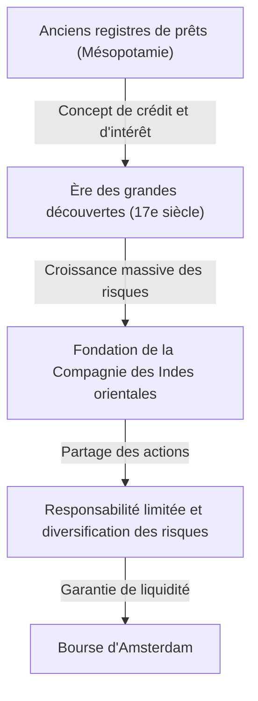

# L'histoire de l'investissement : comment l'humanité a inventé le risque et le rendement

L'histoire de l'humanité est aussi celle de l'exploration de l'inconnu et de la lutte contre les risques qui en découlent. Et le défi de savoir comment gérer ces risques et les transformer en profits (rendements) a favorisé la construction des grands systèmes que sont la « finance » et l'« investissement ». Cet article explore en profondeur la manière dont l'humanité a inventé et fait évoluer les concepts de risque et de rendement, depuis les plus anciennes traces d'emprunt gravées sur des tablettes d'argile en Mésopotamie antique, jusqu'au trading algorithmique à la milliseconde près par les supercalculateurs d'aujourd'hui, en passant par la Compagnie des Indes orientales qui a traversé les océans, et les économies de bulles qui ont rendu le monde fou.

## 1. L'aube : La « naissance du crédit » dans l'Antiquité

Les racines de l'investissement et de la finance remontent à l'Antiquité, en Mésopotamie, bien avant l'invention de la monnaie. Vers 3000 av. J.-C., les Sumériens utilisaient l'écriture cunéiforme pour enregistrer des prêts d'orge et d'argent sur des tablettes d'argile. Ce sont les plus anciennes traces de « créances » connues de l'humanité.

Dans la société de l'époque, un système était établi où les agriculteurs empruntaient des semences et des outils agricoles et les remboursaient avec des intérêts après la récolte. Le Code de Hammurabi (vers le 18ème siècle av. J.-C.) précise clairement le taux d'intérêt maximum et les dispositions d'exonération de dette en cas de mauvaise récolte due à des catastrophes naturelles, ce qui suggère que le concept de gestion des risques existait déjà.

## 2. L'ère des grandes découvertes et la naissance des sociétés par actions : La diversification des risques

Dans l'Europe médiévale, les cités-États italiennes (Venise, Gênes) qui ont fait fortune dans le commerce méditerranéen ont inventé des techniques financières telles que la comptabilité en partie double et les lettres de change, qui ont conduit à l'époque moderne. Cependant, un véritable changement de paradigme dans l'histoire de l'investissement s'est produit au 17ème siècle, lors de l'« ère des grandes découvertes ».

La Compagnie néerlandaise des Indes orientales (VOC), fondée en 1602, est largement reconnue comme la première « société par actions » de l'histoire. Les voyages vers l'Asie à la recherche d'épices avaient le potentiel d'apporter d'énormes profits, mais comportaient également des risques extrêmement élevés tels que les naufrages, les attaques de pirates et le scorbut. Investir toute sa fortune dans un seul navire pouvait signifier la ruine.

Par conséquent, une méthode révolutionnaire a été conçue pour collecter de petits montants de fonds auprès de nombreux investisseurs et diversifier les risques. Les investisseurs (actionnaires) bénéficiaient d'une « responsabilité limitée », c'est-à-dire qu'ils n'étaient pas responsables au-delà du montant de leur investissement, et ils pouvaient recevoir des dividendes si l'entreprise réalisait des bénéfices. De plus, ces actions ont commencé à être échangées librement à la Bourse d'Amsterdam, achevant ainsi le prototype du marché boursier moderne.

## 3. Frénésie et effondrement : Les premières bulles qui colorent l'histoire

Lorsque le mécanisme du marché commence à fonctionner, les désirs humains sont également amplifiés par le marché. Du 17ème au 18ème siècle, le monde a connu trois énormes bulles financières.

### La tulipomanie (1637, Pays-Bas)
Les bulbes de tulipes importés de l'Empire ottoman sont devenus l'objet de spéculations, et les variétés rares atteignaient des prix équivalents à l'achat d'une maison. C'est un exemple typique de « spéculation » qui s'est détachée de la demande réelle pour s'échanger uniquement dans l'attente de futures hausses de prix, et après l'éclatement de la bulle, de nombreuses personnes ont fait faillite.

### La bulle de la Compagnie des mers du Sud (1720, Royaume-Uni)
Le cours de l'action de la « Compagnie des mers du Sud », qui s'est vu accorder le monopole commercial en Amérique du Sud en échange de la prise en charge de la dette du gouvernement britannique, a connu une flambée anormale. Même le physicien Isaac Newton a été pris dans cette fièvre spéculative, et après avoir subi d'énormes pertes, il a laissé la célèbre citation : « Je peux calculer le mouvement des corps célestes, mais pas la folie des hommes. »

### Le système de Law ou la Compagnie du Mississippi (1720, France)
Il s'agissait d'un projet financier géant centré sur la Compagnie du Mississippi, lancé en France par l'Écossais John Law. L'émission excessive de papier-monnaie et la manipulation des cours des actions se sont conjuguées, provoquant finalement un effondrement majeur qui a ébranlé l'économie nationale.

Ces incidents ont gravé dans l'esprit de l'humanité le fait que les marchés sont parfois dominés par des comportements irrationnels et frénétiques, et les dangers du risque lorsque la liquidité est associée à un crédit excessif.

## 4. Révolution industrielle et développement du capitalisme

La révolution industrielle, qui a débuté en Grande-Bretagne dans la seconde moitié du 18ème siècle, a nécessité des capitaux à une échelle sans précédent pour la construction de réseaux ferroviaires, d'usines géantes et le creusement de canaux. Afin de répondre à cette énorme demande de fonds, le système financier s'est également sophistiqué.

Londres est devenue le centre financier du monde, où l'on échangeait des obligations d'État, des obligations de sociétés et diverses actions. Des banques d'investissement (Merchant Banks) ont émergé et ont joué le rôle de pipeline fournissant des fonds pour tous les projets, du développement des infrastructures nationales à l'exploitation des colonies d'outre-mer. À cette époque, l'investissement n'était plus l'apanage de quelques classes privilégiées ou de marchands aventuriers, mais s'est imposé dans la société comme un moyen de gestion des actifs pour la bourgeoisie émergente.

## 5. Le 20e siècle : L'ingénierie financière et la théorisation de l'investissement

Au 20ème siècle, l'investissement est passé du monde de l'« expérience et de l'intuition » au monde de la « science et des mathématiques ». Le plus grand tournant a été la « théorie moderne du portefeuille (MPT) » publiée par Harry Markowitz en 1952.

Markowitz a défini mathématiquement le « rendement » et le « risque (variance des fluctuations de prix) » de l'investissement, et a prouvé qu'en combinant plusieurs actifs dont les prix évoluent différemment, il est possible de maximiser le rendement tout en limitant les risques. Ainsi, le vieil adage « ne mettez pas tous vos œufs dans le même panier » a été étayé par une formule mathématique rigoureuse.

Par la suite, dans les années 1970, Fischer Black et Myron Scholes ont conçu le « modèle Black-Scholes », qui a permis de calculer théoriquement le prix équitable des produits financiers dérivés tels que les options. Le développement de ces ingénieries financières a rendu possible d'énormes gestions de fonds par des investisseurs institutionnels, élargissant considérablement les marchés financiers mondiaux.

## 6. L'ère numérique : Algorithmes et trading à ultra-haute fréquence

Aujourd'hui, au 21ème siècle, les acteurs principaux des marchés financiers passent de l'humain à l'ordinateur. Le paysage de la corbeille où les gens se rassemblaient à la bourse et criaient appartient au passé, et aujourd'hui, les données électroniques qui circulent dans les câbles à fibres optiques façonnent le marché.

Dans une méthode appelée HFT (trading à haute fréquence), les supercalculateurs, sur la base d'algorithmes sophistiqués, répètent des volumes massifs d'ordres en unités d'un millième de seconde (milliseconde) ou d'un millionième de seconde (microseconde), invisibles à l'œil humain, et s'approprient des profits à partir de différences de prix infimes. Des experts en mathématiques et en physique appelés quants dominent le marché, et les modèles de prédiction par apprentissage automatique utilisant l'IA (intelligence artificielle) sont mis à jour quotidiennement.

Cependant, l'évolution de la technologie a également créé de nouveaux risques. Le « Flash Crash » survenu le 6 mai 2010 a révélé la vulnérabilité du marché, le Dow Jones ayant chuté d'environ 1000 dollars en quelques minutes en raison d'une réaction en chaîne d'ordres de vente algorithmiques.

## 7. L'avenir de la finance : Décentralisation et création de nouvelles valeurs

Et maintenant, avec l'essor de la technologie de la blockchain et des crypto-actifs (monnaies virtuelles), une nouvelle page est sur le point d'être écrite dans l'histoire de la finance. La DeFi (finance décentralisée) est une tentative ambitieuse de construire un système financier autonome complet avec seulement des codes de programme (contrats intelligents), sans l'intervention de « gestionnaires » tels que les banques centrales et les institutions financières traditionnelles.

L'histoire de l'investissement a été une série d'innovations visant à gérer les risques et à rechercher des rendements de manière plus efficace et plus sûre. Le système de crédit et d'enregistrement qui a commencé avec les tablettes d'argile de l'Antiquité est maintenant sur le point d'être gravé à jamais sous forme de données cryptées sur des réseaux décentralisés transfrontaliers.

Quelle que soit la forme des marchés de demain, l'essence même de l'investissement — « engager des capitaux dans un avenir incertain pour créer de nouvelles valeurs » — ne changera jamais. Nous continuerons à chercher de nouvelles formes d'économie entre le risque et le rendement.
