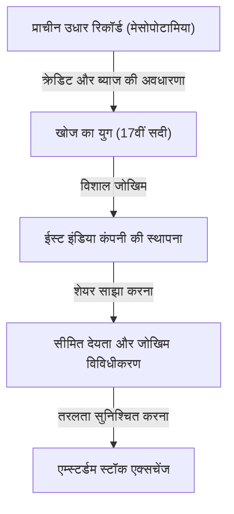

# निवेश का इतिहास: मानवता ने जोखिम और रिटर्न का आविष्कार कैसे किया

मानवता का इतिहास अज्ञात दुनिया की खोज और उससे जुड़े जोखिमों के खिलाफ संघर्ष का भी इतिहास है। और उस जोखिम को कैसे प्रबंधित किया जाए और उसे लाभ (रिटर्न) में कैसे बदला जाए, इस चुनौती ने "वित्त" और "निवेश" जैसी एक भव्य प्रणाली के निर्माण को प्रेरित किया। इस लेख में, हम गहराई से जानेंगे कि मानवता ने जोखिम और रिटर्न की अवधारणाओं का आविष्कार और विकास कैसे किया—प्राचीन मेसोपोटामिया की मिट्टी की गोलियों पर उकेरे गए सबसे पुराने उधार और उधार के रिकॉर्ड से लेकर, महासागरों को पार करने वाली ईस्ट इंडिया कंपनी, दुनिया को पागल करने वाली बुलबुला अर्थव्यवस्था, और आज के सुपर कंप्यूटरों का उपयोग करके मिलीसेकंड स्तर के एल्गोरिथम ट्रेडिंग तक।

## 1. प्रारंभिक युग: प्राचीन काल में "क्रेडिट का जन्म"

निवेश और वित्त की जड़ें प्राचीन मेसोपोटामिया के समय में वापस जाती हैं, मुद्रा के आविष्कार से बहुत पहले। लगभग 3000 ईसा पूर्व, सुमेरियों ने कीलाक्षर का उपयोग करके मिट्टी की गोलियों पर जौ और चांदी के उधार और उधार को दर्ज किया था। यह मानवता को ज्ञात "ऋण" का सबसे पुराना रिकॉर्ड है।

उस समय के समाज में, एक प्रणाली स्थापित की गई थी जहाँ किसान बीज और कृषि उपकरण उधार लेते थे और फसल के बाद ब्याज के साथ उन्हें वापस करते थे। हम्मुराबी की संहिता (लगभग 18वीं शताब्दी ईसा पूर्व) में स्पष्ट रूप से अधिकतम ब्याज दरों और प्राकृतिक आपदाओं के कारण फसल की विफलता की स्थिति में ऋण माफी के प्रावधान शामिल हैं, जो बताते हैं कि जोखिम प्रबंधन की अवधारणा पहले से ही मौजूद थी।

## 2. खोज का युग और संयुक्त-स्टॉक कंपनी का जन्म: जोखिम का विविधीकरण

मध्ययुगीन यूरोप में, इतालवी शहर-राज्यों (वेनिस और जेनोआ) जिन्होंने भूमध्यसागरीय व्यापार में संपत्ति अर्जित की थी, ने डबल-एंट्री बहीखाता और बिल ऑफ एक्सचेंज जैसी वित्तीय तकनीकें बनाईं जो आधुनिक समय की ओर ले जाती हैं। हालांकि, निवेश के इतिहास में वास्तविक प्रतिमान बदलाव 17वीं सदी में "खोज के युग" के दौरान हुआ।

1602 में स्थापित डच ईस्ट इंडिया कंपनी (VOC) को व्यापक रूप से इतिहास की पहली "संयुक्त-स्टॉक कंपनी" के रूप में जाना जाता है। जबकि मसालों की तलाश में एशिया की यात्राओं में भारी मुनाफा होने की संभावना थी, वे अत्यधिक उच्च जोखिम भी लेकर आए, जैसे जहाज की तबाही, समुद्री डाकू के हमले और स्कर्वी। एक ही जहाज में अपनी सारी संपत्ति निवेश करने का मतलब तबाही हो सकता था।

इसलिए, कई निवेशकों से छोटी मात्रा में धन इकट्ठा करके जोखिम को फैलाने की क्रांतिकारी पद्धति तैयार की गई। निवेशकों (शेयरधारकों) को "सीमित देयता" का लाभ मिला, जिसका अर्थ था कि वे अपने निवेश से अधिक के लिए जिम्मेदार नहीं थे, और कंपनी के लाभ कमाने पर लाभांश प्राप्त कर सकते थे। इसके अलावा, एम्स्टर्डम में स्थापित स्टॉक एक्सचेंज ने इन शेयरों को स्वतंत्र रूप से खरीदने और बेचने की अनुमति दी, जिससे आधुनिक शेयर बाजार के प्रोटोटाइप को पूरा किया गया।

## 3. उन्माद और पतन: इतिहास के प्रारंभिक बुलबुले

जैसे-जैसे बाजार तंत्र काम करना शुरू करता है, मानवीय इच्छाएं भी बाजार के माध्यम से बढ़ती हैं। 17वीं से 18वीं शताब्दी के दौरान, दुनिया ने तीन बड़े वित्तीय बुलबुले का अनुभव किया।

### ट्यूलिप मेनिया (1637, नीदरलैंड)
ओटोमन साम्राज्य से लाए गए ट्यूलिप बल्ब अटकलों का विषय बन गए, दुर्लभ किस्मों की कीमत एक घर जितनी हो गई। यह "सट्टेबाजी" का एक उत्कृष्ट उदाहरण है, जहां वास्तविक मांग के बिना भविष्य में मूल्य वृद्धि की उम्मीद में खरीदारी और बिक्री की जाती है, और बुलबुले के फटने के बाद कई लोग दिवालिया हो गए।

### साउथ सी बबल (1720, ग्रेट ब्रिटेन)
ब्रिटिश सरकार के ऋण को लेने के बदले में दक्षिण अमेरिका में व्यापार पर एकाधिकार प्राप्त करने वाली "साउथ सी कंपनी" के शेयर की कीमत में असामान्य वृद्धि देखी गई। यहां तक कि भौतिक विज्ञानी आइजैक न्यूटन भी इस सट्टा बुखार में फंस गए थे, और भारी नुकसान उठाने के बाद अपनी प्रसिद्ध टिप्पणी छोड़ी: "मैं खगोलीय पिंडों की गति की गणना कर सकता हूं, लेकिन लोगों के पागलपन की नहीं।"

### मिसिसिपी योजना (1720, फ्रांस)
स्कॉटिश जॉन लॉ द्वारा फ्रांस में शुरू की गई मिसिसिपी कंपनी पर केंद्रित एक विशाल वित्तीय परियोजना। कागज के पैसे के अंधाधुंध छपाई और शेयर की कीमत में हेरफेर ने एक साथ काम किया, जिससे अंततः एक बड़ा पतन हुआ जिसने राष्ट्रीय अर्थव्यवस्था को हिलाकर रख दिया।

इन घटनाओं ने मानवता पर अंकित किया कि बाजार कभी-कभी अतार्किक और उन्मादी व्यवहारों से कैसे शासित हो सकते हैं, और तरलता के अत्यधिक ऋण के साथ जुड़ने पर जोखिमों के खतरे कितने डरावने हो सकते हैं।

## 4. औद्योगिक क्रांति और पूंजीवाद का विकास

18वीं शताब्दी के उत्तरार्ध में ब्रिटेन में शुरू हुई औद्योगिक क्रांति को अभूतपूर्व मात्रा में पूंजी की आवश्यकता थी, जैसे रेलवे नेटवर्क का निर्माण, विशाल कारखानों का निर्माण और नहरों की खुदाई। धन की इस विशाल मांग को पूरा करने के लिए वित्तीय प्रणाली भी अधिक परिष्कृत हो गई।

लंदन वैश्विक वित्त का केंद्र बन गया, जहां सरकारी बॉन्ड, कॉर्पोरेट बॉन्ड और विभिन्न शेयरों का कारोबार होता था। निवेश बैंक (मर्चेंट बैंक) प्रमुखता से उभरे, जो राष्ट्रीय बुनियादी ढांचे के विकास से लेकर विदेशी उपनिवेशों के विकास तक हर परियोजना को धन की आपूर्ति करने वाली पाइपलाइन के रूप में काम कर रहे थे। इस युग में, निवेश अब केवल कुछ विशेषाधिकार प्राप्त वर्गों या साहसिक व्यापारियों के लिए नहीं था, बल्कि उभरते हुए पूंजीपति वर्ग के लिए संपत्ति प्रबंधन के साधन के रूप में समाज में स्थापित हो गया।

## 5. 20वीं सदी: वित्तीय इंजीनियरिंग और निवेश का सिद्धांत

20वीं सदी में प्रवेश करते हुए, निवेश "अनुभव और अंतर्ज्ञान" की दुनिया से "विज्ञान और गणित" की दुनिया में बदल गया। सबसे बड़ा महत्वपूर्ण मोड़ "आधुनिक पोर्टफोलियो थ्योरी (MPT)" था जिसे हैरी मार्कोविट्ज़ ने 1952 में प्रकाशित किया था।

मार्कोविट्ज़ ने गणितीय रूप से निवेश में "रिटर्न" और "जोखिम" (मूल्य में उतार-चढ़ाव का विचरण) को परिभाषित किया, और साबित किया कि विभिन्न मूल्य आंदोलनों के साथ कई संपत्तियों को मिलाकर जोखिम को कम करते हुए रिटर्न को अधिकतम किया जा सकता है। इसने पुरानी कहावत "अपने सभी अंडे एक टोकरी में न रखें" को कठोर गणितीय सूत्रों के साथ एक समर्थन दिया।

बाद में, 1970 के दशक में, फिशर ब्लैक और मायरोन शोल्स ने "ब्लैक-शोल्स मॉडल" का आविष्कार किया, जिसने सैद्धांतिक रूप से ऑप्शंस जैसे वित्तीय डेरिवेटिव के उचित मूल्य की गणना करना संभव बना दिया। वित्तीय इंजीनियरिंग के इन विकासों ने संस्थागत निवेशकों को भारी मात्रा में धन का प्रबंधन करने में सक्षम बनाया, जिससे वैश्विक वित्तीय बाजार का नाटकीय रूप से विस्तार हुआ।

## 6. डिजिटल युग: एल्गोरिदम और हाई-फ्रीक्वेंसी ट्रेडिंग

आज, 21वीं सदी में, वित्तीय बाजारों के प्रमुख खिलाड़ी इंसानों से कंप्यूटर की ओर स्थानांतरित margin हैं। ट्रेडिंग फ्लोर का दृश्य जहां लोग इकट्ठा होकर चिल्लाते थे, अब अतीत की बात हो गई है, और अब फाइबर ऑप्टिक केबल पर यात्रा करने वाले इलेक्ट्रॉनिक डेटा बाजार को आकार देते हैं।

हाई-फ्रीक्वेंसी ट्रेडिंग (HFT) नामक एक पद्धति में, सुपर कंप्यूटर उन्नत एल्गोरिदम के आधार पर मानवीय आंखों के लिए अदृश्य मिलीसेकंड (1/1000 सेकंड) या माइक्रोसेकंड (1/1,000,000 सेकंड) इकाइयों में बड़ी मात्रा में ऑर्डर दोहराते हैं, और मामूली मूल्य अंतर से लाभ उठाते हैं। क्वान्ट्स नामक गणित और भौतिकी के विशेषज्ञ बाजार पर हावी हैं, और AI (कृत्रिम बुद्धिमत्ता) का उपयोग करने वाले मशीन लर्निंग प्रेडिक्टिव मॉडल हर दिन अपडेट किए जा रहे हैं।

हालाँकि, तकनीकी विकास ने नए जोखिम भी पैदा किए हैं। 6 मई, 2010 को हुई "फ्लैश क्रैश" में, एल्गोरिदम के शृंखलाबद्ध बिक्री आदेशों के कारण डॉव जोन्स इंडस्ट्रियल एवरेज में कुछ ही मिनटों में लगभग 1,000 डॉलर की गिरावट आई, जिसने बाजार की कमजोरी को उजागर किया।

## 7. वित्त का भविष्य: विकेंद्रीकरण और नया मूल्य सृजन

और अब, ब्लॉकचेन तकनीक और क्रिप्टो एसेट्स (वर्चुअल करेंसी) के उदय के साथ, वित्तीय इतिहास में एक नया पन्ना लिखा जाने वाला है। DeFi (विकेंद्रीकृत वित्त) एक स्वायत्त वित्तीय प्रणाली के निर्माण का एक महत्वाकांक्षी प्रयास है जिसे केंद्रीय बैंकों या पारंपरिक वित्तीय संस्थानों जैसे "प्रशासकों" की आवश्यकता के बिना केवल प्रोग्राम कोड (स्मार्ट अनुबंध) के साथ पूरा किया जाता है।

निवेश का इतिहास जोखिमों को अधिक कुशलतापूर्वक और सुरक्षित रूप से प्रबंधित करने और रिटर्न को आगे बढ़ाने के लिए नवाचारों की एक निरंतरता रहा है। प्राचीन मिट्टी की गोलियों से शुरू हुई क्रेडिट और रिकॉर्ड-कीपिंग प्रणाली अब सीमाओं के पार विकेन्द्रीकृत नेटवर्क पर एन्क्रिप्टेड डेटा के रूप में हमेशा के लिए उकेरी जाने वाली है।

भविष्य का बाजार चाहे जो भी रूप ले, निवेश का सार—"एक अनिश्चित भविष्य में धन निवेश करना और नया मूल्य बनाना"—कभी नहीं बदलेगा। हम जोखिम और रिटर्न के बीच अर्थशास्त्र के नए रूपों का पता लगाना जारी रखेंगे。
