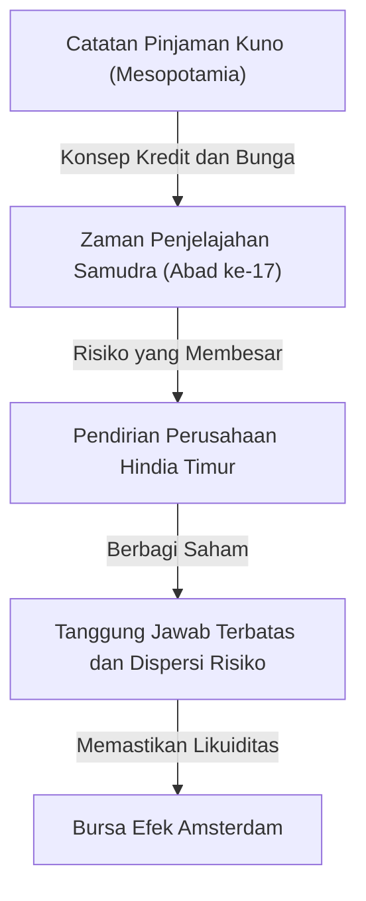

# Sejarah Investasi: Bagaimana Umat Manusia Menemukan Risiko dan Imbal Hasil

Sejarah umat manusia juga merupakan sejarah eksplorasi dunia yang tidak diketahui dan perjuangan melawan risiko yang menyertainya. Dan tantangan tentang bagaimana mengelola risiko tersebut dan menghubungkannya dengan keuntungan (imbal hasil) mendorong pembangunan sistem yang luar biasa yaitu "keuangan" dan "investasi". Artikel ini akan menggali lebih dalam bagaimana umat manusia telah menemukan dan mengembangkan konsep risiko dan imbal hasil, mulai dari catatan pinjaman tertua yang terukir di loh tanah liat Mesopotamia kuno, Perusahaan Hindia Timur yang mengarungi lautan, ekonomi gelembung yang membuat dunia tergila-gila, hingga perdagangan algoritmik dalam hitungan milidetik oleh superkomputer modern.

## 1. Masa Awal: "Kelahiran Kredit" di Zaman Kuno

Akar dari investasi dan keuangan berawal jauh sebelum uang ditemukan, yakni pada zaman Mesopotamia kuno. Sekitar tahun 3000 SM, bangsa Sumeria menggunakan huruf paku untuk mencatat pinjaman gandum dan perak di loh tanah liat. Sejauh yang diketahui umat manusia, ini adalah catatan "kredit" tertua.

Dalam masyarakat pada waktu itu, sebuah sistem telah terbentuk di mana para petani meminjam benih atau alat pertanian dan mengembalikannya dengan bunga setelah panen. Piagam Hammurabi (sekitar abad ke-18 SM) secara jelas mencantumkan batas maksimum suku bunga dan ketentuan pembebasan utang jika terjadi gagal panen akibat bencana alam, yang menunjukkan bahwa konsep manajemen risiko telah ada sejak saat itu.

## 2. Zaman Penjelajahan Samudra dan Lahirnya Perusahaan Saham Gabungan: Dispersi Risiko

Di Eropa Abad Pertengahan, negara-kota Italia (seperti Venesia dan Genoa) yang membangun kekayaan melalui perdagangan Mediterania menciptakan teknik keuangan yang mengarah ke era modern, seperti pembukuan berpasangan dan wesel. Namun, pergeseran paradigma yang sesungguhnya dalam sejarah investasi terjadi pada "Zaman Penjelajahan Samudra" di abad ke-17.

Perusahaan Hindia Timur Belanda (VOC), yang didirikan pada tahun 1602, dikenal luas sebagai "perusahaan saham gabungan" pertama dalam sejarah. Pelayaran ke Asia untuk mencari rempah-rempah memiliki potensi keuntungan yang sangat besar, tetapi di sisi lain membawa risiko yang sangat tinggi seperti kapal karam, serangan bajak laut, dan penyakit kudis. Menginvestasikan seluruh kekayaan hanya pada satu kapal bisa berarti kehancuran.

Oleh karena itu, muncullah sebuah metode inovatif untuk mengumpulkan dana dalam jumlah kecil dari banyak investor guna menyebarkan risiko. Para investor (pemegang saham) menikmati manfaat "tanggung jawab terbatas", di mana mereka tidak bertanggung jawab lebih dari jumlah yang diinvestasikan, dan dapat menerima dividen jika perusahaan menghasilkan keuntungan. Selain itu, dengan didirikannya bursa efek di Amsterdam, saham-saham ini dapat diperjualbelikan dengan bebas, dan di sinilah prototipe pasar saham modern disempurnakan.

## 3. Kegilaan dan Kehancuran: Gelembung Awal yang Mewarnai Sejarah

Ketika mekanisme pasar mulai berfungsi, hasrat manusia juga ikut diperkuat melalui pasar. Dari abad ke-17 hingga abad ke-18, dunia mengalami tiga gelembung keuangan besar.

### Gelembung Tulip (1637, Belanda)
Umbi tulip yang dibawa dari Kekaisaran Ottoman menjadi objek spekulasi, dan varietas langka dihargai setara dengan harga sebuah rumah. Ini adalah contoh klasik dari "spekulasi" di mana pembelian dan penjualan dilakukan hanya dengan harapan kenaikan harga di masa depan tanpa mempedulikan permintaan riil, dan banyak orang bangkrut setelah gelembung ini pecah.

### Insiden Gelembung Laut Selatan (1720, Inggris)
Harga saham "South Sea Company", yang diberikan hak monopoli perdagangan di Amerika Selatan sebagai imbalan untuk mengambil alih utang pemerintah Inggris, melonjak secara tidak wajar. Bahkan fisikawan Isaac Newton pun ikut terseret dalam demam spekulasi ini dan kehilangan sejumlah besar uang, lalu meninggalkan kutipan terkenal: "Saya bisa menghitung pergerakan benda-benda langit, tetapi tidak bisa menghitung kegilaan manusia."

### Skema Mississippi (1720, Prancis)
Sebuah proyek keuangan raksasa yang berpusat pada Mississippi Company, yang didirikan oleh pria Skotlandia John Law di Prancis. Pencetakan uang kertas yang berlebihan dan manipulasi harga saham saling berkaitan, yang pada akhirnya memicu keruntuhan besar yang mengguncang ekonomi nasional.

Peristiwa-peristiwa ini menanamkan pada umat manusia bahwa pasar terkadang dikuasai oleh perilaku yang tidak rasional dan gila, serta betapa mengerikannya risiko ketika likuiditas digabungkan dengan kredit yang berlebihan.

## 4. Revolusi Industri dan Perkembangan Kapitalisme

Revolusi Industri yang dimulai di Inggris pada paruh kedua abad ke-18 membutuhkan modal dalam skala yang belum pernah ada sebelumnya, seperti untuk pembangunan jaringan kereta api, pembangunan pabrik raksasa, dan penggalian kanal. Untuk memenuhi permintaan dana yang sangat besar ini, sistem keuangan pun berkembang menjadi lebih canggih.

London menjadi pusat keuangan dunia, tempat obligasi pemerintah, obligasi perusahaan, dan berbagai macam saham diperdagangkan. Bank investasi (merchant bank) muncul dan berperan sebagai saluran penyedia dana untuk segala jenis proyek, mulai dari pembangunan infrastruktur nasional hingga pengembangan koloni luar negeri. Pada era ini, investasi bukan lagi hanya milik segelintir kelas istimewa atau pedagang petualang, melainkan telah mengakar di masyarakat sebagai sarana pengelolaan aset bagi kaum borjuis baru.

## 5. Abad ke-20: Rekayasa Keuangan dan Teori Investasi

Memasuki abad ke-20, investasi berubah dari dunia "pengalaman dan intuisi" menjadi dunia "sains dan matematika". Titik balik terbesarnya adalah "Teori Portofolio Modern (MPT)" yang diterbitkan oleh Harry Markowitz pada tahun 1952.

Markowitz mendefinisikan secara matematis "imbal hasil" dan "risiko (dispersi fluktuasi harga)" dari investasi, dan membuktikan bahwa dengan menggabungkan beberapa aset yang pergerakan harganya berbeda, seseorang dapat memaksimalkan imbal hasil sambil menekan risiko. Dengan ini, pepatah lama "jangan menaruh semua telurmu dalam satu keranjang" didukung secara ketat oleh rumus matematika.

Setelah itu, pada tahun 1970-an, "Model Black-Scholes" dirancang oleh Fischer Black dan Myron Scholes, sehingga memungkinkan perhitungan teoretis dari harga wajar produk derivatif keuangan seperti opsi. Perkembangan rekayasa keuangan ini memungkinkan pengelolaan dana berskala raksasa oleh investor institusional dan memperluas pasar keuangan global secara dramatis.

## 6. Era Digital: Algoritma dan Perdagangan Berkecepatan Sangat Tinggi

Dewasa ini di abad ke-21, pemeran utama di pasar keuangan sedang beralih dari manusia ke komputer. Pemandangan lantai bursa tempat orang-orang berkumpul dan saling berteriak telah menjadi masa lalu, dan saat ini data elektronik yang berlalu-lalang melalui kabel serat optiklah yang membentuk pasar.

Dalam metode yang disebut HFT (High-Frequency Trading), superkomputer secara berulang-ulang menempatkan sejumlah besar pesanan dalam hitungan 1/1000 detik (milidetik) atau 1/1.000.000 detik (mikrodetik) yang tidak terlihat oleh mata manusia berdasarkan algoritma canggih, demi meraup keuntungan dari selisih harga yang sangat kecil. Para ahli matematika dan fisika yang disebut quant mendominasi pasar, dan model prediksi berbasis pembelajaran mesin menggunakan AI (Kecerdasan Buatan) diperbarui setiap hari.

Namun, evolusi teknologi juga melahirkan risiko baru. Dalam "Flash Crash" yang terjadi pada tanggal 6 Mei 2010, reaksi berantai dari pesanan jual algoritmik menyebabkan Dow Jones Industrial Average anjlok sekitar 1.000 dolar hanya dalam beberapa menit, memperlihatkan kerentanan pasar.

## 7. Masa Depan Keuangan: Desentralisasi dan Penciptaan Nilai Baru

Dan sekarang, dengan bangkitnya teknologi blockchain dan aset kripto (mata uang virtual), sebuah halaman baru akan segera ditambahkan ke dalam sejarah keuangan. DeFi (Keuangan Terdesentralisasi) adalah upaya ambisius untuk membangun sistem keuangan otonom yang hanya diatur oleh kode program (smart contract) tanpa campur tangan "pengelola" seperti bank sentral atau lembaga keuangan tradisional.

Sejarah investasi adalah rangkaian inovasi untuk mengejar imbal hasil dan mengelola risiko dengan lebih efisien dan lebih aman. Sistem kredit dan pencatatan yang dimulai dari loh tanah liat kuno kini akan diukir selamanya sebagai data terenkripsi di jaringan terdesentralisasi yang melintasi batas-batas negara.

Bagaimanapun bentuk pasar di masa depan, esensi investasi yaitu "menginvestasikan dana di masa depan yang tidak pasti untuk menciptakan nilai baru" tidak akan pernah berubah. Kita akan terus mencari bentuk ekonomi yang baru di antara risiko dan imbal hasil.
