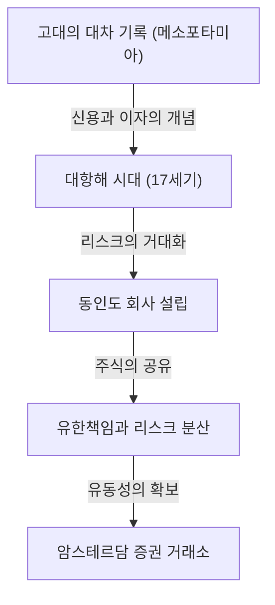

# 투자의 역사: 인류는 어떻게 리스크와 리턴을 발명했는가

인류의 역사는 미지의 세계에 대한 탐구와 그에 수반되는 리스크와의 싸움의 역사이기도 합니다. 그리고 그 리스크를 어떻게 관리하고 이익(리턴)으로 연결할 것인가 하는 과제는 '금융'과 '투자'라는 장대한 시스템의 구축을 촉진했습니다. 본 기사에서는 고대 메소포타미아의 점토판에 새겨진 가장 오래된 대차 기록부터, 대양을 건넌 동인도 회사, 세계를 열광시킨 버블 경제, 그리고 현대의 슈퍼컴퓨터에 의한 밀리초 단위의 알고리즘 거래에 이르기까지, 인류가 어떻게 리스크와 리턴이라는 개념을 발명하고 진화시켜 왔는지를 깊이 파고듭니다.

## 1. 여명기: 고대의 '신용의 탄생'

투자와 금융의 근원은 화폐가 발명되기 훨씬 이전인 고대 메소포타미아 시대까지 거슬러 올라갑니다. 기원전 3000년경의 수메르인들은 쐐기 문자를 사용하여 점토판에 보리와 은의 대차를 기록했습니다. 이것이 인류가 아는 한 가장 오래된 '채권'의 기록입니다.

당시 사회에서는 농민이 볍씨나 농기구를 빌리고 수확 후에 이자를 붙여 갚는 구조가 확립되어 있었습니다. 함무라비 법전(기원전 18세기경)에는 이자의 최고 한도액이나 자연재해로 인해 흉작이 발생했을 경우의 채무 면제 규정 등이 명확하게 적혀 있어, 이미 리스크 관리의 개념이 존재했음을 알 수 있습니다.

## 2. 대항해 시대와 주식회사의 탄생: 리스크의 분산화

중세 유럽에서 지중해 무역으로 부를 축적한 이탈리아의 도시 국가(베네치아와 제노바)는 복식부기나 환어음과 같은 현대에 통용되는 금융 기술을 만들어냈습니다. 그러나 투자의 역사에서 진정한 패러다임 전환이 일어난 것은 17세기의 '대항해 시대'입니다.

1602년에 설립된 네덜란드 동인도 회사(VOC)는 사상 최초의 '주식회사'로 널리 알려져 있습니다. 향신료를 찾아 아시아로 향하는 항해는 막대한 이익을 가져다줄 가능성이 있었던 반면, 난파나 해적의 습격, 괴혈병과 같은 극히 높은 리스크를 수반했습니다. 단 한 척의 배에 전 재산을 투자하는 것은 파멸을 의미할 수 있습니다.

그래서 고안된 것이 많은 출자자로부터 소액의 자금을 모아 리스크를 분산시키는 획기적인 방식입니다. 출자자(주주)는 출자액 이상의 책임을 지지 않는 '유한책임'의 혜택을 받았고, 회사가 이익을 내면 배당금을 받을 수 있었습니다. 나아가 암스테르담에 설립된 증권 거래소에서는 이 주식이 자유롭게 매매되기 시작했으며, 여기서 현대 주식 시장의 원형이 완성된 것입니다.

## 3. 열광과 폭락: 역사를 장식하는 초기 버블

시장이라는 메커니즘이 기능하기 시작하자 사람들의 욕망 또한 시장을 통해 증폭되기 시작합니다. 17세기부터 18세기에 걸쳐 세계는 세 가지 거대한 금융 버블을 경험합니다.

### 튤립 버블 (1637년・네덜란드)
오스만 제국에서 들여온 튤립 구근이 투기 대상이 되어, 희귀한 품종에는 집 한 채를 살 수 있을 정도의 가격이 매겨졌습니다. 실수요를 벗어나 장래의 가격 상승만을 기대하고 매매되는 '투기'의 전형적인 예이며, 버블 붕괴 후에는 많은 사람들이 파산했습니다.

### 남해 거품 사건 (1720년・영국)
영국 정부의 채무를 떠안는 대가로 남아메리카에서의 무역 독점권을 부여받은 '남해 회사'의 주가가 비정상적인 폭등을 보였습니다. 물리학자 아이작 뉴턴조차도 이 투기 열풍에 휘말려 거액의 손실을 낸 후 "천체의 움직임은 계산할 수 있어도 사람들의 광기는 계산할 수 없다"는 유명한 말을 남겼습니다.

### 미시시피 계획 (1720년・프랑스)
스코틀랜드인 존 로가 프랑스에서 기획한, 미시시피 회사를 핵심으로 하는 거대한 금융 프로젝트입니다. 지폐의 남발과 주가 조작이 맞물려, 최종적으로는 국가 경제를 뒤흔드는 대붕괴를 일으켰습니다.

이러한 사건들은 시장이 때로는 비합리적이고 광기 어린 행동에 지배될 수 있다는 것, 그리고 유동성과 과도한 신용이 결합되었을 때의 리스크의 무서움을 인류에게 각인시켰습니다.

## 4. 산업 혁명과 자본주의의 발전

18세기 후반 영국에서 시작된 산업 혁명은 철도망의 부설, 거대한 공장의 건설, 운하의 굴착 등 전례 없는 규모의 자본을 필요로 했습니다. 이 막대한 자금 수요에 부응하기 위해 금융 시스템 또한 고도화되었습니다.

런던은 세계 금융의 중심지가 되어, 국채와 회사채, 그리고 다양한 주식이 거래되기 시작했습니다. 투자 은행(머천트 뱅크)이 대두되어, 국가의 인프라 정비부터 해외 식민지 개발까지 모든 프로젝트에 자금을 공급하는 파이프라인 역할을 수행했습니다. 이 시대에 투자는 일부 특권 계급이나 모험 상인들만의 것이 아니라, 신흥 부르주아지의 자산 운용 수단으로 사회에 정착해 나갔습니다.

## 5. 20세기: 금융 공학과 투자의 이론화

20세기에 들어서면서 투자는 '경험과 감'의 세계에서 '과학과 수학'의 세계로 변모합니다. 그 최대의 전환점이 된 것이 1952년에 해리 마코위츠가 발표한 '현대 포트폴리오 이론(MPT)'입니다.

마코위츠는 투자의 '리턴'과 '리스크(가격 변동의 분산)'를 수학적으로 정의하고, 서로 다른 가격 움직임을 보이는 여러 자산을 조합함으로써 리스크를 억제하면서 리턴을 극대화할 수 있음을 증명했습니다. 이를 통해 '계란을 한 바구니에 담지 마라'는 옛 격언이 엄밀한 수식으로 뒷받침된 것입니다.

이후 1970년대에는 피셔 블랙과 마이런 숄즈에 의해 '블랙-숄즈 모델'이 고안되어, 옵션 등 금융 파생 상품(파생상품)의 적정 가격을 이론적으로 산출하는 것이 가능해졌습니다. 이러한 금융 공학의 발전은 기관 투자자에 의한 거대한 자금 운용을 가능하게 했고, 세계 금융 시장을 비약적으로 확대시켰습니다.

## 6. 디지털 시대: 알고리즘과 초고속 거래

21세기 오늘날, 금융 시장의 주역은 인간에서 컴퓨터로 이동하고 있습니다. 거래소에 모여 목소리를 높이던 입회장의 풍경은 과거의 것이 되었고, 현재는 광섬유 케이블을 오가는 전자 데이터가 시장을 형성하고 있습니다.

HFT(고빈도 매매)라고 불리는 기법에서는 슈퍼컴퓨터가 고도의 알고리즘에 기초하여 인간의 눈에는 보이지 않는 1000분의 1초(밀리초)나 100만분의 1초(마이크로초) 단위로 방대한 주문을 반복하며, 미세한 가격 차이에서 이익을 취하고 있습니다. 퀀트라 불리는 수학 및 물리학 전문가들이 시장을 지배하고 있으며, AI(인공지능)를 이용한 기계 학습을 통한 예측 모델이 매일 업데이트되고 있습니다.

그러나 기술의 진화는 새로운 리스크도 만들어냈습니다. 2010년 5월 6일에 발생한 '플래시 크래시(Flash Crash)'에서는 알고리즘의 연쇄적인 매도 주문으로 인해 다우 평균 주가가 단 몇 분 만에 약 1000달러나 폭락하여 시장의 취약성을 드러냈습니다.

## 7. 미래의 금융: 분산화와 새로운 가치의 창출

그리고 지금, 블록체인 기술과 암호자산(가상화폐)의 대두로 인해 금융의 역사에 새로운 페이지가 쓰여지려 하고 있습니다. DeFi(탈중앙화 금융)는 중앙은행이나 전통적인 금융 기관이라는 '관리자'를 거치지 않고, 프로그램 코드(스마트 컨트랙트)만으로 완결되는 자율적인 금융 시스템을 구축하려는 야심 찬 시도입니다.

투자의 역사란 더 효율적이고 더 안전하게 리스크를 관리하며 리턴을 추구하기 위한 혁신의 연속이었습니다. 고대의 점토판에서 시작된 신용과 기록의 시스템은 이제 국경을 초월한 분산형 네트워크상에서 암호화된 데이터로서 영원히 새겨지려 하고 있습니다.

미래의 시장이 어떤 형태가 되든, '불확실한 미래에 자금을 투입하여 새로운 가치를 창출한다'는 투자의 본질은 변하지 않을 것입니다. 우리는 앞으로도 리스크와 리턴의 틈바구니에서 새로운 경제의 형태를 계속해서 모색해 나갈 것입니다.
