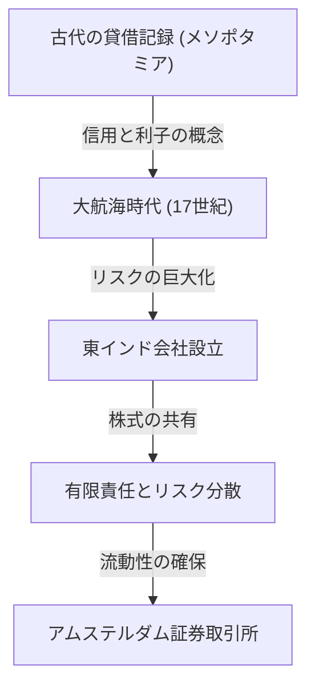

# 投資の歴史：人類はいかにしてリスクとリターンを発明したのか

人類の歴史は、未知の世界への探求と、それに伴うリスクとの戦いの歴史でもあります。そして、そのリスクをいかに管理し、利益（リターン）へと結びつけるかという課題は、「金融」と「投資」という壮大なシステムの構築を促しました。本記事では、古代メソポタミアの粘土板に刻まれた最古の貸借記録から、大海原を渡った東インド会社、世界を熱狂させたバブル経済、そして現代のスーパーコンピュータによるミリ秒単位のアルゴリズム取引に至るまで、人類がどのようにしてリスクとリターンという概念を発明し、進化させてきたのかを深掘りします。

## 1. 黎明期：古代の「信用の誕生」

投資と金融の根源は、貨幣が発明されるよりもはるか昔、古代メソポタミアの時代にまで遡ります。紀元前3000年頃のシュメール人は、楔形文字を用いて粘土板に大麦や銀の貸し借りを記録していました。これが、人類が知る限り最古の「債権」の記録です。

当時の社会では、農民が種もみや農具を借り、収穫後に利子をつけて返すという仕組みが確立していました。ハンムラビ法典（紀元前18世紀頃）には、利子の最高限度額や、自然災害によって不作となった場合の債務免除規定などが明確に記されており、すでにリスク管理の概念が存在していたことが伺えます。

## 2. 大航海時代と株式会社の誕生：リスクの分散化

中世ヨーロッパにおいて、地中海貿易で富を築いたイタリアの都市国家（ヴェネツィアやジェノヴァ）は、複式簿記や為替手形といった現代に通じる金融技術を生み出しました。しかし、投資の歴史において真のパラダイムシフトが起きたのは、17世紀の「大航海時代」です。

1602年に設立されたオランダ東インド会社（VOC）は、史上初の「株式会社」として広く知られています。香辛料を求めてアジアへ向かう航海は、莫大な利益をもたらす可能性があった反面、難破や海賊の襲撃、壊血病といった極めて高いリスクを伴いました。たった一隻の船に全財産を投じることは、破滅を意味しかねません。

そこで考案されたのが、多くの出資者から小口の資金を集め、リスクを分散するという画期的な手法です。出資者（株主）は、出資額以上の責任を負わない「有限責任」の恩恵を受け、会社が利益を出した場合には配当を受け取ることができました。さらに、アムステルダムに設立された証券取引所では、この株式が自由に売買されるようになり、ここに現代の株式市場の原型が完成したのです。

## 3. 熱狂と暴落：歴史を彩る初期のバブル

市場というメカニズムが機能し始めると、人々の欲望もまた市場を通じて増幅されるようになります。17世紀から18世紀にかけて、世界は三つの巨大な金融バブルを経験します。

### チューリップ・バブル（1637年・オランダ）
オスマン帝国から持ち込まれたチューリップの球根が投機対象となり、珍しい品種には家一軒が買えるほどの値段がつきました。実需を離れ、将来の値上がりだけを期待して売買される「投機」の典型例であり、バブル崩壊後は多くの人々が破産しました。

### 南海泡沫事件（1720年・イギリス）
イギリス政府の債務を引き受ける見返りに、南アメリカにおける貿易独占権を与えられた「南海会社」の株価が異常な高騰を見せました。物理学者アイザック・ニュートンでさえもこの投機熱に巻き込まれ、巨額の損失を出した後に「天体の動きは計算できても、人々の狂気までは計算できない」という有名な言葉を残しています。

### ミシシッピ計画（1720年・フランス）
スコットランド人のジョン・ローがフランスで仕掛けた、ミシシッピ会社を中核とする巨大な金融プロジェクトです。紙幣の乱発と株価の吊り上げが連動し、最終的には国家経済を揺るがす大崩壊を引き起こしました。

これらの事件は、市場が時に非合理的で狂気的な行動に支配されること、そして流動性と過剰な信用が結びついたときのリスクの恐ろしさを人類に刻み込みました。

## 4. 産業革命と資本主義の発展

18世紀後半にイギリスで始まった産業革命は、鉄道網の敷設、巨大工場の建設、運河の開削など、かつてない規模の資本を必要としました。この莫大な資金需要に応えるため、金融システムもまた高度化を遂げます。

ロンドンは世界金融の中心地となり、国債や社債、そして多様な株式が取引されるようになりました。投資銀行（マーチャント・バンク）が台頭し、国家のインフラ整備から海外植民地の開発まで、あらゆるプロジェクトに資金を供給するパイプラインの役割を果たしました。この時代、投資は一部の特権階級や冒険商人だけのものではなく、新興ブルジョワジーの資産運用の手段として社会に定着していきました。

## 5. 20世紀：金融工学と投資の理論化

20世紀に入ると、投資は「経験と勘」の世界から「科学と数学」の世界へと変貌を遂げます。その最大の転換点となったのが、1952年にハリー・マーコウィッツが発表した「現代ポートフォリオ理論（MPT）」です。

マーコウィッツは、投資の「リターン」と「リスク（価格変動の分散）」を数学的に定義し、異なる値動きをする複数の資産を組み合わせることで、リスクを抑えつつリターンを最大化できることを証明しました。これにより、「卵は一つのカゴに盛るな」という古くからの格言が、厳密な数式として裏付けられたのです。

その後、1970年代にはフィッシャー・ブラックとマイロン・ショールズによって「ブラック・ショールズ・モデル」が考案され、オプションなどの金融派生商品（デリバティブ）の適正価格を理論的に算出することが可能になりました。これらの金融工学の発展は、機関投資家による巨大な資金運用を可能にし、世界の金融市場を飛躍的に拡大させました。

## 6. デジタル時代：アルゴリズムと超高速取引

21世紀の今日、金融市場の主役は人間からコンピュータへと移行しつつあります。取引所に集まって声を張り上げていた立会場の風景は過去のものとなり、現在では光ファイバーケーブルを行き交う電子データが市場を形作っています。

HFT（高頻度取引）と呼ばれる手法では、スーパーコンピュータが高度なアルゴリズムに基づき、人間の目には見えない1000分の1秒（ミリ秒）や100万分の1秒（マイクロ秒）単位で膨大な注文を繰り返し、わずかな価格差から利益を掠め取っています。クオンツと呼ばれる数学や物理学の専門家たちが市場を支配し、AI（人工知能）を用いた機械学習による予測モデルが日々アップデートされています。

しかし、技術の進化は新たなリスクも生み出しました。2010年5月6日に起きた「フラッシュ・クラッシュ」では、アルゴリズムの連鎖的な売り注文によってダウ平均株価が数分間で約1000ドルも暴落し、市場の脆弱性を露呈しました。

## 7. 未来の金融：分散化と新たな価値の創造

そして今、ブロックチェーン技術と暗号資産（仮想通貨）の台頭により、金融の歴史に新たなページが書き加えられようとしています。DeFi（分散型金融）は、中央銀行や伝統的な金融機関という「管理者」を介さずに、プログラムのコード（スマートコントラクト）だけで完結する自律的な金融システムを構築しようとする野心的な試みです。

投資の歴史とは、より効率的で、より安全にリスクを管理し、リターンを追求するためのイノベーションの連続でした。古代の粘土板から始まった信用と記録のシステムは、今や国境を越えた分散型ネットワーク上で暗号化されたデータとして永遠に刻まれようとしています。

未来の市場がどのような形になるにせよ、「不確実な未来に資金を投じ、新たな価値を創造する」という投資の本質が変わることはありません。私たちはこれからも、リスクとリターンの狭間で、新たな経済の形を模索し続けていくことでしょう。
