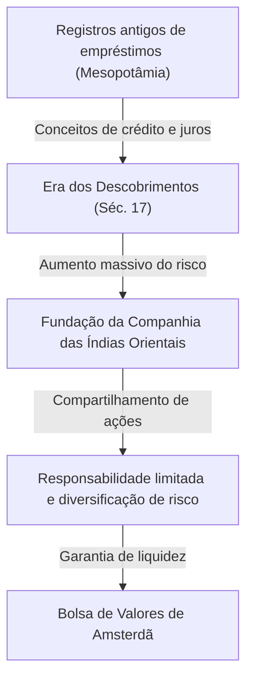

# História dos Investimentos: Como a Humanidade Inventou o Risco e o Retorno

A história da humanidade é também a história da exploração de mundos desconhecidos e da luta contra os riscos associados. O desafio de como gerenciar esse risco e vinculá-lo ao lucro (retorno) impulsionou a construção dos grandiosos sistemas de "finanças" e "investimentos". Neste artigo, vamos nos aprofundar em como a humanidade inventou e evoluiu os conceitos de risco e retorno, desde os primeiros registros de empréstimos em tábuas de argila na antiga Mesopotâmia, passando pela Companhia das Índias Orientais que cruzou os oceanos, pelas economias de bolha que enlouqueceram o mundo, até chegar à negociação algorítmica em milissegundos por supercomputadores modernos.

## 1. O Alvorecer: O "Nascimento do Crédito" na Antiguidade

As raízes dos investimentos e das finanças remontam muito antes da invenção do dinheiro, até a época da antiga Mesopotâmia. Por volta de 3000 a.C., os sumérios usavam a escrita cuneiforme para registrar o empréstimo e o empréstimo de cevada e prata em tábuas de argila. Este é o registro mais antigo de "crédito" conhecido pela humanidade.

Na sociedade daquela época, foi estabelecido um sistema no qual os agricultores pegavam emprestadas sementes e ferramentas agrícolas e as devolviam com juros após a colheita. O Código de Hamurábi (por volta do século XVIII a.C.) afirma claramente o limite máximo das taxas de juros e as provisões para isenção de dívidas em caso de quebra de safra devido a desastres naturais, sugerindo que o conceito de gerenciamento de risco já existia.

## 2. A Era dos Descobrimentos e o Nascimento da Sociedade Anônima: Diversificação de Riscos

Na Europa medieval, as cidades-estado italianas (Veneza e Gênova), que construíram riqueza por meio do comércio no Mediterrâneo, criaram tecnologias financeiras, como o método das partidas dobradas e letras de câmbio, que levaram aos tempos modernos. No entanto, uma verdadeira mudança de paradigma na história dos investimentos ocorreu durante a "Era dos Descobrimentos" no século XVII.

A Companhia Holandesa das Índias Orientais (VOC), estabelecida em 1602, é amplamente conhecida como a primeira "sociedade anônima" da história. As viagens para a Ásia em busca de especiarias traziam a possibilidade de lucros enormes, mas também envolviam riscos extremamente altos, como naufrágios, ataques de piratas e escorbuto. Investir todas as suas propriedades em um único navio poderia significar a ruína.

Portanto, foi concebido um método inovador de coletar pequenas quantias de fundos de muitos investidores para diversificar o risco. Os investidores (acionistas) desfrutavam dos benefícios da "responsabilidade limitada", pela qual não eram responsáveis além do valor do seu investimento, e podiam receber dividendos se a empresa tivesse lucro. Além disso, a Bolsa de Valores de Amsterdã foi criada, onde essas ações passaram a ser negociadas livremente, completando aqui o protótipo do mercado de ações moderno.

## 3. Frenesi e Queda: As Primeiras Bolhas da História

Assim que o mecanismo de mercado começou a funcionar, os desejos humanos também foram amplificados por meio dele. Do século XVII ao XVIII, o mundo experimentou três enormes bolhas financeiras.

### Mania das Tulipas (1637, Holanda)
Os bulbos de tulipas trazidos do Império Otomano tornaram-se objeto de especulação, e variedades raras chegaram a custar o equivalente a uma casa inteira. Este é um exemplo clássico de "especulação", desvinculada da demanda real e negociada apenas na expectativa de valorização futura. Após o colapso da bolha, muitas pessoas foram à falência.

### Bolha dos Mares do Sul (1720, Reino Unido)
O preço das ações da "Companhia dos Mares do Sul", que recebeu o monopólio do comércio na América do Sul em troca de assumir a dívida do governo britânico, disparou de forma anormal. Até mesmo o físico Isaac Newton foi pego nessa febre especulativa e, depois de sofrer perdas enormes, deixou sua famosa frase: "Consigo calcular o movimento dos corpos celestiais, mas não a loucura das pessoas."

### Esquema do Mississípi (1720, França)
Um gigantesco projeto financeiro centrado na Companhia do Mississípi, organizado na França pelo escocês John Law. A emissão excessiva de papel-moeda e a inflação dos preços das ações estavam interligadas, levando, em última análise, a um grande colapso que abalou a economia nacional.

Esses eventos mostraram à humanidade que os mercados podem, às vezes, ser dominados por comportamentos irracionais e frenéticos, bem como o perigo dos riscos quando a liquidez e o crédito excessivo se combinam.

## 4. Revolução Industrial e o Desenvolvimento do Capitalismo

A Revolução Industrial, que começou na Grã-Bretanha no final do século XVIII, exigiu capital em uma escala sem precedentes, incluindo a construção de redes ferroviárias, fábricas gigantescas e a escavação de canais. Para atender a essa enorme demanda de fundos, o sistema financeiro também se tornou mais sofisticado.

Londres tornou-se o centro financeiro mundial, onde títulos governamentais, títulos corporativos e uma variedade de ações eram negociados. Os bancos de investimento (bancos mercantis) ganharam destaque, atuando como canais que forneciam fundos para todos os tipos de projetos, desde o desenvolvimento da infraestrutura nacional até o desenvolvimento de colônias no exterior. Nesta época, o investimento não era mais exclusivo de uma classe privilegiada e mercadores aventureiros, mas tornou-se estabelecido na sociedade como um meio de gestão de ativos para a burguesia emergente.

## 5. Século XX: Engenharia Financeira e Teorização dos Investimentos

Ao entrar no século XX, o investimento transformou-se de um mundo de "experiência e intuição" para um mundo de "ciência e matemática". O maior ponto de virada foi a "Teoria Moderna de Portfólio (TMP)", publicada por Harry Markowitz em 1952.

Markowitz definiu matematicamente o "retorno" e o "risco" (variância das flutuações de preço) de um investimento e provou que o retorno pode ser maximizado enquanto se contém o risco ao combinar vários ativos com diferentes movimentos de preços. Isso transformou o antigo ditado "Não coloque todos os ovos na mesma cesta" em uma rigorosa fórmula matemática.

Mais tarde, na década de 1970, o "Modelo Black-Scholes" foi desenvolvido por Fischer Black e Myron Scholes, tornando possível calcular teoricamente o preço justo de derivativos financeiros, como opções. O desenvolvimento dessa engenharia financeira possibilitou o investimento em grande escala por investidores institucionais e expandiu drasticamente os mercados financeiros globais.

## 6. A Era Digital: Algoritmos e Negociações de Ultra-Alta Velocidade

Hoje, no século XXI, os principais atores do mercado financeiro estão migrando dos humanos para os computadores. A visão do pregão de negociação, onde as pessoas se reuniam e gritavam os lances, é coisa do passado, e agora os dados eletrônicos cruzando cabos de fibra ótica formam o mercado.

Em um método conhecido como HFT (High-Frequency Trading, ou negociação de alta frequência), os supercomputadores repetem grandes volumes de ordens em milésimos de segundo (milissegundos) ou milionésimos de segundo (microssegundos), invisíveis ao olho humano, baseados em algoritmos sofisticados para extrair lucros de diferenças de preços marginais. Especialistas em matemática e física chamados quants dominam o mercado, e modelos preditivos utilizando aprendizado de máquina com IA (Inteligência Artificial) são atualizados diariamente.

No entanto, a evolução da tecnologia também criou novos riscos. O "Flash Crash" que ocorreu em 6 de maio de 2010 expôs a vulnerabilidade do mercado, quando uma reação em cadeia de ordens de venda algorítmicas fez com que o Dow Jones despencasse cerca de 1.000 dólares em apenas alguns minutos.

## 7. O Futuro das Finanças: Descentralização e a Criação de Novos Valores

E agora, com a ascensão da tecnologia blockchain e das criptomoedas, uma nova página está prestes a ser escrita na história das finanças. DeFi (Finanças Descentralizadas) é uma tentativa ambiciosa de construir um sistema financeiro autônomo, preenchido inteiramente por códigos de computador (contratos inteligentes) sem intermediários, como bancos centrais ou instituições financeiras tradicionais.

A história dos investimentos tem sido uma série contínua de inovações para gerenciar o risco e buscar retornos de forma mais eficiente e segura. O sistema de crédito e registros que começou em antigas tábuas de argila, agora está prestes a ser gravado eternamente como dados criptografados em redes descentralizadas além das fronteiras.

Qualquer que seja a forma dos mercados futuros, a essência do investimento de "comprometer fundos a um futuro incerto e criar novos valores" permanecerá inalterada. Continuaremos a procurar novas formas de economia no espaço entre risco e retorno.
