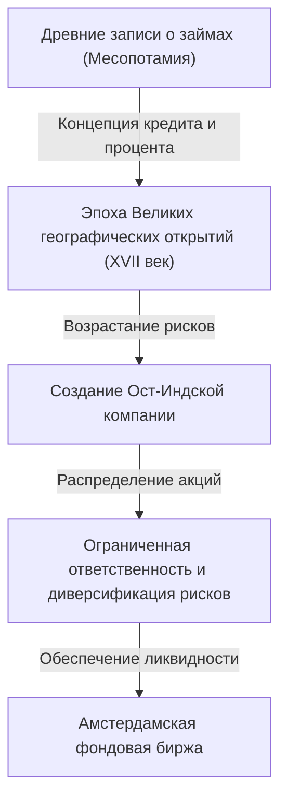

# История инвестиций: как человечество изобрело риск и доходность

История человечества — это также история исследований неизведанных миров и связанной с этим борьбы с рисками. А задача того, как управлять этими рисками и связывать их с прибылью (доходностью), способствовала созданию грандиозных систем «финансов» и «инвестиций». В этой статье мы подробно рассмотрим, как человечество изобретало и развивало концепции риска и доходности, начиная с древнейших записей о займах на глиняных табличках Древней Месопотамии, через Ост-Индскую компанию, пересекшую океаны, экономические пузыри, охватившие мир, и заканчивая современным миллисекундным алгоритмическим трейдингом на суперкомпьютерах.

## 1. Зарождение: Древнее «рождение кредита»

Корни инвестиций и финансов уходят в глубокую древность, еще до изобретения денег, во времена Древней Месопотамии. Около 3000 года до н.э. шумеры использовали клинопись для записи займов ячменя и серебра на глиняных табличках. Это самые старые из известных человечеству записей о «долговых обязательствах».

В обществе того времени сложилась система, при которой фермеры одалживали семена и сельскохозяйственные орудия, а после сбора урожая возвращали их с процентами. В Законах Хаммурапи (около XVIII века до н.э.) четко прописаны максимальные процентные ставки, а также положения о списании долгов в случае неурожая из-за стихийных бедствий, что свидетельствует о том, что концепция управления рисками существовала уже тогда.

## 2. Эпоха Великих географических открытий и рождение акционерных обществ: Диверсификация рисков

В средневековой Европе итальянские города-государства (Венеция и Генуя), разбогатевшие на средиземноморской торговле, создали финансовые технологии, ведущие к современности, такие как двойная бухгалтерия и векселя. Однако настоящий сдвиг парадигмы в истории инвестиций произошел в XVII веке в «Эпоху Великих географических открытий».

Голландская Ост-Индская компания (VOC), основанная в 1602 году, широко известна как первая в истории «акционерная компания». Путешествия в Азию за специями несли в себе потенциал колоссальных прибылей, но сопровождались чрезвычайно высокими рисками, такими как кораблекрушения, нападения пиратов и цинга. Вложить все свое состояние в один-единственный корабль могло означать разорение.

Поэтому был придуман революционный метод сбора небольших средств от многих инвесторов для диверсификации рисков. Инвесторы (акционеры) пользовались преимуществом «ограниченной ответственности», не отвечая сверх суммы своих вложений, и могли получать дивиденды, если компания приносила прибыль. Кроме того, на созданной в Амстердаме фондовой бирже эти акции стали свободно торговаться, тем самым сформировав прототип современного фондового рынка.

## 3. Эйфория и крах: Ранние пузыри, раскрасившие историю

Как только рыночный механизм начинает функционировать, человеческие желания также начинают усиливаться через рынок. С XVII по XVIII век мир пережил три гигантских финансовых пузыря.

### Тюльпаномания (1637 год, Нидерланды)
Луковицы тюльпанов, привезенные из Османской империи, стали объектом спекуляций, а за редкие сорта платили цену, равную стоимости дома. Это классический пример «спекуляции», оторванной от реального спроса и торгуемой исключительно в ожидании будущего роста цен, а после того как пузырь лопнул, многие люди обанкротились.

### Пузырь Южных морей (1720 год, Великобритания)
В обмен на принятие государственного долга Великобритании «Компания Южных морей» получила монополию на торговлю в Южной Америке, и цены на ее акции продемонстрировали аномальный рост. Даже физик Исаак Ньютон был втянут в эту спекулятивную лихорадку и после огромных потерь оставил знаменитую фразу: «Я могу рассчитать движение небесных тел, но не безумие людей».

### Миссисипская компания (1720 год, Франция)
Масштабный финансовый проект, запущенный шотландцем Джоном Ло во Франции, ядром которого была Миссисипская компания. Массовый выпуск бумажных денег был связан с искусственным завышением цен на акции, что в конечном итоге привело к великому краху, потрясшему национальную экономику.

Эти события навсегда запечатлели в памяти человечества тот факт, что рынком иногда управляет иррациональное и безумное поведение, а также ужас рисков, возникающих при сочетании ликвидности и чрезмерного кредитования.

## 4. Промышленная революция и развитие капитализма

Промышленная революция, начавшаяся в Великобритании во второй половине XVIII века, потребовала беспрецедентных объемов капитала для прокладки железнодорожных сетей, строительства гигантских фабрик и рытья каналов. Чтобы удовлетворить этот колоссальный спрос на капитал, финансовая система также становилась все более сложной.

Лондон стал мировым финансовым центром, где торговались государственные облигации, корпоративные бонды и различные акции. На первый план вышли инвестиционные (торговые) банки, сыграв роль трубопровода для поставок средств на самые разные проекты — от развития национальной инфраструктуры до освоения заморских колоний. В эту эпоху инвестиции перестали быть прерогативой лишь привилегированных классов или купцов-авантюристов, прочно укоренившись в обществе как средство управления активами новой буржуазии.

## 5. XX век: Финансовая инженерия и теоретизация инвестиций

В XX веке инвестирование превращается из мира «опыта и интуиции» в мир «науки и математики». Главным поворотным моментом стала «Современная портфельная теория (MPT)», представленная Гарри Марковицем в 1952 году.

Марковиц математически определил «доходность» и «риск (дисперсию колебаний цен)» инвестиций и доказал, что комбинируя несколько активов с различной динамикой цен, можно максимизировать доходность при одновременном снижении риска. Таким образом, старая поговорка «не кладите все яйца в одну корзину» была подтверждена строгой математической формулой.

Позже, в 1970-х годах, Фишер Блэк и Майрон Шоулз разработали «Модель Блэка-Шоулза», которая позволила теоретически рассчитывать справедливую цену финансовых деривативов, таких как опционы. Развитие этой финансовой инженерии сделало возможным управление огромными средствами институциональных инвесторов и привело к резкому расширению мировых финансовых рынков.

## 6. Цифровая эра: Алгоритмы и сверхвысокочастотный трейдинг

Сегодня, в XXI веке, главная роль на финансовых рынках переходит от людей к компьютерам. Картина торгового зала, где собираются биржевики и кричат свои ставки, ушла в прошлое; сейчас рынки формируются электронными данными, снующими по оптоволоконным кабелям.

В методе, известном как HFT (высокочастотный трейдинг), суперкомпьютеры на основе сложных алгоритмов многократно размещают огромное количество ордеров в единицах 1/1000 (миллисекунды) или 1/1000000 (микросекунды) секунды, невидимых человеческому глазу, извлекая прибыль из малейших разниц в ценах. Эксперты в области математики и физики, которых называют квантами, доминируют на рынке, а прогностические модели, основанные на машинном обучении с использованием ИИ (искусственного интеллекта), обновляются каждый день.

Однако технологическая эволюция породила и новые риски. Во время «Flash Crash» (мгновенного обвала), произошедшего 6 мая 2010 года, цепная реакция ордеров на продажу со стороны алгоритмов привела к падению промышленного индекса Доу-Джонса примерно на 1000 долларов за считанные минуты, обнажив уязвимость рынка.

## 7. Финансы будущего: Децентрализация и создание новой ценности

И теперь, с появлением технологии блокчейн и криптоактивов (виртуальных валют), в историю финансов вписывается новая страница. DeFi (децентрализованные финансы) — это амбициозная попытка создать автономную финансовую систему, работающую исключительно на основе программного кода (смарт-контрактов), без участия «управляющих», таких как центральные банки или традиционные финансовые учреждения.

История инвестиций — это непрерывная череда инноваций, направленных на более эффективное и безопасное управление рисками и стремление к доходности. Система кредитования и учета, начавшаяся с древних глиняных табличек, теперь собирается быть навсегда запечатлена в виде зашифрованных данных в транснациональной децентрализованной сети.

Независимо от того, какую форму примут рынки будущего, суть инвестирования — «вложение средств в неопределенное будущее и создание новой ценности» — останется неизменной. Мы продолжим искать новые экономические формы в пространстве между риском и доходностью.
