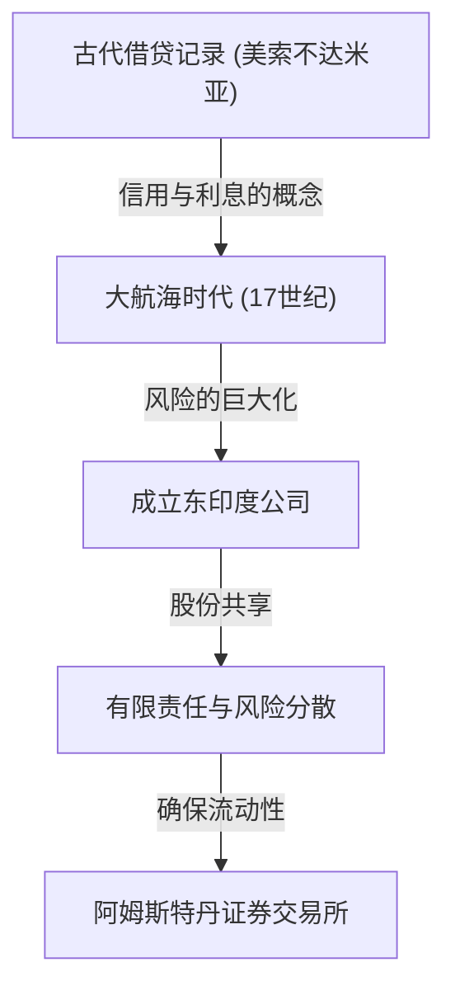

# 投资的历史：人类是如何发明风险与回报的

人类的历史，同时也是一部探索未知世界并与随之而来的风险作斗争的历史。而如何管理这些风险并将其转化为利润（回报），这一课题促使了“金融”与“投资”这一宏大系统的构建。本文将深入探讨从古代美索不达米亚泥板上刻写的最古老借贷记录，到跨越大洋的东印度公司、让世界陷入狂热的泡沫经济，再到现代超级计算机以毫秒为单位进行的算法交易，人类是如何发明并不断演进风险与回报这两个概念的。

## 1. 黎明期：古代“信用的诞生”

投资与金融的根源，可以追溯到远早于货币被发明的古代美索不达米亚时期。大约在公元前3000年，苏美尔人就使用楔形文字在泥板上记录大麦和白银的借贷。这是人类已知最古老的“债权”记录。

在当时的社会中，已经确立了农民借入谷种和农具，在收获后连本带利归还的机制。在《汉谟拉比法典》（约公元前18世纪）中，明确规定了最高利率限额，以及因自然灾害导致歉收时的债务免除条款等，由此可见，当时已经存在风险管理的概念。

## 2. 大航海时代与股份公司的诞生：风险的分散化

在中世纪的欧洲，通过地中海贸易积累财富的意大利城邦（如威尼斯和热那亚），创造了复式记账法和汇票等与现代相通的金融技术。然而，在投资历史上，真正的范式转变发生在17世纪的“大航海时代”。

1602年成立的荷兰东印度公司（VOC），被广泛认为是历史上第一家“股份公司”。前往亚洲寻找香料的航行虽然有可能带来巨额利润，但同时也伴随着沉船、海盗袭击和坏血病等极高的风险。将全部财产投入一艘船，可能意味着毁灭。

因此，人们设计出了一种革命性的方法：从众多投资者那里筹集小额资金，从而分散风险。投资者（股东）享有“有限责任”的红利，即承担的责任不超过其出资额；当公司盈利时，他们可以获得分红。此外，在阿姆斯特丹成立的证券交易所中，这些股票可以自由买卖，现代股票市场的雏形由此完成。

## 3. 狂热与暴跌：点缀历史的早期泡沫

当市场机制开始运作时，人们的欲望也通过市场被放大了。在17世纪到18世纪期间，世界经历了三次巨大的金融泡沫。

### 郁金香狂热（1637年·荷兰）
从奥斯曼帝国引进的郁金香球茎成为了投机对象，稀有品种的价格甚至能买下一栋房子。这是脱离实际需求、仅期待未来价格上涨而进行买卖的“投机”典型案例。泡沫破裂后，无数人宣告破产。

### 南海泡沫事件（1720年·英国）
作为接手英国政府债务的回报，获得了在南美洲贸易垄断权的“南海公司”股价出现了异常暴涨。就连物理学家艾萨克·牛顿也被卷入了这场投机狂热，在遭受巨额损失后，他留下了著名的感叹：“我能计算出天体的运行轨迹，却无法计算出人类的疯狂。”

### 密西西比泡沫（1720年·法国）
由苏格兰人约翰·劳在法国策划的，以密西西比公司为核心的庞大金融项目。纸币的滥发与股价的哄抬相互交织，最终引发了动摇国家经济的大崩溃。

这些事件让人类深刻铭记：市场有时会被非理性和疯狂的行为所主导，当流动性与过度信用结合时，风险是极其可怕的。

## 4. 工业革命与资本主义的发展

18世纪下半叶发端于英国的工业革命，需要铺设铁路网、建设大型工厂和开凿运河等，这都需要前所未有的大规模资本。为了满足这种庞大的资金需求，金融系统也变得更加复杂化。

伦敦成为了世界金融中心，国债、公司债以及各种股票都在这里进行交易。投资银行（商人银行）开始崛起，扮演着为从国家基础设施建设到海外殖民地开发等各种项目提供资金的渠道角色。在这一时期，投资不再仅仅是少数特权阶层或冒险商人的专利，而是作为新兴资产阶级管理资产的一种手段在社会中扎根。

## 5. 20世纪：金融工程与投资的理论化

进入20世纪，投资从“经验与直觉”的世界转变为“科学与数学”的世界。其最大的转折点是1952年哈里·马科维茨提出的“现代投资组合理论（MPT）”。

马科维茨在数学上定义了投资的“回报”与“风险（价格波动的方差）”，并证明了通过组合价格走势不同的多种资产，可以在控制风险的同时最大化回报。这使得“不要把所有鸡蛋放在一个篮子里”这句古老的格言，得到了严谨的数学公式的印证。

此后，在20世纪70年代，费希尔·布莱克和迈伦·斯科尔斯提出了“布莱克-斯科尔斯模型”，使得从理论上计算期权等金融衍生品的公允价值成为可能。这些金融工程的发展，使得机构投资者能够进行庞大的资金管理，并促使全球金融市场实现了飞跃性的扩张。

## 6. 数字时代：算法与超高频交易

到了21世纪的今天，金融市场的主角正逐渐从人类转变为计算机。在交易所大厅里聚集喧哗的场景已成为过去，现在，穿梭在光纤电缆中的电子数据构成了市场。

在一种被称为HFT（高频交易）的方法中，超级计算机基于复杂的算法，以人类肉眼无法察觉的千分之一秒（毫秒）或百万分之一秒（微秒）为单位，反复下达海量订单，从微小的价格差中掠夺利润。被称为“宽客”（Quants）的数学和物理学专家们主导着市场，利用AI（人工智能）进行机器学习的预测模型每天都在不断更新。

然而，技术的进步也催生了新的风险。在2010年5月6日发生的“闪电崩盘”中，算法的连锁抛售指令导致道琼斯工业平均指数在几分钟内暴跌了约1000点，暴露了市场的脆弱性。

## 7. 未来的金融：去中心化与新价值的创造

而现在，随着区块链技术和加密资产（虚拟货币）的崛起，金融的历史即将翻开新的一页。DeFi（去中心化金融）是一项雄心勃勃的尝试，旨在构建一个无需通过中央银行或传统金融机构等“管理者”，仅靠程序代码（智能合约）就能运作的自主金融系统。

投资的历史，就是一部为了更高效、更安全地管理风险并追求回报而不断创新的历史。始于古代泥板的信用与记录系统，如今正准备作为跨国去中心化网络上的加密数据被永远铭刻。

无论未来的市场呈现何种形态，“向不确定的未来投入资金，创造新价值”这一投资的本质都不会改变。我们将继续在风险与回报之间，不断探索新的经济形态。
