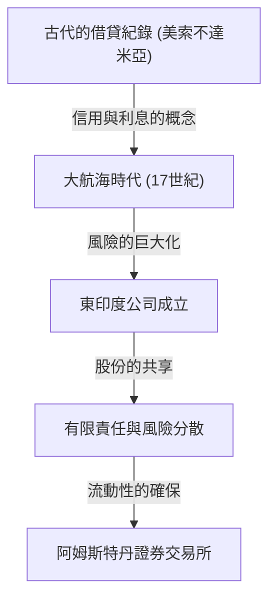

# 投資的歷史：人類如何發明風險與回報

人類的歷史，也是一部探索未知世界並與伴隨而來的風險搏鬥的歷史。而如何管理這些風險並將其轉化為利潤（回報）的課題，促使了「金融」與「投資」這套宏大系統的建立。本文將從古代美索不達米亞泥板上刻下的最古老借貸紀錄開始，到跨越汪洋的東印度公司、讓世界狂熱的泡沫經濟，乃至現代超級電腦以毫秒為單位的演算法交易，深入探討人類是如何發明並演進風險與回報的概念。

## 1. 黎明期：古代「信用的誕生」

投資與金融的根源，可以追溯到比貨幣發明還要久遠的古代美索不達米亞時代。大約在公元前3000年的蘇美爾人，使用楔形文字將大麥或白銀的借貸記錄在泥板上。這就是人類所知最古老的「債權」紀錄。

當時的社會，已經建立起農民借取穀種或農具，並在收穫後連本帶利歸還的機制。《漢摩拉比法典》（約公元前18世紀）中，明確記載了利息的最高限額，以及因自然災害導致歉收時的債務免除規定等，可見當時已經存在風險管理的概念。

## 2. 大航海時代與股份有限公司的誕生：風險的分散化

在中世紀的歐洲，透過地中海貿易累積財富的義大利城邦（如威尼斯和熱那亞），孕育出了複式簿記和匯票等通往現代的金融技術。然而，投資歷史上真正的典範轉移，發生在17世紀的「大航海時代」。

1602年成立的荷蘭東印度公司（VOC），被廣泛認為是史上第一家「股份有限公司」。前往亞洲尋求香料的航海，雖然可能帶來龐大的利潤，但另一方面也伴隨著船隻遇難、海盜襲擊、壞血病等極高的風險。將所有財產投入一艘船上，可能意味著破產。

因此，他們發明了從眾多投資者那裡募集小額資金，藉以分散風險的劃時代手法。出資者（股東）享有「有限責任」的恩惠，即承擔的責任不超過出資額，若公司獲利則可以領取股息。此外，在阿姆斯特丹成立的證券交易所中，這些股票可以自由買賣，現代股票市場的雛形便在此完成。

## 3. 狂熱與暴跌：點綴歷史的早期泡沫

當市場機制開始運作，人們的慾望也透過市場被放大。從17世紀到18世紀，世界經歷了三次巨大的金融泡沫。

### 鬱金香狂熱（1637年・荷蘭）
從鄂圖曼帝國引進的鬱金香球根成為了投機對象，稀有品種甚至被炒作到能買下一棟房子的價格。這是脫離實際需求，純粹期待未來價格上漲而進行買賣的「投機」典型案例，泡沫破裂後導致許多人破產。

### 南海泡沫事件（1720年・英國）
作為承擔英國政府債務的回報，獲得南美洲貿易壟斷權的「南海公司」，其股價出現了異常的飆漲。就連物理學家艾薩克·牛頓也被捲入這場投機熱潮中，在蒙受巨額損失後留下了著名的一句話：「我能計算天體的運行，卻無法計算人類的瘋狂。」

### 密西西比計畫（1720年・法國）
由蘇格蘭人約翰·勞在法國策劃，以密西西比公司為核心的巨大金融專案。紙幣的濫發與股價的哄抬相互牽動，最終引發了動搖國家經濟的大崩潰。

這些事件將市場有時會被非理性與瘋狂行為所支配，以及當流動性與過度信用結合時風險的恐怖之處，深深地刻在了人類的記憶中。

## 4. 工業革命與資本主義的發展

18世紀後半葉發源於英國的工業革命，需要鋪設鐵路網、建設大型工廠、開鑿運河等前所未見規模的資本。為了滿足這種龐大的資金需求，金融系統也隨之高度化。

倫敦成為了世界金融中心，開始交易國債、公司債以及各式各樣的股票。投資銀行（商業銀行）崛起，扮演了為從國家基礎設施建設到海外殖民地開發等各類專案提供資金的管道角色。在這個時代，投資不再只是一部分特權階級或冒險商人的專利，而是作為新興資產階級的資產管理手段在社會中紮根。

## 5. 20世紀：金融工程與投資的理論化

進入20世紀，投資從「經驗與直覺」的世界轉變為「科學與數學」的世界。其最大的轉折點，是1952年哈利·馬可維茲發表的「現代投資組合理論（MPT）」。

馬可維茲將投資的「回報」與「風險（價格波動的變異數）」進行了數學上的定義，證明了透過組合不同價格波動的複數資產，可以在抑制風險的同時將回報最大化。這使得「別把雞蛋放在同一個籃子裡」這句古老的格言，獲得了嚴謹的數學公式佐證。

其後，在1970年代，費雪·布萊克和邁倫·休斯提出了「布萊克-休斯模型」，使得理論上計算選擇權等金融衍生性商品的合理價格成為可能。這些金融工程的發展，讓機構投資者能夠進行龐大的資金管理，並使全球金融市場出現飛躍性的擴張。

## 6. 數位時代：演算法與超高頻交易

在21世紀的今天，金融市場的主角正逐漸從人類轉移到電腦身上。在交易所裡聚集並大聲喊價的交易大廳景象已成為過去，如今市場是由在光纖電纜中穿梭的電子數據所構成。

在被稱為HFT（高頻交易）的手法中，超級電腦根據高度的演算法，以人類肉眼無法察覺的千分之一秒（毫秒）或百萬分之一秒（微秒）為單位，重複進行龐大的訂單，從微小的價差中掠奪利潤。被稱為計量分析師的數學和物理學專家支配著市場，利用AI（人工智慧）進行機器學習的預測模型每天都在更新。

然而，技術的進化也產生了新的風險。2010年5月6日發生的「閃電崩盤」中，由於演算法的連鎖拋售訂單，道瓊工業平均指數在短短幾分鐘內暴跌了約1000美元，暴露出市場的脆弱性。

## 7. 未來的金融：去中心化與新價值的創造

而現在，隨著區塊鏈技術與加密資產（虛擬貨幣）的崛起，金融的歷史正準備寫下新的一頁。DeFi（去中心化金融）是一項野心勃勃的嘗試，旨在不透過中央銀行或傳統金融機構等「管理者」的情況下，僅靠程式碼（智能合約）來建構一個完備且自主的金融系統。

投資的歷史，就是一段為了更有效率、更安全地管理風險並追求回報而不斷創新的過程。從古代泥板開始的信用與紀錄系統，如今正作為加密數據，準備永遠地刻印在跨越國界的去中心化網路上。

無論未來的市場會變成什麼模樣，「將資金投入不確定的未來，創造新價值」這個投資的本質都不會改變。我們今後也將繼續在風險與回報的夾縫中，探索新經濟的樣貌。
