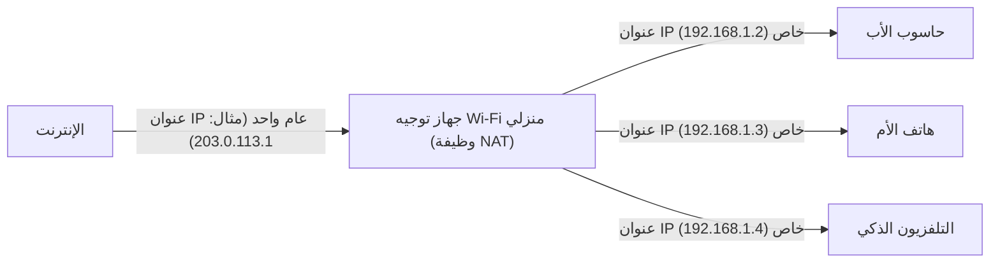

## 1. عنوان IP: "العنوان" في عالم الإنترنت

عندما تتصفح مواقع الويب أو ترسل رسالة لصديق عبر LINE، تصل البيانات إلى هاتف المستلم دون أن تضيع في شبكة الإنترنت الواسعة.
ما يجعل هذا ممكناً هو "**عنوان بروتوكول الإنترنت (IP Address)**". وهو عبارة عن "**عنوان (مكان)**" على الشبكة، يُخصص لكل الأجهزة المتصلة بالإنترنت (مثل الهواتف الذكية، الحواسيب، الخوادم، وأجهزة التوجيه).

المعيار الذي لا يزال يُستخدم على نطاق واسع حتى اليوم هو "**IPv4 (الإصدار الرابع من بروتوكول الإنترنت)**"، والذي تم توحيده في عام 1981.
يتكون عنوان IPv4 من **32 خانة** من البتات ("0 و 1") التي تتعامل معها الحواسيب (32 بت). ولتسهيل قراءتها على البشر، يتم تقسيمها إلى 4 كتل، كل منها يحتوي على 8 بتات، وتُحول إلى النظام العشري وتُفصل بنقاط. (مثال: `192.168.1.1`)

## 2. كان من المفترض أن 4.3 مليار عنوان "لن تنفد أبداً"

نظراً لأن عنوان IPv4 يتكون من 32 بت، فإن عدد التوليفات الممكنة هو "2 أس 32"، أي أنه يمكن إنشاء **حوالي 4.3 مليار** عنوان (على وجه الدقة 4,294,967,296 عنوان).

في الثمانينيات، كان الإنترنت (مثل ARPANET في ذلك الوقت) مخصصاً لربط أجهزة الحاسوب الكبيرة في بعض الجامعات، والمؤسسات العسكرية، والشركات الضخمة.
في ذلك الوقت، كان الباحثون يعتقدون بلا أدنى شك: "حتى لو ربطنا جميع أجهزة الحاسوب في العالم، فإن العدد لن يتجاوز عشرات الآلاف. **إذا كان لدينا 4.3 مليار عنوان، فلن نستهلكها أبداً حتى نهاية العالم**". نتيجة لذلك، قاموا بتوزيع العناوين بسخاء وبشكل مهدر للغاية، حيث تم تخصيص ما يصل إلى 16 مليون عنوان (الفئة A) لمنظمة واحدة، مثل الشركات الكبرى والجامعات في أمريكا.

## 3. الانتشار الهائل للإنترنت و"مشكلة استنفاد عناوين IP"

ومع ذلك، خالف التاريخ توقعاتهم بشكل كبير.
مع انتشار أجهزة الحاسوب الشخصية في المنازل العادية بفضل ظهور Windows 95 في التسعينيات، ثم الانتشار الهائل للهواتف الذكية منذ أواخر العقد الأول من القرن الحادي والعشرين، حان الوقت الذي يمتلك فيه الشخص الواحد أجهزة متعددة متصلة بالإنترنت. وعلاوة على ذلك، في الوقت الحاضر، أصبحت الأجهزة المنزلية وحتى السيارات تحتاج إلى عناوين IP بسبب [إنترنت الأشياء](/ar/p/technology-iot/) (IoT).

بينما يبلغ عدد سكان العالم حوالي 8 مليار نسمة، لا يوجد سوى 4.3 مليار عنوان.
في فبراير 2011، واجهنا حدثاً تاريخياً حيث **استنفد تجمع التخصيص الجديد لعناوين IPv4 التابع لمنظمة IANA** (المنظمة الرئيسية التي تدير عناوين IP في العالم) تماماً (أصبح المخزون صفراً).

## 4. تدابير إطالة العمر: NAT وعناوين IP الخاصة

في الوضع الطبيعي، كان من المفترض أن يشهد الإنترنت حالة من الذعر في عام 2011. ولكن لم يحدث ذلك بفضل تقنية إطالة العمر المسماة "**NAT (ترجمة عنوان الشبكة)**".

NAT هي تقنية تقوم بترجمة "العنوان العام على الإنترنت" إلى "العنوان المحلي داخل المنزل أو الشركة فقط" والعكس.
تخيل جهاز التوجيه (راوتر) Wi-Fi في المنزل.

"العنوان الحقيقي (عنوان IP العام)" الذي يقدمه مزود الخدمة لجهاز التوجيه هو **عنوان واحد فقط**.
يقوم جهاز التوجيه بتخصيص "عناوين مؤقتة (عناوين IP الخاصة)" يمكن استخدامها داخل المنزل فقط لكل جهاز من أجهزة العائلة، وفي كل مرة يتم فيها الاتصال، يقوم جهاز التوجيه بتمثيلهم وترجمة العناوين للتواصل مع الإنترنت.
بفضل هذه التقنية، **تتشارك عشرات المليارات من الأجهزة حول العالم وتقتصد في استخدام عناوين IP العامة المحدودة**، مما حال دون انهيار عالم IPv4 بأي شكل من الأشكال.

## 5. ظهور المنقذ للجيل القادم "IPv6"

ومع ذلك، فإن NAT ليست سوى "تدبير مؤقت لإطالة العمر" ولا توفر حلاً جذرياً. بالإضافة إلى ذلك، فإن عملية ترجمة العناوين مع كل اتصال تسبب تأخيراً في الاتصال.

وهنا ظهر بروتوكول الجيل التالي "**IPv6**".
تم توسيع عنوان IPv6 إلى 128 بت، ويبلغ عددها "2 أس 128" عنواناً، أي حوالي 340 أندشيليون (**حوالي 340 تريليون مضروبة في تريليون مضروبة في تريليون**)، وهو رقم فلكي.
وكثيراً ما يُشبه بأنه "**حتى لو خصصنا عنوان IP لكل حبة رمل على وجه الأرض، فسيتبقى منها**".

## 6. الخلاصة

الانتقال من IPv4 إلى IPv6 هو مشروع بنية تحتية ضخم على مستوى العالم. نظراً لعدم وجود توافقية، يجب أن تدعم جميع أجهزة التوجيه ومزودي الخدمة وخوادم الويب على الإنترنت بروتوكول IPv6، ولا تزال فترة الانتقال التي يختلط فيها المعياران مستمرة حتى الآن.
يمكن القول إن تاريخ IPv4، حيث اعتقد المصممون الأوائل أن "4.3 مليار عنوان ستكون كافية"، هو درس مثير للاهتمام يوضح صعوبة التنبؤ في عالم تكنولوجيا المعلومات، وكيف كان تطور التكنولوجيا البشرية (خاصة الهواتف المحمولة وإنترنت الأشياء) هائلاً وسريعاً.
