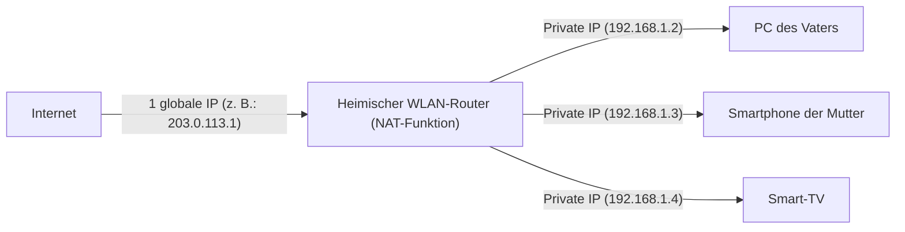

## 1. IP-Adressen: Die „Adressen“ in der Welt des Internets

Wenn Sie eine Website besuchen oder eine LINE-Nachricht an einen Freund senden, gelangen die Daten ohne sich im weiten Internet zu verirren zum Smartphone der anderen Person.
Dies wird durch die **IP-Adresse (Internet Protocol Address)** ermöglicht. Dies ist die **„Adresse (Hausnummer)“ im Netzwerk**, die allen mit dem Internet verbundenen Geräten (Smartphones, Computern, Servern, Routern usw.) zugewiesen wird.

Noch heute wird weit verbreitet der Standard **IPv4 (Internet Protocol version 4)** verwendet, der 1981 standardisiert wurde.
Eine IPv4-Adresse besteht aus **32 Stellen** (32 Bit) der „0 und 1“-Bits, die von Computern verarbeitet werden. Damit sie für Menschen lesbar ist, wird sie in vier Blöcke zu je 8 Bit unterteilt, in Dezimalzahlen umgewandelt und durch Punkte getrennt dargestellt. (Beispiel: `192.168.1.1`)

## 2. 4,3 Milliarden Adressen sollten „absolut unerschöpflich“ sein

Da die IPv4-Adresse 32 Bit umfasst, gibt es „2 hoch 32“ Kombinationsmöglichkeiten, was bedeutet, dass etwa **4,3 Milliarden** (genau 4.294.967.296) Adressen erstellt werden können.

In den 1980er Jahren war das Internet (wie das damalige ARPANET) dazu gedacht, Großrechner in einigen Universitäten, militärischen Einrichtungen und großen Unternehmen miteinander zu verbinden.
Die damaligen Forscher glaubten fest daran: „Selbst wenn wir alle Computer der Welt miteinander verbinden, werden es nur einige Zehntausend sein. **Mit 4,3 Milliarden Adressen werden sie absolut nicht aufgebraucht sein, bis die Erde untergeht.**“ Daher wurden Adressen sehr verschwenderisch vergeben, indem großen amerikanischen Unternehmen und Universitäten jeweils großzügig 16 Millionen Adressen (Klasse A) auf einmal zugewiesen wurden.

## 3. Die explosive Verbreitung des Internets und das „IP-Adressen-Erschöpfungsproblem“

Die Geschichte hat ihre Erwartungen jedoch stark enttäuscht.
Mit der Einführung von Windows 95 in den 1990er Jahren hielten Computer Einzug in die normalen Haushalte, und durch die explosive Verbreitung von Smartphones ab der zweiten Hälfte der 2000er Jahre brach eine Ära an, in der eine Person mehrere Internetgeräte besitzt. Darüber hinaus benötigen heute durch das IoT (Internet of Things) sogar Haushaltsgeräte und Autos IP-Adressen.

Während die Weltbevölkerung bei etwa 8 Milliarden liegt, gibt es nur 4,3 Milliarden Adressen.
Im Februar 2011 kam es schließlich zu einem historischen Ereignis: Der **Pool für die Neuvergabe von IPv4-Adressen bei der IANA** (der Dachorganisation, die die IP-Adressen der Welt verwaltet) **wurde vollständig erschöpft** (Bestand null).

## 4. Lebensverlängernde Maßnahme: NAT und private IP-Adressen

Eigentlich hätte das Internet 2011 in Panik geraten müssen. Dass dies nicht passierte, verdanken wir einer lebensverlängernden Technologie namens **NAT (Network Address Translation)**.

NAT ist eine Technologie, die zwischen „globalen Adressen im Internet“ und „lokalen Adressen nur im Haus oder Unternehmen“ übersetzt.
Stellen Sie sich Ihren heimischen WLAN-Router vor.

Die „echte Adresse (globale IP-Adresse)“, die der Provider dem Router zuweist, gibt es **nur ein einziges Mal**.
Der Router weist den Geräten jedes Familienmitglieds „vorläufige Adressen (private IP-Adressen)“ zu, die nur innerhalb des Hauses verwendet werden können, und bei jeder Kommunikation übersetzt der Router stellvertretend die Adresse, um mit dem Internet zu interagieren.
Durch diese Technologie **teilen sich zig Milliarden Geräte auf der ganzen Welt die begrenzten globalen IP-Adressen und sparen sie dabei ein**, weshalb die IPv4-Welt gerade noch so vor dem Zusammenbruch bewahrt werden konnte.

## 5. Der Retter der nächsten Generation: Das Aufkommen von „IPv6“

NAT ist jedoch nur eine „vorübergehende Notlösung“ und keine grundlegende Lösung. Zudem verursacht der Prozess der Adressübersetzung bei jeder Kommunikation auch Verzögerungen.

Daher trat das Protokoll der nächsten Generation, **IPv6**, auf den Plan.
Die Adresse von IPv6 ist auf 128 Bit erweitert worden, was zu einer astronomischen Zahl von „2 hoch 128“ führt, also etwa 340 Sextillionen (**etwa das 1-Billionen-mal 1-Billionen-fache von 340 Billionen**).
Es wird oft gesagt: **„Selbst wenn wir jedem Sandkorn auf der Erde eine IP-Adresse zuweisen würden, blieben noch welche übrig.“**

## 6. Zusammenfassung

Der Übergang von IPv4 zu IPv6 ist ein gewaltiges globales Infrastrukturprojekt. Da es keine Kompatibilität gibt, müssen alle Router, Provider und Webserver im Internet IPv6 unterstützen, weshalb derzeit eine Übergangsphase andauert, in der beide Standards gemischt vorkommen.
Die Geschichte von IPv4, bei der die ursprünglichen Designer dachten, „4,3 Milliarden sind genug“, ist eine interessante Lektion, die davon zeugt, wie schwer Vorhersagen in der IT-Welt sind und wie explosiv sich die menschliche Technologie (insbesondere Mobilgeräte und IoT) entwickelt hat.
