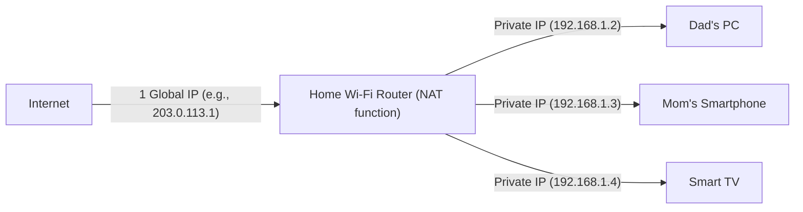

## 1. IP Address: The "Address" in the Internet World

When you view a website or send a LINE message to a friend, the data reaches their smartphone without getting lost in the vast internet.
What makes this possible is the "**IP Address (Internet Protocol Address)**". This is the **"address" on the network** assigned to all devices (smartphones, computers, servers, routers, etc.) connected to the internet.

The standard still widely used today is "**IPv4 (Internet Protocol version 4)**", which was standardized in 1981.
An IPv4 address is a sequence of **32 digits** (32 bits) of "0s and 1s" handled by computers. For humans to easily read it, it is divided into 4 blocks of 8 bits each, converted to decimal, and separated by dots. (e.g., `192.168.1.1`)

## 2. 4.3 Billion Addresses Were Supposed to Be "Absolutely Inexhaustible"

Because IPv4 addresses are 32 bits, there are "2 to the power of 32" possible combinations, meaning **about 4.3 billion** (exactly 4,294,967,296) addresses can be created.

In the 1980s, the internet (such as ARPANET at the time) was meant to connect large computers in some universities, military institutions, and huge corporations.
Researchers at the time firmly believed, "Even if we connect all the computers in the world, there will be tens of thousands. **With 4.3 billion addresses, we will never run out until the end of the world.**" Because of this, they allocated addresses very wastefully, generously handing out 16 million addresses (Class A) to a single organization like large American corporations or universities.

## 3. Explosive Spread of the Internet and the "IP Address Exhaustion Problem"

However, history betrayed their expectations significantly.
The spread of personal computers to ordinary households with the introduction of Windows 95 in the 1990s, and the explosive spread of smartphones since the late 2000s, brought about an era where a single person owns multiple internet devices. Furthermore, today, even home appliances and cars require IP addresses due to IoT (Internet of Things).

While the global population is about 8 billion, there are only 4.3 billion addresses.
In February 2011, a historic event finally occurred: the pool of new IPv4 address allocations by IANA (the main organization that manages global IP addresses) was **completely exhausted** (zero inventory).

## 4. Life Extension Measures: NAT and Private IP Addresses

Normally, the internet should have panicked in 2011. However, what prevented this was a life-extending technology called "**NAT (Network Address Translation)**".

NAT is a technology that translates between "global addresses on the internet" and "local addresses only inside homes or companies".
Imagine a home Wi-Fi router.

The router is given **only one** "real address (Global IP address)" by the provider.
The router assigns "temporary addresses (Private IP addresses)" that can only be used inside the house to each family member's device, and for every communication, the router translates the address on their behalf to interact with the internet.
Thanks to this technology, **tens of billions of devices around the world are saving and sharing limited global IP addresses**, which is why the IPv4 world has barely managed to avoid collapsing.

## 5. Appearance of the Next-Generation Savior, "IPv6"

However, NAT is only a "makeshift life extension measure" and not a fundamental solution. Also, the process of translating addresses for every communication causes delays.

Therefore, the next-generation protocol "**IPv6**" emerged.
IPv6 addresses are expanded to 128 bits, and the number is "2 to the power of 128", which is an astronomical number of about 340 undecillion (**about 340 trillion times 1 trillion times 1 trillion**).
It is often compared to "**even if you assign an IP address to every grain of sand on Earth, there will be leftovers.**"

## 6. Conclusion

The transition from IPv4 to IPv6 is a magnificent global-scale infrastructure project. Because there is no compatibility, all routers, providers, and Web servers on the internet must support IPv6, and the transition period with the two mixed standards continues today.
The history of IPv4, where early designers thought "4.3 billion is enough," can be said to be an interesting lesson that tells how difficult prediction is in the IT world and how explosive the evolution of human technology (especially mobile and IoT) has been.
