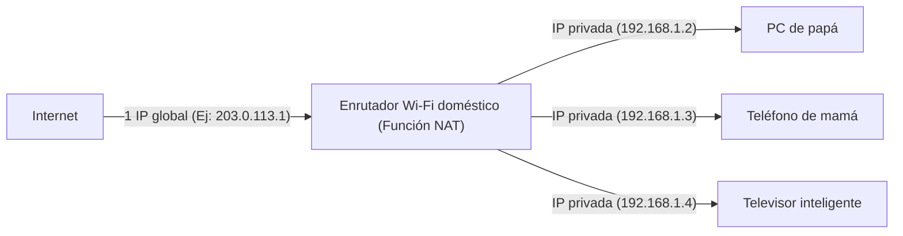

## 1. Direcciones IP: Las "direcciones" del mundo de Internet

Cuando navegas por un sitio web o envías un mensaje de LINE a un amigo, los datos llegan al teléfono de la otra persona sin perderse en la vasta Internet.
Lo que hace esto posible es la "**dirección IP (Internet Protocol Address)**". Esta es una **"dirección" en la red** asignada a todos los dispositivos conectados a Internet (teléfonos inteligentes, computadoras, servidores, enrutadores, etc.).

El estándar que todavía se usa ampliamente en la actualidad es "**IPv4 (Internet Protocol version 4)**", estandarizado en 1981.
La dirección IPv4 es una secuencia de **32 dígitos** (32 bits) de "0 y 1" manejados por computadoras. Para que sea más fácil de leer para los humanos, se divide en cuatro bloques de 8 bits cada uno, se convierte al sistema decimal y se separa con puntos. (Ejemplo: `192.168.1.1`)

## 2. Se suponía que 4.300 millones de direcciones eran "absolutamente inagotables"

Dado que la dirección IPv4 es de 32 bits, el número de combinaciones es "2 a la 32ª potencia", es decir, se pueden crear **aproximadamente 4.300 millones** (exactamente 4.294.967.296) de direcciones.

En la década de 1980, Internet (como ARPANET en ese momento) servía para conectar grandes computadoras en algunas universidades, instituciones militares y corporaciones gigantes.
Los investigadores de esa época creían sin lugar a dudas: "Incluso si conectamos todas las computadoras del mundo, serán solo unas pocas decenas de miles. **Con 4.300 millones de direcciones, nunca se agotarán hasta el fin del mundo**". Por lo tanto, realizaron distribuciones bastante ineficientes, como asignar generosamente 16 millones de direcciones (Clase A) a una sola organización, como grandes empresas o universidades estadounidenses.

## 3. La propagación explosiva de Internet y el "Problema de agotamiento de las direcciones IP"

Sin embargo, la historia traicionó enormemente sus expectativas.
Con la llegada de Windows 95 en la década de 1990, las computadoras personales se generalizaron en los hogares, y con la propagación explosiva de los teléfonos inteligentes desde fines de la década de 2000, llegó una era en la que una sola persona posee múltiples dispositivos de Internet. Además, en la actualidad, incluso los electrodomésticos y los automóviles requieren direcciones IP debido al IoT (Internet de las cosas).

Mientras que la población mundial es de aproximadamente 8.000 millones, solo hay 4.300 millones de direcciones.
En febrero de 2011, finalmente se produjo una situación histórica en la que **el grupo de nuevas asignaciones de direcciones IPv4 de la IANA (la organización principal que gestiona las direcciones IP del mundo) se agotó por completo** (inventario cero).

## 4. Medida para prolongar la vida: NAT y direcciones IP privadas

Originalmente, se suponía que Internet entraría en pánico en 2011. Sin embargo, no fue así gracias a una tecnología de prolongación de vida llamada "**NAT (Network Address Translation)**".

NAT es una tecnología que convierte "direcciones globales en Internet" en "direcciones locales solo dentro del hogar o la empresa".
Imagina un enrutador Wi-Fi doméstico.

Solo hay **una** "dirección real (dirección IP global)" otorgada al enrutador por el proveedor.
El enrutador asigna una "dirección temporal (dirección IP privada)", que solo se puede usar dentro de la casa, a cada dispositivo de la familia, y en cada comunicación, el enrutador traduce la dirección en su nombre y se comunica con Internet.
Gracias a esta tecnología, **decenas de miles de millones de dispositivos en todo el mundo comparten y ahorran las limitadas direcciones IP globales**, razón por la cual el mundo de IPv4 ha logrado evitar el colapso.

## 5. La aparición del salvador de próxima generación "IPv6"

Sin embargo, NAT es solo una "medida provisional para prolongar la vida" y no es una solución fundamental. Además, el proceso de traducir la dirección en cada comunicación también causa retrasos.

Ahí es donde entra el protocolo de próxima generación, "**IPv6**".
La dirección IPv6 se expande a 128 bits, y el número es "2 a la 128ª potencia", lo que resulta en un número astronómico de aproximadamente 340 sextillones (**aproximadamente 340 billones de veces un billón de veces un billón**).
A menudo se compara con "tener más que suficiente incluso si se asigna una dirección IP a **cada grano de arena en la Tierra**".

## 6. Resumen

La transición de IPv4 a IPv6 es un proyecto de infraestructura épico a escala global. Debido a la falta de compatibilidad, todos los enrutadores, proveedores y servidores web en Internet deben admitir IPv6, y actualmente continúa un período de transición donde conviven ambos estándares.
La historia de IPv4, donde los diseñadores iniciales pensaron que "4.300 millones son suficientes", puede considerarse una lección interesante que cuenta la dificultad de predecir en el mundo de la TI y cuán explosiva ha sido la evolución de la tecnología humana (especialmente en móviles e IoT).
