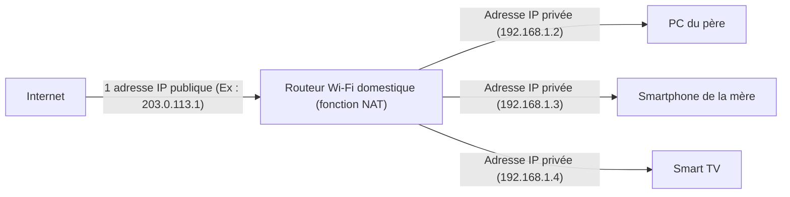

## 1. L'adresse IP : L'« adresse » du monde d'Internet

Lorsque vous consultez un site Web ou envoyez un message LINE à un ami, les données parviennent jusqu'au smartphone de votre correspondant sans se perdre dans le vaste Internet.
Ce qui rend cela possible est l'**adresse IP (Internet Protocol Address)**. Il s'agit d'une **« adresse » (numéro de rue) sur le réseau** attribuée à tous les appareils connectés à Internet (smartphones, ordinateurs, serveurs, routeurs, etc.).

La norme encore largement utilisée aujourd'hui est l'**IPv4 (Internet Protocol version 4)**, standardisée en 1981.
Une adresse IPv4 est constituée de **32 chiffres** (32 bits) de « 0 et 1 » manipulés par les ordinateurs. Pour qu'elle soit plus lisible pour les humains, elle est divisée en 4 blocs de 8 bits chacun, convertie en système décimal et séparée par des points. (Exemple : `192.168.1.1`)

## 2. Les 4,3 milliards d'adresses devaient être « absolument inépuisables »

Puisque l'adresse IPv4 compte 32 bits, le nombre de combinaisons est de « 2 à la puissance 32 », ce qui permet de créer **environ 4,3 milliards** (très exactement 4 294 967 296) d'adresses.

Dans les années 1980, Internet (comme l'ARPANET de l'époque) servait à connecter entre eux les grands ordinateurs de certaines universités, des institutions militaires et des grandes entreprises.
Les chercheurs de l'époque étaient persuadés que « même si l'on connectait tous les ordinateurs du monde, il n'y en aurait que quelques dizaines de milliers. **Avec 4,3 milliards d'adresses, nous ne les épuiserons jamais, même si la Terre devait disparaître** ». De ce fait, ils ont procédé à une distribution très peu économe, attribuant généreusement pas moins de 16 millions d'adresses (Classe A) à une seule organisation, comme de grandes entreprises ou universités américaines.

## 3. L'expansion explosive d'Internet et le « problème d'épuisement des adresses IP »

Cependant, l'histoire a largement contredit leurs prévisions.
Avec la diffusion des ordinateurs personnels dans les foyers dans les années 1990 suite à l'apparition de Windows 95, puis la popularisation explosive des smartphones à partir de la fin des années 2000, l'ère où une seule personne possède plusieurs appareils connectés à Internet est arrivée. De plus, aujourd'hui, avec l'IoT (Internet des Objets), même les appareils électroménagers et les voitures ont besoin d'une adresse IP.

Alors que la population mondiale s'élève à environ 8 milliards d'habitants, il n'y a que 4,3 milliards d'adresses.
En février 2011, nous avons finalement fait face à une situation historique où **le pool d'attribution de nouvelles adresses IPv4 de l'IANA (l'organisation principale qui gère les adresses IP dans le monde) s'est complètement épuisé** (stock zéro).

## 4. Mesure de prolongation : le NAT et les adresses IP privées

Normalement, Internet aurait dû sombrer dans la panique en 2011. Si cela ne s'est pas produit, c'est grâce à une technologie de prolongation appelée « **NAT (Network Address Translation)** ».

Le NAT est une technologie qui convertit une « adresse publique sur Internet » en une « adresse locale utilisable uniquement à la maison ou en entreprise ».
Imaginez le routeur Wi-Fi de votre maison.

Il n'y a qu'**une seule** « véritable adresse (adresse IP publique) » fournie par le fournisseur d'accès à votre routeur.
Le routeur attribue une « adresse provisoire (adresse IP privée) » utilisable uniquement à l'intérieur de la maison à chaque appareil de la famille. À chaque communication, le routeur se charge de convertir l'adresse et de communiquer avec Internet en leur nom.
Grâce à cette technologie, **des dizaines de milliards d'appareils dans le monde partagent le nombre limité d'adresses IP publiques tout en les économisant**, ce qui a permis d'éviter de justesse l'effondrement du monde de l'IPv4.

## 5. L'arrivée du sauveur de la prochaine génération, « IPv6 »

Cependant, le NAT n'est qu'une « mesure de prolongation temporaire » et ne constitue pas une solution fondamentale. De plus, le processus de conversion d'adresse à chaque communication entraîne également des retards.

C'est là qu'intervient le protocole de nouvelle génération, « **IPv6** ».
L'adresse IPv6 a été étendue à 128 bits, ce qui porte son nombre à « 2 à la puissance 128 », soit un nombre astronomique d'environ 340 sextillions (**environ 340 billions de billions de billions**).
On l'illustre souvent en disant que « **même si l'on attribuait une adresse IP à chaque grain de sable sur Terre, il en resterait encore** ».

## 6. Résumé

La transition de l'IPv4 à l'IPv6 est un immense chantier d'infrastructure à l'échelle mondiale. En l'absence de compatibilité, tous les routeurs, fournisseurs d'accès et serveurs Web sur Internet doivent prendre en charge l'IPv6, ce qui explique pourquoi nous sommes toujours dans une période de transition où les deux normes coexistent.
L'histoire de l'IPv4, où ses premiers concepteurs pensaient que « 4,3 milliards suffiraient amplement », constitue une leçon fascinante sur la difficulté de faire des prévisions dans le monde de l'informatique, et illustre à quel point l'évolution des technologies humaines (en particulier le mobile et l'IoT) a été explosive.
