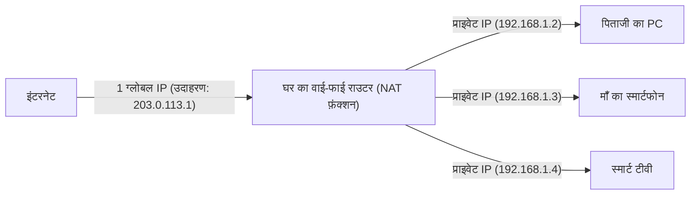

## 1. IP एड्रेस: इंटरनेट की दुनिया का "पता"

जब आप कोई वेबसाइट देखते हैं या किसी दोस्त को LINE भेजते हैं, तो डेटा विशाल इंटरनेट में खोए बिना प्राप्तकर्ता के स्मार्टफोन तक पहुँच जाता है।
इसे संभव बनाने वाला **IP एड्रेस (Internet Protocol Address)** है। यह इंटरनेट से जुड़े हर उपकरण (स्मार्टफोन, कंप्यूटर, सर्वर, राउटर आदि) को सौंपा गया नेटवर्क पर एक **"पता" (address)** है।

आज भी व्यापक रूप से उपयोग किया जाने वाला मानक **IPv4 (Internet Protocol version 4)** है, जिसे 1981 में मानकीकृत किया गया था।
IPv4 एड्रेस **32 अंकों** (32-बिट) की एक स्ट्रिंग है जिसमें "0 और 1" होते हैं जिन्हें कंप्यूटर प्रोसेस करता है। इंसानों के पढ़ने में आसानी के लिए, इसे 8 बिट्स के 4 ब्लॉकों में विभाजित किया जाता है, दशमलव में परिवर्तित किया जाता है, और बिंदुओं से अलग किया जाता है। (उदाहरण: `192.168.1.1`)

## 2. 4.3 बिलियन पते "कभी भी पूरी तरह से इस्तेमाल नहीं किए जा सकते थे"

चूंकि IPv4 एड्रेस 32-बिट का है, इसलिए इसके "2 की घात 32" संयोजन हो सकते हैं, यानी **लगभग 4.3 बिलियन** (सटीक रूप से 4,294,967,296) पते बनाए जा सकते हैं।

1980 के दशक में, इंटरनेट (उस समय ARPANET आदि) का उपयोग कुछ विश्वविद्यालयों, सैन्य संस्थानों और बड़ी कंपनियों के बड़े कंप्यूटरों को जोड़ने के लिए किया जाता था।
उस समय के शोधकर्ताओं का दृढ़ विश्वास था, "भले ही हम दुनिया के सभी कंप्यूटरों को जोड़ लें, वे केवल कुछ हज़ार ही होंगे। **अगर 4.3 बिलियन पते हैं, तो दुनिया के खत्म होने तक उन्हें कभी भी पूरी तरह से इस्तेमाल नहीं किया जा सकता है।**" इसलिए, उन्होंने अमेरिकी बड़े निगमों और विश्वविद्यालयों को काफी बेकार तरीके से पते आवंटित किए, जैसे कि एक ही संगठन को एक साथ 16 मिलियन (क्लास A) पते दे देना।

## 3. इंटरनेट का विस्फोटक प्रसार और "IP एड्रेस की कमी की समस्या"

हालाँकि, इतिहास ने उनकी उम्मीदों को पूरी तरह से गलत साबित कर दिया।
1990 के दशक में Windows 95 की शुरुआत के साथ आम घरों में पर्सनल कंप्यूटर के प्रसार, और 2000 के दशक के उत्तरार्ध से स्मार्टफोन के विस्फोटक प्रसार के साथ, एक ऐसा युग आ गया जहाँ एक व्यक्ति के पास कई इंटरनेट उपकरण हैं। इसके अलावा, आज IoT (इंटरनेट ऑफ थिंग्स) के कारण घरेलू उपकरणों और कारों को भी IP एड्रेस की आवश्यकता होती है।

जबकि दुनिया की आबादी लगभग 8 बिलियन है, पते केवल 4.3 बिलियन हैं।
फरवरी 2011 में, IANA (विश्व के IP एड्रेस का प्रबंधन करने वाला मुख्य संगठन) का **IPv4 एड्रेस का नया आवंटन पूल पूरी तरह से समाप्त** (इन्वेंट्री शून्य) हो गया, जो एक ऐतिहासिक घटना थी।

## 4. जीवनरक्षक उपाय: NAT और प्राइवेट IP एड्रेस

सामान्य तौर पर, 2011 में इंटरनेट पर अफरा-तफरी मच जानी चाहिए थी। लेकिन ऐसा नहीं हुआ, इसका श्रेय **NAT (Network Address Translation)** नामक जीवनरक्षक तकनीक को जाता है।

NAT एक ऐसी तकनीक है जो "इंटरनेट पर ग्लोबल पते" और "घर या कंपनी के अंदर के लोकल पते" के बीच अनुवाद करती है।
अपने घर के वाई-फाई राउटर की कल्पना करें।

प्रदाता (Provider) द्वारा राउटर को दिया गया "असली पता (ग्लोबल IP एड्रेस)" **केवल एक** होता है।
राउटर परिवार के प्रत्येक उपकरण को "अस्थायी पता (प्राइवेट IP एड्रेस)" सौंपता है जिसका उपयोग केवल घर के अंदर किया जा सकता है, और हर बार संचार होने पर इंटरनेट के साथ संवाद करने के लिए राउटर प्रतिनिधि के रूप में पते का अनुवाद करता है।
इस तकनीक के कारण, **दुनिया भर में अरबों उपकरण सीमित ग्लोबल IP एड्रेस को बचाते हुए साझा कर रहे हैं**, इसलिए किसी तरह IPv4 की दुनिया ढहने से बच गई है।

## 5. अगली पीढ़ी के रक्षक "IPv6" का आगमन

हालाँकि, NAT केवल ഏക "अस्थायी जीवनरक्षक उपाय" है और यह कोई मौलिक समाधान नहीं है। इसके अलावा, हर बार संचार होने पर पते का अनुवाद करने की प्रक्रिया देरी (latency) का कारण भी बनती है।

इसलिए अगली पीढ़ी का प्रोटोकॉल **IPv6** सामने आया।
IPv6 एड्रेस को 128 बिट्स तक बढ़ाया गया है, और इसकी संख्या "2 की घात 128" है, जो कि लगभग 340 अनडेसिलियन (undecillion) (**लगभग 340 ट्रिलियन का 1 ट्रिलियन गुणा 1 ट्रिलियन**) जैसी खगोलीय संख्या है।
इसकी तुलना अक्सर यह कहकर की जाती है कि **"पृथ्वी पर रेत के हर कण को एक IP एड्रेस देने के बाद भी पते बच जाएंगे"**।

## 6. निष्कर्ष

IPv4 से IPv6 की ओर जाना वैश्विक पैमाने पर एक बहुत बड़ा बुनियादी ढाँचा (infrastructure) प्रोजेक्ट है। चूंकि इसमें संगतता (compatibility) नहीं है, इसलिए इंटरनेट पर सभी राउटर, प्रदाता और वेब सर्वर को IPv6 का समर्थन करने की आवश्यकता है, और वर्तमान में एक संक्रमण काल (transition period) चल रहा है जहाँ दोनों मानक एक साथ मौजूद हैं।
IPv4 का इतिहास, जहाँ शुरुआती डिजाइनरों ने सोचा था कि "4.3 बिलियन पर्याप्त हैं", आईटी की दुनिया में भविष्यवाणी करने की कठिनाई और मानव प्रौद्योगिकी (विशेष रूप से मोबाइल और IoT) के विकास के विस्फोटक स्वरूप की एक दिलचस्प कहानी और सबक है।
