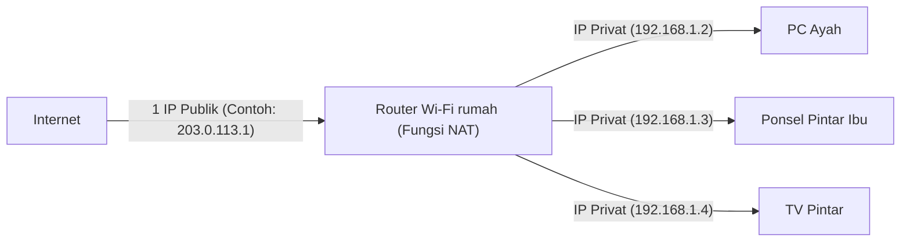

## 1. Alamat IP: "Alamat" di Dunia Internet

Saat Anda melihat situs web atau mengirim pesan LINE ke teman, data tidak tersesat di dalam internet yang luas melainkan sampai ke ponsel pintar penerima.
Hal ini dimungkinkan oleh **"Alamat IP (Internet Protocol Address)"**. Ini adalah **"alamat (nomor rumah)"** di jaringan, yang ditetapkan untuk semua perangkat (ponsel pintar, PC, server, router, dll.) yang terhubung ke internet.

Standar yang masih banyak digunakan saat ini adalah **"IPv4 (Internet Protocol version 4)"**, yang distandardisasi pada tahun 1981.
Alamat IPv4 terdiri dari **32 digit** bit "0 dan 1" yang ditangani oleh komputer (32-bit). Agar mudah dibaca manusia, alamat ini dibagi menjadi 4 blok masing-masing 8-bit, dikonversi menjadi bilangan desimal, dan dipisahkan oleh titik. (Contoh: `192.168.1.1`)

## 2. 4,3 Miliar Alamat Seharusnya "Tidak Akan Pernah Habis"

Karena alamat IPv4 adalah 32-bit, kombinasinya adalah "2 pangkat 32" cara, yaitu dapat dibuat sekitar **4,3 miliar** (tepatnya 4.294.967.296) alamat.

Pada tahun 1980-an, internet (saat itu ARPANET, dll.) bertujuan untuk menghubungkan komputer-komputer besar di beberapa universitas, lembaga militer, dan perusahaan besar.
Para peneliti saat itu percaya tanpa ragu bahwa, "Bahkan jika semua komputer di dunia dihubungkan, jumlahnya hanya akan mencapai puluhan ribu. **Dengan 4,3 miliar alamat, kita tidak akan pernah kehabisan sampai bumi hancur**". Oleh karena itu, mereka melakukan alokasi yang sangat boros, seperti dengan murah hati memberikan 16 juta alamat (Kelas A) ke satu organisasi untuk perusahaan besar atau universitas di Amerika.

## 3. Ledakan Popularitas Internet dan "Masalah Kehabisan Alamat IP"

Namun, sejarah sangat bertolak belakang dengan prediksi mereka.
Dengan menyebarnya PC ke rumah tangga umum melalui kemunculan Windows 95 pada tahun 1990-an, dan ledakan popularitas ponsel pintar sejak akhir tahun 2000-an, era di mana satu orang memiliki banyak perangkat internet telah tiba. Selain itu, saat ini dengan adanya IoT (Internet of Things), bahkan peralatan rumah tangga dan mobil pun membutuhkan alamat IP.

Sementara populasi dunia adalah sekitar 8 miliar orang, alamat IP hanya ada 4,3 miliar.
Pada bulan Februari 2011, akhirnya tiba situasi bersejarah di mana kumpulan alokasi baru alamat IPv4 dari IANA (organisasi utama yang mengelola alamat IP dunia) **sepenuhnya habis** (stok nol).

## 4. Tindakan Perpanjangan Usia: NAT dan Alamat IP Privat

Jika sesuai rencana, internet seharusnya panik pada tahun 2011. Namun, hal itu tidak terjadi berkat teknologi perpanjangan usia yang disebut **"NAT (Network Address Translation)"**.

NAT adalah teknologi yang menerjemahkan antara "alamat publik di internet" dan "alamat lokal hanya di dalam rumah atau perusahaan".
Bayangkan router Wi-Fi di rumah.

Alamat sebenarnya (alamat IP publik) yang diberikan oleh penyedia layanan internet (provider) ke router **hanya ada satu**.
Router menetapkan "alamat sementara (alamat IP privat)" yang hanya dapat digunakan di dalam rumah ke setiap perangkat anggota keluarga, dan setiap kali ada komunikasi, router mewakili untuk menerjemahkan alamat dan berinteraksi dengan internet.
Berkat teknologi ini, **puluhan miliar perangkat di seluruh dunia berbagi dengan menghemat alamat IP publik yang terbatas**, sehingga dunia IPv4 entah bagaimana berhasil terhindar dari kehancuran.

## 5. Kemunculan Penyelamat Generasi Berikutnya "IPv6"

Namun, NAT hanyalah "langkah perpanjangan usia sementara" dan bukan merupakan solusi mendasar. Selain itu, proses penerjemahan alamat pada setiap komunikasi juga menjadi penyebab kelambatan (latensi).

Oleh karena itu, muncullah protokol generasi berikutnya, **"IPv6"**.
Alamat IPv6 telah diperluas menjadi 128-bit, dan jumlahnya menjadi "2 pangkat 128" buah, yaitu sekitar 340 undecillion (**sekitar 340 triliun dikali 1 triliun dikali 1 triliun**) yang merupakan angka astronomis.
Sering diumpamakan bahwa **"meskipun setiap butir pasir di bumi diberi alamat IP, masih akan ada sisa"**.

## 6. Kesimpulan

Transisi dari IPv4 ke IPv6 adalah pekerjaan infrastruktur skala besar di tingkat dunia. Karena tidak ada kompatibilitas, semua router, penyedia layanan (provider), dan server web di internet harus mendukung IPv6, dan masa transisi di mana kedua standar tersebut bercampur masih berlanjut hingga saat ini.
Sejarah IPv4, di mana para perancang awal menganggap "4,3 miliar sudah cukup", dapat dikatakan sebagai pelajaran menarik yang menunjukkan betapa sulitnya membuat prediksi di dunia TI, dan betapa meledaknya evolusi teknologi umat manusia (terutama seluler dan IoT).
