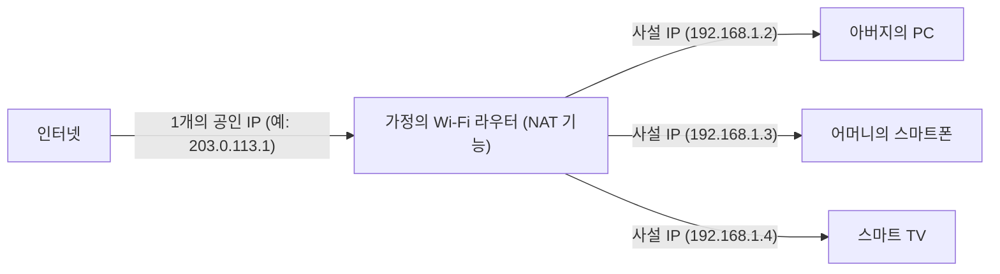

## 1. IP 주소: 인터넷 세계의 '주소'

여러분이 웹사이트를 보거나 친구에게 LINE을 보낼 때, 데이터는 광대한 인터넷 속에서 길을 잃지 않고 상대방의 스마트폰까지 도착합니다.
이것을 가능하게 하는 것이 '**IP 주소(Internet Protocol Address)**'입니다. 이것은 인터넷에 연결된 모든 기기(스마트폰, PC, 서버, 라우터 등)에 할당되는 **네트워크상의 '주소(번지)'** 입니다.

현재도 널리 사용되고 있는 것이 1981년에 표준화된 '**IPv4(Internet Protocol version 4)**'라는 규격입니다.
IPv4의 주소는 컴퓨터가 다루는 '0과 1'의 비트가 **32자리** 나열된 것(32비트)입니다. 인간이 읽기 쉽도록 8비트씩 4개의 블록으로 나누고, 10진수로 고쳐 점으로 구분하여 표현합니다. (예: `192.168.1.1`)

## 2. 43억 개의 주소는 '절대로 다 쓸 수 없을' 터였다

IPv4의 주소는 32비트이므로, 조합은 '2의 32제곱' 가지, 즉 **약 43억 개** (정확히는 4,294,967,296개)의 주소를 만들 수 있습니다.

1980년대 당시, 인터넷(당시의 ARPANET 등)은 일부 대학이나 군사 기관, 거대 기업에 있는 대형 컴퓨터끼리 연결하기 위한 것이었습니다.
당시의 연구자들은 '전 세계의 컴퓨터를 전부 연결해도 수만 대일 것이다. **43억 개나 주소가 있으면 지구가 멸망할 때까지 절대로 다 쓸 수 없다**'라고 굳게 믿고 의심하지 않았습니다. 그래서 미국의 대기업이나 대학에 대해, 1개의 조직에 1600만 개(클래스 A)나 되는 주소를 아낌없이 뭉텅이로 할당하는 등, 꽤 낭비가 심한 배분을 하고 있었습니다.

## 3. 인터넷의 폭발적 보급과 'IP 주소 고갈 문제'

그러나 역사는 그들의 예상을 크게 빗나갔습니다.
1990년대 Windows 95의 등장에 의한 PC의 일반 가정 보급, 그리고 2000년대 후반부터의 스마트폰의 폭발적인 보급에 의해, 1명이 여러 개의 인터넷 단말기를 가지는 시대가 도래했습니다. 나아가 현재는 IoT(사물 인터넷)에 의해 가전이나 자동차까지도 IP 주소를 필요로 하고 있습니다.

세계 인구가 약 80억 명인데 반해, 주소는 43억 개밖에 없습니다.
2011년 2월, 마침내 IANA(세계의 IP 주소를 관리하는 근원 조직)의 **IPv4 주소의 신규 할당 풀이 완전히 고갈** (재고 제로)되는 역사적인 사태를 맞이했습니다.

## 4. 연명 조치: NAT와 사설 IP 주소

본래라면 2011년에 인터넷은 패닉에 빠졌어야 했습니다. 하지만 그렇게 되지 않은 것은 '**NAT(Network Address Translation)**'라는 연명 기술 덕분입니다.

NAT는 '인터넷상의 공인 주소'와 '집이나 회사 안에서만의 사설 주소'를 변환하는 기술입니다.
가정의 Wi-Fi 라우터를 상상해 보세요.

프로바이더로부터 라우터에 주어지는 '진짜 주소(공인 IP 주소)'는 **1개뿐** 입니다.
라우터는 집 안에서만 사용할 수 있는 '임시 주소(사설 IP 주소)'를 가족의 각 단말기에 할당하고, 통신할 때마다 라우터가 대표로 주소를 변환하여 인터넷과 주고받습니다.
이 기술에 의해 **전 세계의 수백억 대의 단말기가 한정된 공인 IP 주소를 절약하며 공유하고 있기** 때문에, 그나마 IPv4의 세계가 붕괴되지 않고 무사한 것입니다.

## 5. 차세대 구세주 'IPv6'의 등장

그러나 NAT는 어디까지나 '임시방편의 연명 조치'에 불과하며, 근본적인 해결책이 되지 않습니다. 또한 통신할 때마다 주소를 변환하는 처리 과정은 지연의 원인이 되기도 합니다.

그래서 등장한 것이 차세대 프로토콜 '**IPv6**'입니다.
IPv6의 주소는 128비트로 확장되어 있으며, 그 수는 '2의 128제곱' 개, 즉 약 340간(澗) 개( **약 340조의 1조 배의 1조 배** )라는 천문학적인 수가 됩니다.
흔히 '**지구상의 모든 모래알에 IP 주소를 할당해도 남는다**'고 비유됩니다.

## 6. 요약

IPv4에서 IPv6로의 이행은 세계 규모의 장대한 인프라 공사입니다. 호환성이 없기 때문에 인터넷상의 모든 라우터나 공급자, 웹 서버가 IPv6에 대응해야 하며, 현재도 두 개의 규격이 혼재된 이행 기간이 계속되고 있습니다.
초기 설계자들이 '43억 개면 충분하다'고 생각했던 IPv4의 역사는, IT 세계에 있어서 예측의 어려움과 인류의 기술(특히 모바일과 IoT)의 진화가 얼마나 폭발적이었는지를 말해주는 흥미로운 교훈이라고 할 수 있을 것입니다.
