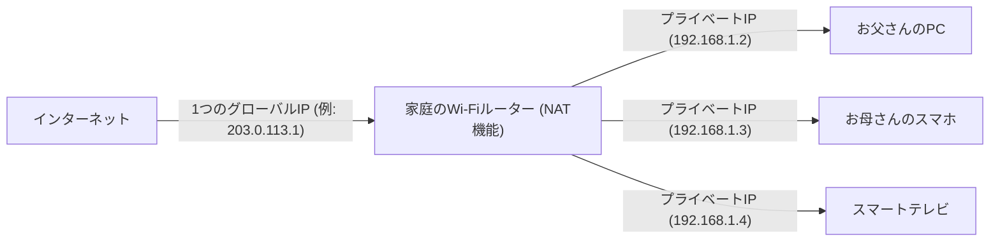

## 1. IPアドレス：インターネットの世界の「住所」

あなたがWebサイトを見たり、友人にLINEを送ったりするとき、データは広大なインターネットの中を迷子にならずに相手のスマホまで届きます。
これを可能にしているのが「**IPアドレス（Internet Protocol Address）**」です。これは、インターネットに接続されたすべての機器（スマホ、パソコン、サーバー、ルーターなど）に割り当てられる、**ネットワーク上の「住所（番地）」**です。

現在でも広く使われているのが、1981年に標準化された「**IPv4（Internet Protocol version 4）**」という規格です。
IPv4のアドレスは、コンピュータが扱う「0と1」のビットが**32桁**並んだもの（32ビット）です。人間が読みやすいように、8ビットずつ4つのブロックに分け、10進数に直してドットで区切って表現します。（例: `192.168.1.1`）

## 2. 43億個のアドレスは「絶対に使い切れない」はずだった

IPv4のアドレスは32ビットなので、組み合わせは「2の32乗」通り、すなわち**約43億個**（正確には4,294,967,296個）の住所を作ることができます。

1980年代当時、インターネット（当時のARPANETなど）は一部の大学や軍事機関、巨大企業にある大型コンピュータ同士を繋ぐためのものでした。
当時の研究者たちは、「世界中のコンピュータを全部繋いでも数万台だろう。**43億個もアドレスがあれば、地球が滅亡するまで絶対に使い切れない**」と信じて疑いませんでした。そのため、アメリカの大企業や大学に対して、1つの組織に1600万個（クラスA）ものアドレスを気前よくドサッと割り当てるなど、かなり無駄の多い配分を行っていました。

## 3. インターネットの爆発的普及と「IPアドレス枯渇問題」

しかし、歴史は彼らの予想を大きく裏切りました。
1990年代のWindows 95の登場によるパソコンの一般家庭への普及、そして2000年代後半からのスマートフォンの爆発的な普及により、1人が複数のインターネット端末を持つ時代が到来しました。さらに現在では、IoT（[モノのインターネット](/p/technology-iot/)）によって家電や自動車までもがIPアドレスを必要としています。

世界人口が約80億人であるのに対し、アドレスは43億個しかありません。
2011年2月、ついにIANA（世界のIPアドレスを管理する大元の組織）の**IPv4アドレスの新規割り当てプールが完全に枯渇**（在庫ゼロ）するという歴史的な事態を迎えました。

## 4. 延命措置：NATとプライベートIPアドレス

本来なら2011年にインターネットはパニックになるはずでした。しかし、そうならなかったのは「**NAT（Network Address Translation）**」という延命技術のおかげです。

NATは、「インターネット上のグローバル住所」と「家や会社の中だけのローカル住所」を変換する技術です。
家庭のWi-Fiルーターを想像してください。

プロバイダからルーターに与えられる「本当の住所（グローバルIPアドレス）」は**1つだけ**です。
ルーターは家の中だけで使える「仮の住所（プライベートIPアドレス）」を家族の各端末に割り当て、通信のたびにルーターが代表して住所を変換してインターネットとやり取りします。
この技術によって、**世界中の何百億台という端末が、限られたグローバルIPアドレスを節約しながらシェアしている**ため、なんとかIPv4の世界が崩壊せずに済んでいるのです。

## 5. 次世代の救世主「IPv6」の登場

しかし、NATはあくまで「その場しのぎの延命措置」に過ぎず、根本的な解決にはなりません。また、通信のたびにアドレスを変換する処理は遅延の原因にもなります。

そこで登場したのが、次世代のプロトコル「**IPv6**」です。
IPv6のアドレスは128ビットに拡張されており、その数は「2の128乗」個、つまり約340澗（かん）個（**約340兆の1兆倍の1兆倍**）という天文学的な数になります。
よく「**地球上のすべての砂粒にIPアドレスを割り当てても余る**」と例えられます。

## 6. まとめ

IPv4からIPv6への移行は、世界規模の壮大なインフラ工事です。互換性がないため、インターネット上のすべてのルーターやプロバイダ、WebサーバーがIPv6に対応する必要があり、現在も2つの規格が混在した移行期間が続いています。
初期の設計者たちが「43億個で十分」と考えたIPv4の歴史は、ITの世界における予測の難しさと、人類のテクノロジー（特にモバイルとIoT）の進化がいかに爆発的であったかを物語る、興味深い教訓と言えるでしょう。
