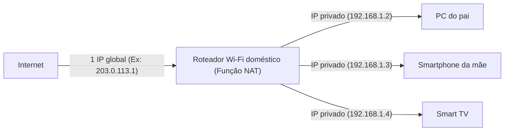

## 1. Endereço IP: O "Endereço" do Mundo da Internet

Quando você visualiza um site ou envia uma mensagem no LINE para um amigo, os dados chegam ao smartphone da outra pessoa sem se perderem na vasta Internet.
O que torna isso possível é o "**Endereço IP (Internet Protocol Address)**". Este é um "**endereço (número de local)**" na rede atribuído a todos os dispositivos (smartphones, PCs, servidores, roteadores, etc.) conectados à Internet.

Ainda amplamente utilizado hoje em dia, o "**IPv4 (Internet Protocol version 4)**" é um padrão padronizado em 1981.
Um endereço IPv4 consiste em **32 dígitos** (32 bits) de "0s e 1s" manipulados por computadores. Para facilitar a leitura humana, ele é dividido em quatro blocos de 8 bits cada, convertido em números decimais e separado por pontos. (Exemplo: `192.168.1.1`)

## 2. 4,3 Bilhões de Endereços Supostamente "Nunca se Esgotariam"

Como o endereço IPv4 é de 32 bits, as combinações são "2 elevado à 32ª potência", o que significa que é possível criar **cerca de 4,3 bilhões** (exatamente 4.294.967.296) de endereços.

Na década de 1980, a Internet (como a ARPANET da época) era destinada a conectar grandes computadores em certas universidades, instituições militares e grandes corporações.
Os pesquisadores da época acreditavam piamente: "Mesmo se conectarmos todos os computadores do mundo, haverá apenas dezenas de milhares deles. **Com 4,3 bilhões de endereços, eles nunca se esgotarão antes que a Terra seja destruída**". Por causa disso, eles faziam alocações bastante desperdiçadoras, como dar generosamente 16 milhões de endereços (Classe A) de uma só vez para uma única grande corporação americana ou universidade.

## 3. A Disseminação Explosiva da Internet e o "Problema do Esgotamento de Endereços IP"

No entanto, a história traiu enormemente suas expectativas.
Com a chegada do Windows 95 na década de 1990 e a popularização dos PCs nas casas em geral, e a disseminação explosiva dos smartphones a partir do final da década de 2000, chegou uma era onde uma pessoa possui vários dispositivos de Internet. Além disso, hoje em dia, até eletrodomésticos e carros precisam de endereços IP devido à IoT (Internet of Things, ou Internet das Coisas).

Enquanto a população mundial é de cerca de 8 bilhões, existem apenas 4,3 bilhões de endereços.
Em fevereiro de 2011, ocorreu um evento histórico onde o **pool de novas alocações de endereços IPv4 da IANA (a principal organização que gerencia os endereços IP do mundo) esgotou-se completamente** (estoque zero).

## 4. Medida de Sobrevida: NAT e Endereços IP Privados

Originalmente, a Internet deveria ter entrado em pânico em 2011. No entanto, isso não aconteceu graças a uma tecnologia de prolongamento de vida chamada "**NAT (Network Address Translation)**".

O NAT é uma tecnologia que traduz o "endereço global na Internet" para um "endereço local apenas dentro de uma casa ou empresa".
Imagine o roteador Wi-Fi da sua casa.

Há **apenas um** "endereço real (Endereço IP global)" dado ao roteador pelo provedor.
O roteador atribui um "endereço temporário (Endereço IP privado)" que pode ser usado apenas dentro da casa a cada dispositivo da família e, a cada comunicação, o roteador atua como um representante, traduzindo o endereço para se comunicar com a Internet.
Graças a essa tecnologia, **dezenas de bilhões de dispositivos ao redor do mundo estão compartilhando e economizando os limitados endereços IP globais**, razão pela qual o mundo do IPv4 de alguma forma conseguiu evitar o colapso.

## 5. A Chegada do "IPv6", o Salvador da Próxima Geração

No entanto, o NAT é apenas um "prolongamento de vida provisório" e não uma solução fundamental. Além disso, o processo de tradução de endereços a cada comunicação causa latência.

Daí surgiu a próxima geração do protocolo, o "**IPv6**".
Os endereços IPv6 são expandidos para 128 bits, e o número de endereços é "2 elevado à 128ª potência", o que é um número astronômico de cerca de 340 undecilhões (**cerca de 340 trilhões de trilhões de trilhões**).
Costuma-se usar a analogia de que "**mesmo se atribuíssemos um endereço IP a cada grão de areia da Terra, ainda haveria sobra**".

## 6. Conclusão

A transição do IPv4 para o IPv6 é uma enorme obra de infraestrutura em escala global. Como não há compatibilidade, todos os roteadores, provedores e servidores Web na Internet devem suportar o IPv6, e ainda estamos em um período de transição onde os dois padrões coexistem.
A história do IPv4, onde os designers originais pensaram que "4,3 bilhões seriam suficientes", é uma lição interessante que conta como é difícil fazer previsões no mundo da TI e o quão explosiva tem sido a evolução da tecnologia humana (especialmente dispositivos móveis e IoT).
