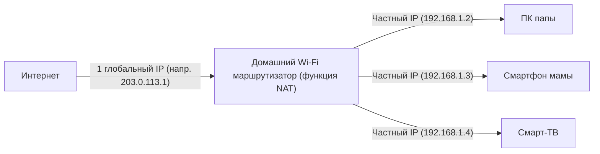

## 1. IP-адрес: «адрес» в мире интернета

Когда вы просматриваете веб-сайт или отправляете сообщение другу в LINE, данные достигают смартфона вашего собеседника, не потерявшись в огромном интернете.
Это становится возможным благодаря **IP-адресу (Internet Protocol Address)**. Это **«адрес» (номер дома) в сети**, который назначается всем устройствам, подключенным к интернету (смартфонам, компьютерам, серверам, маршрутизаторам и т. д.).

Сегодня до сих пор широко используется стандарт **IPv4 (Internet Protocol version 4)**, который был стандартизирован в 1981 году.
Адрес IPv4 состоит из **32 цифр** битов «0 и 1», которые обрабатывает компьютер (32 бита). Для удобства чтения человеком он разделен на 4 блока по 8 битов, преобразован в десятичную систему счисления и разделен точками. (Пример: `192.168.1.1`)

## 2. 4,3 миллиарда адресов «определенно нельзя исчерпать»

Поскольку адрес IPv4 является 32-битным, количество комбинаций равно «2 в 32-й степени», то есть можно создать **около 4,3 миллиарда** (а точнее, 4 294 967 296) адресов.

В 1980-х годах интернет (например, тогдашний ARPANET) предназначался для соединения больших компьютеров в некоторых университетах, военных учреждениях и гигантских корпорациях.
Исследователи того времени нисколько не сомневались и верили: «Даже если мы подключим все компьютеры в мире, их будет всего несколько десятков тысяч. **С 4,3 миллиарда адресов мы никогда не сможем использовать их все до конца света**». Из-за этого они распределяли адреса довольно расточительно, например, щедро выделяя 16 миллионов (класс А) адресов одной организации, такой как крупная американская корпорация или университет.

## 3. Взрывной рост интернета и «проблема исчерпания IP-адресов»

Однако история сильно обманула их ожидания.
С появлением Windows 95 в 1990-х годах, что привело к распространению персональных компьютеров в обычных домах, а также со взрывным распространением смартфонов со второй половины 2000-х годов наступила эра, когда у одного человека есть несколько интернет-терминалов. Более того, сегодня даже бытовой технике и автомобилям нужны IP-адреса из-за IoT (интернета вещей).

В то время как население мира составляет около 8 миллиардов человек, адресов всего 4,3 миллиарда.
В феврале 2011 года мы наконец столкнулись с исторической ситуацией, когда **пул для новых назначений IPv4-адресов от IANA (главной организации, управляющей мировыми IP-адресами) был полностью исчерпан** (нулевой запас).

## 4. Меры по продлению жизни: NAT и частные IP-адреса

По идее, в 2011 году в интернете должна была начаться паника. Однако этого не произошло благодаря технологии продления жизни, называемой **NAT (Network Address Translation)**.

NAT — это технология, которая переводит «глобальные адреса в интернете» в «локальные адреса только внутри дома или компании».
Представьте себе домашний Wi-Fi маршрутизатор.

«Настоящий адрес (глобальный IP-адрес)», предоставляемый маршрутизатору провайдером, **всего один**.
Маршрутизатор назначает «временный адрес (частный IP-адрес)», который можно использовать только дома, каждому терминалу в семье, и при каждом взаимодействии маршрутизатор действует как представитель, переводит адрес и взаимодействует с интернетом.
Благодаря этой технологии **десятки миллиардов устройств по всему миру делят между собой ограниченные глобальные IP-адреса, экономя их**, и поэтому мир IPv4 как-то умудряется не рухнуть.

## 5. Появление спасителя следующего поколения «IPv6»

Однако NAT — это лишь временная мера, которая не является фундаментальным решением. Кроме того, процесс преобразования адреса при каждом соединении также вызывает задержки.

Вот где на сцену выходит протокол следующего поколения **IPv6**.
Адреса IPv6 были расширены до 128 битов, и их количество составляет «2 в 128-й степени», то есть астрономическое число около 340 ундециллионов (**в 1 триллион раз по 1 триллиону раз больше, чем 340 триллионов**).
Часто говорят: **«Даже если каждому зернышку песка на Земле присвоить IP-адрес, их все равно останется с избытком»**.

## 6. Заключение

Переход от IPv4 к IPv6 — это грандиозный инфраструктурный проект глобального масштаба. Из-за отсутствия совместимости всем маршрутизаторам, провайдерам и веб-серверам в интернете необходимо поддерживать IPv6, и в настоящее время продолжается переходный период, в котором сосуществуют оба стандарта.
История IPv4, когда первые разработчики думали, что «4,3 миллиарда будет достаточно», — это интересный урок, который рассказывает нам о том, насколько сложно делать прогнозы в мире ИТ и насколько взрывным было развитие человеческих технологий (особенно мобильных и IoT).
