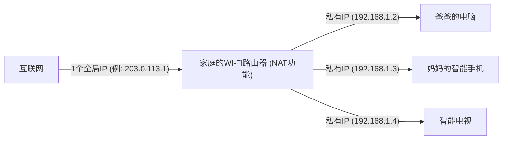

## 1. IP地址：互联网世界的“地址”

当您浏览Web网站，或给朋友发送LINE消息时，数据能在广阔的互联网中不迷路地准确到达对方的智能手机。
使得这一切成为可能的就是“ **IP地址（Internet Protocol Address）** ”。这是分配给所有连接到互联网的设备（智能手机、电脑、服务器、路由器等）的， **网络上的“地址（门牌号）”** 。

至今仍被广泛使用的是于1981年标准化的“ **IPv4（Internet Protocol version 4）** ”这一标准。
IPv4的地址是由计算机处理的“0和1”的比特排列而成的 **32位** （32比特）。为了方便人类阅读，将其每8位分成4个块，转换为10进制并用点分隔来表示。（例如：`192.168.1.1`）

## 2. 43亿个地址本应是“绝对用不完”的

因为IPv4的地址是32位，所以组合有“2的32次方”种，即可以生成 **约43亿个** （准确地说是4,294,967,296个）地址。

在1980年代，互联网（当时的ARPANET等）是为了连接部分大学、军事机构和大型企业中的大型计算机而存在的。
当时的研究人员坚信，“即使把全世界的计算机都连起来也只有几万台吧。 **如果有43亿个地址，直到地球毁灭也绝对用不完** ”。因此，他们向美国的大企业和大学慷慨地一次性分配一个组织1600万个（A类）地址，进行了相当浪费的分配。

## 3. 互联网的爆发式普及与“IP地址枯竭问题”

然而，历史大大出乎了他们的预料。
随着1990年代Windows 95的出现使个人电脑普及到普通家庭，以及从2000年代后半期开始智能手机的爆发式普及，一个人拥有多台互联网终端的时代到来了。更有甚者，在今天，由于IoT（[物联网](/zh-cn/p/technology-iot/)），甚至家电和汽车都需要IP地址。

相对于全球约80亿的人口，地址却只有43亿个。
2011年2月，终于迎来了IANA（管理全球IP地址的最高组织）的 **IPv4地址的新增分配池完全枯竭** （库存为零）这一历史性事件。

## 4. 续命措施：NAT与私有IP地址

本来在2011年互联网应该会陷入恐慌。然而，之所以没有发生这种情况，多亏了名为“ **NAT（Network Address Translation）** ”的续命技术。

NAT是一种转换“互联网上的全局地址”和“仅限家庭或公司内部的本地地址”的技术。
请想象一下家庭的Wi-Fi路由器。

由运营商分配给路由器的“真实地址（全局IP地址）” **只有一个** 。
路由器将仅限于家中使用的“临时地址（私有IP地址）”分配给家人的各个终端，每次通信时都由路由器代表进行地址转换并与互联网进行交互。
通过这项技术， **全世界数百亿台终端在节约有限的全局IP地址的同时进行共享** ，因此IPv4的世界总算没有崩溃。

## 5. 下一代救世主“IPv6”的登场

然而，NAT说到底不过是“权宜之计的续命措施”，并不能从根本上解决问题。此外，每次通信都要转换地址的处理也会成为延迟的原因。

于是登场的就是下一代协议“ **IPv6** ”。
IPv6的地址被扩展到了128位，其数量为“2的128次方”个，即约340涧个（ **约340兆的1兆倍的1兆倍** ）这样一个天文数字。
经常被比喻为“ **即使给地球上的每一粒沙子都分配一个IP地址还有剩余** ”。

## 6. 总结

从IPv4向IPv6的过渡，是一项全球规模的宏大基础设施工程。由于两者不兼容，因此互联网上的所有路由器、运营商和Web服务器都需要支持IPv6，现在仍处于两个标准混杂的过渡期。
早期的设计者们认为“43亿个就足够了”的IPv4历史，诉说了在IT世界中预测的困难程度，以及人类科技（尤其是移动设备和IoT）的进化是何等爆发性的，可以说是一个令人深思的教训。
