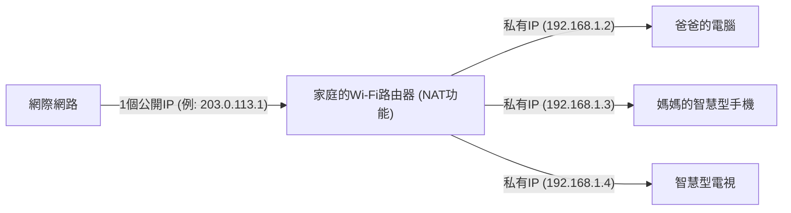

## 1. IP位址：網際網路世界的「地址」

當你瀏覽網站或發送LINE訊息給朋友時，資料會在廣大的網際網路中不迷路地送達對方的智慧型手機。
讓這一切成為可能的就是「 **IP位址（Internet Protocol Address）** 」。這是分配給所有連接到網際網路的設備（智慧型手機、個人電腦、伺服器、路由器等）的 **網路上「地址（門牌號碼）」** 。

至今仍被廣泛使用的是於1981年標準化的「 **IPv4（Internet Protocol version 4）** 」規格。
IPv4位址是由電腦處理的「0和1」的位元排列了 **32位數** 所組成（32位元）。為了讓人容易閱讀，會將其分成4個區塊，每個區塊8位元，並轉換為十進位制以點號分隔來表示。（例: `192.168.1.1`）

## 2. 43億個位址原本應該「絕對用不完」

因為IPv4的位址是32位元，所以組合共有「2的32次方」種，亦即可以建立 **約43億個** （精確來說是4,294,967,296個）地址。

在1980年代當時，網際網路（當時的ARPANET等）是為了連接部分大學、軍事機構、大型企業中的大型電腦而存在的。
當時的研究人員深信不疑：「就算把全世界的電腦都連起來也才幾萬台。 **如果有43億個位址，直到地球毀滅也絕對用不完** 」。因此，當時進行了相當浪費的分配，例如對美國的大企業或大學，大方地一次性分配給單一組織1600萬個（Class A）位址。

## 3. 網際網路的爆發性普及與「IP位址枯竭問題」

然而，歷史大大地辜負了他們的預期。
1990年代隨著Windows 95問世，個人電腦普及至一般家庭；隨後從2000年代後半期開始，智慧型手機爆發性普及，迎來了一人擁有多台連網設備的時代。再到現在，透過IoT（物聯網），甚至連家電和汽車也需要IP位址。

相對於全球人口約80億人，位址卻只有43億個。
2011年2月，終於迎來了IANA（管理全球IP位址的最核心組織）的 **IPv4位址新分配池完全枯竭** （庫存歸零）的歷史性事態。

## 4. 續命措施：NAT與私有IP位址

照理說，網際網路在2011年應該會陷入恐慌。然而，之所以沒有變成那樣，多虧了名為「 **NAT（Network Address Translation）** 」的續命技術。

NAT是將「網際網路上的公開地址」與「僅限於家中或公司內的區域地址」進行轉換的技術。
請想像一下家庭的Wi-Fi路由器。

由網路服務提供商配發給路由器的「真正地址（公開IP位址）」 **只有1個** 。
路由器會將僅限於家中使用之「臨時地址（私有IP位址）」分配給家人的各個設備，每次通訊時，路由器會代表進行地址轉換，並與網際網路進行互動。
透過這項技術， **全世界數以百億計的設備，在節省有限公開IP位址的同時共享著它們** ，才勉強讓IPv4的世界免於崩潰。

## 5. 次世代的救世主「IPv6」登場

然而，NAT終究不過是「暫時的續命措施」，無法從根本上解決問題。此外，每次通訊都要轉換位址的處理過程也會成為延遲的原因。

因此登場的就是次世代通訊協定「 **IPv6** 」。
IPv6的位址被擴展為128位元，其數量達到了「2的128次方」個，亦即約340澗個（ **約340兆的1兆倍再1兆倍** ）這個天文數字。
經常被比喻為「 **就算給地球上所有的沙粒都分配一個IP位址也還有剩** 」。

## 6. 總結

從IPv4過渡到IPv6是一項世界規模的浩大基礎設施工程。由於互不相容，網際網路上的所有路由器、網路服務提供商、Web伺服器都需要支援IPv6，目前仍處於兩個規格混雜的過渡期。
早期設計者們認為「43億個就夠了」的IPv4歷史，訴說了IT世界中預測的困難度，以及人類科技（特別是行動裝置和IoT）的進化是如何地爆發性成長，可以說是一個非常有趣的教訓。
