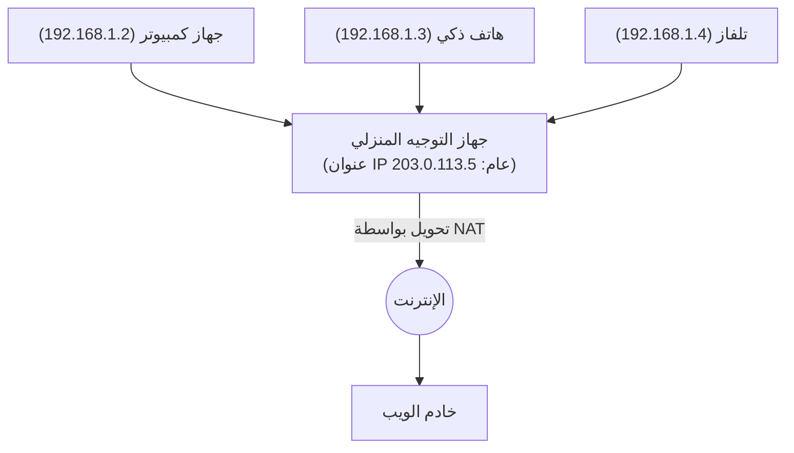

## 1. دور "العنوان" في الإنترنت

إن قدرة أجهزة الكمبيوتر والهواتف الذكية حول العالم المتصلة بالإنترنت على إرسال البيانات لبعضها البعض دون خطأ ترجع إلى أن كل جهاز يُخصص له "عنوان" فريد في العالم.
يُطلق على هذا العنوان على الشبكة اسم "**عنوان بروتوكول الإنترنت (IP Address)**".

عندما نصل إلى "خوادم جوجل"، يقوم المتصفح في الخلفية غير المرئية بإرسال حزم (رزم) من البيانات موجّهة إلى سلسلة من الأرقام (عنوان IP) مثل "142.250.196.110".
نظام العناوين هذا الذي دعم الإنترنت لفترة طويلة هو "**IPv4 (بروتوكول الإنترنت الإصدار 4)**". ولكن في الوقت الحاضر، يواجه IPv4 حدودًا نظامية خطيرة، ويجري تنفيذ مشروع انتقال (هجرة) ضخم إلى الجيل القادم "**IPv6**" على مستوى العالم.

## 2. ولادة IPv4 و"حدود الـ 4.3 مليار"

تم توحيد معايير IPv4 في فجر الإنترنت عام 1981 (RFC 791).
يُعبّر عن عنوان IPv4 بكمية بيانات تبلغ "**32 بت**". يعني 32 بت "مجموعة من الأصفار والآحاد تتكون من 32 خانة"، وبحسابها نجد $2^{32} = 4,294,967,296$، أي يمكن إنشاء **حوالي 4.3 مليار** عنوان.

في ذلك الوقت، كان الإنترنت عبارة عن شبكة صغيرة تستخدمها فقط بعض الجامعات والمؤسسات العسكرية والشركات الكبيرة. اعتقد المصممون أنه "بما أن عدد سكان الأرض بالكامل هو بضعة مليارات فقط، فإن وجود 4.3 مليار عنوان يعني أنها لن تُستنفد إلى الأبد".

ومع ذلك، أدى الانتشار الهائل للشبكة العنكبوتية العالمية في التسعينيات، وظهور الهواتف الذكية في العقد الأول من القرن الحادي والعشرين، ووصول إنترنت الأشياء (IoT: العصر الذي تتصل فيه الأجهزة المنزلية وحتى السيارات بالإنترنت) اليوم، إلى إفساد هذه التقديرات تمامًا.
أصبح الشخص الواحد يستهلك عدة عناوين IP لجهاز الكمبيوتر الشخصي والهاتف الذكي والجهاز اللوحي والساعة الذكية، وسرعان ما تم التهام 4.3 مليار عنوان.

في فبراير 2011، قامت IANA (هيئة أرقام الإنترنت المخصصة)، وهي المنظمة المركزية التي تدير عناوين IP في العالم، بتخصيص "المخزون المركزي الأخير من عناوين IPv4" الذي كان لديها للمنظمات الإقليمية، وأعلنت أخيرًا **الاستنفاد الكامل للمخزون المركزي**.

## 3. تدابير إطالة العمر: NAT وعناوين IP الخاصة

كان من المفترض أن يصاب الإنترنت بالذعر في الوقت الذي نفدت فيه العناوين، ولكن حقيقة أننا لا نزال قادرين على استخدام الإنترنت بشكل طبيعي اليوم ترجع إلى تقنية إطالة العمر المسماة "**NAT (ترجمة عناوين الشبكة)**".

تُعد NAT تقنية تقوم بتخصيص "عنوان IP عام" واحد فقط، وهو العنوان الوحيد في العالم، لكل جهاز توجيه (راوتر) منزلي أو خاص بشركة، وتُعيد استخدام "عنوان IP خاص (مثل: 192.168.1.x)"، وهو "عنوان داخلي صالح فقط بين الأجهزة القريبة"، داخل شبكة جهاز التوجيه (داخل المنزل).

يقوم جهاز التوجيه بإرسال جميع الطلبات الواردة من الأجهزة الموجودة في المنزل إلى الإنترنت بالنيابة عنها كـ "طلبات منه شخصيًا (جهاز التوجيه)"، ويقوم بتوزيع الإجابات التي يتلقاها بشكل صحيح على كل جهاز في المنزل.
بفضل هذه الآلية، أصبح من الممكن توصيل عشرات الأجهزة بالإنترنت باستخدام عنوان IP عام واحد، وتم تأجيل أزمة استنفاد IPv4 بشكل كبير. ومع ذلك، لم يكن هذا حلاً جذريًا، فقد أدى إلى خلق مشاكل مثل تأخير المعالجة بسبب NAT وصعوبة إجراء اتصالات P2P (مثل الاتصال المباشر في الألعاب عبر الإنترنت).

## 4. الحل الجذري: ظهور "IPv6"

بروتوكول الجيل القادم الذي تم تصميمه لحل مشكلة الاستنفاد الأساسية هذه هو "**IPv6 (بروتوكول الإنترنت الإصدار 6)**".

أكبر ميزة في IPv6 هي اتساع مساحة العناوين بشكل هائل.
بالمقارنة مع "32 بت" في IPv4، يمتلك IPv6 مساحة عناوين تبلغ "**128 بت**".
عند حسابها، تصبح $2^{128}$، مما يسمح بإصدار عدد مذهل من العناوين يفوق خيال البشر يبلغ حوالي "**340 أونديكليون**" (340 تريليون مضروبة في تريليون مضروبة في تريليون).

هذا رقم فلكي كبير لدرجة أنه يُقال "حتى لو تم تخصيص عنوان IP لكل حبة رمل على وجه الأرض، فسيتبقى المزيد".
تغيرت طريقة الكتابة أيضًا من النظام العشري مثل `192.168.1.1` في IPv4، إلى النظام السداسي عشري مفصولاً بنقطتين (كولون) مثل `2001:0db8:85a3:0000:0000:8a2e:0370:7334`.

### فوائد IPv6
1. **الاستغناء عن NAT**
   نظرًا لوجود عدد لا حصر له تقريبًا من العناوين، يمكن تخصيص عنوان IP عام وفريد في العالم مباشرةً لكل مصباح كهربائي في المنزل. تصبح الترجمة المعقدة للعناوين (NAT) في أجهزة التوجيه غير ضرورية، مما يسمح للأجهزة بالتواصل مباشرة مع بعضها البعض بسرعات عالية.
2. **توحيد معايير الأمان (IPsec)**
   تم دمج ميزة الأمان المسماة IPsec، والتي تقوم بتشفير الاتصالات واكتشاف التلاعب، كمعيار قياسي، مما يحسن الأمان على مستوى طبقة الشبكة.
3. **تحسين كفاءة التوجيه**
   نظرًا لأن بنية العناوين منظمة هرميًا، تصبح عملية تحديد المسار (التوجيه) عندما تقوم أجهزة التوجيه على الإنترنت بإعادة توجيه الحزم أخف، مما يقلل من تأخير الاتصال.

## 5. انتشار IPv6 في اليابان و"IPoE"

على الرغم من أن IPv6 مثالي من الناحية التقنية، إلا أن انتشاره استغرق وقتًا. كان العائق الأكبر هو أن "**IPv4 و IPv6 غير متوافقين (لا يمكنهما التحدث معًا مباشرة)**". لا يمكنك عرض موقع ويب يدعم IPv4 فقط من جهاز كمبيوتر يدعم IPv6. لذلك، أُجبرت شركات الاتصالات ومزودو خدمة الإنترنت على تحمل تكاليف باهظة لتشغيل كلتا الشبكتين بالتوازي (الرص المزدوج).

ومع ذلك، في السنوات الأخيرة، تقدمت اليابان على بقية العالم في الانتشار الهائل لـ IPv6 لسبب فريد. وهو تسريع الاتصال عن طريق تقنية "**IPoE (طريقة IPv6 IPoE)**".

كان اتصال الإنترنت التقليدي في اليابان (طريقة PPPoE) يعاني من مشكلة حدوث ازدحام شديد في جزء يُعرف باسم "معدات إنهاء الشبكة" الخاص بمزود الخدمة في فترة الليل، مما يؤدي إلى انخفاض سرعة الاتصال بشكل كبير.
في المقابل، باستخدام طريقة الاتصال الجديدة "IPoE"، أصبح من الممكن تجاوز نقطة الازدحام الشديد هذه والمرور مباشرة عبر شبكة الجيل القادم الواسعة وغير المزدحمة. وبما أن شرط استخدام "طريقة IPoE" هذه كان "أن يكون الاتصال عبر IPv6"، فقد ظهرت حركة بين العديد من المستخدمين نحو "اعتماد أجهزة توجيه تدعم IPv6 لجعل الإنترنت أسرع"، ونتيجة لذلك، قفز معدل انتشار IPv6 في اليابان إلى أعلى المستويات في العالم.

## 6. الخلاصة: الانتقال الهادئ للبنية التحتية الكبرى

إن ترقية إصدار بروتوكول IP، الذي يُعد أساس الإنترنت، يشبه استبدال محرك سيارة أثناء سيرها بسرعة عالية، وهو مشروع صعب للغاية.
ومع ذلك، بفضل سنوات من الجهد من قبل شركات تكنولوجيا المعلومات العالمية مثل جوجل (Google) ونتفليكس (Netflix)، وشركات الاتصالات، والشركات المصنعة لأجهزة التوجيه، ارتفع معدل انتشار IPv6 بشكل مطرد، وتتدفق الآن الكثير من حركة المرور العالمية بالفعل عبر IPv6.

إن الإنترنت، الذي تغلب على الأزمة النظامية المتمثلة في استنفاد 4.3 مليار عنوان واكتسب مساحة لا حصر لها تبلغ 340 أونديكليون عنوان، أصبح مستعدًا لمواصلة التطور كأرضية صلبة لعصر إنترنت الأشياء حيث تتصل جميع الأشياء بالإنترنت، والمدن الذكية، والقيادة الذاتية.
